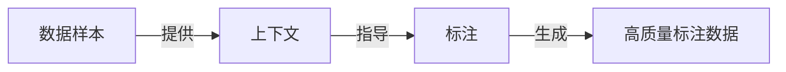

# 基于上下文的数据标注:提高标注准确性

作者：禅与计算机程序设计艺术

## 1. 背景介绍
### 1.1 数据标注的重要性
在人工智能和机器学习领域,高质量的训练数据是模型性能的关键。数据标注是获取高质量训练数据的重要手段,它通过人工为原始数据添加标签,使机器能够理解和学习数据的内在模式和规律。
### 1.2 传统数据标注方法的局限性
传统的数据标注方法通常是孤立地对每个数据样本进行标注,忽略了样本之间的上下文关系。这种方法存在以下局限性:
- 标注效率低:逐个标注样本费时费力
- 标注质量不高:没有利用上下文信息,容易产生错误和不一致的标注
- 标注成本高:需要大量人力投入
### 1.3 基于上下文的数据标注方法的优势
基于上下文的数据标注方法充分利用了数据样本之间的上下文关系,通过将样本放在特定的上下文中进行标注,可以显著提高标注的准确性和效率。其优势包括:
- 提高标注准确性:上下文信息为标注提供了更多线索,减少了错误和歧义
- 提高标注效率:利用上下文关系可实现批量化、自动化标注
- 降低标注成本:减少了人工标注的工作量

## 2. 核心概念与联系
### 2.1 上下文(Context)
上下文是指数据样本所处的环境和背景,包括样本之间的关系、顺序、场景等。在自然语言处理中,上下文可以是词语间的语义关系、句子间的逻辑关系等。在计算机视觉中,上下文可以是图像中物体间的空间关系、时序关系等。
### 2.2 数据样本(Data Sample)  
数据样本是需要进行标注的基本单元,可以是一段文本、一张图片、一段音频等。高质量的数据样本是训练高性能模型的前提。
### 2.3 标注(Annotation)
标注是为数据样本添加标签的过程。标签可以是分类标签(如情感极性)、序列标签(如命名实体)、数值标签(如对象检测的边界框坐标)等。
### 2.4 概念之间的关系
基于上下文的数据标注方法的核心是利用数据样本的上下文信息来指导标注过程。通过分析样本的上下文,可以推断出样本的标签,从而提高标注的准确性和效率。样本、上下文和标注三者之间的关系如下图所示:



## 3. 核心算法原理与具体操作步骤
### 3.1 基于规则的上下文标注算法
#### 3.1.1 算法原理
基于规则的方法通过人工定义一系列规则,利用上下文特征来推断样本的标签。规则可以是基于词典、模板、正则表达式等形式定义的。
#### 3.1.2 算法步骤
1. 定义上下文特征:根据任务和数据的特点,定义能够反映上下文信息的特征,如周围单词、句法结构、版式等。
2. 构建规则库:总结标注任务的经验,构建规则库。规则要有较好的覆盖度和准确度。 
3. 匹配规则:对每个数据样本,提取其上下文特征,与规则库进行匹配。
4. 生成标注结果:根据匹配到的规则,生成相应的标注标签。
5. 人工检查和修正:对自动标注的结果进行人工检查,修正错误的标注,进一步完善规则库。

### 3.2 基于机器学习的上下文标注算法
#### 3.2.1 算法原理  
基于机器学习的方法通过构建上下文特征,训练机器学习模型,来自动预测样本的标签。常见的机器学习模型有条件随机场(CRF)、循环神经网络(RNN)等。
#### 3.2.2 算法步骤
1. 标注种子数据:人工标注一部分数据作为种子数据集,用于训练初始模型。  
2. 特征工程:基于上下文信息,构建样本的特征向量。特征可以是词向量、one-hot编码等。
3. 训练模型:用种子数据集训练机器学习模型,学习上下文特征与标签之间的映射关系。
4. 模型预测:用训练好的模型对未标注数据进行预测,生成标注结果。
5. 主动学习:根据预测的置信度,选择最不确定的样本进行人工标注,加入训练集迭代训练模型。
6. 人工检查:对模型预测的标注结果进行抽查,评估标注质量,不断迭代优化模型。

## 4. 数学模型和公式详细讲解举例说明
### 4.1 条件随机场(CRF)模型
条件随机场是常用的序列标注模型,它可以利用上下文信息进行建模。给定观测序列 $X=(x_1,x_2,...,x_n)$ 和标签序列 $Y=(y_1,y_2,...,y_n)$,CRF模型定义为:

$$P(Y|X)=\frac{1}{Z(X)} \exp \left(\sum_{i=1}^{n}\left(\sum_{j} \lambda_{j} t_{j}\left(y_{i-1}, y_{i}, X, i\right)+\sum_{k} \mu_{k} s_{k}\left(y_{i}, X, i\right)\right)\right)$$

其中,$Z(X)$ 是归一化因子; $t_j$ 是定义在边上的特征函数,$\lambda_j$ 是对应的权重; $s_k$ 是定义在结点上的特征函数,$\mu_k$ 是对应的权重。

训练CRF模型就是学习特征函数的权重,常用的训练算法有:
- 最大似然估计:最大化训练数据的对数似然函数。
- 最大熵:在满足约束条件下,最大化模型的熵。

预测阶段是给定观测序列 $X$,求最可能的标签序列 $Y^*$:

$$Y^{*}=\arg \max _{Y} P(Y | X)$$

常用的解码算法有维特比算法、近似算法等。

### 4.2 循环神经网络(RNN)模型
循环神经网络可以建模序列数据,捕捉长距离的依赖关系。对于标注任务,可以使用双向RNN,综合利用上下文信息。

设输入序列为 $X=(x_1,x_2,...,x_T)$,标签序列为 $Y=(y_1,y_2,...,y_T)$。双向RNN包含前向RNN和后向RNN,其中前向RNN的隐藏状态为:

$$\overrightarrow{h}_{t}=f\left(W_{x h} x_{t}+W_{\overrightarrow{h} h} \overrightarrow{h}_{t-1}+b_{\overrightarrow{h}}\right)$$

后向RNN的隐藏状态为:

$$\overleftarrow{h}_{t}=f\left(W_{x h} x_{t}+W_{\overleftarrow{h} h} \overleftarrow{h}_{t+1}+b_{\overleftarrow{h}}\right)$$

其中,$f$ 是非线性激活函数,如tanh、ReLU等。

将前向和后向的隐藏状态拼接,再通过softmax层预测标签:

$$y_{t}=\operatorname{softmax}\left(W_{h y}\left[\overrightarrow{h}_{t} ; \overleftarrow{h}_{t}\right]+b_{y}\right)$$

双向RNN模型的训练通常使用反向传播算法,优化目标是最小化交叉熵损失。预测阶段是给定输入序列,逐个预测每个位置的标签。

下面是一个用双向LSTM进行序列标注的PyTorch代码示例:

```python
import torch
import torch.nn as nn

class BiLSTMTagger(nn.Module):
    def __init__(self, vocab_size, embedding_dim, hidden_dim, tagset_size):
        super(BiLSTMTagger, self).__init__()
        self.embedding = nn.Embedding(vocab_size, embedding_dim)
        self.lstm = nn.LSTM(embedding_dim, hidden_dim // 2, num_layers=1, bidirectional=True, batch_first=True)
        self.hidden2tag = nn.Linear(hidden_dim, tagset_size)
    
    def forward(self, x):
        embeds = self.embedding(x)
        lstm_out, _ = self.lstm(embeds)
        tag_space = self.hidden2tag(lstm_out)
        tag_scores = torch.nn.functional.log_softmax(tag_space, dim=-1)
        return tag_scores
```

## 5. 项目实践:代码实例和详细解释说明
下面是一个使用CRF进行中文命名实体识别的示例代码,基于sklearn-crfsuite库实现。

```python
import sklearn_crfsuite
from sklearn_crfsuite import metrics

# 定义特征提取函数
def word2features(sent, i):
    """提取单个字的特征"""
    word = sent[i]
    features = [
        'bias',
        'word=' + word,
        'word.isdigit=%s' % word.isdigit(),
    ]
    if i > 0:
        word1 = sent[i-1]
        features.extend([
            '-1:word=' + word1,
            '-1:word.isdigit=%s' % word1.isdigit(),
        ])
    else:
        features.append('BOS')
    if i < len(sent)-1:
        word1 = sent[i+1]
        features.extend([
            '+1:word=' + word1,
            '+1:word.isdigit=%s' % word1.isdigit(),
        ])
    else:
        features.append('EOS')
    return features

def sent2features(sent):
    """提取序列特征"""
    return [word2features(sent, i) for i in range(len(sent))]

def sent2labels(sent):
    """提取标签"""
    return [label for token, label in sent]

def sent2tokens(sent):
    """提取token"""
    return [token for token, label in sent]

# 准备数据集
train_sents = [
    [('今', 'O'), ('天', 'O'), ('天', 'O'), ('气', 'O'), ('真', 'O'), ('好', 'O'), ('啊', 'O')],
    [('李', 'B-Person'), ('小', 'I-Person'), ('明', 'I-Person'), ('是', 'O'), ('我', 'O'), ('的', 'O'), ('好', 'O'), ('朋', 'O'), ('友', 'O')],
    [('中', 'B-Organization'), ('国', 'I-Organization'), ('银', 'I-Organization'), ('行', 'I-Organization'), ('发', 'O'), ('布', 'O'), ('公', 'O'), ('告', 'O')],
]

test_sents = [
    [('我', 'O'), ('叫', 'O'), ('王', 'B-Person'), ('大', 'I-Person'), ('锤', 'I-Person')],
    [('中', 'B-Organization'), ('国', 'I-Organization'), ('移', 'I-Organization'), ('动', 'I-Organization'), ('公', 'I-Organization'), ('司', 'I-Organization'), ('真', 'O'), ('厉', 'O'), ('害', 'O')]
]

# 转换数据格式
X_train = [sent2features(s) for s in train_sents]
y_train = [sent2labels(s) for s in train_sents]

X_test = [sent2features(s) for s in test_sents]
y_test = [sent2labels(s) for s in test_sents]

# 训练CRF模型
crf = sklearn_crfsuite.CRF(
    algorithm='lbfgs',
    c1=0.1,
    c2=0.1,
    max_iterations=100,
    all_possible_transitions=True
)
crf.fit(X_train, y_train)

# 模型预测
y_pred = crf.predict(X_test)

# 评估模型
labels = list(crf.classes_)
labels.remove('O')
print(metrics.flat_classification_report(y_test, y_pred, labels=labels, digits=3))
```

代码说明:
1. 定义了特征提取函数`word2features`,提取单个字的特征,包括字本身、字是否为数字、前一个字、后一个字等。
2. `sent2features`对整个句子提取特征,`sent2labels`提取标签序列,`sent2tokens`提取token序列。
3. 准备训练集和测试集数据,每个句子表示为[(token1, label1), (token2, label2),...]的形式。
4. 将数据转换为CRF所需的特征序列和标签序列形式。 
5. 创建`sklearn_crfsuite.CRF`对象,设置训练参数,训练CRF模型。
6. 用训练好的模型对测试集进行预测。
7. 用`metrics.flat_classification_report`计算评估指标,包括precision