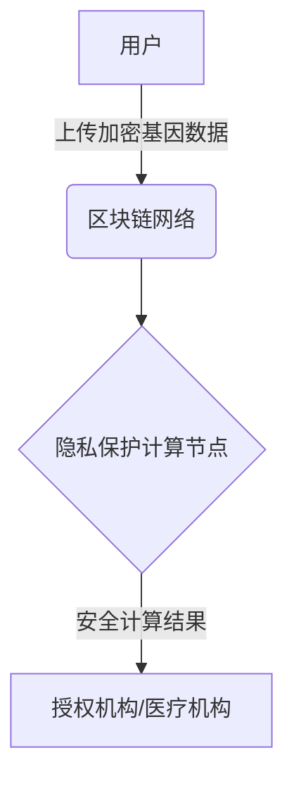

# 基于区块链的隐私保护基因分析系统

## 1. 背景介绍

### 1.1 基因数据的重要性

基因数据是人类生物学和医学研究的关键资源。随着测序技术的快速发展,个人基因数据的获取变得越来越容易和经济。这为个性化医疗、疾病预防和基因治疗等领域带来了巨大的机遇。然而,基因数据的敏感性也引发了人们对隐私和安全的严重关注。

### 1.2 基因隐私保护的挑战

基因数据包含了个人的独特生物标识信息,一旦泄露,可能会导致歧视、隐私侵犯和身份盗窃等严重后果。传统的数据加密和匿名化方法无法完全解决这一问题,因为基因数据具有不可撤销性和可推理性。此外,在基因数据分析过程中,需要跨机构共享和计算,进一步增加了隐私风险。

### 1.3 区块链技术的应用前景

区块链技术因其去中心化、不可篡改和透明可追溯等特性,为解决基因隐私保护问题提供了新的途径。通过将基因数据存储在区块链上,并利用加密技术和智能合约来控制数据访问和计算,可以实现安全可信的跨机构协作,同时保护个人隐私。

## 2. 核心概念与联系

### 2.1 区块链

区块链是一种分布式账本技术,由一系列使用密码学方法相关联产生的数据块组成。它是一个去中心化的点对点网络,不依赖于任何可信的第三方机构。每个节点都可以参与记录和验证交易,形成一个公开、透明和不可篡改的数据库。

### 2.2 隐私保护计算

隐私保护计算(Privacy-Preserving Computation, PPC)是一种在不泄露原始数据的前提下进行数据计算和分析的技术。常见的隐私保护计算方法包括:

- 同态加密(Homomorphic Encryption)
- 安全多方计算(Secure Multi-Party Computation, SMPC)
- 差分隐私(Differential Privacy)
- 可信执行环境(Trusted Execution Environment, TEE)

### 2.3 智能合约

智能合约是部署在区块链上的一段可执行代码,它可以自动执行预定义的条件和规则。智能合约提供了一种可信的、透明的方式来管理和执行各种交易和协议,不需要中介机构的参与。

### 2.4 联系

基于区块链的隐私保护基因分析系统将区块链、隐私保护计算和智能合约技术相结合,形成一个安全、可信、高效的基因数据共享和分析平台。它利用区块链的不可篡改性来保证数据的完整性和追溯性,使用隐私保护计算技术在不泄露原始数据的情况下进行基因数据分析,并通过智能合约来管理和控制数据访问权限。

## 3. 核心算法原理具体操作步骤

### 3.1 系统架构

基于区块链的隐私保护基因分析系统通常采用以下架构:

1. 用户将自己的基因数据进行加密,并上传到区块链网络中。
2. 区块链网络将加密数据分发给隐私保护计算节点。
3. 隐私保护计算节点在不解密原始数据的情况下,对加密数据进行安全计算和分析。
4. 计算结果通过智能合约的控制,只有经过授权的机构(如医疗机构)才能访问。

### 3.2 数据加密上传

用户在将基因数据上传到区块链之前,需要对数据进行加密。常用的加密方式包括:

1. **同态加密**:同态加密允许在密文上直接进行一些特定的计算操作,而无需解密。这种加密方式可以保护数据的隐私,同时支持在密文上进行有限的计算。
2. **秘密共享**:将数据分割成多个秘密份额,分别加密并分发给不同的计算节点。只有当所有份额聚合时,才能重建出原始数据。

用户可以选择上述加密方式中的一种或多种组合,将加密后的数据上传到区块链网络中。

### 3.3 隐私保护计算

隐私保护计算节点接收到加密数据后,需要在不解密的情况下对数据进行计算和分析。常用的隐私保护计算技术包括:

1. **同态加密计算**:在密文上直接进行加法或乘法运算,获得的结果与对明文进行相应运算后再加密所得结果相同。
2. **安全多方计算(SMPC)**:将计算任务分散到多个节点,每个节点只持有输入数据的一部分。通过交互协议,各节点可以共同计算出结果,而不会泄露任何一方的输入数据。
3. **差分隐私**:在查询结果中引入一定程度的噪声,使得无法从结果中推断出任何个人的隐私信息。
4. **可信执行环境(TEE)**:在硬件层面提供一个安全的隔离执行环境,确保代码和数据在此环境中运行时不会被窃取或篡改。

不同的计算任务可以选择合适的隐私保护计算技术,或者将多种技术相结合,以达到更高的隐私保护水平。

### 3.4 结果访问控制

计算结果需要通过智能合约来控制访问权限,只有经过授权的机构(如医疗机构)才能获取。智能合约可以设置以下访问控制规则:

1. **基于角色的访问控制(RBAC)**:根据不同的角色(如医生、研究人员等)分配不同的访问权限。
2. **基于属性的访问控制(ABAC)**:根据用户的属性(如机构类型、专业领域等)来授予访问权限。
3. **多重授权**:需要多个授权实体(如不同的医疗机构或监管部门)共同批准,才能访问计算结果。
4. **可审计性**:所有的访问请求和授权过程都记录在区块链上,形成不可篡改的审计日志。

通过智能合约的访问控制机制,可以确保只有经过适当授权的机构才能获取基因数据分析结果,从而保护个人隐私。

## 4. 数学模型和公式详细讲解举例说明

在基于区块链的隐私保护基因分析系统中,常用的数学模型和加密技术包括同态加密、秘密共享和安全多方计算等。下面将详细介绍其中的一些核心概念和公式。

### 4.1 同态加密

同态加密允许在密文上直接进行一些特定的计算操作,而无需解密。它是实现隐私保护计算的重要技术之一。

定义一个加密函数 $E$,对明文 $m$ 进行加密,得到密文 $c$:

$$c = E(m)$$

同态加密要求存在运算 $\oplus$ 和 $\otimes$,使得对于任意明文 $m_1$ 和 $m_2$,有:

$$E(m_1 + m_2) = E(m_1) \oplus E(m_2)$$
$$E(m_1 \times m_2) = E(m_1) \otimes E(m_2)$$

这意味着我们可以在密文上直接进行加法或乘法运算,获得的结果与对明文进行相应运算后再加密所得结果相同。

一种常见的同态加密方案是Paillier加密,它支持同态加法运算。设 $g$ 为一个整数,对明文 $m$ 进行Paillier加密:

$$E(m) = g^m r^n \bmod n^2$$

其中 $r$ 是一个随机数,用于引入随机性,防止相同的明文产生相同的密文。$n$ 是一个足够大的整数,是两个大质数的乘积。

对于两个密文 $E(m_1)$ 和 $E(m_2)$,它们的同态加法运算定义为:

$$E(m_1) \oplus E(m_2) = E(m_1) \times E(m_2) \bmod n^2 = E(m_1 + m_2)$$

这样,我们就可以在密文上进行加法运算,而无需解密。

### 4.2 秘密共享

秘密共享是一种将秘密数据分割成多个份额,分别分发给不同方的技术。只有当所有份额聚合时,才能重建出原始数据。它是实现安全多方计算的基础。

设有一个秘密数据 $s$,我们将其分割成 $n$ 个份额 $s_1, s_2, \ldots, s_n$,并分发给 $n$ 个不同的方。任何 $t$ 个或更多份额聚合在一起,就可以重建出原始数据 $s$;但任何 $t-1$ 个或更少的份额,都无法获取任何关于 $s$ 的信息。这里 $t$ 被称为重构阈值。

一种常见的秘密共享方案是Shamir's秘密共享。它基于有限域上的多项式插值,将秘密数据 $s$ 嵌入到一个 $t-1$ 次多项式中:

$$f(x) = s + a_1x + a_2x^2 + \ldots + a_{t-1}x^{t-1}$$

其中 $a_1, a_2, \ldots, a_{t-1}$ 是随机选择的系数。然后计算 $n$ 个点 $(x_i, f(x_i))$,将每个点作为一个份额分发给相应的方。

当有 $t$ 个或更多份额聚合时,就可以使用拉格朗日插值法来重建多项式 $f(x)$,进而获取秘密数据 $s$。但任何 $t-1$ 个或更少的份额,都无法唯一确定 $f(x)$,因此无法获取 $s$。

秘密共享技术确保了即使有部分份额被泄露,也不会导致整个秘密数据的泄露,从而提高了数据的安全性和隐私保护能力。

### 4.3 安全多方计算

安全多方计算(Secure Multi-Party Computation, SMPC)是一种允许多方在不泄露各自的输入数据的情况下,共同计算某个函数的加密技术。它是实现隐私保护计算的另一种重要方法。

设有 $n$ 个参与方 $P_1, P_2, \ldots, P_n$,每个参与方持有一个私有输入 $x_1, x_2, \ldots, x_n$。他们希望共同计算一个函数 $f(x_1, x_2, \ldots, x_n)$,但又不希望泄露各自的输入数据。

安全多方计算协议需要满足以下条件:

1. **正确性**:每个诚实参与方都能正确计算出 $f(x_1, x_2, \ldots, x_n)$ 的值。
2. **隐私性**:任何一个参与方或者一个小的联合,都无法从协议的执行过程中推断出其他参与方的输入。
3. **公平性**:要么所有参与方都能获得正确的计算结果,要么没有任何一方能获得额外的信息。

一种常见的安全多方计算方案是基于秘密共享和加密电路(Garbled Circuit)的协议。具体步骤如下:

1. 每个参与方 $P_i$ 将自己的输入 $x_i$ 分割成多个秘密份额,并分发给其他参与方。
2. 参与方共同构建一个加密电路,用于计算函数 $f$。加密电路由多个加密的逻辑门组成,每个逻辑门的输入和输出都是加密的。
3. 参与方使用秘密份额作为加密电路的输入,并依次计算每个逻辑门的输出。
4. 最终,参与方获得加密电路的输出,即函数 $f$ 的计算结果。

在整个过程中,每个参与方只知道自己的输入和部分中间计算结果,无法推断出其他参与方的输入,从而实现了隐私保护。

安全多方计算技术可以应用于各种隐私敏感的数据计算场景,如金融、医疗、投票等领域,为保护个人隐私提供了有力的技术支持。

## 5. 项目