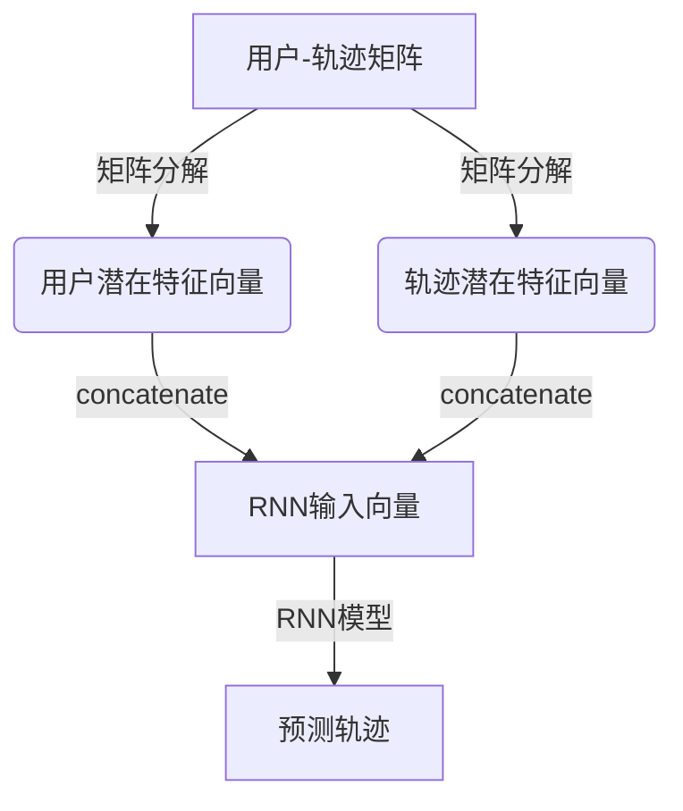

# 基于协同过滤的用户移动轨迹信息预测研究

## 1. 背景介绍

### 1.1 移动轨迹数据的重要性

在当今快节奏的生活方式中,人们的移动模式和轨迹数据成为了一种宝贵的信息资源。通过分析用户的移动轨迹数据,我们可以深入了解人们的行为模式、偏好和需求。这些见解对于多个领域都具有重要意义,例如:

- **位置服务**: 基于用户的位置,提供个性化的推荐服务、优惠信息和路线规划。
- **交通规划**: 通过研究集体移动模式,优化交通系统、缓解拥堵并提高效率。
- **城市规划**: 根据人口流动,合理规划公共设施、商业区和住宅区的布局。
- **应急管理**: 在自然灾害或突发事件中,跟踪和疏散人群的移动。

因此,准确预测用户的移动轨迹对于提供个性化服务、优化资源分配和支持智能决策至关重要。

### 1.2 移动轨迹预测的挑战

尽管移动轨迹预测具有广泛的应用前景,但也面临着一些挑战:

- **数据稀疏性**: 由于隐私问题,获取大量高质量的移动轨迹数据并不容易。
- **数据噪声**: 移动轨迹数据往往包含噪声和异常值,需要进行预处理和清洗。
- **模式复杂性**: 人类的移动模式往往受到多种因素的影响,如时间、天气和社会活动等,导致模式难以捕捉。
- **个体差异性**: 不同个体的移动模式存在显著差异,需要个性化的建模方法。

为了有效应对这些挑战,需要开发出高效、可扩展且个性化的移动轨迹预测算法。

## 2. 核心概念与联系  

### 2.1 协同过滤

协同过滤(Collaborative Filtering, CF)是一种常用的个性化推荐技术,通过分析用户之间的相似性来预测用户的偏好。协同过滤算法可以分为以下两类:

1. **基于用户的协同过滤(User-based CF)**: 基于用户之间的相似性,推荐与目标用户有相似兴趣的其他用户喜欢的项目。

2. **基于项目的协同过滤(Item-based CF)**: 基于项目之间的相似性,推荐与目标用户曾经喜欢的项目相似的其他项目。

在移动轨迹预测任务中,我们可以将用户视为项目,将移动轨迹视为用户的"偏好"。通过分析用户之间移动轨迹的相似性,我们可以为目标用户推荐与之相似的其他用户的移动轨迹,从而实现移动轨迹的预测。

### 2.2 矩阵分解

矩阵分解是协同过滤算法中常用的技术,通过将高维稀疏矩阵分解为低维紧凑矩阵的乘积,从而发现潜在的用户和项目特征。常见的矩阵分解算法包括:

- **奇异值分解 (SVD)**: 将矩阵分解为三个矩阵的乘积,其中两个矩阵分别表示用户和项目的潜在特征向量。

- **概率矩阵分解 (PMF)**: 基于统计模型,将矩阵分解为用户和项目的潜在特征向量,并引入先验分布来减少过拟合。

在移动轨迹预测中,我们可以将用户-轨迹数据构建成一个矩阵,并使用矩阵分解技术来学习用户和轨迹的潜在特征向量,从而捕捉用户的移动模式并进行预测。

### 2.3 时序模式挖掘

由于移动轨迹数据具有时序性质,因此挖掘时序模式对于准确预测至关重要。常见的时序模式挖掘技术包括:

- **马尔可夫模型**: 通过建模状态之间的转移概率来捕捉时序依赖性,如隐马尔可夫模型 (HMM)。

- **循环神经网络 (RNN)**: 利用内部状态来捕捉序列数据中的长期依赖关系,如长短期记忆网络 (LSTM) 和门控循环单元 (GRU)。

- **注意力机制**: 通过自适应地分配不同时间步的权重,有效捕捉长期依赖关系。

结合协同过滤和时序模式挖掘技术,我们可以同时考虑用户之间的相似性和移动轨迹的时序模式,从而提高预测的准确性。

## 3. 核心算法原理与操作步骤

在本节中,我们将介绍一种基于协同过滤和时序模式挖掘的移动轨迹预测算法,称为 CF-RNN (Collaborative Filtering with Recurrent Neural Networks)。该算法的核心思想是将协同过滤和循环神经网络相结合,以捕捉用户之间的相似性和移动轨迹的时序模式。

### 3.1 算法框架

CF-RNN 算法的总体框架如下所示:

1. 首先,我们将用户-轨迹数据构建成一个矩阵,并使用矩阵分解技术(如 SVD 或 PMF)将其分解为用户和轨迹的潜在特征向量。

2. 对于每个用户,我们将其潜在特征向量与其历史移动轨迹的潜在特征向量级联,形成 RNN 模型的输入向量。

3. 使用循环神经网络(如 LSTM 或 GRU)对输入向量进行建模,捕捉移动轨迹的时序模式。

4. 最后,RNN 模型输出预测的下一个移动轨迹。

通过这种方式,CF-RNN 算法能够同时利用协同过滤和时序模式挖掘的优势,从而提高移动轨迹预测的准确性。

### 3.2 算法步骤

下面是 CF-RNN 算法的具体步骤:

1. **数据预处理**:
   - 构建用户-轨迹矩阵 $R$,其中 $R_{ui}$ 表示用户 $u$ 是否访问过轨迹 $i$。
   - 对矩阵 $R$ 进行归一化处理,以减少数据偏差。

2. **矩阵分解**:
   - 使用 SVD 或 PMF 等矩阵分解技术,将矩阵 $R$ 分解为用户潜在特征矩阵 $P$ 和轨迹潜在特征矩阵 $Q$,即 $R \approx P^TQ$。

3. **RNN 输入向量构建**:
   - 对于每个用户 $u$,将其潜在特征向量 $p_u$ 与其历史移动轨迹的潜在特征向量 $\{q_i\}$ 级联,形成 RNN 输入向量 $x_u = [p_u, q_1, q_2, \dots, q_n]$。

4. **RNN 模型训练**:
   - 使用 LSTM 或 GRU 等循环神经网络,对输入向量 $x_u$ 进行建模,捕捉移动轨迹的时序模式。
   - 定义损失函数,如交叉熵损失,并使用反向传播算法优化模型参数。

5. **预测与评估**:
   - 对于新的用户移动轨迹,使用训练好的 RNN 模型进行预测。
   - 使用适当的评估指标(如准确率、召回率等)评估预测性能。

通过上述步骤,CF-RNN 算法能够有效地融合协同过滤和时序模式挖掘技术,从而提高移动轨迹预测的准确性和个性化水平。

## 4. 数学模型和公式详细讲解

在本节中,我们将详细介绍 CF-RNN 算法中使用的数学模型和公式。

### 4.1 矩阵分解

在 CF-RNN 算法中,我们使用概率矩阵分解 (PMF) 技术将用户-轨迹矩阵 $R$ 分解为用户潜在特征矩阵 $P$ 和轨迹潜在特征矩阵 $Q$。PMF 的目标是最小化以下损失函数:

$$\mathcal{L}(P, Q) = \sum_{u, i \in \mathcal{K}} (R_{ui} - p_u^Tq_i)^2 + \lambda_P\|P\|_F^2 + \lambda_Q\|Q\|_F^2$$

其中:

- $\mathcal{K}$ 表示观测数据集,即已知的用户-轨迹对。
- $p_u$ 和 $q_i$ 分别表示用户 $u$ 和轨迹 $i$ 的潜在特征向量。
- $\lambda_P$ 和 $\lambda_Q$ 是正则化系数,用于防止过拟合。
- $\|\cdot\|_F$ 表示矩阵的矩阵范数。

通过优化上述损失函数,我们可以获得最优的用户潜在特征矩阵 $P$ 和轨迹潜在特征矩阵 $Q$。

### 4.2 循环神经网络

在 CF-RNN 算法中,我们使用循环神经网络 (RNN) 对用户的移动轨迹进行建模。具体来说,我们使用长短期记忆网络 (LSTM),其状态转移方程如下:

$$\begin{aligned}
f_t &= \sigma(W_f \cdot [h_{t-1}, x_t] + b_f) \\
i_t &= \sigma(W_i \cdot [h_{t-1}, x_t] + b_i) \\
\tilde{C}_t &= \tanh(W_C \cdot [h_{t-1}, x_t] + b_C) \\
C_t &= f_t \odot C_{t-1} + i_t \odot \tilde{C}_t \\
o_t &= \sigma(W_o \cdot [h_{t-1}, x_t] + b_o) \\
h_t &= o_t \odot \tanh(C_t)
\end{aligned}$$

其中:

- $x_t$ 是时间步 $t$ 的输入向量,即用户潜在特征向量与轨迹潜在特征向量的级联。
- $f_t$、$i_t$ 和 $o_t$ 分别表示遗忘门、输入门和输出门。
- $C_t$ 是时间步 $t$ 的细胞状态向量,用于捕捉长期依赖关系。
- $h_t$ 是时间步 $t$ 的隐藏状态向量,作为输出。
- $W$ 和 $b$ 是 LSTM 模型的可学习参数。
- $\sigma$ 是 Sigmoid 激活函数,而 $\tanh$ 是双曲正切激活函数。
- $\odot$ 表示元素wise乘积运算。

通过训练 LSTM 模型,我们可以捕捉用户移动轨迹中的时序模式,并结合协同过滤的潜在特征向量进行移动轨迹预测。

### 4.3 损失函数和优化

在 CF-RNN 算法中,我们使用交叉熵损失函数来优化模型参数。具体来说,对于每个用户 $u$,我们计算其移动轨迹序列 $\{l_1, l_2, \dots, l_n\}$ 的条件概率:

$$p(l_1, l_2, \dots, l_n | u) = \prod_{t=1}^n p(l_t | l_1, \dots, l_{t-1}, u)$$

其中,每个条件概率 $p(l_t | l_1, \dots, l_{t-1}, u)$ 由 LSTM 模型输出的隐藏状态向量 $h_t$ 计算得到:

$$p(l_t | l_1, \dots, l_{t-1}, u) = \text{softmax}(W_o h_t + b_o)$$

因此,我们可以定义交叉熵损失函数如下:

$$\mathcal{L} = -\frac{1}{N} \sum_{u=1}^N \sum_{t=1}^{n_u} \log p(l_t^u | l_1^u, \dots, l_{t-1}^u, u)$$

其中 $N$ 是用户总数,而