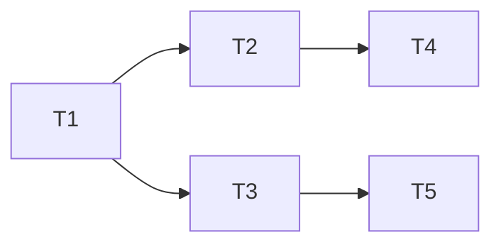

# 多代理系统中的工作流协调与效能优化

作者：禅与计算机程序设计艺术

## 1. 背景介绍

### 1.1 多代理系统概述
#### 1.1.1 多代理系统的定义
#### 1.1.2 多代理系统的特点
#### 1.1.3 多代理系统的应用领域

### 1.2 工作流协调的重要性
#### 1.2.1 工作流协调的定义
#### 1.2.2 工作流协调在多代理系统中的作用
#### 1.2.3 工作流协调面临的挑战

### 1.3 效能优化的必要性  
#### 1.3.1 效能优化的定义
#### 1.3.2 效能优化对多代理系统的影响
#### 1.3.3 效能优化的难点与机遇

## 2. 核心概念与联系

### 2.1 多代理系统的核心概念
#### 2.1.1 代理(Agent)
#### 2.1.2 环境(Environment)
#### 2.1.3 交互(Interaction)

### 2.2 工作流协调的核心概念
#### 2.2.1 任务(Task)
#### 2.2.2 依赖关系(Dependency)
#### 2.2.3 调度(Scheduling)

### 2.3 效能优化的核心概念
#### 2.3.1 性能指标(Performance Metrics)
#### 2.3.2 资源分配(Resource Allocation)
#### 2.3.3 负载均衡(Load Balancing)

### 2.4 三者之间的关系
#### 2.4.1 多代理系统与工作流协调的关系
#### 2.4.2 工作流协调与效能优化的关系  
#### 2.4.3 多代理系统与效能优化的关系

## 3. 核心算法原理具体操作步骤

### 3.1 工作流协调算法
#### 3.1.1 基于依赖关系的任务调度算法
##### 3.1.1.1 算法原理
##### 3.1.1.2 算法步骤
##### 3.1.1.3 算法复杂度分析

#### 3.1.2 基于启发式规则的任务分配算法 
##### 3.1.2.1 算法原理
##### 3.1.2.2 算法步骤  
##### 3.1.2.3 算法优缺点分析

#### 3.1.3 基于市场机制的任务协商算法
##### 3.1.3.1 算法原理
##### 3.1.3.2 算法步骤
##### 3.1.3.3 算法适用场景

### 3.2 效能优化算法
#### 3.2.1 基于强化学习的资源分配算法
##### 3.2.1.1 算法原理
##### 3.2.1.2 算法步骤
##### 3.2.1.3 算法收敛性分析

#### 3.2.2 基于博弈论的负载均衡算法
##### 3.2.2.1 算法原理  
##### 3.2.2.2 算法步骤
##### 3.2.2.3 算法Nash均衡分析

#### 3.2.3 基于进化计算的效能优化算法
##### 3.2.3.1 算法原理
##### 3.2.3.2 算法步骤
##### 3.2.3.3 算法全局最优性分析

## 4. 数学模型和公式详细讲解举例说明

### 4.1 工作流协调的数学模型
#### 4.1.1 任务依赖关系的有向无环图模型
$$G=(V,E)$$
其中，$V$表示任务节点集合，$E$表示任务之间的依赖关系边集合。
举例：对于任务集合$V=\{T_1,T_2,T_3,T_4,T_5\}$，依赖关系$E=\{(T_1,T_2),(T_1,T_3),(T_2,T_4),(T_3,T_5)\}$，则对应的有向无环图为：



#### 4.1.2 任务调度的整数规划模型
$$\min \sum_{i=1}^{n}\sum_{j=1}^{m}c_{ij}x_{ij}$$
$$s.t. \sum_{j=1}^{m}x_{ij}=1, \forall i=1,2,...,n$$
$$\sum_{i=1}^{n}x_{ij}\leq 1, \forall j=1,2,...,m$$  
$$x_{ij}\in \{0,1\}, \forall i,j$$

其中，$n$表示任务数量，$m$表示代理数量，$c_{ij}$表示将任务$i$分配给代理$j$的代价，$x_{ij}$为0-1决策变量，当$x_{ij}=1$时表示将任务$i$分配给代理$j$，否则不分配。

举例：假设有3个任务$\{T_1,T_2,T_3\}$和2个代理$\{A_1,A_2\}$，代价矩阵为：
$$C=\begin{bmatrix}
2 & 3\\ 
4 & 2\\
3 & 5
\end{bmatrix}$$
则整数规划模型为：
$$\min 2x_{11}+3x_{12}+4x_{21}+2x_{22}+3x_{31}+5x_{32}$$
$$s.t. x_{11}+x_{12}=1$$
$$x_{21}+x_{22}=1$$
$$x_{31}+x_{32}=1$$
$$x_{11}+x_{21}+x_{31}\leq 1$$
$$x_{12}+x_{22}+x_{32}\leq 1$$
$$x_{ij}\in \{0,1\}, \forall i,j$$

### 4.2 效能优化的数学模型
#### 4.2.1 资源分配的马尔可夫决策过程模型
状态空间：$S=\{s_1,s_2,...,s_n\}$，其中$s_i$表示系统在第$i$个时间步的资源分配状态。
行动空间：$A=\{a_1,a_2,...,a_m\}$，其中$a_j$表示将资源分配给第$j$个代理。
转移概率：$P(s'|s,a)$表示在状态$s$下采取行动$a$后转移到状态$s'$的概率。
奖励函数：$R(s,a)$表示在状态$s$下采取行动$a$获得的即时奖励。
策略：$\pi: S\rightarrow A$表示在每个状态下采取的行动。
最优值函数：$V^*(s)=\max_{\pi}\mathbb{E}[\sum_{t=0}^{\infty}\gamma^tR(s_t,\pi(s_t))|s_0=s]$表示从状态$s$开始，采取最优策略$\pi^*$能获得的期望累积奖励，其中$\gamma\in[0,1]$为折扣因子。

举例：假设有2个代理$\{A_1,A_2\}$和3个资源$\{R_1,R_2,R_3\}$，状态空间为$S=\{(0,0),(0,1),(1,0),(1,1)\}$，其中$(i,j)$表示将资源$R_i$分配给代理$A_1$，资源$R_j$分配给代理$A_2$。奖励函数为：
$$R((0,0),a)=0, \forall a$$
$$R((0,1),a_1)=1, R((0,1),a_2)=2$$
$$R((1,0),a_1)=2, R((1,0),a_2)=1$$
$$R((1,1),a)=3, \forall a$$
假设转移概率$P(s'|s,a)$均匀分布，折扣因子$\gamma=0.9$，则可以通过值迭代或策略迭代算法求解最优策略$\pi^*$和最优值函数$V^*$。

#### 4.2.2 负载均衡的evolutionary博弈模型
策略空间：$S=\{s_1,s_2,...,s_n\}$，其中$s_i$表示第$i$个代理的负载均衡策略。
收益函数：$u_i(s_i,s_{-i})$表示第$i$个代理采取策略$s_i$，其他代理采取策略$s_{-i}$时获得的收益。
复制动态方程：$\dot{x}_i=x_i(u_i(s_i,x)-\bar{u}(x))$表示策略$s_i$的复制动态，其中$x_i$为策略$s_i$在群体中的占比，$\bar{u}(x)=\sum_{i=1}^{n}x_iu_i(s_i,x)$为群体的平均收益。
Nash均衡：如果对任意$i$，有$u_i(s_i^*,s_{-i}^*)\geq u_i(s_i,s_{-i}^*), \forall s_i\in S$，则策略组合$s^*=(s_1^*,s_2^*,...,s_n^*)$为Nash均衡。

举例：假设有2个代理$\{A_1,A_2\}$，每个代理有2个策略$\{H,L\}$，其中$H$表示高负载，$L$表示低负载。收益矩阵为：
$$\begin{bmatrix}
(3,3) & (1,4)\\ 
(4,1) & (2,2)
\end{bmatrix}$$
其中，矩阵第$i$行第$j$列的元素表示代理$A_1$采取策略$i$，代理$A_2$采取策略$j$时的收益。
令$x$表示代理$A_1$采取策略$H$的概率，$1-x$表示采取策略$L$的概率；$y$表示代理$A_2$采取策略$H$的概率，$1-y$表示采取策略$L$的概率。则复制动态方程为：
$$\dot{x}=x(1-x)(3y+1(1-y)-(4y+2(1-y)))=x(1-x)(1-2y)$$
$$\dot{y}=y(1-y)(3x+4(1-x)-(x+2(1-y)))=y(1-y)(1+x)$$
可以求得Nash均衡点为$(0,0),(0,1),(1,0),(\frac{1}{3},\frac{1}{2})$，其中前三个为纯策略Nash均衡，最后一个为混合策略Nash均衡。

## 5. 项目实践：代码实例和详细解释说明

### 5.1 工作流协调算法的代码实现
#### 5.1.1 基于依赖关系的任务调度算法
```python
import networkx as nx

def task_scheduling(G):
    # 计算每个任务的入度
    in_degree = dict(G.in_degree())
    
    # 找出入度为0的任务
    zero_in_degree = [node for node in G.nodes() if in_degree[node] == 0]
    
    # 存储任务调度结果
    res = []
    
    while zero_in_degree:
        # 取出一个入度为0的任务
        node = zero_in_degree.pop(0)
        res.append(node)
        
        # 将该任务的所有后继任务的入度减1
        for successor in G.successors(node):
            in_degree[successor] -= 1
            if in_degree[successor] == 0:
                zero_in_degree.append(successor)
                
    # 如果还有任务的入度不为0，说明存在环，无法完成调度
    if any(in_degree.values()):
        return None
    
    return res

# 示例
G = nx.DiGraph()
G.add_edges_from([('T1','T2'), ('T1','T3'), ('T2','T4'), ('T3','T5')])
print(task_scheduling(G))  # 输出 ['T1', 'T2', 'T3', 'T4', 'T5']
```
算法思路：
1. 计算每个任务的入度，即有多少前置任务
2. 找出所有入度为0的任务，即没有前置任务的任务，加入队列
3. 从队列中取出一个任务，将其加入调度结果，并将其所有后继任务的入度减1
4. 如果减1后有后继任务的入度变为0，则将其加入队列
5. 重复3-4步，直到队列为空
6. 如果所有任务的入度都为0，则调度成功，返回调度结果；否则存在环，无法完成调度，返回None

算法复杂度：
- 时间复杂度：$O(|V|+|E|)$，其中$|V|$为任务数，$|E|$为依赖关系数
- 空间复杂度：$O(|V|)$

#### 5.1.2 基于启发式规则的任务分配算法
```python
import numpy as np

def task_assignment(cost_matrix):
    n, m = cost_matrix.shape
    
    # 初始化分配结果
    assignment = np.zeros((n, m), dtype=int)
    
    # 根据启发式规则依次分配任务
    for i in range(n):
        # 找出第i个任务的最小代价代理
        j = np.argmin(cost_matrix[i])
        assignment[i][j] = 1