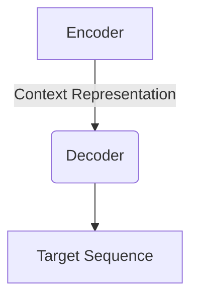

# 多语言营销全球化:大模型支持的语言迁移

## 1.背景介绍

### 1.1 全球化营销的重要性

在当今互联网时代,全球化营销已经成为企业保持竞争力和实现可持续增长的关键因素。随着全球经济一体化的不断深入,跨国公司需要针对不同国家和地区的目标受众进行本地化营销。有效的多语言营销策略可以帮助企业打破语言和文化壁垒,更好地触达潜在客户,提高品牌知名度和销售业绩。

### 1.2 语言迁移的挑战

然而,传统的语言翻译方式存在诸多挑战,例如:

- 人工翻译成本高昂且效率低下
- 上下文语义丢失,难以保证翻译质量
- 缺乏实时性,难以及时响应市场变化

因此,寻求一种高效、准确、实时的语言迁移解决方案,成为企业实现多语言营销全球化的当务之急。

### 1.3 大模型的崛起

近年来,大型语言模型(Large Language Models,LLMs)在自然语言处理(NLP)领域取得了突破性进展。这些基于深度学习的模型能够从海量语料中学习语言知识,并在机器翻译、文本生成、问答等任务中表现出色。

大模型的强大能力为语言迁移带来了全新的可能性。通过将大模型与领域知识相结合,我们可以构建出高质量、个性化的多语言营销解决方案,助力企业实现真正的全球化。

## 2.核心概念与联系

### 2.1 大模型架构

大型语言模型通常采用Transformer等注意力机制架构,能够有效捕捉长距离依赖关系。模型由编码器(Encoder)和解码器(Decoder)两部分组成:

- 编码器将输入序列(如源语言文本)映射为上下文表示
- 解码器基于上下文表示生成目标序列(如目标语言文本)

下图展示了Transformer模型的基本架构:

### 2.2 预训练与微调

大模型通常采用两阶段训练策略:

1. **预训练(Pretraining)**: 在大规模无监督语料上进行自监督学习,获取通用语言知识。常用的预训练目标包括掩码语言模型(Masked LM)和下一句预测(Next Sentence Prediction)等。

2. **微调(Finetuning)**: 在特定任务的标注数据上进行有监督学习,使模型适应下游任务。例如机器翻译任务的微调数据为源语言-目标语言的句对。

通过巧妙设计的预训练目标和微调策略,大模型能够在保留通用语言知识的同时,为特定任务提供专门的知识支持。

### 2.3 多语言能力

除了单语种建模外,大模型还具备强大的多语言处理能力。通过在预训练阶段融入多种语言数据,模型可以学习不同语言的语义和语法知识,实现跨语言的理解和生成。

此外,一些大模型采用统一的词汇表(Vocabulary)来表示所有语言,进一步增强了模型的多语言能力。例如XLM-R模型使用了250K词汇,覆盖了100多种语言。

### 2.4 领域知识融合

虽然大模型具备一般语言理解能力,但在特定领域(如营销)中的表现仍有提升空间。为解决这一问题,我们可以将领域知识注入到模型中,实现领域自适应。

常见的知识融合方法包括:

- 继续预训练(Continued Pretraining):在领域语料上继续预训练通用模型
- 提示学习(Prompt Learning):通过设计合适的提示词,引导模型生成所需的输出
- 模型调整(Model Adjustment):微调模型的部分参数或注入新的神经网络模块

通过以上方法,我们可以赋予大模型营销领域的专业知识,提高其在多语言营销任务中的性能表现。

## 3.核心算法原理具体操作步骤  

### 3.1 序列到序列学习

机器翻译等语言迁移任务可被视为序列到序列(Sequence-to-Sequence,Seq2Seq)学习问题。该问题的目标是学习一个条件概率模型 $P(Y|X)$,将源语言序列 $X=(x_1,x_2,...,x_n)$ 映射到目标语言序列 $Y=(y_1,y_2,...,y_m)$。

在大模型中,Seq2Seq学习通常由编码器-解码器架构来实现:

1. **编码器**将输入序列 $X$ 编码为上下文向量 $C$:

$$C=\text{Encoder}(X)=(h_1,h_2,...,h_n)$$

其中 $h_i$ 是第 $i$ 个位置的隐藏状态向量,捕获了 $X$ 中该位置前的所有信息。

2. **解码器**接收上下文向量 $C$,生成目标序列 $Y$:

$$\begin{aligned}
P(Y|X)&=\prod_{t=1}^m P(y_t|y_<t,X)\\
&=\prod_{t=1}^m P(y_t|y_<t,C)
\end{aligned}$$

其中 $y_<t$ 表示长度为 $t-1$ 的部分序列 $(y_1,y_2,...,y_{t-1})$。

在训练阶段,我们最大化 $P(Y|X)$ 在训练数据上的对数似然,优化模型参数。在推理阶段,则通过beam search等解码策略生成最优序列。

### 3.2 注意力机制

注意力机制是Seq2Seq模型的关键创新,它允许模型在解码时动态关注输入序列的不同部分,从而更好地建模长距离依赖关系。

具体来说,在每个解码时间步,注意力模块会计算一个上下文向量 $c_t$,作为当前目标词 $y_t$ 的条件编码:

$$c_t=\sum_{i=1}^n\alpha_{t,i}h_i$$

其中,注意力权重 $\alpha_{t,i}$ 衡量了输入隐藏状态 $h_i$ 对生成 $y_t$ 的重要性:

$$\alpha_{t,i}=\frac{\exp(e_{t,i})}{\sum_{j=1}^n\exp(e_{t,j})},\quad e_{t,i}=\text{score}(s_{t-1},h_i)$$

$\text{score}$ 函数可以是加性或点积等不同形式,用于计算查询 $s_{t-1}$ 和键 $h_i$ 之间的相关性分数。

通过注意力机制,模型可以自适应地选择输入序列中最相关的部分,从而提高翻译质量。

### 3.3 多头注意力

多头注意力(Multi-Head Attention)进一步增强了注意力机制的表达能力。它将注意力分成 $H$ 个不同的"头部",每个头部对输入序列进行独立的注意力计算,然后将所有头部的结果拼接起来:

$$\text{MultiHead}(Q,K,V)=\text{Concat}(head_1,head_2,...,head_H)W^O$$
$$\text{where }head_i=\text{Attention}(QW_i^Q,KW_i^K,VW_i^V)$$

其中 $Q$、$K$、$V$ 分别表示查询、键和值;$W_i^Q$、$W_i^K$、$W_i^V$、$W^O$ 是可学习的线性投影参数。

多头注意力允许模型从不同的表示子空间中捕获不同的相关模式,提高了模型的表达能力和泛化性。

### 3.4 位置编码

由于Seq2Seq模型没有递归或卷积结构,因此需要一些方式来注入序列的位置信息。Transformer采用位置编码的方法,将位置信息直接编码到序列的表示中。

具体来说,对于序列中的每个位置 $i$,我们构造一个位置编码向量 $\text{PE}(i)$,并将其加到该位置的输入嵌入向量中:

$$z_i=x_i+\text{PE}(i)$$

其中,位置编码向量可以基于不同的函数构造,例如正弦/余弦函数:

$$\begin{aligned}
\text{PE}(i,2j)&=\sin(i/10000^{2j/d_\text{model}})\\
\text{PE}(i,2j+1)&=\cos(i/10000^{2j/d_\text{model}})
\end{aligned}$$

通过这种方式,序列中每个位置的表示都被赋予了独特的位置信息,从而使模型能够有效地建模序列数据。

### 3.5 掩码自回归

在机器翻译等序列生成任务中,我们希望模型能够基于已生成的部分序列和源序列来预测下一个词。这种做法被称为自回归(Autoregressive)建模。

为了实现自回归,解码器需要屏蔽掉目标序列中当前位置之后的信息,防止信息泄露。这通常通过在自注意力层添加一个掩码(Mask)来实现:

$$\text{Mask}_{ij}=\begin{cases}
0,&\text{if }j>i\\
-\infty,&\text{otherwise}
\end{cases}$$

在计算自注意力时,将掩码加到attention scores上,从而强制模型只关注当前位置之前的信息。

通过掩码自回归,解码器可以自回归地生成目标序列,同时利用源序列的全部信息,实现高质量的序列到序列学习。

## 4.数学模型和公式详细讲解举例说明

在本节中,我们将详细解释大模型中一些核心数学模型和公式,并给出具体的例子说明。

### 4.1 Transformer中的自注意力计算

自注意力是Transformer模型的核心组件,它允许模型动态关注输入序列的不同部分。我们以英语到法语的翻译任务为例,来解释自注意力的计算过程。

假设我们要翻译的英语句子是"The dog runs in the park.",编码器的自注意力计算如下:

1. 首先,我们将输入词元(word pieces)映射为嵌入向量:

$$\begin{aligned}
\text{The}&\rightarrow\begin{bmatrix}0.1\\0.2\\0.3\end{bmatrix},\quad
\text{dog}&\rightarrow\begin{bmatrix}-0.2\\0.4\\-0.1\end{bmatrix},\quad
\text{runs}&\rightarrow\begin{bmatrix}0.3\\-0.3\\0.5\end{bmatrix},\\
\text{in}&\rightarrow\begin{bmatrix}-0.1\\0.6\\-0.2\end{bmatrix},\quad
\text{the}&\rightarrow\begin{bmatrix}0.1\\0.2\\0.3\end{bmatrix},\quad
\text{park}&\rightarrow\begin{bmatrix}-0.4\\0.1\\-0.6\end{bmatrix}
\end{aligned}$$

2. 然后,我们计算每个词元与其他词元之间的注意力分数(scores):

$$\begin{aligned}
\text{score}(\text{The},\text{The})&=0.1\cdot\begin{bmatrix}0.1\\0.2\\0.3\end{bmatrix}=0.04\\
\text{score}(\text{The},\text{dog})&=0.1\cdot\begin{bmatrix}-0.2\\0.4\\-0.1\end{bmatrix}=-0.01\\
&\vdots
\end{aligned}$$

注意力分数实际上是查询向量(当前词元的嵌入)与键向量(其他词元的嵌入)的点积。

3. 对注意力分数应用softmax函数,得到注意力权重:

$$\begin{aligned}
\alpha_{\text{The}\rightarrow\text{The}}&=\frac{\exp(0.04)}{\sum\exp(\cdot)}\\
\alpha_{\text{The}\rightarrow\text{dog}}&=\frac{\exp(-0.01)}{\sum\exp(\cdot)}\\
&\vdots
\end{aligned}$$

其中,分母是所有分数的指数和,用于归一化。

4. 使用注意力权重对值向量(词元嵌入)进行加权求和,得到注意力输出:

$$\begin{aligned}
\text{attn}_\text{The}&=\alpha_{\text{The}\rightarrow\text{The}}\cdot\begin{bmatrix}0.1\\0.2\\0.3\end{bmatrix}+\alpha_{\text{The}\rightarrow\text{dog}}\cdot\begin{bmatrix}-0.2\\0.4\\-0.1\end{bmat