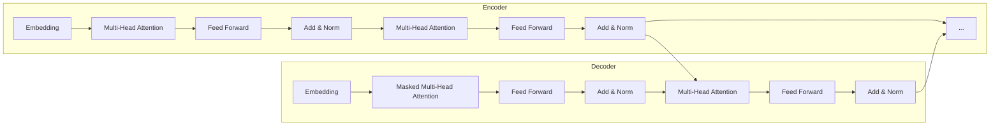

# 大语言模型原理基础与前沿 随机路由

## 1.背景介绍

### 1.1 什么是大语言模型？

大语言模型(Large Language Model, LLM)是一种基于深度学习的自然语言处理(NLP)模型,旨在从大量文本数据中学习语言的统计规律和语义关系。这些模型通过训练吸收海量的文本数据,捕捉语言的内在结构和模式,从而能够生成自然、流畅且语义合理的文本输出。

大语言模型的核心思想是利用自注意力(Self-Attention)机制和transformer架构,有效地捕获长距离的语义依赖关系,突破了传统序列模型(如RNN)的局限性。通过预训练和微调(fine-tuning)等技术,大语言模型可以在各种自然语言处理任务中表现出色,如机器翻译、文本生成、问答系统等。

### 1.2 大语言模型的重要性

大语言模型的出现标志着自然语言处理领域的一次重大突破。它们展现了强大的语言理解和生成能力,为人工智能系统与人类进行自然交互提供了新的可能性。大语言模型在以下几个方面具有重要意义:

1. **语言理解与生成**:大语言模型能够深入理解和捕捉语言的丰富语义,生成高质量、流畅自然的文本输出,为自然语言交互系统奠定基础。

2. **知识迁移**:通过预训练技术,大语言模型可以从海量文本数据中学习通用的语言知识,并将这些知识迁移到下游任务中,提高模型的泛化能力。

3. **多任务学习**:大语言模型具有强大的多任务学习能力,可以在单一模型中同时处理多种自然语言处理任务,提高了模型的效率和一致性。

4. **低资源语言支持**:由于大语言模型可以从少量数据中学习,因此有望为低资源语言的自然语言处理提供支持,缩小不同语言之间的技术鸿沟。

5. **科研前沿**:大语言模型代表了自然语言处理领域的最新进展,吸引了众多研究人员的关注,推动了相关理论和方法的发展。

### 1.3 随机路由技术

随机路由(Random Routing)是一种用于训练和推理大语言模型的新颖技术。它通过在模型的不同层之间引入随机路由机制,增加了模型的表达能力和泛化性。

传统的transformer模型采用固定的层次结构,每个层都依赖于前一层的输出。而随机路由技术打破了这种固定的层次约束,允许每个层的输出随机路由到后续的任意层,从而增加了模型的灵活性和表达能力。

随机路由技术的关键思想是:在训练过程中,每个层的输出将以一定概率被路由到后续的任意层,而不是固定地传递给下一层。这种随机性使得模型能够探索更多的路径组合,从而学习到更丰富的语言表示。在推理阶段,随机路由也会被应用,以获得更加鲁棒和泛化的预测结果。

该技术不仅提高了大语言模型的性能,还有助于减少过拟合风险,提高模型的泛化能力。此外,随机路由还可以用于模型压缩和加速推理,为大语言模型的实际应用提供了更多可能性。

## 2.核心概念与联系  

### 2.1 自注意力机制(Self-Attention)

自注意力机制是大语言模型的核心组成部分,它允许模型捕获输入序列中任意两个位置之间的依赖关系,从而有效地建模长距离的语义关联。

在自注意力机制中,每个输入位置都会与其他所有位置进行关联,计算出一个注意力分数矩阵。这个矩阵捕获了输入序列中每个位置相对于其他位置的重要性。通过对注意力分数矩阵进行加权求和,模型可以为每个位置生成一个新的表示,融合了全局信息。

自注意力机制可以被形式化为以下公式:

$$
\begin{aligned}
\text{Attention}(Q, K, V) &= \text{softmax}\left(\frac{QK^T}{\sqrt{d_k}}\right)V \\
\text{MultiHead}(Q, K, V) &= \text{Concat}(head_1, \ldots, head_h)W^O\\
\text{where } head_i &= \text{Attention}(QW_i^Q, KW_i^K, VW_i^V)
\end{aligned}
$$

其中 $Q$、$K$、$V$ 分别代表查询(Query)、键(Key)和值(Value)矩阵,通过线性变换从输入序列中得到。$d_k$ 是缩放因子,用于防止点积的值过大导致梯度消失。多头注意力(Multi-Head Attention)机制则是将多个注意力头的输出进行拼接,以捕获不同的关系。

自注意力机制的优势在于能够有效地捕获长距离依赖关系,同时保持并行计算的能力,克服了传统序列模型(如RNN)的局限性。它为大语言模型提供了强大的语义建模能力,成为了transformer架构的核心组件。

### 2.2 transformer架构

Transformer是一种全新的序列到序列(Sequence-to-Sequence)模型架构,它完全基于注意力机制,不依赖于循环神经网络(RNN)或卷积神经网络(CNN)。Transformer架构被广泛应用于自然语言处理任务,如机器翻译、文本生成等,也是大语言模型的基础架构。

Transformer架构主要由编码器(Encoder)和解码器(Decoder)两个部分组成,如下图所示:

编码器由多个相同的层堆叠而成,每一层包含两个子层:多头自注意力层(Multi-Head Attention)和前馈全连接层(Feed Forward)。编码器的作用是将输入序列映射为一系列连续的表示。

解码器的结构与编码器类似,但在第一个子层使用了掩码多头自注意力(Masked Multi-Head Attention),以确保在生成每个输出token时,只依赖于之前的输出和整个输入序列。此外,解码器还包含一个额外的多头注意力层,用于关注编码器的输出。

Transformer架构的优势在于并行计算能力强、捕获长距离依赖关系的能力好,同时避免了RNN的梯度消失/爆炸问题。它为大语言模型提供了高效、强大的序列建模能力,成为了大语言模型的核心架构。

### 2.3 预训练与微调

预训练(Pre-training)和微调(Fine-tuning)是大语言模型中常用的两种训练范式。

**预训练**是在大规模无监督文本数据上对模型进行初始化训练的过程。在这个阶段,模型会学习到通用的语言知识和模式,如词义表示、语法结构、语义关联等。常见的预训练目标包括掩码语言模型(Masked Language Modeling)和下一句预测(Next Sentence Prediction)等。

**微调**则是在特定的下游任务上,基于预训练模型进行进一步的监督训练。在这个阶段,模型会在保留预训练知识的基础上,专门学习下游任务的特定模式和知识。微调通常只需要较少的任务相关数据和较短的训练时间,就能获得良好的性能表现。

预训练和微调的组合使用,能够充分利用大规模无监督数据和有限的监督数据,提高模型的泛化能力和性能表现。这种范式已经成为训练大语言模型的标准方法,被广泛应用于各种自然语言处理任务中。

预训练和微调的优点包括:

- 有效利用大规模无监督数据,学习通用的语言知识
- 降低了对大量标注数据的依赖
- 提高了模型在下游任务上的性能和泛化能力
- 支持快速迁移学习,缩短了模型训练时间

因此,预训练和微调是大语言模型取得巨大成功的关键因素之一,为自然语言处理任务提供了强大的语言表示和知识迁移能力。

## 3.核心算法原理具体操作步骤

### 3.1 大语言模型的训练过程

大语言模型的训练过程通常包括两个主要阶段:预训练和微调。下面我们详细介绍这两个阶段的具体操作步骤。

#### 3.1.1 预训练阶段

预训练阶段的目标是在大规模无监督文本数据上,训练模型学习通用的语言知识和模式。常见的预训练目标包括掩码语言模型(Masked Language Modeling, MLM)和下一句预测(Next Sentence Prediction, NSP)等。

1. **数据预处理**:首先需要对原始文本数据进行预处理,包括分词、词典构建、数据清洗等步骤。

2. **构建预训练任务**:根据选择的预训练目标,构建相应的预训练任务。例如,对于MLM任务,需要随机掩码一部分输入token,让模型预测被掩码的token。对于NSP任务,需要判断两个句子是否相邻。

3. **数据批处理**:将预处理后的数据按批次组织,以便并行训练。

4. **模型初始化**:初始化transformer模型的参数,包括embedding层、编码器层和解码器层等。

5. **预训练迭代**:使用优化算法(如Adam)对模型进行迭代训练,最小化预训练任务的损失函数。每个迭代包括前向传播、反向传播和参数更新三个步骤。

6. **模型保存**:在预训练过程中,定期保存模型的当前状态,以便后续的微调或推理使用。

预训练阶段通常需要消耗大量的计算资源和时间,但它为模型提供了通用的语言表示和知识基础,是实现强大语言理解和生成能力的关键。

#### 3.1.2 微调阶段

微调阶段的目标是在特定的下游任务上,基于预训练模型进行进一步的监督训练,使模型专门学习该任务的特定模式和知识。

1. **准备下游任务数据**:收集并预处理与下游任务相关的监督数据,如文本分类、机器翻译、问答等任务的数据集。

2. **加载预训练模型**:加载预训练阶段得到的模型参数,作为微调的初始化参数。

3. **构建下游任务目标**:根据下游任务的性质,构建相应的监督学习目标,如分类、序列生成等。

4. **微调模型**:使用优化算法(如Adam)对模型进行迭代训练,最小化下游任务的损失函数。在这个过程中,只需要对模型的部分参数(如输出层)进行微调,而保留大部分预训练参数不变。

5. **模型评估**:在验证集上评估微调后模型的性能,根据需要调整超参数或训练策略。

6. **模型部署**:将微调后的模型部署到生产环境中,用于实际的下游任务应用。

微调阶段通常只需要较少的任务相关数据和较短的训练时间,就能获得良好的性能表现。这得益于预训练阶段学习到的通用语言知识,使模型具备了强大的迁移学习能力。

通过预训练和微调的组合使用,大语言模型能够充分利用大规模无监督数据和有限的监督数据,实现出色的语言理解和生成能力,并广泛应用于各种自然语言处理任务中。

### 3.2 随机路由算法

随机路由(Random Routing)是一种用于训练和推理大语言模型的新颖技术,它通过在模型的不同层之间引入随机路由机制,增