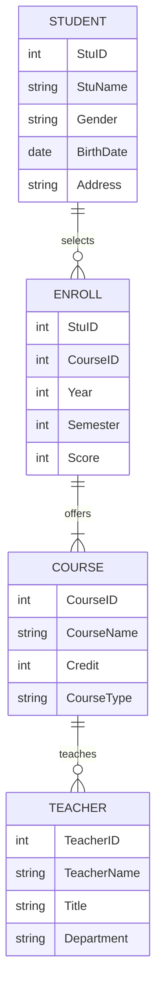
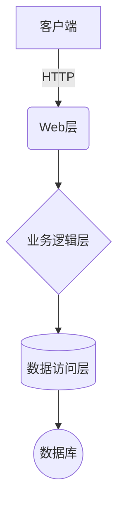

# 学生信息管理系统详细设计与具体代码实现

## 1. 背景介绍

### 1.1 学生信息管理系统概述

随着教育事业的不断发展,学校的规模和管理的复杂度也在不断增加。传统的纸质档案管理方式已经无法满足现代化学校管理的需求。因此,构建一个高效、安全、可扩展的学生信息管理系统(Student Information Management System,SIMS)就显得尤为重要。

SIMS是一种基于计算机技术的信息管理系统,旨在实现对学生基本信息、成绩信息、课程信息等数据的集中统一管理。它可以极大地提高学校管理效率,优化教学资源配置,并为决策者提供数据支持。

### 1.2 系统的重要性和应用前景

一个完善的SIMS不仅能够简化学校的日常运作,更能为学生、教师和管理人员提供高质量的服务。具体来说,它可以:

- 为学生提供一站式的个人信息查询和成绩管理
- 为教师提供学生数据支持,方便教学管理和师生互动
- 为管理人员提供数据决策支持,实现精细化管理
- 提高学校管理的标准化和信息化水平

随着教育信息化进程的不断推进,SIMS在未来的应用前景将更加广阔。它不仅可以在中小学校推广应用,也可以为高等院校和职业教育机构提供管理支撑。

## 2. 核心概念与联系

### 2.1 系统的核心概念

在深入探讨SIMS的设计与实现之前,我们有必要先了解该系统的几个核心概念:

- **实体(Entity)**: 系统所关注的核心对象,如学生、教师、课程等。
- **属性(Attribute)**: 描述实体特征的一组数据元素,如姓名、年龄、成绩等。
- **关系(Relationship)**: 实体之间的联系,如学生选课、任课教师等。

这三个概念构成了系统的基本数据模型,是系统设计和开发的基础。

### 2.2 系统的核心模块

一个完整的SIMS通常包含以下几个核心模块:

- **基础信息模块**: 维护学生、教师、课程等基本信息数据。
- **教务管理模块**: 管理课程开设、选课、成绩录入等教学活动。
- **系统管理模块**: 实现用户权限管理、系统配置、数据备份等功能。
- **数据统计模块**: 提供多维度的数据统计和分析功能。
- **其他辅助模块**: 如公告发布、在线交流、移动应用等。

这些模块相互关联、协同工作,共同构建了一个完整的SIMS应用系统。

## 3. 核心算法原理具体操作步骤

### 3.1 数据库设计

数据库设计是SIMS开发的基础,直接决定了系统的性能和可扩展性。以关系型数据库为例,我们可以按照如下步骤进行设计:

1. **数据需求分析**: 明确系统所需要管理的数据实体及其属性。
2. **概念结构设计(ER模型)**: 根据实体之间的联系,构建概念结构模型。
3. **逻辑结构设计(关系模式)**: 将概念模型转换为关系模式。
4. **物理设计**: 根据关系模式,创建数据库和表,完成数据类型、完整性约束等设置。

#### 3.1.1 实体和属性识别

我们可以从业务需求出发,识别出以下主要实体及其属性:

- 学生(StuID,StuName,Gender,BirthDate,Address,...)
- 教师(TeacherID,TeacherName,Title,Department,...)
- 课程(CourseID,CourseName,Credit,CourseType,...)
- 选课(StuID,CourseID,Year,Semester,Score,...)

#### 3.1.2 ER模型

根据实体之间的关系,我们可以绘制如下的ER模型:



#### 3.1.3 关系模式转换

根据ER模型,我们可以得到以下关系模式:

- 学生(StuID,StuName,Gender,BirthDate,Address)
- 教师(TeacherID,TeacherName,Title,Department)  
- 课程(CourseID,CourseName,Credit,CourseType)
- 选课(StuID,CourseID,Year,Semester,Score)

#### 3.1.4 物理数据库设计

最后,我们可以使用SQL语句在数据库中创建相应的表:

```sql
CREATE TABLE Student (
    StuID INT PRIMARY KEY,
    StuName VARCHAR(20) NOT NULL,
    Gender CHAR(1) NOT NULL,
    BirthDate DATE NOT NULL,
    Address VARCHAR(100)
);

CREATE TABLE Teacher (
    TeacherID INT PRIMARY KEY,
    TeacherName VARCHAR(20) NOT NULL,
    Title VARCHAR(20),
    Department VARCHAR(30)
);

CREATE TABLE Course (
    CourseID INT PRIMARY KEY,
    CourseName VARCHAR(50) NOT NULL,
    Credit INT NOT NULL,
    CourseType VARCHAR(20) NOT NULL
);

CREATE TABLE Enroll (
    StuID INT REFERENCES Student(StuID),
    CourseID INT REFERENCES Course(CourseID),
    Year INT NOT NULL,
    Semester INT NOT NULL,
    Score INT,
    PRIMARY KEY (StuID, CourseID, Year, Semester)
);
```

以上就是数据库设计的基本流程,为系统的进一步开发奠定了基础。

### 3.2 系统架构设计

在确定了数据库结构后,我们需要设计整个系统的软件架构。这里我们采用经典的三层架构模式:



1. **表现层(Web层)**: 提供用户界面,接收用户请求并显示处理结果。通常采用B/S或C/S架构。
2. **业务逻辑层**: 处理用户请求,实现系统的核心功能,如数据维护、查询统计等。
3. **数据访问层**: 负责与数据库进行交互,执行数据持久化操作。

该架构模式将表现逻辑、业务逻辑和数据逻辑分离,有利于代码的复用和系统的可维护性。

### 3.3 关键技术选型

在具体实现时,我们需要选择合适的开发技术和工具。以下是一些常见的选择:

- **开发语言**: Java、Python、C#等
- **Web框架**: Spring、Django、ASP.NET等
- **数据库**: MySQL、PostgreSQL、Oracle等
- **前端技术**: HTML/CSS/JavaScript、Vue.js、React等
- **移动开发**: Android、iOS原生开发或跨平台开发(React Native、Flutter等)

不同的技术路线有其特点和适用场景,需要结合具体需求、开发团队实力等因素综合考虑。

### 3.4 系统开发流程

SIMS的开发可以遵循经典的软件开发生命周期,包括以下主要阶段:

1. **需求分析**: 收集和分析用户需求,确定系统功能和非功能需求。
2. **概要设计**: 设计系统架构、模块划分、数据库结构等。
3. **详细设计**: 设计算法逻辑、模块接口、数据结构等。
4. **编码与测试**: 编写代码并进行单元测试、集成测试等。
5. **系统集成**: 将各模块集成为完整的系统。
6. **上线运行**: 系统安装部署和运行维护。

在每个阶段,都需要进行严格的质量控制和风险管理,以确保系统的可靠性和安全性。

## 4. 数学模型和公式详细讲解举例说明

在学生信息管理系统中,我们可能需要使用一些数学模型和公式来支持特定的功能,如成绩计算、数据分析等。

### 4.1 加权平均分计算

在计算学生的加权平均分时,我们需要考虑每门课程的学分权重。假设一个学生选修了n门课程,则其加权平均分可按如下公式计算:

$$\overline{X} = \frac{\sum\limits_{i=1}^{n}X_i \times C_i}{\sum\limits_{i=1}^{n}C_i}$$

其中:
- $\overline{X}$ 表示加权平均分
- $X_i$ 表示第i门课程的分数
- $C_i$ 表示第i门课程的学分

例如,一个学生选修了三门课程,分别是:

- 课程1: 90分,3学分
- 课程2: 85分,2学分
- 课程3: 92分,4学分

则该学生的加权平均分为:

$$\overline{X} = \frac{90 \times 3 + 85 \times 2 + 92 \times 4}{3 + 2 + 4} = \frac{630}{9} \approx 70$$

### 4.2 标准差计算

在数据统计分析中,我们经常需要计算一个数据集的标准差,以衡量数据的离散程度。对于包含n个数据的数据集$\{x_1, x_2, \ldots, x_n\}$,其标准差$\sigma$可按如下公式计算:

$$\sigma = \sqrt{\frac{\sum\limits_{i=1}^{n}(x_i - \overline{x})^2}{n}}$$

其中$\overline{x}$为数据集的均值,即:

$$\overline{x} = \frac{\sum\limits_{i=1}^{n}x_i}{n}$$

例如,我们有一个包含5个数据的数据集$\{72, 80, 65, 92, 71\}$,则其均值和标准差分别为:

$$\overline{x} = \frac{72 + 80 + 65 + 92 + 71}{5} = 76$$

$$\sigma = \sqrt{\frac{(72 - 76)^2 + (80 - 76)^2 + (65 - 76)^2 + (92 - 76)^2 + (71 - 76)^2}{5}} \approx 9.8$$

标准差的计算在评估学生成绩水平、分析教学质量等场景中有着广泛应用。

## 5. 项目实践: 代码实例和详细解释说明

为了更好地理解SIMS的实现细节,我们将以Java语言和Spring框架为例,展示一些核心功能的代码实现。

### 5.1 基础信息维护

#### 5.1.1 学生信息管理

```java
// Student.java
@Entity
public class Student {
    @Id
    @GeneratedValue(strategy = GenerationType.IDENTITY)
    private Long id;
    private String name;
    private String gender;
    private Date birthDate;
    private String address;
    // getters and setters
}

// StudentRepository.java
@Repository
public interface StudentRepository extends JpaRepository<Student, Long> {
}

// StudentService.java
@Service
public class StudentService {
    @Autowired
    private StudentRepository studentRepo;

    public List<Student> getAllStudents() {
        return studentRepo.findAll();
    }

    public Student getStudentById(Long id) {
        return studentRepo.findById(id).orElse(null);
    }

    public Student saveStudent(Student student) {
        return studentRepo.save(student);
    }

    public void deleteStudent(Long id) {
        studentRepo.deleteById(id);
    }
}
```

在上面的代码中,我们定义了`Student`实体类,并使用Spring Data JPA来实现对学生信息的增删改查操作。`StudentRepository`接口继承自`JpaRepository`,可以直接使用一些常用的数据访问方法。`StudentService`则封装了对学生信息的业务逻辑处理。

#### 5.1.2 课程信息管理

课程信息管理的代码实现类似于学生信息管理,这里不再赘述。

### 5.2 选课功能

```java
// Enroll.java
@Entity
public class Enroll {
    @EmbeddedId
    private EnrollId id;
    private Integer score;
    // getters and setters
}

@Embeddable
class EnrollId implements Serializable {
    private Long studentId;
    private Long courseId;
    private Integer year;
    private Integer semester;
    // getters and setters
}

// EnrollRepository.java
@Repository
public interface EnrollRepository extends JpaRepository<Enroll, EnrollId> {
}

// EnrollService.java
@Service
public class EnrollService {
    @Autowired
    private EnrollRepository enrollRepo;
    @Autowired
    private StudentRepository studentRepo