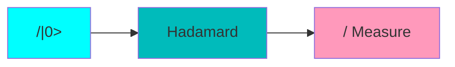

# 探索AIOS的量子计算前景:量子机器学习、量子优化与量子模拟

## 1.背景介绍

### 1.1 量子计算的崛起

量子计算是利用量子力学的基本原理来执行运算的一种全新计算范式。与经典计算机基于二进制位(0和1)不同,量子计算机利用量子比特(量子态的叠加)来表示信息。这使得量子计算机能够同时处理大量可能的状态,从而在解决某些复杂问题时拥有巨大的计算优势。

量子计算的潜力已经引起了科技界的广泛关注。谷歌、IBM、微软等科技巨头都在量子计算领域投入了大量资源。2019年,谷歌宣布实现了"量子优越性",其54量子比特的Sycamore量子处理器在解决一个特定的采样问题时,比当今最快的经典计算机快上10万亿倍。

### 1.2 AIOS与量子计算

人工智能、物联网、云计算和大数据统称为AIOS(AI、IoT、Cloud、Big Data)。这些新兴技术的发展离不开强大的计算能力。量子计算作为未来的计算范式,必将为AIOS带来巨大推动。

- **量子机器学习**:量子计算可以加速机器学习算法,提高数据处理效率,从而推动人工智能的发展。
- **量子优化**:许多优化问题在经典计算机上是NP难的,量子计算可以为此提供更高效的解决方案。
- **量子模拟**:量子计算机可以精确模拟量子系统,这在化学、材料科学、药物设计等领域有着广泛应用前景。

因此,探索量子计算在AIOS领域的应用前景,是当前科技发展的一个重要课题。

## 2.核心概念与联系  

### 2.1 量子计算的基本概念

#### 2.1.1 量子比特

量子比特(qubit)是量子计算的基本信息单元。与经典比特的0和1不同,量子比特可以处于0和1的叠加态,表示为$\alpha|0\rangle+\beta|1\rangle$,其中$|\alpha|^2+|\beta|^2=1$。这种叠加态赋予了量子比特并行处理信息的能力。

#### 2.1.2 量子逻辑门

量子逻辑门是对量子比特进行操作的基本单元,相当于经典计算中的逻辑门。常见的量子逻辑门包括Hadamard门、CNOT门、相位转移门等。通过对量子比特施加一系列量子逻辑门操作,可以构建出复杂的量子算法。

#### 2.1.3 量子纠缠

量子纠缠是量子力学中一种奇特的现象,描述了量子态之间的相关性。纠缠的量子态无法被分解为单个量子态的乘积,这使得量子计算机能够处理大量相关信息,从而获得巨大的并行计算能力。

### 2.2 量子计算与AIOS的联系

量子计算为AIOS带来了新的计算范式和算力支持,为这些领域注入了新的活力。

- **人工智能**:量子计算可以加速机器学习算法,提高数据处理效率,推动人工智能的发展。
- **物联网**:通过量子优化算法,可以优化物联网设备的能源管理、任务调度等,提高系统效率。
- **云计算**:量子计算为云计算提供了新的计算资源,可用于处理复杂的大数据分析、优化等任务。
- **大数据**:量子计算机的并行处理能力,可以加速大数据的处理和分析,提取更有价值的信息。

因此,量子计算是推动AIOS发展的重要驱动力,两者的结合将孕育出新的科技变革。

## 3.核心算法原理具体操作步骤

### 3.1 量子机器学习算法

量子机器学习算法利用量子计算的并行性和量子态叠加的特点,对经典机器学习算法进行了加速。以下是一些典型的量子机器学习算法及其基本原理。

#### 3.1.1 量子主成分分析(QPCA)

主成分分析(PCA)是一种常用的无监督降维技术。QPCA利用量子相位估计算法来计算数据的特征值和特征向量,从而实现对数据的降维。

算法步骤:

1. 将经典数据编码为量子态$|\psi\rangle$
2. 构造一个量子线路来实现矩阵$e^{-iAt}$的指数映射,其中$A$是待分解的矩阵
3. 通过量子相位估计,计算$e^{-iAt}$的特征值$e^{-i\lambda_j t}$
4. 通过反向计算,得到矩阵$A$的特征值$\lambda_j$
5. 利用特征值和特征向量,完成对数据的降维

QPCA可以在指数加速下完成PCA,大大提高了计算效率。

#### 3.1.2 量子支持向量机(QSVM)

支持向量机(SVM)是一种常用的监督学习模型。QSVM通过量子相位估计和幺正矩阵分解,加速了SVM的训练过程。

算法步骤:

1. 将训练数据编码为量子态$|\psi\rangle$
2. 构造一个量子线路来实现矩阵$e^{-iHt}$的指数映射,其中$H$是SVM的核矩阵
3. 通过量子相位估计,计算$e^{-iHt}$的特征值$e^{-i\lambda_j t}$
4. 利用特征值和特征向量,计算出SVM的支持向量
5. 基于支持向量,构建SVM分类器

QSVM通过量子相位估计和幺正矩阵分解,大大减少了SVM训练的时间复杂度。

### 3.2 量子优化算法

量子优化算法利用量子计算的并行性和量子纠缠特性,可以为一些NP难的组合优化问题提供更高效的解决方案。

#### 3.2.1 量子近似优化算法(QAOA)

QAOA是一种通用的量子优化算法框架,可以应用于多种组合优化问题,如旅行商问题、图着色问题等。

算法步骤:

1. 将优化问题的目标函数编码为一个量子哈密顿量$H_C$
2. 设计一个驱动哈密顿量$H_B$,用于产生相干的量子态演化
3. 通过交替应用$e^{-i\beta_k H_B}$和$e^{-i\gamma_kH_C}$,产生一个量子态$|\psi(\vec{\beta},\vec{\gamma})\rangle$
4. 测量$|\psi(\vec{\beta},\vec{\gamma})\rangle$,获得优化问题的近似解
5. 通过经典优化算法,调整$\vec{\beta}$和$\vec{\gamma}$,使$\langle\psi(\vec{\beta},\vec{\gamma})|H_C|\psi(\vec{\beta},\vec{\gamma})\rangle$最小化

QAOA通过量子态的叠加和干涉,可以在有限的量子线路深度下获得优化问题的较好近似解。

#### 3.2.2 量子绝热算法(QAA)

QAA借鉴了物理学中的绝热理论,通过缓慢演化量子系统,找到其基态(最优解)。

算法步骤:

1. 构造一个简单的初始哈密顿量$H_B$,其基态容易获得
2. 构造一个与优化问题对应的目标哈密顿量$H_P$
3. 设计一个绝热路径,使系统从$H_B$缓慢演化到$H_P$
4. 测量系统的最终态,即为$H_P$的基态(优化问题的解)

QAA的关键在于绝热演化的路径设计。一个合理的绝热路径可以避免系统陷入局部极小值,从而获得全局最优解。

## 4.数学模型和公式详细讲解举例说明

量子计算的数学模型主要基于量子力学的基本原理,包括量子态、量子测量、量子逻辑门等概念。下面将详细讲解一些核心的数学模型和公式。

### 4.1 量子态和量子测量

量子态是量子系统的基本描述,用复数量子态矢量$|\psi\rangle$表示。对于一个$n$比特的量子系统,其量子态可以表示为:

$$
|\psi\rangle = \sum_{i=0}^{2^n-1}\alpha_i|i\rangle
$$

其中,$\alpha_i$是复数系数,满足归一化条件$\sum_i|\alpha_i|^2=1$。$|i\rangle$是计算基矢,用$n$比特的二进制串表示。

对量子态进行测量,会使其坍缩到某个特定的基态$|i\rangle$,概率为$|\alpha_i|^2$。这种测量过程是不可逆的,会破坏量子态的叠加特性。

### 4.2 量子逻辑门

量子逻辑门是对量子比特进行操作的基本单元,用酉矩阵表示。一个$n$比特的量子逻辑门$U$是一个$2^n\times 2^n$的酉矩阵,满足$U^\dagger U=UU^\dagger=I$。

常见的单比特量子逻辑门包括:

- hadamard门: $H=\frac{1}{\sqrt{2}}\begin{pmatrix}1&1\\1&-1\end{pmatrix}$
- 相位转移门: $R_\phi=\begin{pmatrix}1&0\\0&e^{i\phi}\end{pmatrix}$
- Pauli-X门: $X=\begin{pmatrix}0&1\\1&0\end{pmatrix}$
- Pauli-Y门: $Y=\begin{pmatrix}0&-i\\i&0\end{pmatrix}$
- Pauli-Z门: $Z=\begin{pmatrix}1&0\\0&-1\end{pmatrix}$

两个量子逻辑门$U_1$和$U_2$的乘积$U_1U_2$表示先应用$U_2$,再应用$U_1$。

### 4.3 量子线路

量子线路是描述量子算法的一种图形化表示方式,由量子逻辑门和量子线路组成。一个简单的量子线路如下所示:



上图表示对量子比特$|0\rangle$施加Hadamard门,然后进行测量。

一个更复杂的量子线路可以用来实现量子相位估计算法,如下所示:

```mermaid
graph BT
    subgraph ControlledU
        q0["/ |0>"]--U1--U2--U3--U4
        q1["/ |0>"]--C1--C2--C3--C4
        C1["/  Controlled-U^1"]
        C2["/  Controlled-U^2"]
        C3["/  Controlled-U^4"]
        C4["/  Controlled-U^8"]
        U1["/  U"]
        U2["/  U^2"]
        U3["/  U^4"]
        U4["/  U^8"]
    end
    subgraph QPE
        q2["/ |0>"]--H--QFT
        H[Hadamard]
        QFT["/  Quantum Fourier Transform"]
    end
    q0--M0["/  Measure"]
    q1--M1["/  Measure"]
    q2--M2["/  Measure"]
    style q0 fill:#0ff
    style q1 fill:#0ff 
    style q2 fill:#0ff
    style M0 fill:#f9b
    style M1 fill:#f9b
    style M2 fill:#f9b
    style C1 fill:#0bb
    style C2 fill:#0bb
    style C3 fill:#0bb
    style C4 fill:#0bb
    style U1 fill:#0bb
    style U2 fill:#0bb
    style U3 fill:#0bb
    style U4 fill:#0bb
    style H fill:#0bb
    style QFT fill:#0bb
```

这个量子线路实现了量子相位估计算法,用于计算一个酉矩阵$U$的特征值。其中$U^{2^k}$表示$U$的$2^k$次方,通过控制门实现。最后通过量子傅里叶变换和测量,可以近似得到$U$的特征值。

### 4.4 量子算法复杂度

量子算法的复杂度分析需要考虑以下几个因素:

- 所需的量子比特数$n$
- 量子线路的深度(量子逻