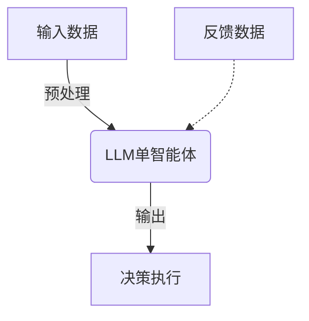

# 智能交通:LLM单智能体系统在智能交通系统中的应用

## 1.背景介绍

### 1.1 智能交通系统的重要性

随着城市化进程的加速和汽车保有量的不断增长,交通拥堵、安全隐患和环境污染等问题日益严重,亟需建立高效、绿色、智能的综合交通运输体系。智能交通系统(Intelligent Transportation Systems, ITS)是指利用先进的信息技术、数据通信传输技术、电子传感器技术、计算机技术、控制技术及其相关领域的理论与技术,对道路、车辆、货物、旅客等进行实时、动态、整体和优化的监测、控制和管理,从而实现交通工具高效、安全、节能、舒适行驶的一种新型综合交通运输管理系统。

### 1.2 人工智能在智能交通系统中的应用

传统的智能交通系统主要依赖规则引擎、机器学习等技术,但存在一些局限性。比如规则引擎需要人工制定大量规则,无法处理复杂动态场景;机器学习则需要大量标注数据,且难以解释决策过程。近年来,大语言模型(Large Language Model, LLM)技术的兴起为智能交通系统带来了新的发展机遇。LLM能够从海量非结构化数据中习得知识,具备强大的自然语言理解和生成能力,可用于智能交通领域的多项任务,如交通预测、路径规划、异常检测等。

### 1.3 LLM单智能体系统概述  

LLM单智能体系统指的是将单一的大语言模型应用于智能交通系统中,充当智能代理,独立完成决策和控制。这种系统具有以下优势:

1. 知识丰富,可从大量非结构化数据中习得交通领域知识
2. 推理能力强,能结合多维度信息做出复杂决策
3. 可解释性好,决策过程有迹可循
4. 部署灵活,无需大量标注数据,成本低
5. 可通过持续学习不断进化,具备自我完善能力

## 2.核心概念与联系

### 2.1 大语言模型(LLM)

大语言模型是一种基于自然语言的人工智能模型,通过自监督学习从大规模文本语料中习得知识表示。主流的LLM有GPT、BERT、XLNet、T5等,它们在自然语言理解、生成、推理等方面表现出色。

LLM通过Transformer编码器-解码器架构对输入序列(如文本)进行编码,捕捉上下文语义信息,然后对目标序列(如回答、翻译等)进行解码生成。在学习过程中,LLM会在训练语料上最大化序列条件概率,习得文本中蕴含的知识。

训练完成后,LLM可被看作是一个先验知识库,存储了大量领域知识。通过prompt引导,它可以针对特定任务生成上下文相关、语义连贯的自然语言输出,从而被应用于各种智能系统中。

### 2.2 LLM在智能交通系统中的应用

智能交通系统涉及多个环节,如交通状态感知、交通流量预测、路径规划、异常事件检测与响应等。LLM可以在这些环节中发挥重要作用:

1. **交通状态感知**: LLM可以从多源异构交通大数据(如道路监控视频、车载传感器数据、社交媒体等)中提取交通参与者(车辆、行人等)的位置、速度、行为等状态信息。

2. **交通流量预测**: 基于历史交通数据、天气情况、社交媒体等信息,LLM可以预测未来一段时间内的交通流量水平,为交通调度和路径规划提供决策依据。

3. **路径规划**: 结合实时交通状态、用户出行偏好、节能减排需求等,LLM可以为用户规划出行路径,并根据交通动态实时调整路线。

4. **异常事件检测与响应**: LLM可以从视频、文本等多模态数据中检测交通异常(如事故、路面施工等),并根据异常类型、影响范围等信息生成应对措施。

5. **交通指令生成**: LLM可以自然语言形式为驾驶员、行人等出具导航、疏导等指令,实现人机交互。

### 2.3 LLM单智能体系统框架

LLM单智能体系统的核心是一个大型语言模型,它扮演智能代理的角色,独立完成对交通环境的感知、决策和指令生成。系统的基本框架如下:

1. **输入数据**包括交通视频流、车载传感器数据、社交媒体文本、天气等多源异构数据。
2. **预处理**将输入数据转换为LLM可以理解的文本形式,如对视频做目标检测并生成文本描述。
3. **LLM单智能体**接收预处理后的数据,根据内部知识对交通状态做出感知,并生成对应的决策指令。
4. **决策执行**将LLM输出的指令发送到执行单元,如改变交通信号灯、发布导航路线等。
5. **反馈数据**收集决策执行后的反馈数据,用于持续训练和优化LLM模型。

LLM单智能体的优势在于无需复杂的规则制定或大量监督数据标注,只需通过prompt学习即可完成各种智能交通任务。同时,它具备较好的可解释性,决策过程可追溯。

## 3.核心算法原理具体操作步骤

LLM单智能体系统的核心是基于Transformer的大型语言模型,通过自回归建模对输入序列进行编码,捕获上下文语义信息,再对目标序列进行解码生成。我们以GPT模型为例,介绍其核心算法原理。

### 3.1 Transformer编码器

Transformer编码器的主要组件包括多头自注意力机制和前馈神经网络。对于长度为n的输入序列$X = (x_1, x_2, ..., x_n)$,编码器计算过程如下:

1. **词嵌入及位置编码**
   
   将每个输入词$x_i$映射为词向量表示$e(x_i)$,并加上相应的位置编码$p_i$,得到表示$z_i = e(x_i) + p_i$。

2. **多头自注意力**

   对输入$Z = (z_1, z_2, ..., z_n)$计算多头自注意力,捕获序列中的长程依赖关系:

   $$\begin{aligned}
   MultiHead(Z) &= Concat(head_1, head_2, ..., head_h)W^O\\
   head_i &= Attention(ZW_i^Q, ZW_i^K, ZW_i^V)
   \end{aligned}$$

   其中$W_i^Q, W_i^K, W_i^V$是查询、键值的线性变换矩阵,用于获取不同表示子空间。

3. **前馈神经网络**

   对多头注意力的输出进行非线性变换:
   
   $$FFN(x) = \text{ReLU}(xW_1 + b_1)W_2 + b_2$$

4. **规范化及残差连接**

   每个子层的输出会做规范化,并与输入做残差连接,保证梯度传播稳定。

5. **输出**

   最终编码器的输出是一个向量序列,其中每个向量$h_i$编码了输入$x_i$及其在序列中的上下文信息。

### 3.2 Transformer解码器

解码器的结构类似编码器,但增加了对编码器输出的注意力计算。给定编码器输出$H = (h_1, h_2, ..., h_n)$和解码器当前输出$Y = (y_1, y_2, ..., y_m)$,解码器每一步的计算过程为:

1. **遮掩多头自注意力**

   与编码器类似,但注意力计算时被遮掩,避免关注未来位置的信息。

2. **编码器-解码器注意力**

   计算解码器输出与编码器输出的注意力,获取输入序列的上下文信息:

   $$\text{AttOutput} = \text{Attention}(YW_q, HW_k, HW_v)$$

3. **前馈神经网络**

   与编码器类似,对注意力输出做非线性变换。

4. **生成概率**
   
   将前馈网络输出通过线性变换和softmax计算,得到下一个词的生成概率分布:
   
   $$P(y_{m+1}|y_1,...,y_m, X) = \text{softmax}(FFN(y_m)W + b)$$

5. **输出**

   重复上述过程,直至生成终止标记或达到长度限制。

通过上述自回归过程,解码器可以基于输入序列和当前已生成的部分,预测出符合上下文语义的下一个词,最终生成整个目标序列。

### 3.3 LLM在智能交通中的应用示例

以交通流量预测为例,说明LLM在智能交通中的应用:

1. **输入数据**包括历史交通数据(如车流量、车速等)、天气情况、社交媒体等,经过预处理转化为文本形式。

2. **编码器**将输入序列编码为上下文表示向量。

3. **解码器**根据输入的上下文向量,自回归生成描述未来交通状态的文本序列。

4. **后处理**将解码器生成的文本,转换为具体的交通流量数值等,送入交通调度系统。

通过prompt引导,LLM可以直接生成各类交通决策的自然语言描述,实现端到端的智能决策,无需复杂的特征工程和模型设计。

## 4.数学模型和公式详细讲解举例说明

LLM的核心是基于Transformer的序列到序列模型,主要涉及自注意力机制、位置编码等数学模型。我们详细介绍其中的关键模块。

### 4.1 缩放点积注意力

注意力机制是Transformer的核心,它能够捕捉输入序列中任意两个词元素之间的相关性。具体来说,对于一个查询向量$q$和一组键值对$(k_i, v_i)$,注意力权重计算如下:

$$\text{Attention}(q, K, V) = \text{softmax}(\frac{qK^T}{\sqrt{d_k}})V$$

其中,
- $q$是查询向量,对应解码器当前状态
- $K = (k_1, k_2, ..., k_n)$是键序列,对应编码器输出
- $V = (v_1, v_2, ..., v_n)$是值序列,对应编码器输出
- $d_k$是缩放因子,防止点积过大导致softmax饱和

注意力权重$\alpha_i = \text{softmax}(\frac{qk_i^T}{\sqrt{d_k}})$反映了查询$q$与键$k_i$的相关性。通过加权求和$\sum_{i=1}^n\alpha_iv_i$,注意力机制可以从值序列中选取与查询最相关的信息。

例如,在生成"早上8点,高峰时段交通拥堵"这个句子时,注意力模型会在编码器输出(如包含"早晨"、"上班高峰"等信息)中分配较高的权重,帮助解码器生成正确的描述。

### 4.2 多头注意力

为了捕捉不同子空间的相关性,Transformer引入了多头注意力机制。具体地,查询、键、值分别通过不同的线性变换,得到不同的表示子空间:

$$\begin{aligned}
\text{head}_i &= \text{Attention}(qW_i^Q, KW_i^K, VW_i^V)\\
\text{MultiHead}(q, K, V) &= \text{Concat}(\text{head}_1, ..., \text{head}_h)W^O
\end{aligned}$$

其中$W_i^Q, W_i^K, W_i^V$是不同的变换矩阵,对应不同的表示子空间。多头注意力的输出是所有子空间注意力的拼接,再经过线性变换$W^O$进行融合。

通过多头注意力,模型可以关注输入序列中的不同位置特征,并在编码器和解码器中进行特征交互,捕捉更加丰富的上下文语义信息。

### 4.3 位置编码

由于Transformer没有递归