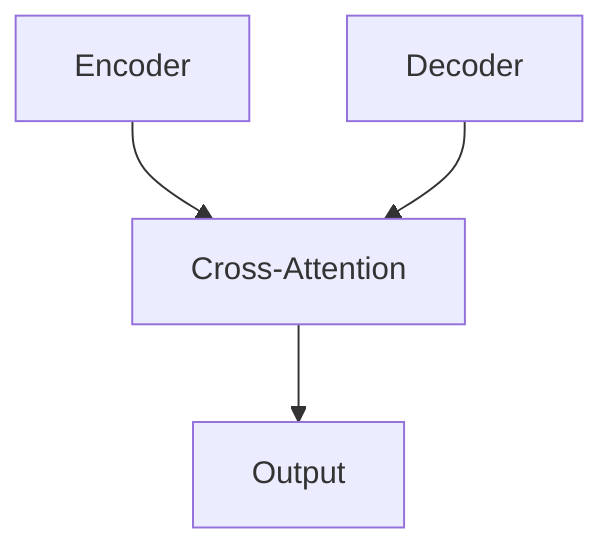

# 智能交通管理:LLM为交通行业带来新变革

## 1.背景介绍

### 1.1 交通拥堵问题

随着城市化进程的加快和汽车保有量的不断增长,交通拥堵已经成为许多城市面临的一个严峻挑战。根据2022年汤姆森路透基金会发布的交通拥堵指数报告,全球有超过60%的城市遭受中度至严重的交通拥堵。交通拥堵不仅导致时间和经济的巨大损失,还会产生环境污染、能源浪费等一系列问题。因此,构建高效、智能的交通管理系统,缓解交通压力,优化交通流量,已经成为当务之急。

### 1.2 传统交通管理系统的局限性

传统的交通管理系统主要依赖于人工经验和简单的控制算法,难以充分应对复杂多变的交通状况。这些系统缺乏智能分析和决策能力,无法实时预测交通流量变化,动态调整信号时间,导致资源利用效率低下。此外,由于缺乏跨系统的数据共享和协同,各个交通子系统之间存在信息孤岛,无法实现整体优化。

### 1.3 大数据与人工智能时代的机遇

近年来,大数据和人工智能技术的飞速发展为交通管理系统带来了全新的机遇。海量的交通数据(如车辆GPS数据、道路监控视频等)为交通分析提供了丰富的原始素材。而人工智能算法(如机器学习、深度学习等)则赋予了系统智能化的分析和决策能力。通过将大数据与人工智能相结合,交通管理系统可以实现智能交通流量预测、动态路径规划、自适应信号控制等智能化功能,大幅提升交通运行效率。

## 2.核心概念与联系

### 2.1 大规模预训练语言模型(LLM)

大规模预训练语言模型(Large Language Model,LLM)是指通过自监督学习方式在海量文本数据上进行预训练,获得通用语言理解和生成能力的大型人工神经网络模型。LLM模型具有强大的上下文理解能力、知识迁移能力和生成能力,可以在自然语言处理的各种任务上取得出色表现。

目前,LLM模型已经在自然语言处理领域取得了突破性进展,如OpenAI的GPT-3、谷歌的PaLM、DeepMind的Chinchilla等。这些大型语言模型通过吸收海量文本数据,掌握了丰富的世界知识和语言知识,可以在对话、问答、文本生成、文本分类等任务中发挥巨大作用。

### 2.2 LLM在交通领域的应用

尽管LLM模型最初设计用于自然语言处理任务,但由于其强大的知识表示和推理能力,LLM也可以在交通领域发挥重要作用。具体来说,LLM可以应用于以下几个方面:

1. **交通数据处理与分析**: 交通大数据通常包含大量非结构化文本数据,如事故报告、维修日志、政策文件等。LLM可以帮助自动提取和结构化这些非结构化数据,为后续的交通分析提供高质量的数据输入。

2. **交通需求理解与响应**: LLM可以通过理解自然语言查询,准确捕捉用户的出行需求,并给出合理的路线规划、时间安排等建议。这种基于对话的智能交通服务,将极大提升用户体验。

3. **交通规划与决策**: 借助LLM的推理和生成能力,交通管理系统可以自动生成各种交通规划方案,并评估不同方案的优劣,为决策者提供有价值的决策支持。

4. **知识库构建与知识推理**: LLM可以帮助自动构建涵盖交通法规、路网拓扑、历史数据等的知识库,并基于知识库进行符号推理,支持交通规划、异常事件处理等高级应用。

5. **多模态交通数据融合**: 除了文本数据,交通系统还包括图像、视频等多模态数据。LLM与计算机视觉技术相结合,可以实现跨模态数据的高效融合,提升交通数据的信息密度。

总的来说,LLM赋予了交通管理系统更强的语义理解、知识推理和内容生成能力,将推动交通系统向智能化、自动化和人性化方向发展。

## 3.核心算法原理具体操作步骤 

### 3.1 LLM模型架构

LLM模型通常采用基于Transformer的编码器-解码器架构,如下图所示:

编码器(Encoder)负责将输入序列(如查询语句)映射为高维向量表示;解码器(Decoder)则根据编码器的输出,生成相应的输出序列(如回复内容)。编码器和解码器均由多层Transformer块组成,通过Self-Attention和Cross-Attention机制实现长距离依赖建模。

LLM模型的训练过程包括两个阶段:

1. **预训练(Pre-training)**: 在海量无标注文本数据上进行自监督学习,获得通用的语言理解和生成能力。常用的预训练目标包括掩码语言模型(Masked Language Modeling)和下一句预测(Next Sentence Prediction)等。

2. **微调(Fine-tuning)**: 在特定任务的标注数据上,对预训练模型进行进一步的监督微调,使模型适应特定任务。

### 3.2 LLM在交通领域的应用流程

将LLM应用于交通领域的一般流程如下:

1. **数据采集与预处理**: 从各类交通数据源(如车载设备、路侧设备、移动APP等)采集原始数据,并对数据进行清洗、标注、格式转换等预处理,为模型训练做好准备。

2. **领域知识注入**: 将交通领域的专业知识(如路网拓扑、交通法规等)注入到LLM模型中,使其获得对应领域的理解能力。常见的注入方式包括继续预训练和知识蒸馏等。

3. **任务微调**: 根据具体应用场景(如交通规划、异常事件处理等),在相应的标注数据集上对LLM模型进行监督微调,提升其在特定任务上的性能表现。

4. **模型部署与应用**: 将微调后的LLM模型部署到交通管理系统中,通过API或其他接口与系统集成,为用户提供智能化的交通服务。

5. **在线学习与更新**: 在实际应用过程中,持续采集用户反馈和新的交通数据,并用于模型的在线学习和更新,不断提升模型的性能和适用性。

通过上述流程,LLM模型可以充分发挥其强大的语言理解、知识推理和内容生成能力,为交通管理系统赋能,实现智能化运营。

## 4.数学模型和公式详细讲解举例说明

LLM模型的核心是基于Transformer架构的自注意力(Self-Attention)机制,用于捕捉输入序列中长距离的依赖关系。下面我们详细介绍Self-Attention的数学原理。

### 4.1 Self-Attention机制

给定一个长度为 $n$ 的输入序列 $X = (x_1, x_2, ..., x_n)$,其中每个 $x_i \in \mathbb{R}^{d_x}$ 是 $d_x$ 维向量。Self-Attention的目标是计算一个新的向量序列 $Z = (z_1, z_2, ..., z_n)$,其中每个 $z_i$ 是 $x_i$ 的加权和,权重由 $x_i$ 与整个输入序列 $X$ 的相关性决定。

具体来说,Self-Attention包括以下几个步骤:

1. **线性投影**: 将输入序列 $X$ 分别投影到查询(Query)、键(Key)和值(Value)空间,得到 $Q$、$K$、$V$:

$$
\begin{aligned}
Q &= XW^Q \\
K &= XW^K \\
V &= XW^V
\end{aligned}
$$

其中 $W^Q \in \mathbb{R}^{d_x \times d_k}$、$W^K \in \mathbb{R}^{d_x \times d_k}$、$W^V \in \mathbb{R}^{d_x \times d_v}$ 是可学习的投影矩阵,用于将输入映射到查询、键和值空间。$d_k$ 和 $d_v$ 分别是查询/键和值向量的维度。

2. **计算注意力分数**: 通过查询 $Q$ 与所有键 $K$ 的点积,计算注意力分数矩阵 $A$:

$$
A = \text{softmax}\left(\frac{QK^\top}{\sqrt{d_k}}\right)
$$

其中 $\sqrt{d_k}$ 是缩放因子,用于避免点积的值过大导致梯度消失或爆炸。

3. **加权求和**: 将注意力分数矩阵 $A$ 与值矩阵 $V$ 相乘,得到输出序列 $Z$:

$$
Z = AV
$$

每个输出向量 $z_i$ 就是输入序列中所有向量的加权和,权重由 $x_i$ 与整个序列的相关性决定。

通过Self-Attention机制,LLM模型可以自动学习输入序列中不同位置之间的长距离依赖关系,从而提升序列建模的性能。

### 4.2 Multi-Head Attention

在实际应用中,通常采用Multi-Head Attention来提高模型的表达能力。Multi-Head Attention将注意力机制分成多个子空间,每个子空间单独计算一次Self-Attention,然后将所有子空间的结果拼接起来作为最终输出。

设有 $h$ 个注意力头(Head),每个头的维度为 $d_v^{\prime} = d_v / h$。Multi-Head Attention的计算过程如下:

1. 对每个注意力头 $i = 1, 2, ..., h$,分别计算:

$$
\begin{aligned}
\text{head}_i &= \text{Attention}(QW_i^Q, KW_i^K, VW_i^V) \\
&= \text{softmax}\left(\frac{QW_i^QK^\top W_i^{K\top}}{\sqrt{d_k}}\right)VW_i^V
\end{aligned}
$$

其中 $W_i^Q \in \mathbb{R}^{d_k \times d_k^{\prime}}$、$W_i^K \in \mathbb{R}^{d_k \times d_k^{\prime}}$、$W_i^V \in \mathbb{R}^{d_v \times d_v^{\prime}}$ 是每个头对应的线性投影矩阵。

2. 将所有头的输出拼接起来:

$$
\text{MultiHead}(Q, K, V) = \text{Concat}(\text{head}_1, \text{head}_2, ..., \text{head}_h)W^O
$$

其中 $W^O \in \mathbb{R}^{hd_v^{\prime} \times d_v}$ 是一个额外的线性投影,用于将拼接后的向量映射回原始的值空间。

通过Multi-Head Attention,模型可以同时关注输入序列中不同的子空间表示,提高了对复杂模式的建模能力。

上述Self-Attention和Multi-Head Attention机制是Transformer及LLM模型的核心,赋予了模型强大的序列建模能力,是LLM模型取得卓越性能的关键所在。

## 4.项目实践:代码实例和详细解释说明

为了帮助读者更好地理解LLM在交通领域的应用,我们提供了一个基于Hugging Face Transformers库的实例项目。该项目旨在构建一个智能交通问答系统,能够回答用户提出的各种交通相关问题。

### 4.1 项目概述

该项目主要包括以下几个模块:

1. **数据采集与预处理**: 从开放数据源(如政府网站、维基百科等)采集与交通相关的文本数据,并进行数据清洗、格式转换等预处理。

2. **领域知识注入**: 利用交通领域的知识库(如路网拓扑、交通法规等),对预训练的LLM模型进行继续预训练,使其获得对应领域的知识。

3. **问答数据标注**: 构建一个交通问答数据集,包括各种交通相关问题及其对应的答案,用于模型的微调训练