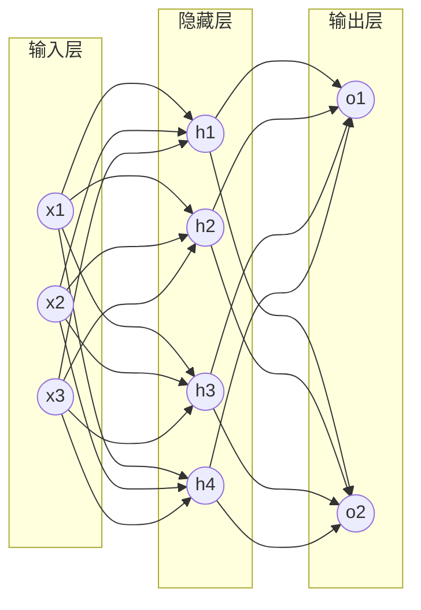

# 构建第一个神经网络:用Python实现前馈网络

作者：禅与计算机程序设计艺术

## 1. 背景介绍

### 1.1 人工智能与神经网络

人工智能(Artificial Intelligence, AI)是计算机科学的一个重要分支,其目标是开发能够模拟人类智能的计算机系统。而神经网络(Neural Network)则是实现人工智能的一种重要方法。神经网络从生物学的角度模拟了人脑的神经元结构和工作原理,通过大量简单的处理单元(即人工神经元)的相互连接与信息传递,实现了复杂的计算和学习功能。

### 1.2 前馈神经网络

前馈神经网络(Feedforward Neural Network)是神经网络的一种基本形式,也称为多层感知机(Multilayer Perceptron, MLP)。其特点是信号或信息总是从输入层经过若干隐藏层最终到达输出层,整个网络呈现一个前向传播的层次结构。前馈神经网络是许多高级神经网络模型(如卷积神经网络)的基础,在模式识别、自然语言处理等领域有广泛应用。

### 1.3 Python在人工智能领域的应用

Python是人工智能领域广泛使用的编程语言之一。其简洁的语法、强大的库支持以及活跃的社区,使得Python成为许多研究者和工程师构建人工智能系统的首选。特别是在机器学习和深度学习方面,Python有NumPy、SciPy、Pandas等数据处理库,以及TensorFlow、PyTorch、Keras等深度学习框架。使用Python构建神经网络模型,可以快速实现想法并进行实验验证。

## 2. 核心概念与联系

### 2.1 人工神经元

人工神经元是神经网络的基本组成单位,从生物学角度模拟了神经元的结构和功能。一个典型的人工神经元由输入、权重、激活函数和输出构成:

- 输入:接收来自其他神经元或外界的信号
- 权重:每个输入信号的重要性
- 激活函数:根据输入和权重计算神经元的激活程度
- 输出:将激活函数的计算结果输出给其他神经元

可以用数学公式表示一个人工神经元的计算过程:

$$
\begin{aligned}
z &= \sum_{i=1}^{n} w_i x_i + b \\
a &= \sigma(z)
\end{aligned}
$$

其中,$x_i$是第$i$个输入,$w_i$是对应的权重,$b$是偏置项,$\sigma$是激活函数,$a$是神经元的输出。

### 2.2 激活函数

激活函数在神经网络中起着非常重要的作用,它引入了非线性,使得神经网络能够逼近任意复杂的函数。常见的激活函数有:

- Sigmoid函数:$\sigma(x) = \frac{1}{1+e^{-x}}$
- Tanh函数:$\tanh(x) = \frac{e^x - e^{-x}}{e^x + e^{-x}}$ 
- ReLU函数:$ReLU(x) = max(0, x)$

不同的激活函数适用于不同的场景。Sigmoid和Tanh函数将输出压缩到(0,1)或(-1,1)的范围内,适合用于二分类问题的输出层。ReLU函数在隐藏层使用较多,可以缓解梯度消失问题并加速训练。

### 2.3 网络结构

前馈神经网络由输入层、隐藏层和输出层组成。每一层都包含若干个人工神经元,相邻层之间的神经元以一定的权重相互连接。网络的层数和每层的神经元个数是超参数,需要根据具体问题来设计。一般来说,增加隐藏层的层数和神经元个数可以提高网络的表达能力,但也可能带来过拟合的风险。

下图展示了一个简单的三层前馈神经网络结构:



### 2.4 前向传播与反向传播

前向传播是神经网络接收输入并产生输出的过程。输入数据从输入层开始,逐层经过隐藏层,最终到达输出层并给出预测结果。前向传播的数学表达如下:

$$
\begin{aligned}
\mathbf{z}^{(1)} &= \mathbf{W}^{(1)} \mathbf{x} + \mathbf{b}^{(1)} \\
\mathbf{a}^{(1)} &= \sigma^{(1)}(\mathbf{z}^{(1)}) \\
\mathbf{z}^{(2)} &= \mathbf{W}^{(2)} \mathbf{a}^{(1)} + \mathbf{b}^{(2)} \\ 
\mathbf{a}^{(2)} &= \sigma^{(2)}(\mathbf{z}^{(2)}) \\
&\cdots \\
\mathbf{\hat{y}} &= \mathbf{a}^{(L)}
\end{aligned}
$$

其中,$\mathbf{W}^{(l)}$和$\mathbf{b}^{(l)}$分别表示第$l$层的权重矩阵和偏置向量,$\sigma^{(l)}$表示第$l$层使用的激活函数,$L$表示网络的层数。

反向传播是训练神经网络的关键算法,用于计算网络参数(即权重和偏置)的梯度。反向传播从输出层开始,根据预测误差,逐层计算各参数的梯度,直到输入层。然后使用梯度下降等优化算法更新网络参数,使得预测结果更加接近真实值。反向传播的核心是链式法则,对于第$l$层的任意参数$\theta^{(l)}$,其梯度为:

$$
\frac{\partial J}{\partial \theta^{(l)}} = \frac{\partial J}{\partial \mathbf{z}^{(l)}} \frac{\partial \mathbf{z}^{(l)}}{\partial \theta^{(l)}}
$$

其中,$J$是损失函数,$\mathbf{z}^{(l)}$是第$l$层神经元的加权输入。

## 3. 核心算法原理具体操作步骤

### 3.1 定义网络结构

构建前馈神经网络的第一步是定义网络结构,包括输入层、隐藏层和输出层的神经元个数。假设我们要构建一个包含1个隐藏层的网络,其输入维度为784(对应28*28的MNIST手写数字图片),隐藏层包含256个神经元,输出层包含10个神经元(对应0-9十个数字的分类概率)。我们可以用一个列表`sizes=[784, 256, 10]`来表示这个网络结构。

### 3.2 初始化参数

定义完网络结构后,需要初始化网络的参数,即各层的权重矩阵和偏置向量。权重矩阵的形状为$n_{l-1} \times n_l$,其中$n_{l-1}$和$n_l$分别表示前一层和当前层的神经元个数。偏置向量的形状为$n_l$。初始化时,权重一般从均值为0、方差为$\frac{1}{n_{l-1}}$的高斯分布中随机采样,偏置则初始化为0。

```python
def init_params(sizes):
    params = {}
    for i in range(1, len(sizes)):
        params['W' + str(i)] = np.random.randn(sizes[i-1], sizes[i]) * np.sqrt(1 / sizes[i-1])
        params['b' + str(i)] = np.zeros((1, sizes[i]))
    return params
```

### 3.3 前向传播

前向传播的过程就是输入数据通过网络的计算最终得到输出的过程。对于一个$L$层的网络,前向传播可以用如下代码实现:

```python
def forward(params, X, activation='relu'):
    A = X
    caches = []
    L = len(params) // 2
    for i in range(1, L+1):
        W = params['W' + str(i)]
        b = params['b' + str(i)]
        Z = np.dot(A, W) + b
        if activation == 'relu':
            A = np.maximum(0, Z)
        elif activation == 'sigmoid':
            A = 1 / (1 + np.exp(-Z))
        caches.append((A, W, b, Z))
        
    return A, caches
```

其中,`caches`用于存储前向传播过程中的一些中间变量,在反向传播时会用到。

### 3.4 计算损失

前向传播得到输出后,需要计算预测输出与真实标签之间的损失,常用的损失函数有均方误差和交叉熵损失。以二分类问题为例,交叉熵损失的计算如下:

```python
def compute_loss(A, Y):
    m = Y.shape[1]
    loss = -np.sum(Y * np.log(A) + (1 - Y) * np.log(1 - A)) / m
    return loss
```

其中,`A`是网络的输出,`Y`是真实标签。

### 3.5 反向传播

有了损失函数,就可以通过反向传播算法计算网络参数的梯度了。反向传播的过程是从输出层开始,逐层计算各参数的梯度,直到输入层。以Sigmoid激活函数为例,反向传播的代码实现如下:

```python
def backward(params, caches, X, Y):
    grads = {}
    L = len(caches)
    m = X.shape[1]
    
    # 输出层梯度
    AL, WL, bL, ZL = caches[L-1]
    dZL = AL - Y
    grads['dW' + str(L)] = np.dot(caches[L-2][0].T, dZL) / m
    grads['db' + str(L)] = np.sum(dZL, axis=1, keepdims=True) / m
    
    # 隐藏层梯度
    for i in reversed(range(L-1)):
        A, W, b, Z = caches[i]
        dA = np.dot(grads['dW' + str(i+2)].T, caches[i+1][3]) * (A * (1 - A))
        grads['dW' + str(i+1)] = np.dot(caches[i-1][0].T, dA) / m
        grads['db' + str(i+1)] = np.sum(dA, axis=1, keepdims=True) / m
        
    return grads
```

其中,`grads`存储了各层参数的梯度。

### 3.6 参数更新

计算出梯度后,就可以使用梯度下降法更新网络参数了。梯度下降的更新规则为:

$$
\begin{aligned}
W^{(l)} &:= W^{(l)} - \alpha \frac{\partial J}{\partial W^{(l)}} \\
b^{(l)} &:= b^{(l)} - \alpha \frac{\partial J}{\partial b^{(l)}}
\end{aligned}
$$

其中,$\alpha$是学习率。将其转化为代码:

```python
def update_params(params, grads, learning_rate):
    L = len(params) // 2
    for i in range(1, L+1):
        params['W' + str(i)] -= learning_rate * grads['dW' + str(i)]
        params['b' + str(i)] -= learning_rate * grads['db' + str(i)]
    return params
```

### 3.7 训练网络

有了以上几个步骤,就可以编写训练网络的主循环了。训练的过程就是不断执行"前向传播-计算损失-反向传播-更新参数"的循环,直到损失函数降到一个满意的程度。

```python
def train(X, Y, sizes, learning_rate, num_epochs):
    params = init_params(sizes)
    
    for i in range(num_epochs):
        A, caches = forward(params, X)
        loss = compute_loss(A, Y)
        grads = backward(params, caches, X, Y)
        params = update_params(params, grads, learning_rate)
        
        if i % 100 == 0:
            print('Epoch %d, loss = %.4f' % (i, loss))
        
    return params
```

其中,`num_epochs`表示训练的轮数。

## 4. 数学模型和公式详细讲解举例说明

前