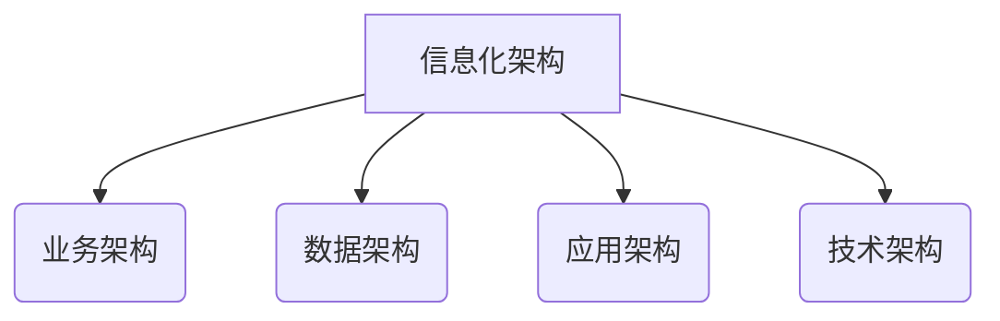
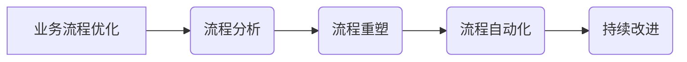

# 消费品行业信息化整体建设和管理工作

## 1. 背景介绍

### 1.1 消费品行业概述

消费品行业是指生产和销售日常生活必需品的行业,包括食品、饮料、日化用品、服装、鞋帽等。这些产品满足了人们基本的生存和生活需求,是一个庞大而不可或缺的产业。随着经济的发展和人民生活水平的提高,消费品行业也在不断扩大和升级。

### 1.2 信息化的重要性

在当今时代,信息技术已经渗透到各行各业,成为提高效率、降低成本、增强竞争力的关键因素。消费品行业作为一个传统行业,也面临着信息化转型的巨大压力和机遇。通过信息化建设,企业可以实现精细化管理、优化供应链、提升营销能力、挖掘大数据价值等,从而赢得市场竞争的主动权。

### 1.3 信息化建设的挑战

尽管信息化建设的重要性不言而喻,但消费品企业在实施过程中也面临着诸多挑战:

- 遗留系统和新系统的整合
- 数据标准和质量问题
- 组织变革和文化冲突
- 人才短缺和技能培训
- 投资回报率评估困难

因此,消费品企业需要制定全面的信息化战略,统筹规划和管理整个建设过程。

## 2. 核心概念与联系

### 2.1 信息化架构

信息化架构是指企业信息系统的总体框架,包括业务架构、数据架构、应用架构、技术架构等层面。它确保了各个系统和模块之间的协调一致,实现了数据共享和业务集成。消费品企业需要根据自身特点,设计出符合实际需求的信息化架构。

### 2.2 业务流程优化

业务流程优化是信息化建设的核心内容之一。通过分析和重塑现有的业务流程,消除低效环节,实现流程自动化和标准化,可以极大提高企业的运营效率。比如在供应链管理、订单处理、库存控制等环节,都有优化的巨大空间。

### 2.3 数字化转型

数字化转型是指利用数字技术全面转变企业的运营模式、产品和服务。对于消费品企业来说,数字化转型包括:

- 电子商务和新零售模式
- 个性化营销和精准营销
- 智能制造和工业4.0
- 大数据分析和商业智能

通过数字化转型,企业可以更好地满足消费者需求,提升竞争力。

### 2.4 信息安全与合规

随着信息系统的广泛应用,信息安全和合规性问题日益突出。消费品企业需要建立完善的安全管理体系,保护关键数据和知识产权,防范网络攻击和数据泄露。同时还要遵守相关的法律法规,如食品安全法、个人信息保护法等。

## 3. 核心算法原理具体操作步骤  

在消费品行业信息化建设中,涉及到多种算法和技术,下面我们介绍其中几种核心算法的原理和具体操作步骤。

### 3.1 供应链优化算法

供应链优化是消费品企业的重中之重,通过建模和算法可以实现供应链网络的优化配置、库存控制、运输路线规划等,从而降低总体运营成本。

#### 3.1.1 整数规划算法

整数规划算法常用于供应链网络优化配置问题,目标是在满足约束条件的前提下,最小化总成本或最大化总收益。

算法步骤:

1) 建立数学模型,确定决策变量(如工厂选址、产能分配等)、目标函数和约束条件
2) 对目标函数和约束进行线性化,转化为整数规划模型
3) 使用整数规划求解器(如CPLEX、Gurobi等)求解最优解
4) 对求解结果进行分析,并应用于实际决策

$$
\begin{aligned}
\min \quad & \sum_i \sum_j c_{ij} x_{ij} \\
\text{s.t.} \quad & \sum_j x_{ij} = d_i, \forall i \\
             & \sum_i x_{ij} \leq s_j, \forall j\\
             & x_{ij} \in \mathbb{Z}^+, \forall i, j
\end{aligned}
$$

上面是一个简化的运输问题整数规划模型,目标是最小化总运输成本,决策变量$x_{ij}$表示从工厂$j$运送到客户$i$的数量。

#### 3.1.2 动态规划算法

动态规划算法适用于具有最优子结构的优化问题,例如库存控制、批量决策等。

算法步骤:

1) 将原问题分解为若干子问题
2) 自底向上求解子问题,并存储子问题的最优解
3) 利用子问题的最优解推导出原问题的最优解

$$
\begin{aligned}
f(n) = \min_{0 \leq k \leq n} \{ f(n-k) + c(k) \}
\end{aligned}
$$

上面是经典的背包动态规划模型,其中$f(n)$表示前$n$个物品的最优解,$c(k)$表示第$k$个物品的成本。

### 3.2 营销决策算法

消费品企业的营销策略对于销售业绩至关重要,通过数据分析和优化算法,可以制定精准的营销方案。

#### 3.2.1 客户细分算法 

客户细分旨在根据客户特征和行为习惯,将其划分为若干个同质群组,从而实施有针对性的营销策略。常用的算法有K-Means聚类、层次聚类等。

算法步骤:

1) 收集客户数据,包括人口统计、交易和行为数据等
2) 对数据进行清洗、标准化和降维处理
3) 选择合适的聚类算法和距离度量,确定聚类数量
4) 运行算法,得到客户群组及其特征描述
5) 分析每个群组,制定差异化营销策略

#### 3.2.2 营销组合优化算法

营销组合优化是在有限的营销预算下,确定最佳的营销活动组合,以达到最大的营销效果。这是一个经典的组合优化问题。

算法步骤:

1) 收集历史营销活动数据,包括成本、曝光度、转化率等
2) 建立营销效果评估模型,如线性模型、logistic回归等
3) 将营销组合优化问题形式化为整数规划或启发式算法模型
4) 使用求解器求解最优营销组合方案
5) 根据优化结果分配营销资源,执行营销活动

### 3.3 智能制造算法

智能制造是消费品企业数字化转型的重要方向,涉及生产计划排程、质量控制、设备预测维护等环节,都可以借助算法和人工智能技术来优化。

#### 3.3.1 制造计划排程算法

制造计划排程算法旨在根据订单需求、资源约束等,生成最优的生产计划和作业排程,以提高资源利用率,缩短生产周期。

算法步骤:

1) 收集订单、工序、资源等制造数据
2) 建立制造计划排程模型,确定约束条件和优化目标
3) 使用算法求解,如整数规划、启发式算法、限制规划等
4) 将最优计划分解为可执行的作业排程
5) 监控实施过程,根据实际情况动态调整计划

#### 3.3.2 质量控制算法

质量控制对消费品企业至关重要,利用机器学习等算法,可以实现自动化的缺陷检测、原因分析和预防控制。

算法步骤:

1) 收集产品质量数据,包括检测数据、工艺参数等
2) 对数据进行预处理,提取特征
3) 使用监督或无监督算法建模,如SVM、神经网络等
4) 在线预测新产品的质量状态,发现异常
5) 分析原因,并将反馈应用于工艺优化和预防控制

## 4. 数学模型和公式详细讲解举例说明

在上一节中,我们介绍了一些核心算法的原理和步骤,其中涉及到了一些数学模型和公式。下面我们对其中的几个典型模型进行详细讲解和举例说明。

### 4.1 整数规划模型

整数规划模型在供应链优化、营销组合优化等问题中有广泛应用。我们以一个简化的运输问题为例,详细讲解整数规划模型的建立过程。

#### 4.1.1 问题描述

某消费品公司有3个工厂和4个销售点,已知每个工厂的产能、每个销售点的需求量,以及各工厂到各销售点的单位运输成本。现需要确定各工厂到各销售点的最优运输方案,使总运输成本最小。

#### 4.1.2 模型建立

决策变量:
- $x_{ij}$: 工厂$j$运送给销售点$i$的产品数量

目标函数:
$$
\min \sum_{i=1}^4 \sum_{j=1}^3 c_{ij} x_{ij}
$$

约束条件:
1) 每个销售点的需求必须被满足
$$
\sum_{j=1}^3 x_{ij} = d_i, \quad i=1,2,3,4
$$
2) 每个工厂的供应量不能超过产能
$$
\sum_{i=1}^4 x_{ij} \leq s_j, \quad j=1,2,3
$$
3) 决策变量为非负整数
$$
x_{ij} \geq 0 \text{ and integer}, \quad \forall i,j
$$

其中:
- $c_{ij}$: 工厂$j$运送到销售点$i$的单位运输成本
- $d_i$: 销售点$i$的需求量
- $s_j$: 工厂$j$的产能

#### 4.1.3 数据实例

假设有以下数据:

工厂产能: $s_1=80$, $s_2=270$, $s_3=250$
销售点需求: $d_1=50$, $d_2=60$, $d_3=90$, $d_4=120$

单位运输成本($c_{ij}$):

|      | 工厂1 | 工厂2 | 工厂3 |
|------|-------|-------|-------|
| 销售点1 | 4     | 6     | 9     |
| 销售点2 | 6     | 3     | 7     |
| 销售点3 | 8     | 8     | 4     |
| 销售点4 | 5     | 10    | 8     |

#### 4.1.4 求解和分析

使用整数规划求解器(如CPLEX)求解上述模型,可以得到最优解:

$$
\begin{aligned}
x_{11} &= 50 \\
x_{22} &= 60 \\
x_{33} &= 90 \\
x_{34} &= 160 \\
\text{其余} x_{ij} &= 0
\end{aligned}
$$

最小总运输成本为1780。

从结果可以看出,工厂1全部供应销售点1,工厂2全部供应销售点2,工厂3分别供应销售点3和销售点4。这种运输方案可以充分利用各工厂的产能,并最小化总运输成本。

### 4.2 动态规划模型

动态规划算法适用于具有最优子结构的优化问题,下面我们以经典的背包问题为例,讲解动态规划模型的建立和求解过程。

#### 4.2.1 问题描述

有$n$种物品和一个容量为$V$的背包,每种物品都有自己的重量$w_i$和价值$v_i$。现在需要从这$n$种物品中选出一些放入背包,使背包中物品的总价值最大,且总重量不超过背包容量$V$。

#### 4.2.2 动态规划模型

定义状态:
- $f(i,j)$: 前$i$种物品中,在背包容量为$j$时,能获得的最大价值

状态转移方