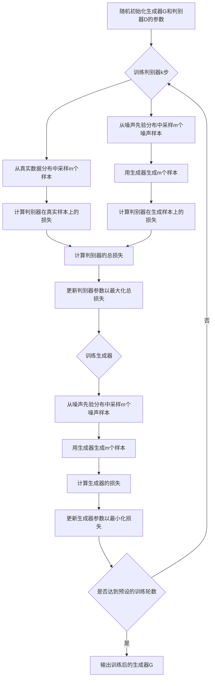

# 生成对抗网络 (GAN) 原理与代码实例讲解

作者：禅与计算机程序设计艺术

## 1. 背景介绍

### 1.1 生成对抗网络 (GAN) 的诞生
生成对抗网络（Generative Adversarial Network，GAN）是近年来机器学习领域最具创新性和影响力的概念之一。它由 Ian Goodfellow 等人于 2014 年在论文《Generative Adversarial Nets》中首次提出。GAN 的出现为生成模型和无监督学习开辟了新的研究方向，并在图像生成、风格迁移、数据增强等领域取得了令人瞩目的成果。

### 1.2 GAN 的研究意义
GAN 的研究意义主要体现在以下几个方面：

1. 突破了传统生成模型的局限性，可以生成高质量、逼真的数据样本。
2. 无需大量标注数据，可以进行无监督和半监督学习。 
3. 通过生成器和判别器的对抗学习，可以捕捉数据的内在分布和特征表示。
4. 为跨领域迁移学习、few-shot learning 等任务提供了新的思路和方法。

### 1.3 GAN 的应用前景
GAN 在计算机视觉、自然语言处理、语音识别等领域都具有广阔的应用前景，主要包括：

1. 图像生成和编辑：如人脸生成、图像翻译、超分辨率重建等。
2. 视频生成和预测：如未来帧预测、视频插值、视频动作迁移等。
3. 文本生成和风格迁移：如诗歌、对联生成，文本风格转换等。
4. 语音合成和转换：如语音克隆、语音转换、歌声合成等。
5. 其他领域：如药物分子生成、时间序列生成、推荐系统等。

## 2. 核心概念与联系

### 2.1 生成器 (Generator)
生成器是 GAN 的核心组件之一，其目的是学习真实数据的分布，并生成与真实数据尽可能相似的样本。生成器通常由随机噪声 z 作为输入，经过一系列非线性变换后输出生成样本 G(z)。常见的生成器结构包括多层感知机 (MLP)、卷积神经网络 (CNN)、循环神经网络 (RNN) 等。

### 2.2 判别器 (Discriminator) 
判别器是 GAN 的另一个核心组件，其目的是区分生成器生成的样本和真实样本。判别器接收一个输入样本 x，输出一个标量 D(x)，表示输入样本为真实样本的概率。判别器通常采用二分类器的形式，如 logistic 回归、支持向量机等。

### 2.3 对抗学习 (Adversarial Learning)
对抗学习是 GAN 的核心思想，即生成器和判别器通过互相博弈的方式不断优化自身的性能。具体而言：

1. 生成器试图生成尽可能逼真的样本来欺骗判别器。
2. 判别器试图准确区分生成样本和真实样本。
3. 两者不断交替训练，最终达到纳什均衡，即生成器生成的样本与真实样本难以区分，判别器无法判断样本的真假。

这个过程可以用如下的 minimax 博弈公式来表示：

$$\min_G \max_D V(D, G) = \mathbb{E}_{x \sim p_{data}(x)}[\log D(x)] + \mathbb{E}_{z \sim p_z(z)}[\log (1 - D(G(z)))]$$

其中，$p_{data}$ 表示真实数据的分布，$p_z$ 表示随机噪声的分布。

### 2.4 损失函数 (Loss Function)
GAN 的损失函数由生成器和判别器的损失函数组成。

生成器的损失函数为：

$$\mathcal{L}_G = \mathbb{E}_{z \sim p_z(z)}[\log (1 - D(G(z)))]$$

生成器试图最小化该损失函数，即最大化 $D(G(z))$，使生成样本尽可能被判别器判断为真实样本。

判别器的损失函数为：

$$\mathcal{L}_D = -\mathbb{E}_{x \sim p_{data}(x)}[\log D(x)] - \mathbb{E}_{z \sim p_z(z)}[\log (1 - D(G(z)))]$$

判别器试图最大化该损失函数，即最大化真实样本的对数概率 $\log D(x)$ 和生成样本的对数反概率 $\log (1 - D(G(z)))$。

### 2.5 训练过程
GAN 的训练过程通常采用交替训练的方式，即先固定生成器，训练判别器，再固定判别器，训练生成器。具体步骤如下：

1. 初始化生成器和判别器的参数。
2. 重复以下步骤直到收敛：
   a. 从真实数据集中采样一批样本 $\{x^{(1)}, \ldots, x^{(m)}\}$。
   b. 从随机噪声分布中采样一批噪声 $\{z^{(1)}, \ldots, z^{(m)}\}$。
   c. 使用生成器生成一批样本 $\{\tilde{x}^{(1)}, \ldots, \tilde{x}^{(m)}\}$，其中 $\tilde{x}^{(i)} = G(z^{(i)})$。
   d. 更新判别器参数，最大化判别器损失函数 $\mathcal{L}_D$。
   e. 从随机噪声分布中采样一批噪声 $\{z^{(1)}, \ldots, z^{(m)}\}$。
   f. 更新生成器参数，最小化生成器损失函数 $\mathcal{L}_G$。

## 3. 核心算法原理具体操作步骤

### 3.1 伪代码

下面给出 GAN 的训练过程的伪代码：

```
for number of training iterations do:
    for k steps do:
        sample minibatch of m noise samples {z(1), ..., z(m)} from noise prior pg(z)
        sample minibatch of m examples {x(1), ..., x(m)} from data generating distribution pdata(x)
        update the discriminator by ascending its stochastic gradient:
            ∇θd 1/m Σi=1:m [log D(x(i)) + log(1 - D(G(z(i))))]
    end for
    sample minibatch of m noise samples {z(1), ..., z(m)} from noise prior pg(z)
    update the generator by descending its stochastic gradient:
        ∇θg 1/m Σi=1:m log(1 - D(G(z(i))))
end for
```

其中，$\theta_d$ 和 $\theta_g$ 分别表示判别器和生成器的参数，$m$ 表示小批量样本的数量，$k$ 表示每次更新生成器之前更新判别器的次数。

### 3.2 算法流程图

下图展示了 GAN 的训练流程：



## 4. 数学模型和公式详细讲解举例说明

### 4.1 生成器

生成器 $G$ 是一个将随机噪声 $z$ 映射到数据空间的函数，其目的是学习真实数据分布 $p_{data}$。生成器可以用如下数学模型表示：

$$G(z; \theta_g) = x$$

其中，$z \in \mathbb{R}^d$ 是从先验噪声分布 $p_z(z)$ 中采样的随机噪声，$\theta_g$ 是生成器的参数，$x \in \mathbb{R}^n$ 是生成器输出的样本。

例如，如果我们使用多层感知机作为生成器，其数学模型可以表示为：

$$G(z; \theta_g) = \sigma(W_L \cdot \sigma(W_{L-1} \cdot \ldots \sigma(W_1 \cdot z + b_1) \ldots) + b_L)$$

其中，$W_i$ 和 $b_i$ 分别表示第 $i$ 层的权重矩阵和偏置向量，$\sigma$ 表示激活函数（如 ReLU、sigmoid 等），$L$ 表示网络的层数。

### 4.2 判别器

判别器 $D$ 是一个二分类器，其目的是判断输入样本是来自真实数据分布 $p_{data}$ 还是生成器分布 $p_g$。判别器可以用如下数学模型表示：

$$D(x; \theta_d) = p$$

其中，$x \in \mathbb{R}^n$ 是输入样本，$\theta_d$ 是判别器的参数，$p \in [0, 1]$ 是判别器输出的概率值，表示输入样本为真实样本的概率。

例如，如果我们使用 logistic 回归作为判别器，其数学模型可以表示为：

$$D(x; \theta_d) = \sigma(w^T \cdot x + b)$$

其中，$w \in \mathbb{R}^n$ 和 $b \in \mathbb{R}$ 分别表示判别器的权重向量和偏置项，$\sigma$ 表示 sigmoid 函数，即 $\sigma(z) = \frac{1}{1 + e^{-z}}$。

### 4.3 目标函数

GAN 的目标函数可以表示为生成器和判别器的 minimax 博弈：

$$\min_G \max_D V(D, G) = \mathbb{E}_{x \sim p_{data}(x)}[\log D(x)] + \mathbb{E}_{z \sim p_z(z)}[\log (1 - D(G(z)))]$$

其中，$V(D, G)$ 表示判别器和生成器的博弈价值函数。

这个目标函数可以理解为：判别器试图最大化真实样本的对数概率 $\log D(x)$ 和生成样本的对数反概率 $\log (1 - D(G(z)))$，而生成器试图最小化生成样本的对数反概率 $\log (1 - D(G(z)))$，即最大化生成样本的对数概率 $\log D(G(z))$。

### 4.4 损失函数

根据目标函数，我们可以得到生成器和判别器的损失函数。

生成器的损失函数为：

$$\mathcal{L}_G = \mathbb{E}_{z \sim p_z(z)}[\log (1 - D(G(z)))]$$

判别器的损失函数为：

$$\mathcal{L}_D = -\mathbb{E}_{x \sim p_{data}(x)}[\log D(x)] - \mathbb{E}_{z \sim p_z(z)}[\log (1 - D(G(z)))]$$

在实际训练中，我们通常使用小批量梯度下降法来优化这些损失函数。对于生成器，我们最小化如下经验损失：

$$\hat{\mathcal{L}}_G = \frac{1}{m} \sum_{i=1}^m \log (1 - D(G(z^{(i)})))$$

对于判别器，我们最大化如下经验损失：

$$\hat{\mathcal{L}}_D = -\frac{1}{m} \sum_{i=1}^m [\log D(x^{(i)}) + \log (1 - D(G(z^{(i)})))]$$

其中，$m$ 表示小批量样本的数量，$x^{(i)}$ 表示第 $i$ 个真实样本，$z^{(i)}$ 表示第 $i$ 个噪声样本。

## 5. 项目实践：代码实例和详细解释说明

下面我们使用 PyTorch 实现一个简单的 GAN，用于生成手写数字图像。

### 5.1 导入所需的库

```python
import torch
import torch.nn as nn
import torch.optim as optim
import torchvision
import torchvision.datasets as datasets
import torchvision.transforms as transforms
import numpy as np
import matplotlib.pyplot as plt
```

### 5.2 定