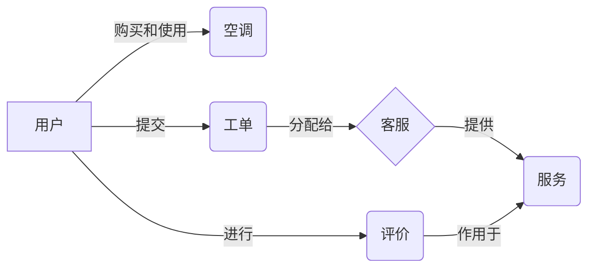

# 空调售后服务系统详细设计与具体代码实现

作者：禅与计算机程序设计艺术

## 1. 背景介绍

随着人们生活水平的提高,空调已成为家庭必备电器之一。然而,空调的普及也带来了售后服务的巨大需求。传统的人工客服模式已无法满足日益增长的售后服务需求,因此开发一套高效、智能的空调售后服务系统势在必行。

本文将详细阐述空调售后服务系统的设计思路和具体实现过程,重点介绍系统架构、核心算法、数据库设计以及关键代码实现。通过本文,读者可以全面了解空调售后服务系统的技术细节,为类似系统的开发提供参考。

### 1.1 空调售后服务的痛点

- 人工客服效率低下,无法24小时响应用户需求
- 售后服务流程复杂,用户体验差
- 售后数据分散,难以进行统计分析
- 缺乏智能化手段,无法实现个性化服务

### 1.2 智能售后服务系统的优势  

- 7x24小时不间断服务,大幅提升响应速度
- 简化售后流程,优化用户体验
- 数据集中管理,方便进行大数据分析
- 引入人工智能技术,实现个性化智能服务

## 2. 核心概念与关系

在空调售后服务系统中,涉及到以下几个核心概念:

- 用户:购买并使用空调产品的客户
- 空调:售后服务的目标产品
- 工单:用户提交的售后服务请求
- 客服:处理工单的人员或AI
- 服务:针对工单采取的处理措施
- 评价:用户对售后服务的满意度评分

这些概念之间的关系如下图所示:



用户购买并使用空调,当出现问题时提交工单。工单会分配给客服进行处理,客服提供相应的服务。用户会对服务进行评价,评价结果又会反馈给客服,形成服务改进的闭环。

## 3. 核心算法原理与步骤

### 3.1 工单智能分类算法

工单分类是售后服务系统的一项核心功能,其目的是根据工单的问题描述,自动将工单分配到对应的问题类别,从而交给相应的客服人员处理。工单分类可以采用机器学习中的文本分类算法来实现。

#### 3.1.1 算法选择

文本分类的常用算法包括:

- 朴素贝叶斯(Naive Bayes)
- 支持向量机(SVM) 
- 逻辑回归(Logistic Regression)
- 深度学习(如CNN、RNN等)

考虑到工单语料的特点以及分类的实时性需求,我们选择朴素贝叶斯算法进行工单分类。朴素贝叶斯具有速度快、实现简单的优点,非常适合文本分类任务。

#### 3.1.2 算法原理

朴素贝叶斯基于贝叶斯定理和特征独立性假设,其基本思想是:对于给定的工单,利用先验概率和条件概率计算其属于各个类别的后验概率,将其分类到后验概率最大的类别中。

设工单 $d$ 的特征向量为 $\vec{x} = (x_1,x_2,...,x_n)$,其中 $x_i$ 表示词 $w_i$ 在工单中的出现次数。类别集合为 $C={c_1,c_2,...,c_m}$。根据贝叶斯公式,工单 $d$ 属于类别 $c$ 的后验概率为:

$$P(c|\vec{x}) = \frac{P(c)P(\vec{x}|c)}{P(\vec{x})}$$

其中,$P(c)$ 为类别 $c$ 的先验概率,$P(\vec{x}|c)$ 为 $\vec{x}$ 的条件概率。

根据特征独立性假设,可以将 $P(\vec{x}|c)$ 拆解为各个特征的条件概率之积:

$$P(\vec{x}|c) = \prod_{i=1}^nP(x_i|c)$$

于是,工单分类问题可以表示为:

$$c^* = \arg\max_{c \in C} P(c) \prod_{i=1}^nP(x_i|c)$$

即找出使后验概率最大的类别 $c^*$。

#### 3.1.3 算法步骤

1. 数据准备:收集大量工单数据,并人工标注其所属类别。

2. 文本预处理:对工单文本进行分词、去停用词、词干化等处理,生成词向量。

3. 模型训练:根据朴素贝叶斯公式,利用标注数据训练分类模型,得到 $P(c)$ 和 $P(x_i|c)$。

4. 模型测试:利用留出法或交叉验证等方法,评估模型的分类准确率。

5. 模型应用:对新提交的工单,进行文本预处理后输入模型,得到其所属类别。

### 3.2 客服智能调度算法

客服调度旨在根据工单的紧急程度、客服的空闲情况等因素,合理分配工单给客服人员处理,从而提高响应速度和服务质量。这可以看作是一个任务调度优化问题。

#### 3.2.1 算法选择

任务调度优化是一个NP-hard问题,常用的近似算法包括:

- 先来先服务(FCFS)
- 最短作业优先(SJF)
- 优先级调度(Priority)
- 轮转调度(RR)

考虑到售后服务的实际需求,我们采用优先级调度算法,根据工单的紧急程度和客服的专业度等因素设置优先级,优先处理高优先级工单。

#### 3.2.2 算法原理

设有 $n$ 个待分配的工单和 $m$ 个客服。每个工单 $t_i$ 有两个属性:紧急程度 $u_i$ 和问题类型 $q_i$。每个客服 $s_j$ 有两个属性:当前工单量 $l_j$ 和专业程度向量 $\vec{p_j}$,其中 $p_{jk}$ 表示客服 $s_j$ 对问题类型 $q_k$ 的专业程度。

定义工单 $t_i$ 的优先级 $f_i$ 为:

$$f_i = \alpha u_i + \beta \max_{1 \leq j \leq m} p_{jq_i}$$

其中 $\alpha$ 和 $\beta$ 为权重参数。优先级由工单紧急程度和客服专业度两部分组成。

调度目标是最小化所有工单的加权完成时间:

$$\min \sum_{i=1}^n w_i C_i$$

其中 $w_i$ 为工单 $t_i$ 的权重(可以取 $u_i$), $C_i$ 为其完成时间。

#### 3.2.3 算法步骤

1. 初始化:根据历史数据,初始化客服的专业度向量 $\vec{p_j}$。

2. 优先级计算:对于每个新提交的工单 $t_i$,根据其紧急程度 $u_i$ 和问题类型 $q_i$,计算优先级 $f_i$。

3. 工单排序:根据优先级 $f_i$ 对工单进行降序排序。 

4. 工单分配:按优先级顺序,将每个工单分配给当前工单量最小且专业度最高的客服。

5. 客服更新:更新客服的当前工单量 $l_j$。

6. 重复执行:重复步骤2-5,直到所有工单都得到分配。

7. 模型更新:定期根据新的工单反馈数据,更新客服专业度向量。

## 4. 数学模型与公式详解

本节我们详细讲解空调售后服务系统涉及的几个关键数学模型和公式。

### 4.1 空调故障预测模型

空调故障预测可以帮助售后服务系统提前预警,提高服务效率。我们以制冷量下降故障为例,建立数学模型。

设空调的制冷量为 $Q$,影响制冷量的因素包括:压缩机频率 $f$、冷凝温度 $T_c$、蒸发温度 $T_e$、管路阻力 $R$、外界温度 $T_o$ 等。我们建立如下多元回归模型:

$$Q = \beta_0 + \beta_1 f + \beta_2 T_c + \beta_3 T_e + \beta_4 R + \beta_5 T_o + \varepsilon$$

其中 $\beta_i$ 为回归系数,$\varepsilon$ 为随机误差项。

通过收集大量历史运行数据,利用最小二乘法可以拟合出回归系数。得到模型后,我们可以实时监测空调运行参数,代入模型计算理论制冷量 $\hat{Q}$。当实际制冷量 $Q$ 与理论值 $\hat{Q}$ 差距超过阈值时,就可以判断制冷量下降故障,并提前预警。

### 4.2 客户满意度预测模型

客户满意度是评价售后服务质量的重要指标。我们可以建立逻辑回归模型来预测客户满意度。

设客户满意度 $y$ 为二元变量,其中 $y=1$ 表示满意,$y=0$ 表示不满意。影响客户满意度的因素包括:故障响应时间 $x_1$、故障解决时间 $x_2$、服务态度 $x_3$、维修质量 $x_4$ 等。逻辑回归模型为:

$$\ln \frac{p}{1-p} = \beta_0 + \beta_1 x_1 + \beta_2 x_2 + \beta_3 x_3 + \beta_4 x_4$$

其中 $p$ 为客户满意的概率,即 $P(y=1)$。通过极大似然估计可以拟合出回归系数 $\beta_i$。

得到模型后,对于新的售后服务,可以收集相关数据输入模型,得到客户满意的预测概率 $\hat{p}$。当 $\hat{p}$ 较低时,说明客户不满意的风险较高,系统可以预警相关人员采取措施,提升服务质量。

## 5. 项目实践:代码实现

下面我们给出空调售后服务系统的部分关键代码实现。

### 5.1 工单智能分类

```python
import jieba
from sklearn.naive_bayes import MultinomialNB
from sklearn.feature_extraction.text import TfidfVectorizer

# 数据准备
train_data = [
    ('空调不制冷','制冷故障'),
    ('空调有噪音','噪音故障'),
    ('遥控器失灵','控制故障'),
    ...
]
train_x, train_y = zip(*train_data)

# 文本预处理
def preprocess(text):
    words = jieba.lcut(text)
    return ' '.join(words)

train_x = [preprocess(x) for x in train_x]

# 特征工程  
vectorizer = TfidfVectorizer()
train_x = vectorizer.fit_transform(train_x)

# 模型训练
model = MultinomialNB()
model.fit(train_x, train_y)

# 模型预测
def predict(query):
    query = preprocess(query)
    query = vectorizer.transform([query])
    result = model.predict(query)[0]
    return result

# 测试
query = '空调出风口有异味'
print(predict(query)) # 输出: 异味故障
```

### 5.2 客服智能调度

```python
import numpy as np

# 初始化
n = 10  # 工单数
m = 5   # 客服数
urgency = np.random.randint(1, 10, n)  # 紧急程度
question_type = np.random.randint(0, 5, n)  # 问题类型
service_load = np.zeros(m)  # 客服工单量
service_prof = np.random.rand(m, 5)  # 客服专业度

alpha = 0.6
beta = 0.4

# 优先级计算
def calc_priority(urgency, question_type, service_prof):
    prof_score = service_prof[:, question_type].max()
    priority = alpha * urgency + beta * prof_score
    return priority

# 工单分配 
def allocate_ticket(ticket_id):
    priority = calc_priority(urgency[ticket_id], question_type[ticket_id], service_prof)
    service_id = np.argmin(service_load + 1e-6 