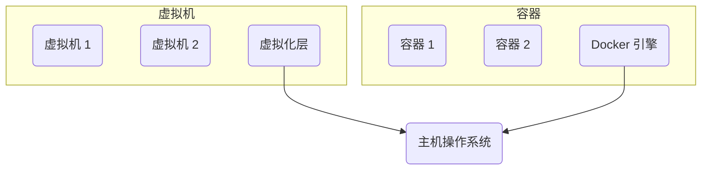
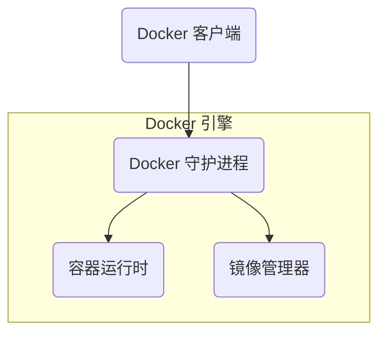
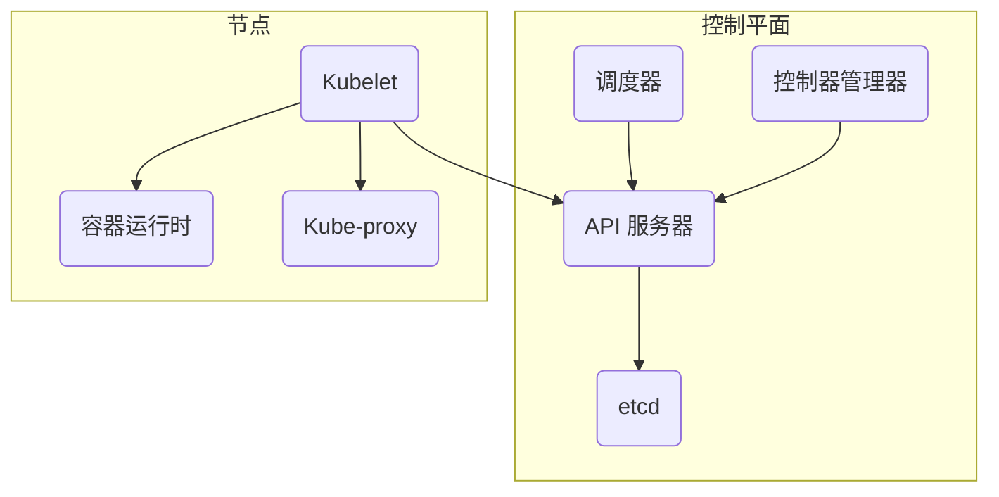
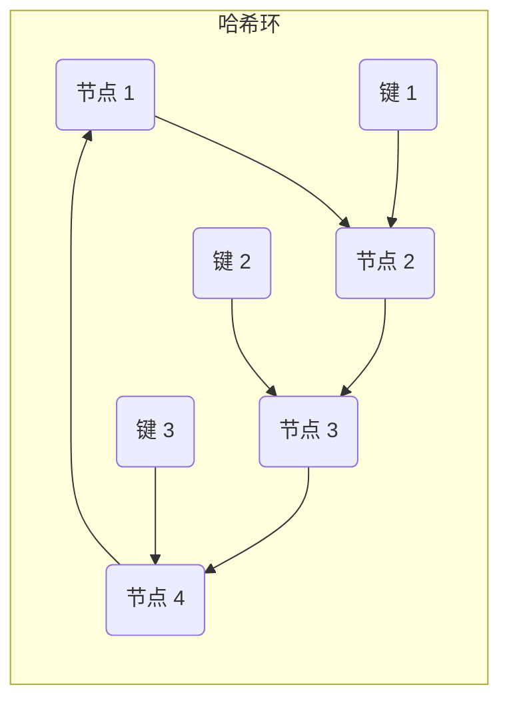

# *系统部署：容器化与云平台*

## 1. 背景介绍

### 1.1 系统部署的挑战

在当今快节奏的软件开发环境中,系统的部署和管理变得越来越复杂。传统的部署方式面临着诸多挑战:

- **环境差异**: 开发、测试和生产环境之间存在差异,导致应用程序在不同环境下表现不一致。
- **依赖地狱**: 应用程序通常依赖于许多第三方库和组件,管理这些依赖关系是一项艰巨的任务。
- **可伸缩性**: 随着用户数量和流量的增长,手动扩展系统变得困难和昂贵。
- **资源利用率低**: 物理服务器通常被低效利用,导致资源浪费。

### 1.2 容器化和云平台的兴起

为了解决这些挑战,容器化和云平台应运而生。容器化技术(如Docker)允许将应用程序及其依赖项打包到一个可移植的容器中,确保了应用程序在任何环境下的一致运行。云平台(如Kubernetes)则提供了自动化部署、扩展和管理容器化应用程序的能力。

## 2. 核心概念与联系

### 2.1 容器 (Container)

容器是一种轻量级、可移植的虚拟化技术,可以将应用程序及其依赖项打包到一个独立的、可移植的单元中。与传统的虚拟机相比,容器更加轻量级,因为它们共享主机操作系统的内核,而不是每个容器都运行完整的操作系统。

#### 2.1.1 容器与虚拟机的区别



虚拟机在硬件层上运行完整的操作系统,因此占用更多资源。而容器直接运行在主机操作系统之上,共享内核,因此更加轻量级和高效。

### 2.2 Docker

Docker是最流行的容器化平台,它提供了一种简单的方式来创建、部署和运行容器化应用程序。Docker使用客户端-服务器架构,其中Docker引擎(服务器)构建、运行和分发容器,而Docker客户端与Docker引擎进行交互。

#### 2.2.1 Docker架构



Docker客户端与Docker守护进程进行通信,发送构建、运行和停止容器的命令。Docker守护进程管理容器的生命周期,并与容器运行时和镜像管理器进行交互。

### 2.3 Kubernetes

Kubernetes是一个开源的容器编排平台,用于自动部署、扩展和管理容器化应用程序。它提供了一种声明式的方式来描述应用程序的期望状态,并自动维护该状态。

#### 2.3.1 Kubernetes 架构



Kubernetes由控制平面和工作节点组成。控制平面管理集群的状态,包括API服务器、调度器、控制器管理器和etcd。工作节点运行容器化的应用程序,由Kubelet、容器运行时和Kube-proxy组成。

## 3. 核心算法原理具体操作步骤

### 3.1 Docker 工作流程

#### 3.1.1 镜像构建

Docker使用Dockerfile来定义镜像的构建过程。Dockerfile包含一系列指令,描述了如何构建镜像。

1. 编写Dockerfile
2. 使用`docker build`命令构建镜像

```dockerfile
# Dockerfile
FROM ubuntu:18.04
RUN apt-get update && apt-get install -y nginx
COPY index.html /var/www/html/
EXPOSE 80
CMD ["nginx", "-g", "daemon off;"]
```

```bash
docker build -t my-nginx .
```

#### 3.1.2 容器运行

使用`docker run`命令从镜像创建并运行容器。

```bash
docker run -d --name my-web -p 8080:80 my-nginx
```

- `-d` 在后台运行容器
- `--name` 为容器指定名称
- `-p` 将主机端口映射到容器端口

#### 3.1.3 容器管理

Docker提供了多种命令来管理容器的生命周期。

- `docker ps` 列出正在运行的容器
- `docker stop` 停止容器
- `docker rm` 删除容器
- `docker logs` 查看容器日志
- `docker exec` 在运行中的容器中执行命令

### 3.2 Kubernetes 工作流程

#### 3.2.1 部署应用程序

Kubernetes使用声明式API来描述应用程序的期望状态。您可以使用YAML或JSON文件定义Kubernetes资源,如Pod、Deployment、Service等。

```yaml
# nginx-deployment.yaml
apiVersion: apps/v1
kind: Deployment
metadata:
  name: nginx-deployment
spec:
  replicas: 3
  selector:
    matchLabels:
      app: nginx
  template:
    metadata:
      labels:
        app: nginx
    spec:
      containers:
      - name: nginx
        image: nginx:latest
        ports:
        - containerPort: 80
```

使用`kubectl apply`命令应用资源定义。

```bash
kubectl apply -f nginx-deployment.yaml
```

#### 3.2.2 服务发现和负载均衡

Kubernetes使用Service资源提供服务发现和负载均衡功能。Service将一组Pod公开为网络服务,并通过选择器标签将流量路由到相应的Pod。

```yaml
# nginx-service.yaml
apiVersion: v1
kind: Service
metadata:
  name: nginx-service
spec:
  selector:
    app: nginx
  ports:
  - port: 80
    targetPort: 80
```

使用`kubectl apply`命令应用Service定义。

```bash
kubectl apply -f nginx-service.yaml
```

#### 3.2.3 扩展和自动修复

Kubernetes通过Deployment资源实现应用程序的扩展和自动修复。您可以通过更改Deployment的`replicas`字段来手动扩展或缩减应用程序。Kubernetes还会自动监控Pod的健康状况,并在Pod失败时重新启动新的Pod。

```bash
# 扩展到 5 个副本
kubectl scale deployment nginx-deployment --replicas=5
```

#### 3.2.4 滚动更新

Kubernetes支持滚动更新,允许您无中断地更新正在运行的应用程序。通过编辑Deployment的`image`字段,您可以触发滚动更新。Kubernetes将逐步终止旧的Pod,并创建新的Pod,确保应用程序在更新过程中保持可用。

```bash
# 更新镜像版本
kubectl set image deployment/nginx-deployment nginx=nginx:1.19
```

## 4. 数学模型和公式详细讲解举例说明

在容器化和云平台的背景下,有一些重要的数学模型和公式需要了解。

### 4.1 资源分配和调度

Kubernetes使用各种算法来调度Pod到适当的节点上。其中一个重要的算法是**bin packing**问题,它旨在将项目打包到尽可能少的bin中,以最大化资源利用率。

给定一组项目$\{p_1, p_2, \ldots, p_n\}$,每个项目$p_i$具有大小$s_i$,以及一组bin$\{b_1, b_2, \ldots, b_m\}$,每个bin$b_j$具有容量$c_j$。bin packing问题旨在找到一种方式将所有项目打包到尽可能少的bin中,同时满足每个bin的容量约束。

这可以表示为以下整数线性规划问题:

$$
\begin{align*}
\text{minimize} &\quad \sum_{j=1}^m y_j \\
\text{subject to} &\quad \sum_{j=1}^m x_{ij} = 1 &&\text{for } i = 1, \ldots, n \\
&\quad \sum_{i=1}^n s_i x_{ij} \leq c_j y_j &&\text{for } j = 1, \ldots, m \\
&\quad x_{ij} \in \{0, 1\} &&\text{for } i = 1, \ldots, n, j = 1, \ldots, m \\
&\quad y_j \in \{0, 1\} &&\text{for } j = 1, \ldots, m
\end{align*}
$$

其中$x_{ij}$是一个二进制变量,表示项目$p_i$是否被打包到bin$b_j$中,$y_j$是一个二进制变量,表示bin$b_j$是否被使用。

Kubernetes使用各种启发式算法来近似求解bin packing问题,如最先适配(First Fit)、最佳适配(Best Fit)等。

### 4.2 负载均衡

在Kubernetes中,Service资源通过选择器标签将流量路由到相应的Pod。为了实现负载均衡,Kubernetes使用一种叫做**consistent hashing**的技术。

consistent hashing是一种分布式哈希表技术,它提供了一种高效且可靠的方式将键映射到节点。它的主要思想是将键和节点都映射到同一个哈希环上,并根据它们在环上的位置将键分配给最近的节点。

给定一个哈希函数$h$,它将键映射到$[0, 2^{32})$的范围内。我们将这个范围视为一个环,并将节点均匀地分布在环上。当需要查找一个键$k$的节点时,我们计算$h(k)$,并在环上顺时针查找第一个大于或等于$h(k)$的节点。



在上图中,键$k_1$被映射到节点2,键$k_2$被映射到节点3,键$k_3$被映射到节点4。

consistent hashing具有以下优点:

- **负载均衡**: 键被均匀地分布在节点上,实现了负载均衡。
- **增量重新哈希**: 当节点加入或离开时,只有环上相邻的键需要被重新映射,其他键的映射保持不变。
- **容错性**: 当一个节点失效时,它的键可以被顺时针分配给下一个节点,从而实现故障转移。

Kubernetes利用consistent hashing实现了高效且可靠的负载均衡。

## 4. 项目实践:代码实例和详细解释说明

在本节中,我们将通过一个示例项目来演示如何使用Docker和Kubernetes部署一个简单的Web应用程序。

### 4.1 Docker示例

我们将构建一个基于Node.js的简单Web应用程序,并使用Docker将其容器化。

#### 4.1.1 应用程序代码

```javascript
// app.js
const express = require('express');
const app = express();
const port = 3000;

app.get('/', (req, res) => {
  res.send('Hello World!');
});

app.listen(port, () => {
  console.log(`Example app listening at http://localhost:${port}`);
});
```

#### 4.1.2 Dockerfile

```dockerfile
# Dockerfile
FROM node:14

# 创建应用程序目录
WORKDIR /usr/src/app

# 安装应用程序依赖
COPY package*.json ./
RUN npm install

# 复制应用程序代码
COPY . .

# 暴露端口并启动应用程序
EXPOSE 3000
CMD [ "node", "app.js" ]
```

#### 4.1.3 构建和运行容器

```bash
# 构建镜像
docker build -t my-app .

# 运行容器
docker run -d --name my-app-container -p 3000:3000 my-app
```

现在,您可以通过访问`http://localhost:3000`来查看运行中的应用程序。

### 4.2 Kubernetes示例

接下来,我们将使用Kubernetes部署和