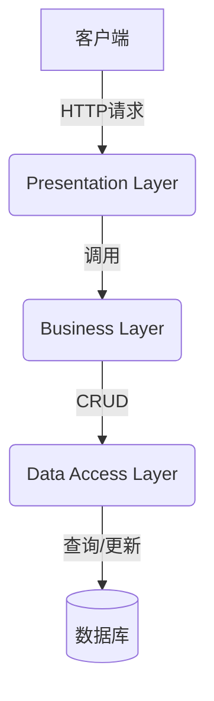

# 网上售房管理系统设计与实现

## 1.背景介绍

### 1.1 房地产行业的发展与挑战

房地产行业是一个巨大且不断增长的市场。随着城市化进程的加快和人们生活水平的提高,对于住房的需求也在不断增加。然而,传统的房地产交易模式存在着诸多痛点,例如信息不对称、流程繁琐、中介费用高昂等问题。因此,开发一个高效、便捷的网上售房管理系统,不仅可以优化交易流程,还能为买卖双方提供更加透明和公平的交易环境。

### 1.2 网上售房管理系统的重要性

网上售房管理系统的出现,为房地产行业带来了全新的交易模式。通过互联网技术,买家和卖家可以直接进行线上交易,无需中介环节,从而降低了交易成本。同时,系统还提供了房源信息查询、在线看房、电子签约等一站式服务,极大提高了交易效率。此外,系统还能够对交易数据进行分析,为决策者提供有价值的见解。

## 2.核心概念与联系

### 2.1 系统架构

网上售房管理系统通常采用 B/S (Browser/Server) 架构,即浏览器/服务器架构。在这种架构中,客户端只需要一个浏览器,就可以访问部署在服务器上的应用程序。系统的核心部分包括:

- **前端**:基于 HTML、CSS 和 JavaScript 开发的用户界面,提供友好的交互体验。
- **后端**:使用 Java、Python、Node.js 等编程语言开发的服务器端应用程序,负责处理业务逻辑和数据存储。
- **数据库**:存储房源信息、用户信息、交易记录等数据,通常使用关系型数据库(如 MySQL)或非关系型数据库(如 MongoDB)。

### 2.2 系统功能模块

一个完整的网上售房管理系统通常包括以下几个核心模块:

- **房源管理模块**:用于发布、编辑和管理房源信息,包括房屋详细信息、图片、视频等。
- **用户管理模块**:处理用户注册、登录、个人信息管理等功能。
- **交易管理模块**:支持在线预约看房、电子签约、支付等交易流程。
- **数据分析模块**:对交易数据进行统计和分析,生成可视化报表。
- **系统管理模块**:用于管理员对系统参数、权限等进行配置和维护。

### 2.3 关键技术

网上售房管理系统涉及到多种技术,包括但不限于:

- **Web 开发技术**:HTML、CSS、JavaScript、React、Vue、Angular 等前端框架,以及 Java、Python、Node.js 等后端语言和框架。
- **数据库技术**:关系型数据库(如 MySQL)和非关系型数据库(如 MongoDB)的使用和优化。
- **安全技术**:用户认证、数据加密、防止注入攻击等安全措施。
- **云计算技术**:利用云服务器部署和扩展系统,提高可用性和灵活性。
- **大数据技术**:对海量交易数据进行存储、处理和分析。

## 3.核心算法原理具体操作步骤

### 3.1 房源信息匹配算法

为了帮助用户快速找到符合需求的房源,系统需要实现高效的房源信息匹配算法。常见的做法是基于用户的搜索条件(如地理位置、房型、价格范围等)对房源信息进行过滤和排序。

一种常见的匹配算法流程如下:

1. **数据预处理**:对房源信息进行标准化处理,例如地址转换为经纬度坐标,价格转换为数值等。
2. **构建索引**:基于关键字段(如地理位置、房型等)建立倒排索引,加速搜索过程。
3. **布尔匹配**:根据用户输入的条件,使用布尔运算(与、或、非等)对索引进行过滤,得到初步匹配结果。
4. **相似度计算**:对于无法完全匹配的条件(如价格范围),计算相似度分数,作为排序的依据。
5. **综合排序**:根据匹配度和其他排序策略(如默认排序、个性化推荐等),对结果进行综合排序。

此外,还可以引入机器学习技术,基于历史数据训练模型,对用户偏好进行建模,提高个性化推荐的准确性。

### 3.2 交易安全算法

为了保证交易的安全性,系统需要采取多种加密和认证措施,防止数据泄露和篡改。常见的做法包括:

1. **用户身份认证**:使用密码哈希、双因素认证等技术,确保用户身份的合法性。
2. **数据加密传输**:在客户端和服务器之间使用 HTTPS 协议,对数据进行加密传输。
3. **数字签名**:在电子合同等关键文件上使用数字签名技术,防止篡改。
4. **支付安全**:与第三方支付平台对接,使用安全的支付流程和加密方式处理交易。
5. **数据备份**:定期对系统数据进行备份,防止数据丢失。

此外,还需要制定完善的安全策略和应急预案,及时修复系统漏洞,提高系统的整体安全性。

## 4.数学模型和公式详细讲解举例说明

### 4.1 房源相似度计算

在房源信息匹配算法中,需要计算用户搜索条件与房源信息之间的相似度,作为排序的依据。一种常见的做法是使用**余弦相似度**公式:

$$
\text{sim}(q, d) = \frac{\vec{q} \cdot \vec{d}}{|\vec{q}||\vec{d}|} = \frac{\sum\limits_{i=1}^{n}{q_i d_i}}{\sqrt{\sum\limits_{i=1}^{n}{q_i^2}}\sqrt{\sum\limits_{i=1}^{n}{d_i^2}}}
$$

其中:

- $q$ 表示用户查询向量,包含地理位置、房型、价格范围等条件
- $d$ 表示房源信息向量,包含相应的特征值
- $n$ 为向量维度,即特征数量
- $q_i$ 和 $d_i$ 分别表示查询向量和房源向量在第 $i$ 个维度上的值

对于数值型特征(如价格),可以直接使用实际值;对于类别型特征(如地理位置、房型),可以使用一热编码(One-Hot Encoding)的方式转换为向量。

计算出查询向量和房源向量的余弦相似度后,可以将相似度作为排序的重要依据,将最相关的房源信息排在前面。

### 4.2 个性化推荐模型

为了提高推荐的准确性,系统可以基于协同过滤算法,构建个性化推荐模型。一种常见的协同过滤算法是**基于用户的协同过滤**,其核心思想是:对于目标用户,找到与其有相似兴趣的其他用户,并基于这些相似用户的喜好,为目标用户生成推荐列表。

具体步骤如下:

1. **构建用户兴趣向量**:基于用户的浏览记录、收藏记录等,构建用户的兴趣向量。
2. **计算用户相似度**:使用余弦相似度或其他相似度度量,计算任意两个用户之间的相似度。
3. **找到最相似用户**:对于目标用户,找到与其最相似的 $k$ 个用户,作为最近邻用户集合。
4. **生成推荐列表**:基于最近邻用户集合的兴趣,为目标用户生成个性化的推荐列表。

此外,还可以引入基于模型的协同过滤算法,如矩阵分解、深度学习等,进一步提高推荐的准确性。

## 4.项目实践:代码实例和详细解释说明

为了更好地理解网上售房管理系统的实现,我们将通过一个简单的 Java Web 项目示例来演示核心功能。

### 4.1 系统架构

我们将采用经典的三层架构(Presentation Layer、Business Layer、Data Access Layer)进行系统设计,具体如下:



- **Presentation Layer**:基于 Servlet 和 JSP 技术,负责接收客户端请求,展示数据并与用户交互。
- **Business Layer**:包含系统的业务逻辑,如房源管理、用户管理、交易管理等。
- **Data Access Layer**:使用 JDBC 技术,负责与数据库进行交互,执行增删改查操作。

### 4.2 核心代码示例

#### 4.2.1 房源管理模块

**HouseDao.java**

```java
// 插入新房源
public void insertHouse(House house) {
    String sql = "INSERT INTO houses (title, description, price, area, rooms, images) VALUES (?, ?, ?, ?, ?, ?)";
    try (Connection conn = getConnection(); PreparedStatement stmt = conn.prepareStatement(sql)) {
        stmt.setString(1, house.getTitle());
        stmt.setString(2, house.getDescription());
        stmt.setDouble(3, house.getPrice());
        stmt.setDouble(4, house.getArea());
        stmt.setInt(5, house.getRooms());
        stmt.setString(6, String.join(",", house.getImages()));
        stmt.executeUpdate();
    } catch (SQLException e) {
        e.printStackTrace();
    }
}

// 查询房源列表
public List<House> searchHouses(SearchCriteria criteria) {
    List<House> houses = new ArrayList<>();
    String sql = "SELECT * FROM houses WHERE 1=1";
    // 根据搜索条件构建 SQL 语句
    if (criteria.getLocation() != null) {
        sql += " AND location LIKE ?";
    }
    if (criteria.getPriceRange() != null) {
        sql += " AND price BETWEEN ? AND ?";
    }
    // ... 其他条件
    sql += " ORDER BY price";

    try (Connection conn = getConnection(); PreparedStatement stmt = conn.prepareStatement(sql)) {
        int paramIndex = 1;
        if (criteria.getLocation() != null) {
            stmt.setString(paramIndex++, "%" + criteria.getLocation() + "%");
        }
        if (criteria.getPriceRange() != null) {
            stmt.setDouble(paramIndex++, criteria.getPriceRange().getMin());
            stmt.setDouble(paramIndex++, criteria.getPriceRange().getMax());
        }
        // ... 设置其他参数
        ResultSet rs = stmt.executeQuery();
        while (rs.next()) {
            House house = new House();
            house.setId(rs.getInt("id"));
            house.setTitle(rs.getString("title"));
            // ... 设置其他属性
            houses.add(house);
        }
    } catch (SQLException e) {
        e.printStackTrace();
    }
    return houses;
}
```

**HouseServlet.java**

```java
@WebServlet("/houses")
public class HouseServlet extends HttpServlet {

    private HouseService houseService = new HouseService();

    @Override
    protected void doGet(HttpServletRequest req, HttpServletResponse resp) throws ServletException, IOException {
        String action = req.getParameter("action");
        if (action == null) {
            listHouses(req, resp);
        } else if (action.equals("search")) {
            searchHouses(req, resp);
        }
        // ... 其他操作
    }

    private void listHouses(HttpServletRequest req, HttpServletResponse resp) throws ServletException, IOException {
        List<House> houses = houseService.listHouses();
        req.setAttribute("houses", houses);
        req.getRequestDispatcher("/WEB-INF/views/house-list.jsp").forward(req, resp);
    }

    private void searchHouses(HttpServletRequest req, HttpServletResponse resp) throws ServletException, IOException {
        SearchCriteria criteria = new SearchCriteria();
        criteria.setLocation(req.getParameter("location"));
        // ... 设置其他搜索条件
        List<House> houses = houseService.searchHouses(criteria);
        req.setAttribute("houses", houses);
        req.getRequestDispatcher("/WEB-INF/views/house-list.jsp").forward(req, resp);
    }
}
```

**house-list.jsp**

```jsp
<%@ taglib prefix="c" uri="http://java.sun.com/jsp/jstl/core" %>
<html>
<head>
    <title>房源列表</title>
</head>
<body>
    <h1>房源列表</h1>
    <table>
        <tr>
            <th>标题</th>
            <th>描述</th>
            <th>价格</th>
            <th>面积</th>
            <th>房间数</th>
            <th>图片</th>
        </tr>
        <c:forEach items="${houses}" var="house">
            <tr>
                <td>${house.title}</td>
                <td>${house.description}</td