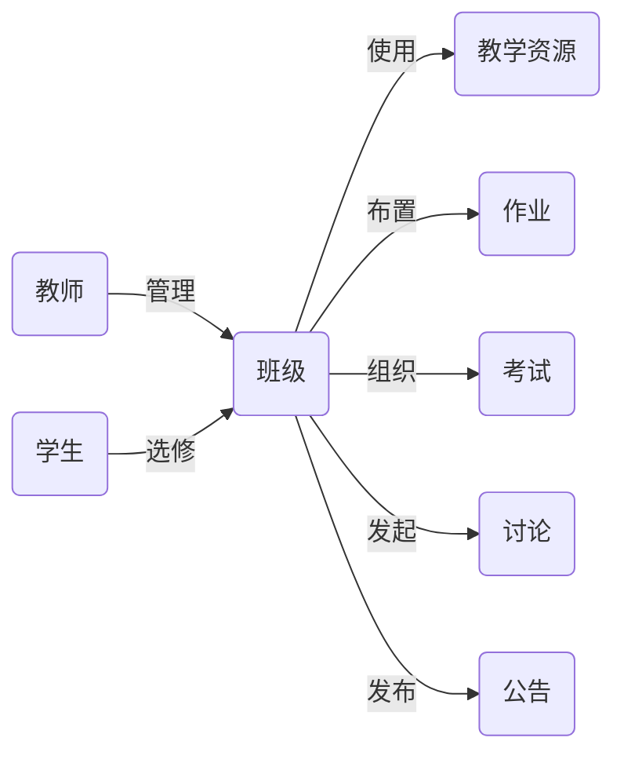

# 网络教学平台-教师子系统详细设计与具体代码实现

作者：禅与计算机程序设计艺术

## 1.背景介绍

### 1.1 网络教学平台的发展现状
近年来,随着互联网技术的快速发展,网络教学平台已经成为教育领域的重要工具。越来越多的学校和教育机构开始使用网络教学平台来辅助传统的课堂教学,提高教学质量和效率。网络教学平台不仅可以为学生提供丰富的学习资源,还可以实现师生之间的实时互动和交流,极大地拓展了教学的时间和空间。

### 1.2 教师子系统在网络教学平台中的重要性
在网络教学平台中,教师子系统是一个非常重要的组成部分。它为教师提供了一系列强大的功能,帮助教师更好地管理和组织教学活动。通过教师子系统,教师可以上传和管理教学资源、布置和批改作业、组织在线测试、与学生进行互动交流等。一个设计良好、功能完善的教师子系统可以大大提高教师的工作效率,减轻教师的工作负担,从而让教师有更多的时间和精力投入到教学和研究中去。

### 1.3 本文的主要内容和目的
本文将详细介绍网络教学平台中教师子系统的设计与实现。我们将从需求分析入手,明确教师子系统需要具备哪些功能;然后进行系统架构设计,确定系统的整体架构和各个模块之间的关系;接着进行数据库设计,设计系统所需的数据表和字段;最后进行详细设计和编码实现,给出关键功能的算法原理、数学模型、流程图和代码实现。通过本文的介绍,读者可以全面了解教师子系统的设计和实现过程,学习到软件开发的一般方法和技巧,并可以将这些知识应用到实际的项目开发中去。

## 2.核心概念与关系

### 2.1 教师 Teacher
教师是网络教学平台的主要用户之一。教师通过教师子系统登录平台,管理教学班级、发布教学资源、布置和批改作业、组织在线测试、与学生互动交流等。每个教师都有一个唯一的ID号,以及姓名、所属院系、联系方式等基本信息。

### 2.2 班级 Class
班级是教师教学的基本单位。每个教师可以创建多个教学班级,比如"计算机网络原理-1班"、"Java程序设计-2班"等。每个班级也有一个唯一的ID号,以及名称、学年学期、上课时间地点、学分学时等基本信息。班级与教师之间是多对一的关系,即一个教师可以教多个班,但一个班只能由一个教师教授。

### 2.3 学生 Student 
学生是网络教学平台的另一主要用户。学生可以通过学生子系统登录平台,加入教学班级,获取学习资源,完成布置的作业,参加在线测试等。每个学生也有一个唯一的ID号(通常为学号),以及姓名、所在专业、年级等基本信息。学生与班级之间是多对多的关系,即一个学生可以选修多个班级,一个班级也可以有多个学生。

### 2.4 教学资源 Resource
教学资源是教师在教学过程中使用的各种材料,如教学大纲、电子教案、课件、参考书目、习题集等。教师可以通过教师子系统上传各种教学资源,并对其进行管理和维护。每个教学资源也有一个唯一的ID号,以及名称、关键词、资源类型、发布时间等元数据信息。教学资源与班级之间是多对多的关系,即一个班级可以使用多个教学资源,一个教学资源也可以被多个班级共享。

### 2.5 作业 Assignment
作业是教师为了检验学生学习效果、巩固知识点而布置的各种任务,如习题、实验、课程设计、小论文等。教师可以通过教师子系统发布作业,并设定截止时间。每个作业也有一个唯一的ID号,以及名称、描述、总分、提交方式等信息。作业与班级之间是多对一的关系,即一个班级可以布置多个作业,但一个作业只能属于一个班级。

### 2.6 考试 Exam
考试是教师对学生学习效果的一种评价方式。教师可以通过教师子系统组织各种形式的在线考试,如选择题、填空题、问答题、编程题等。每个考试也有一个唯一的ID号,以及名称、描述、总分、考试时间、是否允许多次作答等信息。考试与班级之间也是多对一的关系,即一个班级可以有多场考试,但一个考试只能属于一个班级。

### 2.7 讨论 Discussion
讨论是师生之间、学生之间进行交流互动的一种方式。教师可以通过教师子系统发起各种主题的讨论,如答疑、研讨、辩论等。每个讨论主题也有一个唯一的ID号,以及标题、内容、发起人、发起时间等信息。讨论与班级之间也是多对一的关系,即一个班级可以有多个讨论主题,但一个讨论主题只能属于一个班级。

### 2.8 公告 Announcement 
公告是教师发布的各种通知信息,如教学安排、作业要求、考试通知等。每个公告也有一个唯一的ID号,以及标题、内容、发布人、发布时间等信息。公告与班级之间也是多对一的关系,即一个班级可以发布多个公告,但一个公告只能属于一个班级。

### 2.9 关系图
以下是教师子系统中各个核心概念之间的关系图:

## 3.核心算法原理与具体操作步骤

### 3.1 教师身份认证
教师登录教师子系统时,需要进行身份认证,以确保系统的安全性。常见的身份认证方法有:用户名密码认证、手机短信验证码认证、人脸识别认证等。其中,用户名密码认证是最基本的方法。具体步骤如下:
1. 教师在登录页面输入用户名和密码,提交登录请求;
2. 系统获取教师输入的用户名和密码,与数据库中存储的教师账户信息进行比对;
3. 如果比对成功,则认证通过,系统为该教师建立会话,记录登录状态,然后跳转到教师子系统主页;
4. 如果比对失败,则认证不通过,系统返回错误提示信息,要求教师重新输入用户名和密码。

### 3.2 教学资源管理
教师可以通过教师子系统上传、管理各种教学资源。资源管理的核心是文件上传和存储。具体步骤如下:
1. 教师在资源管理页面选择要上传的文件,点击上传按钮,提交上传请求;
2. 系统接收到上传请求后,首先对上传的文件进行安全检查,如文件类型、大小等,以防止恶意文件上传;
3. 如果检查通过,系统生成一个唯一的文件名,将文件保存到服务器指定目录下,并将文件信息(如文件名、大小、类型、上传时间、上传者等)存入数据库;
4. 如果检查不通过,系统返回错误提示信息,要求教师重新选择文件上传。

教师还可以对已上传的资源进行管理,如修改资源信息、下载资源、删除资源等。这些操作实际上是对数据库中资源信息的增删改查。

### 3.3 作业管理
作业管理是教师子系统的一个重要功能,涉及作业的布置、提交、批改、成绩登记等环节。其中,作业批改是最核心的环节。常见的批改方式有:教师手动批改、自动批改(针对客观题)、学生互评等。以教师手动批改为例,具体步骤如下:
1. 教师在作业管理页面可以看到学生提交的作业列表,点击某个作业,进入批改页面;
2. 批改页面展示该学生的作业内容(如附件、在线编辑的文本等),教师可以在线查看和批注;
3. 教师根据作业质量,给出一个成绩,并填写评语,然后提交批改结果;
4. 系统将教师的批改结果保存到数据库,并将成绩发送给学生。

对于客观题作业,系统还可以自动批改。具体实现是:将学生提交的答案与标准答案进行比对,根据预设的评分规则计算出成绩。

### 3.4 在线测验
在线测验是教师对学生进行考核评价的一种方式。它一般包括出题、组卷、考试、评分等环节。其中,自动组卷和自动评分是两个核心算法。

自动组卷是指系统根据教师设定的考试要求(如题型、难度、分值、数量等),从题库中自动选取一定数量的题目,形成一套试卷。具体实现可以采用一些启发式算法,如遗传算法、模拟退火算法等。这些算法通过优化某个目标函数(如试卷难度与预期难度的差异),在海量题库中搜索最优的题目组合。

自动评分是指系统对学生提交的答案进行自动判分,无需教师手动批改。对于选择题、填空题等客观题,自动评分比较简单,只需将学生答案与标准答案进行字符串匹配即可。对于主观题,自动评分就比较复杂,需要采用自然语言处理技术,如关键词匹配、语义相似度计算等。一种常见的做法是:将学生答案与标准答案或参考答案进行比较,提取关键词,计算相似度,然后根据相似度给出一个分数。

### 3.5 师生互动
师生互动主要是通过讨论区和在线聊天工具实现的。讨论区允许师生就某个话题进行异步讨论,如提问、回答、评论等。在线聊天工具允许师生进行实时交流,如答疑、辅导等。

讨论区的核心是帖子的发布和展示。具体实现是:将帖子内容存储在数据库中,并通过分页查询的方式展示给用户。当用户发布新帖子或回复时,实际上是向数据库插入了一条记录。当用户浏览帖子列表或详情时,实际上是从数据库中查询了相应的记录。

在线聊天工具的核心是消息的实时收发。常见的实现方式有:轮询、长轮询、WebSocket等。轮询是指客户端定时向服务器发送请求,查询是否有新消息;长轮询是指客户端发送一个请求后,如果服务器没有新消息,则保持连接,直到有新消息或超时才返回;WebSocket则是一种全双工通信协议,可以实现客户端和服务器之间的双向实时通信。

## 4.数学模型和公式详细讲解举例说明

### 4.1 作业评分模型
在作业管理中,我们需要根据学生提交的作业质量给出一个合理的分数。一种常见的评分模型是加权求和模型。假设一个作业有n个评分项,每个评分项的满分为$m_i$,教师给每个评分项的得分为$s_i$,每个评分项的权重为$w_i$,则作业总分$S$可以表示为:

$$S=\sum_{i=1}^n w_i \cdot \frac{s_i}{m_i} \cdot 100$$

其中,$\sum_{i=1}^n w_i=1$,即所有评分项的权重之和为1。这个模型可以根据评分项的重要程度给予不同的权重,从而得到一个综合的评分结果。

举例说明:假设一个作业满分100分,共有三个评分项:代码正确性(满分50分,权重50%)、代码规范性(满分20分,权重20%)、文档完整性(满分30分,权重30%)。某个学生的作业得分如下:代码正确性得40分、代码规范性得15分、文档完整性得25