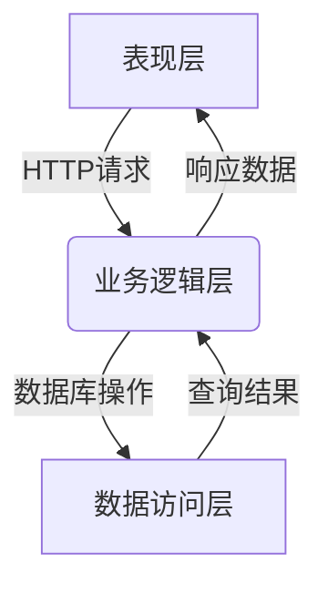
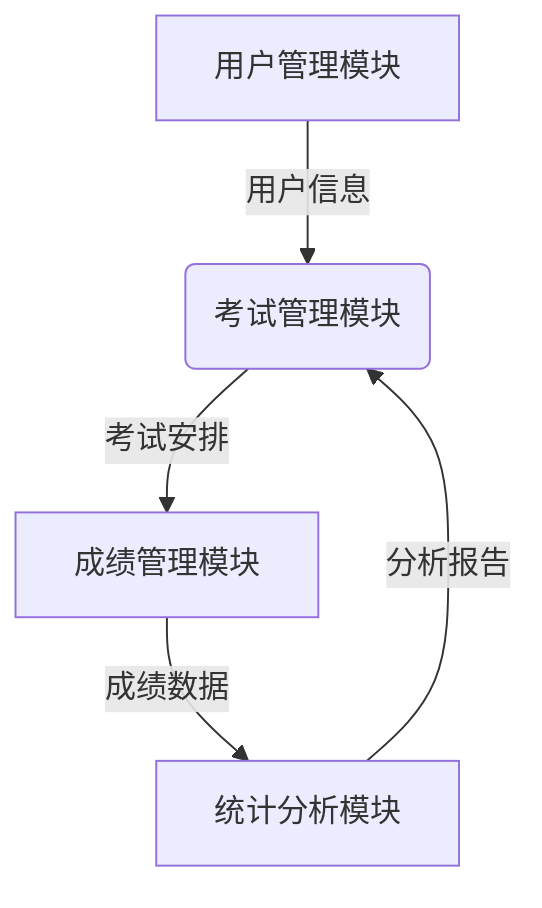

# 计算机等级考试管理系统详细设计与具体代码实现

## 1. 背景介绍

### 1.1 计算机等级考试概述

计算机等级考试是一项全国性的计算机水平考试,旨在评估考生的计算机理论知识和实际操作能力。该考试分为多个级别,包括一级、二级、三级和四级。每个级别都涵盖不同的知识领域和难度,从基础计算机知识到高级编程和数据库管理等。

通过参加计算机等级考试,考生可以获得相应的计算机等级证书,这对于求职、升学和个人发展都有着重要意义。因此,有效管理和组织计算机等级考试对于确保考试的公平性、安全性和效率至关重要。

### 1.2 现有系统存在的问题

传统的计算机等级考试管理系统存在以下几个主要问题:

1. **数据管理混乱**: 考生信息、考试安排、成绩记录等数据通常采用手工方式管理,容易出现错误和数据丢失。
2. **流程效率低下**: 报名、分配考场、阅卷等环节需要大量人工操作,效率低下且容易出错。
3. **安全性不足**: 纸质试卷和成绩单易受损坏或丢失,缺乏有效的防作弊机制。
4. **统计分析能力差**: 难以对历史数据进行深入分析,无法及时发现问题并提出改进措施。

为了解决这些问题,迫切需要一个高效、安全、智能的计算机等级考试管理系统。

## 2. 核心概念与联系

### 2.1 系统架构概览

计算机等级考试管理系统采用了经典的三层架构,包括表现层(Presentation Layer)、业务逻辑层(Business Logic Layer)和数据访问层(Data Access Layer)。这种分层设计有利于提高系统的可维护性、可扩展性和安全性。



### 2.2 核心模块及其关系

系统主要包含以下几个核心模块:

1. **用户管理模块**: 负责管理考生、监考员、阅卷员等不同类型用户的信息和权限。
2. **考试管理模块**: 负责管理考试的组织、安排、试卷生成等工作。
3. **成绩管理模块**: 负责阅卷、统计成绩、发布成绩等工作。
4. **统计分析模块**: 负责对历史数据进行多维度统计分析,为决策提供支持。

这些模块之间存在着紧密的关系和数据交互,如下图所示:



## 3. 核心算法原理具体操作步骤

### 3.1 试卷生成算法

试卷生成算法是考试管理模块的核心部分,它需要根据考试大纲和知识点库自动生成试卷。算法的基本思路如下:

1. 根据考试大纲,确定每个知识点的权重和题量比例。
2. 从知识点库中随机抽取符合比例的题目。
3. 对抽取的题目进行随机排序,生成试卷初稿。
4. 检查试卷初稿是否满足约束条件(如题型分布、难度分布等),不满足则重新抽取。
5. 对最终试卷进行格式化处理,生成PDF文件。

该算法的伪代码如下:

```python
# 输入: 考试大纲outline, 知识点库knowledge_base
# 输出: 试卷PDF文件

# 计算每个知识点的权重和题量比例
weights = calculate_weights(outline)

# 初始化试卷
paper = []

# 遍历每个知识点
for point, weight in weights.items():
    # 从知识点库中抽取题目
    questions = random_sample(knowledge_base[point], weight)
    paper.extend(questions)

# 随机排序试卷
random.shuffle(paper)

# 检查约束条件
while not check_constraints(paper):
    paper = regenerate(paper, weights, knowledge_base)

# 生成PDF文件
generate_pdf(paper, 'exam_paper.pdf')
```

### 3.2 智能阅卷算法

智能阅卷算法是成绩管理模块的核心部分,它需要自动批改试卷并给出客观的分数。算法的基本思路如下:

1. 对扫描的答题卡进行预处理,包括图像增强、分割和识别等步骤。
2. 将识别出的答案与标准答案进行比对,给出初步分数。
3. 对主观题答案使用自然语言处理技术进行语义分析,给出分数。
4. 将客观题和主观题分数进行加权求和,得到最终分数。

该算法的伪代码如下:

```python
# 输入: 扫描答题卡image, 标准答案answer_key
# 输出: 最终分数final_score

# 预处理答题卡
processed_image = preprocess(image)

# 识别客观题答案
obj_answers = recognize(processed_image)

# 比对客观题答案,得到初步分数
obj_score = compare(obj_answers, answer_key['objective'])

# 语义分析主观题答案
subj_answers = extract_text(processed_image)
subj_score = semantic_analysis(subj_answers, answer_key['subjective'])

# 计算最终分数
total_weight = answer_key['objective_weight'] + answer_key['subjective_weight']
final_score = (obj_score * answer_key['objective_weight'] + 
               subj_score * answer_key['subjective_weight']) / total_weight

return final_score
```

## 4. 数学模型和公式详细讲解举例说明

### 4.1 试卷生成模型

试卷生成算法需要根据考试大纲和知识点库生成试卷,这可以用数学模型来描述。假设有 $n$ 个知识点,每个知识点 $i$ 的权重为 $w_i$,题库中该知识点的题目数量为 $q_i$。我们需要从每个知识点中抽取 $k_i$ 道题目,使得:

$$
\sum_{i=1}^n k_i = K
$$

其中 $K$ 是试卷的总题量。同时,我们希望 $k_i$ 与 $w_i$ 和 $q_i$ 成正比,即:

$$
\frac{k_i}{w_i q_i} = C \quad (i=1,2,\cdots,n)
$$

这是一个约束优化问题,可以使用拉格朗日乘数法求解。定义拉格朗日函数:

$$
L(k_1,k_2,\cdots,k_n,\lambda) = \sum_{i=1}^n \frac{k_i}{w_i q_i} - C - \lambda\left(\sum_{i=1}^n k_i - K\right)
$$

对 $k_i$ 和 $\lambda$ 求偏导数并令其等于零,可以得到:

$$
\frac{1}{w_i q_i} - \lambda = 0 \quad (i=1,2,\cdots,n)
$$

$$
\sum_{i=1}^n k_i = K
$$

解这个方程组,就可以得到每个知识点的题量 $k_i$。

### 4.2 智能阅卷模型

智能阅卷算法需要对主观题答案进行语义分析,给出分数。这可以使用自然语言处理技术来实现。

假设有一个主观题答案语料库 $C$,其中每个答案 $c_i$ 都有一个分数 $s_i$。对于一个新的待评分答案 $x$,我们可以计算它与语料库中每个答案的语义相似度 $\text{sim}(x, c_i)$,然后根据相似度和分数的加权求和来估计 $x$ 的分数:

$$
\text{score}(x) = \sum_{i=1}^{|C|} \text{sim}(x, c_i) \cdot s_i
$$

语义相似度可以使用诸如 Word2Vec、BERT 等模型来计算。例如,对于两个句子 $x$ 和 $y$,我们可以先用 BERT 编码它们为向量 $\vec{x}$ 和 $\vec{y}$,然后计算它们的余弦相似度:

$$
\text{sim}(x, y) = \cos(\vec{x}, \vec{y}) = \frac{\vec{x} \cdot \vec{y}}{|\vec{x}| \cdot |\vec{y}|}
$$

通过这种方式,我们可以自动评分主观题答案,提高阅卷效率和公平性。

## 5. 项目实践: 代码实例和详细解释说明

在本节中,我们将提供一些核心模块的代码实例,并对其进行详细解释。

### 5.1 用户管理模块

用户管理模块负责管理系统中不同类型用户的信息和权限。以下是 `User` 和 `Role` 类的实现:

```python
from flask_login import UserMixin
from . import db

class Role(db.Model):
    __tablename__ = 'roles'
    id = db.Column(db.Integer, primary_key=True)
    name = db.Column(db.String(64), unique=True)
    users = db.relationship('User', backref='role', lazy='dynamic')

    def __repr__(self):
        return '<Role %r>' % self.name

class User(UserMixin, db.Model):
    __tablename__ = 'users'
    id = db.Column(db.Integer, primary_key=True)
    email = db.Column(db.String(64), unique=True, index=True)
    username = db.Column(db.String(64), unique=True, index=True)
    password_hash = db.Column(db.String(128))
    role_id = db.Column(db.Integer, db.ForeignKey('roles.id'))

    @property
    def password(self):
        raise AttributeError('password is not a readable attribute')

    @password.setter
    def password(self, password):
        self.password_hash = generate_password_hash(password)

    def verify_password(self, password):
        return check_password_hash(self.password_hash, password)

    def __repr__(self):
        return '<User %r>' % self.username
```

在这个实现中,我们定义了 `Role` 和 `User` 两个模型类。`Role` 类表示用户角色,如管理员、考生、阅卷员等。`User` 类继承自 `UserMixin`,它提供了一些用于认证的方法,如 `is_authenticated`、`is_active` 等。

`User` 类中的 `password` 属性使用 `@property` 装饰器进行保护,防止直接读取密码哈希值。`verify_password` 方法用于验证输入的密码是否正确。

### 5.2 考试管理模块

考试管理模块负责管理考试的组织、安排和试卷生成等工作。以下是 `Exam` 和 `ExamPaper` 类的实现:

```python
from . import db
from datetime import datetime

class Exam(db.Model):
    __tablename__ = 'exams'
    id = db.Column(db.Integer, primary_key=True)
    name = db.Column(db.String(128), unique=True)
    description = db.Column(db.Text)
    start_time = db.Column(db.DateTime)
    end_time = db.Column(db.DateTime)
    duration = db.Column(db.Integer)  # 持续时间(分钟)
    papers = db.relationship('ExamPaper', backref='exam', lazy='dynamic')

    def __repr__(self):
        return '<Exam %r>' % self.name

class ExamPaper(db.Model):
    __tablename__ = 'exam_papers'
    id = db.Column(db.Integer, primary_key=True)
    exam_id = db.Column(db.Integer, db.ForeignKey('exams.id'))
    file = db.Column(db.LargeBinary)  # 试卷PDF文件
    generated_time = db.Column(db.DateTime, default=datetime.utcnow)

    def __repr__(self):
        return '<ExamPaper %r>' % self.id
```

在这个实现中,`Exam` 类表示一次考试,包含了考试名称、描述、开始时间、结束时间和持续时间等属性。`ExamPaper` 类表示一份试卷,它与 `Exam` 是一对多的关系。

`ExamPaper` 类中的 `file` 属性用于存储生成的试卷 PDF 文件。`generated_time` 属性记录了试卷生成的时间戳。

### 5.3 成绩管理模块

成绩管理模块负责阅卷、统计成绩和发布成绩等工作。以下是 `Answer` 和 `Score` 类的实现:

```python
from . import db

class Answer(db.Model):
    __tablename__ = 'answers'
    id = db.Column(db.Integer, primary_key=True)
    exam_paper_i