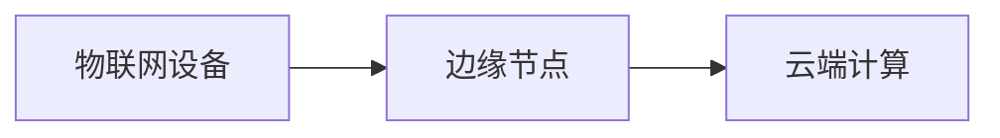
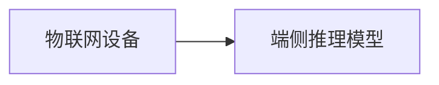

## 1. 背景介绍

随着物联网（IoT）和智能城市的发展，传统的云端计算和数据处理模式越来越不适应。为了满足大规模设备的计算需求，我们需要一种新的计算模式，这就是边缘计算（Edge Computing）。边缘计算将计算和数据处理能力下移到物联网设备和网络节点，从而减少了数据传输距离，降低了网络延迟和带宽需求。

与此同时，端侧推理（Edge Inference）则是一种在物联网设备上执行深度学习模型的技术，它可以将复杂的计算任务下放到设备上，降低了数据传输成本，提高了处理速度。

在本文中，我们将介绍边缘计算与端侧推理的原理、算法和代码实例，并探讨其在实际应用场景中的优势。

## 2. 核心概念与联系

边缘计算是一种分布式计算架构，它将计算和数据处理能力下移到物联网设备和网络节点，从而减少数据传输距离，降低网络延迟和带宽需求。边缘计算可以提高系统的可靠性和实时性，降低运营成本。

端侧推理是一种在物联网设备上执行深度学习模型的技术，它可以将复杂的计算任务下放到设备上，降低数据传输成本，提高处理速度。端侧推理可以在物联网设备上进行实时语义理解、图像识别、音频识别等任务，实现智能化和个性化服务。

边缘计算与端侧推理之间有密切的联系。边缘计算为端侧推理提供了计算资源和环境，端侧推理则为边缘计算提供了高级应用和价值。

## 3. 核心算法原理具体操作步骤

### 3.1 边缘计算原理

边缘计算的核心原理是将计算和数据处理能力下移到物联网设备和网络节点。以下是一个简单的边缘计算架构示意图：



在这个示意图中，物联网设备通过边缘节点与云端计算进行交互。边缘节点负责将设备数据进行预处理和筛选，减少需要传输到云端的数据量，从而降低网络延迟和带宽需求。

### 3.2 端侧推理原理

端侧推理的核心原理是将深度学习模型部署在物联网设备上，并在设备上执行计算。以下是一个简单的端侧推理架构示意图：



在这个示意图中，物联网设备上部署了一个端侧推理模型。该模型可以在设备上进行实时语义理解、图像识别、音频识别等任务，实现智能化和个性化服务。

## 4. 数学模型和公式详细讲解举例说明

在本节中，我们将介绍一个简单的深度学习模型，即卷积神经网络（Convolutional Neural Network, CNN），并解释其数学模型和公式。

### 4.1 卷积神经网络概述

卷积神经网络（CNN）是一种深度学习模型，它通过卷积层、激活函数和全连接层来实现图像识别、语义 segmentation 等任务。CNN 的核心特点是使用局部连接和共享参数，从而减少参数量和计算复杂度。

### 4.2 CNN 的数学模型和公式

CNN 的数学模型可以分为三个部分：卷积层、激活函数和全连接层。

1. 卷积层：卷积层使用一个权重矩阵（核）对输入数据进行卷积操作。卷积操作可以将输入数据中的局部特征抽取出来，形成新的特征图。
2. 激活函数：激活函数用于引入非线性行为，将线性模型变为非线性模型。常用的激活函数有 ReLU（Rectified Linear Unit）、Sigmoid 和 Tanh 等。
3. 全连接层：全连接层将特征图展平后与输出层进行连接。全连接层负责将特征图转换为类别概率分布，从而实现分类任务。

## 4. 项目实践：代码实例和详细解释说明

在本节中，我们将通过一个简单的图像识别项目来演示如何使用 CNN 进行端侧推理。我们将使用 Python 语言和 TensorFlow 库实现这个项目。

### 4.1 数据准备

首先，我们需要准备一个包含图像数据的数据集。以下是一个简单的数据集准备示例：

```python
import tensorflow as tf
from tensorflow.keras.datasets import cifar10

(x_train, y_train), (x_test, y_test) = cifar10.load_data()
x_train, x_test = x_train / 255.0, x_test / 255.0
```

### 4.2 模型构建

接下来，我们需要构建一个 CNN 模型。以下是一个简单的 CNN 模型构建示例：

```python
import tensorflow as tf

model = tf.keras.models.Sequential([
    tf.keras.layers.Conv2D(32, (3, 3), activation='relu', input_shape=(32, 32, 3)),
    tf.keras.layers.MaxPooling2D((2, 2)),
    tf.keras.layers.Conv2D(64, (3, 3), activation='relu'),
    tf.keras.layers.MaxPooling2D((2, 2)),
    tf.keras.layers.Flatten(),
    tf.keras.layers.Dense(64, activation='relu'),
    tf.keras.layers.Dense(10, activation='softmax')
])
```

### 4.3 训练模型

在此，我们将使用训练数据训练 CNN 模型。以下是一个简单的训练模型示例：

```python
model.compile(optimizer='adam', loss='sparse_categorical_crossentropy', metrics=['accuracy'])
model.fit(x_train, y_train, epochs=10)
```

### 4.4 模型评估

最后，我们需要评估模型的性能。以下是一个简单的评估模型示例：

```python
model.evaluate(x_test, y_test)
```

## 5. 实际应用场景

边缘计算与端侧推理在实际应用场景中具有广泛的应用空间，以下是一些典型的应用场景：

1. 智慧城市：通过边缘计算和端侧推理，可以实现智能交通、智能能源管理等任务，提高城市运营效率和环境友好性。
2. 工业自动化：边缘计算和端侧推理可以用于工业设备的故障检测和预测，提高生产效率和降低维护成本。
3. 医疗健康：边缘计算和端侧推理可以用于医疗设备的数据分析，实现远程诊断和个性化医疗服务。
4. 娱乐与教育：边缘计算和端侧推理可以用于游戏、教育等领域，实现个性化推荐和智能化教学。

## 6. 工具和资源推荐

以下是一些可以帮助读者学习边缘计算与端侧推理的工具和资源：

1. TensorFlow：TensorFlow 是一个开源的深度学习框架，可以用于构建和训练 CNN 模型。
2. PyTorch：PyTorch 是另一个开源的深度学习框架，它具有动态计算图和动态定义网络结构的特点，可以用于端侧推理任务。
3. ONNX Runtime：ONNX Runtime 是一个跨平台的深度学习推理引擎，可以用于部署和运行端侧推理模型。
4. Edge AI Platform：Edge AI Platform 是一个用于边缘计算和端侧推理的云端平台，可以帮助开发者部署和管理边缘计算和端侧推理模型。
5. Coursera：Coursera 提供了许多关于深度学习、边缘计算和端侧推理等主题的在线课程，可以帮助读者深入了解这些技术。

## 7. 总结：未来发展趋势与挑战

边缘计算与端侧推理作为未来物联网和智能城市发展的重要技术手段，具有广泛的应用前景。然而，在实现大规模商业化应用的过程中，还面临着一些挑战：

1. 技术难题：边缘计算和端侧推理需要解决数据传输、计算资源分配、安全性和隐私保护等技术难题。
2. 标准与协议：边缘计算和端侧推理领域需要制定统一的标准和协议，以便不同设备和系统之间的互联互通。
3. 人才培养：边缘计算与端侧推理领域需要不断培养和吸引新一代的技术人才。

## 8. 附录：常见问题与解答

在本附录中，我们将回答一些关于边缘计算与端侧推理的常见问题：

1. Q: 边缘计算和端侧推理的区别在哪里？
A: 边缘计算是一种分布式计算架构，将计算和数据处理能力下移到物联网设备和网络节点；端侧推理则是将深度学习模型部署在物联网设备上，并在设备上执行计算。边缘计算为端侧推理提供了计算资源和环境，端侧推理则为边缘计算提供了高级应用和价值。
2. Q: 边缘计算与云计算的区别在哪里？
A: 边缘计算与云计算的主要区别在于计算和数据处理能力的部署位置。边缘计算将计算能力部署在物联网设备和网络节点上，降低了数据传输距离和延迟；云计算则将计算能力部署在远程数据中心，需要通过网络进行数据传输。
3. Q: 端侧推理与服务器端推理的区别在哪里？
A: 端侧推理将深度学习模型部署在物联网设备上，并在设备上执行计算，从而减少数据传输成本和提高处理速度；服务器端推理则将模型部署在远程服务器上，并通过网络将数据和结果进行交互。端侧推理适用于需要低延迟和高性能的场景，而服务器端推理则适用于有足够的网络带宽和计算资源的场景。