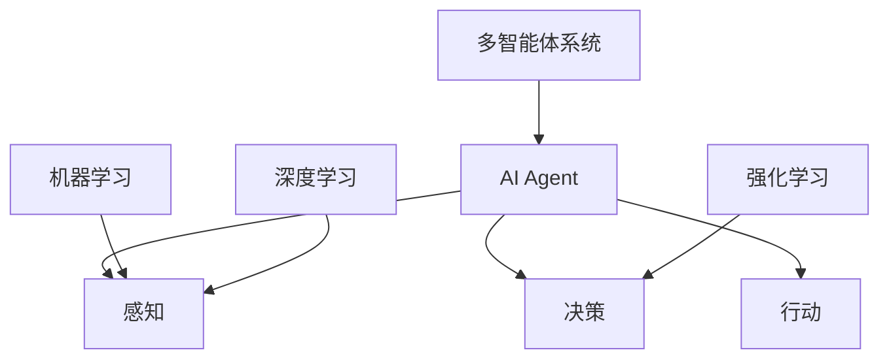

# AI Agent: AI的下一个风口 从早期萌芽到深度学习

## 1.背景介绍

### 1.1 人工智能的兴起

人工智能(Artificial Intelligence, AI)是当代科技领域最热门、最具革命性的技术之一。自20世纪50年代AI概念被正式提出以来,经过数十年的发展,AI已经渗透到我们生活的方方面面,为我们带来了巨大的变革。从语音助手到自动驾驶汽车,从智能推荐系统到医疗诊断,AI无处不在。

### 1.2 AI发展的三次浪潮

AI的发展大致经历了三次浪潮:

- 第一次浪潮(1956-1974年):以符号主义和专家系统为主导,主要关注逻辑推理和知识表示。
- 第二次浪潮(1980-1997年):以知识库和机器学习为核心,尝试从大量数据中发现模式和规律。
- 第三次浪潮(2006年至今):以深度学习为代表,利用海量数据和强大的计算能力,在语音识别、图像识别等领域取得突破性进展。

### 1.3 AI Agent的重要性

在当前的第三次AI浪潮中,AI Agent(智能代理)无疑是最受关注的热点。AI Agent是指能够感知环境,并根据感知做出决策和行动的智能系统。它们可以与人类或其他Agent进行交互,完成特定的任务。AI Agent的概念贯穿了当代AI的方方面面,是AI技术的核心和灵魂。

## 2.核心概念与联系

### 2.1 AI Agent的定义

AI Agent是一种能够感知环境,并根据感知做出决策和行动的智能系统。具体来说,一个AI Agent需要具备以下三个核心能力:

1. **感知(Perception)**:从环境中获取信息,例如视觉、听觉、触觉等感官输入。
2. **决策(Decision Making)**:基于感知到的信息和内部状态,做出合理的决策和计划。
3. **行动(Action)**:根据决策执行相应的行动,以影响环境。

### 2.2 AI Agent与其他AI概念的关系

AI Agent是一个广义的概念,它与当代AI的其他核心概念密切相关:

- **机器学习(Machine Learning)**:AI Agent需要通过机器学习算法从数据中学习知识和模型,以提高感知和决策能力。
- **深度学习(Deep Learning)**:深度学习是机器学习的一个重要分支,尤其在感知任务(如计算机视觉、自然语言处理)中发挥着关键作用。
- **强化学习(Reinforcement Learning)**:强化学习是一种基于奖惩机制,训练AI Agent在特定环境中做出最优决策的方法。
- **多智能体系统(Multi-Agent System)**:多个AI Agent可以组成一个复杂系统,通过协作或竞争来完成任务。



上图展示了AI Agent与其他AI概念之间的关系。AI Agent是一个整体,需要感知、决策和行动三个核心能力;而机器学习、深度学习、强化学习和多智能体系统则分别支撑了AI Agent的不同方面。

## 3.核心算法原理具体操作步骤

AI Agent的核心算法主要包括感知、决策和行动三个部分,下面将分别介绍它们的具体原理和操作步骤。

### 3.1 感知算法

感知算法的主要任务是从环境中获取信息,并将这些信息转化为AI Agent可以理解和处理的表示形式。常见的感知算法包括:

1. **计算机视觉算法**:用于从图像或视频中提取视觉特征,例如目标检测、语义分割等。
2. **自然语言处理算法**:用于从文本中提取语义信息,例如命名实体识别、情感分析等。
3. **语音识别算法**:用于从语音信号中识别出文本内容。

以计算机视觉中的目标检测算法为例,其主要操作步骤如下:

1. **数据预处理**:对输入图像进行标准化、数据增强等预处理操作。
2. **特征提取**:使用卷积神经网络(CNN)从图像中提取视觉特征。
3. **目标检测**:基于提取的特征,使用算法(如Faster R-CNN、YOLO等)预测图像中目标的类别和位置。
4. **后处理**:对检测结果进行非极大值抑制、阈值过滤等后处理,获得最终输出。

### 3.2 决策算法

决策算法的任务是根据感知到的信息和AI Agent的内部状态,做出合理的决策和计划。常见的决策算法包括:

1. **规划算法**:用于生成一系列行动以达成目标,例如A*算法、RRT算法等。
2. **强化学习算法**:通过奖惩机制,训练AI Agent在特定环境中做出最优决策,例如Q-Learning、策略梯度等。
3. **多智能体决策算法**:用于协调多个AI Agent之间的行为,例如博弈论算法、契约网络算法等。

以强化学习中的Q-Learning算法为例,其主要操作步骤如下:

1. **初始化**:初始化Q表(状态-行动值函数)和相关参数。
2. **观察环境**:获取当前环境状态。
3. **选择行动**:根据当前状态和Q表,选择一个行动(exploration或exploitation)。
4. **执行行动**:执行选择的行动,观察环境的反馈(奖惩)和新状态。
5. **更新Q表**:根据观察到的奖惩和新状态,更新Q表中相应的状态-行动值。
6. **重复步骤2-5**:重复上述过程,直到达到终止条件。

### 3.3 行动算法

行动算法的任务是根据决策算法的输出,执行相应的行动以影响环境。常见的行动算法包括:

1. **运动控制算法**:用于控制机器人或无人机等移动平台的运动,例如PID控制、轨迹跟踪等。
2. **机械臂控制算法**:用于控制机械臂的运动,例如逆运动学、运动规划等。
3. **语音合成算法**:用于将文本转化为语音输出。

以机械臂控制中的逆运动学算法为例,其主要操作步骤如下:

1. **获取目标位姿**:确定机械臂末端执行器的期望位置和姿态。
2. **计算关节角度**:使用数学模型(如闭式解析解法或数值迭代法)计算达到目标位姿所需的每个关节角度。
3. **执行运动**:将计算出的关节角度发送给每个电机,驱动机械臂运动到目标位姿。
4. **反馈校正**:根据传感器反馈,对机械臂的实际位姿进行校正。

## 4.数学模型和公式详细讲解举例说明

在AI Agent的各个核心算法中,都涉及了大量的数学模型和公式。下面将对其中一些重要的数学模型进行详细讲解和举例说明。

### 4.1 线性代数

线性代数是AI算法的基础,广泛应用于矩阵运算、向量变换等场景。

#### 4.1.1 矩阵乘法

矩阵乘法是AI算法中最常见的运算之一,例如在神经网络的前向传播和反向传播过程中。

设有两个矩阵$A$和$B$,它们的乘积$C=AB$定义为:

$$
C_{ij} = \sum_{k=1}^{n}A_{ik}B_{kj}
$$

其中,$A$是$m\times n$矩阵,$B$是$n\times p$矩阵,$C$是$m\times p$矩阵。

#### 4.1.2 特征值和特征向量

特征值和特征向量在主成分分析(PCA)、线性判别分析(LDA)等算法中有重要应用。

对于一个$n\times n$矩阵$A$,如果存在一个非零向量$x$和一个标量$\lambda$满足:

$$
Ax = \lambda x
$$

则$\lambda$被称为$A$的一个特征值,对应的$x$被称为$A$的一个特征向量。

### 4.2 概率论与统计

概率论和统计理论是机器学习算法的理论基础,在AI Agent的感知和决策过程中扮演着重要角色。

#### 4.2.1 贝叶斯公式

贝叶斯公式广泛应用于各种机器学习算法中,例如朴素贝叶斯分类器、贝叶斯网络等。

设$A$和$B$是两个事件,则根据贝叶斯公式:

$$
P(A|B) = \frac{P(B|A)P(A)}{P(B)}
$$

其中,$P(A|B)$表示已知$B$发生的条件下$A$发生的条件概率,$P(B|A)$表示已知$A$发生的条件下$B$发生的条件概率,$P(A)$和$P(B)$分别表示$A$和$B$的先验概率。

#### 4.2.2 最大似然估计

最大似然估计是求解概率模型参数的一种常用方法,在各种机器学习算法中都有应用。

设有一个概率模型$P(x|\theta)$,其中$\theta$是需要估计的参数向量,给定观测数据$X=\{x_1,x_2,...,x_n\}$,则最大似然估计的目标是找到一个$\theta$使得观测数据的似然函数$L(\theta|X)$最大化:

$$
\hat{\theta} = \arg\max_{\theta}L(\theta|X) = \arg\max_{\theta}\prod_{i=1}^{n}P(x_i|\theta)
$$

### 4.3 最优化理论

最优化理论为AI算法提供了求解最优解的工具,在训练过程中扮演着关键角色。

#### 4.3.1 梯度下降法

梯度下降法是最常用的一种优化算法,广泛应用于神经网络的训练过程中。

设有一个待优化的目标函数$f(x)$,其中$x$是自变量向量,梯度下降法的迭代公式为:

$$
x^{(t+1)} = x^{(t)} - \eta\nabla f(x^{(t)})
$$

其中,$\eta$是学习率,$\nabla f(x)$表示函数$f(x)$在点$x$处的梯度向量。通过不断迭代,可以使目标函数值不断下降,最终收敛到(局部)最小值点。

#### 4.3.2 拉格朗日乘子法

拉格朗日乘子法是一种常用的约束优化方法,在强化学习等领域有广泛应用。

设有一个目标函数$f(x)$,需要在约束条件$g_i(x)=0(i=1,2,...,m)$和$h_j(x)\leq 0(j=1,2,...,n)$下求解最小值,则可以构造拉格朗日函数:

$$
L(x,\lambda,\mu) = f(x) + \sum_{i=1}^{m}\lambda_ig_i(x) + \sum_{j=1}^{n}\mu_jh_j(x)
$$

其中,$\lambda$和$\mu$是拉格朗日乘子向量。求解$L(x,\lambda,\mu)$的驻点,即可得到原始约束优化问题的解。

## 5.项目实践:代码实例和详细解释说明

为了帮助读者更好地理解AI Agent的原理和实现,下面将提供一个实际项目的代码实例,并对其中的关键部分进行详细解释说明。

### 5.1 项目概述

本项目实现了一个基于强化学习的智能体(Agent),它可以在一个简单的网格世界(GridWorld)环境中学习行走策略,目标是从起点到达终点。

项目使用Python编程语言和PyTorch深度学习框架实现。代码结构如下:

```
gridworld/
├── agent.py       # 定义了强化学习智能体
├── environment.py # 定义了GridWorld环境
├── main.py        # 主程序入口
├── utils.py       # 一些辅助函数
```

### 5.2 环境实现

`environment.py`文件定义了GridWorld环境,它是一个$n\times n$的网格世界,其中包含起点(Start)、终点(Goal)和一些障碍物(Obstacle)。智能体的目标是从起点出