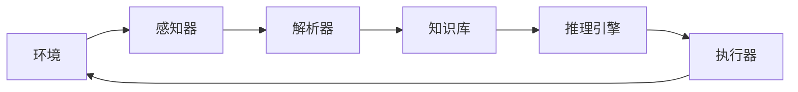

# AI Agent: AI的下一个风口 感知和解析环境与自主决策

## 1. 背景介绍

### 1.1 人工智能的发展历程

人工智能(Artificial Intelligence, AI)是现代科技发展的重要组成部分,其起源可追溯到20世纪50年代。在过去的几十年里,AI经历了几次重大的发展浪潮,例如专家系统、机器学习、深度学习等。每一次浪潮都推动了AI技术的飞速进步,使其在越来越多的领域得到广泛应用。

### 1.2 AI Agent的重要性

在AI的发展历程中,AI Agent(智能体)的概念被提出,并逐渐成为AI研究的核心。AI Agent是指能够感知环境、解析环境、并根据环境做出决策的智能系统。它们可以通过与环境交互来获取信息,并基于这些信息做出合理的行为决策。

AI Agent的重要性在于,它们能够模拟人类的认知过程,并在复杂环境中自主地解决问题。随着AI技术的不断发展,AI Agent的能力也在不断提高,它们正在渗透到越来越多的领域,如机器人、自动驾驶、智能家居等,为人类生活带来了巨大的便利。

### 1.3 感知和解析环境与自主决策的意义

感知和解析环境是AI Agent实现自主决策的基础。AI Agent需要通过传感器获取环境信息,并对这些信息进行处理和解析,从而建立对环境的理解。只有充分理解了环境,AI Agent才能做出合理的决策和行为。

自主决策是AI Agent的核心能力。AI Agent需要根据对环境的理解,自主地选择行为策略,并执行相应的行为。这种自主决策能力使AI Agent能够在动态、复杂的环境中灵活应对,而不需要人工干预。

因此,感知和解析环境与自主决策是AI Agent实现智能行为的关键,也是AI技术发展的重要方向。

## 2. 核心概念与联系

### 2.1 AI Agent的定义

AI Agent是一个感知环境、解析环境并根据环境做出决策的智能系统。它由以下几个核心组件组成:

1. **感知器(Sensors)**: 用于获取环境信息,如视觉、听觉、触觉等传感器。
2. **解析器(Parser)**: 将感知器获取的原始数据转换为有意义的表示形式,以便进一步处理。
3. **知识库(Knowledge Base)**: 存储AI Agent已有的知识和经验。
4. **推理引擎(Inference Engine)**: 根据知识库和环境信息,推理出合理的行为决策。
5. **执行器(Actuators)**: 执行推理引擎做出的行为决策,如机器人的机械臂等。

### 2.2 AI Agent与环境的交互

AI Agent与环境之间存在着动态的交互过程,如下图所示:

1. 环境提供原始信息,被感知器获取。
2. 感知器将获取的原始数据传递给解析器。
3. 解析器将原始数据转换为有意义的表示形式,并与知识库中的知识相结合。
4. 推理引擎根据知识库和解析后的环境信息,推理出合理的行为决策。
5. 执行器执行推理引擎做出的决策,对环境产生影响。
6. 环境发生变化,重新进入下一个循环。

这种交互过程使AI Agent能够持续地感知环境、解析环境并做出决策,从而实现智能行为。

### 2.3 AI Agent的类型

根据AI Agent与环境的交互方式,可以将其分为以下几种类型:

1. **反应型Agent(Reactive Agent)**: 只根据当前的感知信息做出决策,没有内部状态。
2. **有限状态机Agent(Finite State Machine Agent)**: 根据当前的感知信息和内部状态做出决策。
3. **目标驱动Agent(Goal-Based Agent)**: 根据预设目标和当前状态,选择最优行为序列。
4. **效用函数Agent(Utility-Based Agent)**: 根据效用函数(Utility Function)评估每个可能行为的效用值,选择效用值最大的行为。
5. **学习型Agent(Learning Agent)**: 通过与环境交互,不断学习和优化自身的决策策略。

不同类型的AI Agent适用于不同的应用场景,需要根据具体需求进行选择和设计。

## 3. 核心算法原理具体操作步骤

### 3.1 感知和解析环境

感知和解析环境是AI Agent实现自主决策的基础。这个过程包括以下几个关键步骤:

1. **数据采集**: 通过各种传感器(如摄像头、麦克风、雷达等)采集环境数据。
2. **数据预处理**: 对采集到的原始数据进行噪声去除、标准化等预处理,以提高数据质量。
3. **特征提取**: 从预处理后的数据中提取有意义的特征,如图像中的边缘、角点等。
4. **模式识别**: 将提取的特征与已有的模式进行匹配,识别出环境中的物体、事件等。
5. **语义理解**: 根据识别出的物体、事件等,构建对环境的语义级理解。

这些步骤通常需要结合机器学习、计算机视觉、自然语言处理等技术来实现。

### 3.2 自主决策

在感知和解析环境的基础上,AI Agent需要做出合理的行为决策。这个过程包括以下几个关键步骤:

1. **状态表示**: 将环境信息和Agent自身状态转换为内部状态表示。
2. **目标设定**: 根据任务需求,设定Agent需要达成的目标。
3. **策略搜索**: 基于当前状态和目标,搜索可能的行为策略序列。
4. **策略评估**: 对每个可能的策略序列进行评估,选择最优策略。
5. **策略执行**: 执行选定的最优策略,产生相应的行为。

这些步骤通常需要结合规划算法、强化学习、决策理论等技术来实现。

### 3.3 算法示例:Q-Learning

Q-Learning是一种广泛使用的强化学习算法,可用于AI Agent的自主决策。它的核心思想是通过与环境交互,不断更新一个Q函数(Q-Function),该函数能够评估在给定状态下执行某个行为的质量。

Q-Learning算法的具体步骤如下:

1. 初始化Q函数,对所有状态-行为对赋予相同的初始值。
2. 观测当前环境状态$s_t$。
3. 根据当前Q函数值,选择一个行为$a_t$执行。
4. 观测执行该行为后的新状态$s_{t+1}$,并获得相应的奖励$r_{t+1}$。
5. 更新Q函数:

$$Q(s_t, a_t) \leftarrow Q(s_t, a_t) + \alpha \left[ r_{t+1} + \gamma \max_a Q(s_{t+1}, a) - Q(s_t, a_t) \right]$$

其中$\alpha$是学习率,$\gamma$是折扣因子。
6. 将$s_{t+1}$设为新的当前状态,重复步骤3-5。

通过不断与环境交互和更新Q函数,AI Agent最终可以学习到一个近似最优的策略,从而实现自主决策。

## 4. 数学模型和公式详细讲解举例说明

在AI Agent的自主决策过程中,常常需要使用数学模型和公式来描述和求解问题。以下是一些常见的数学模型和公式:

### 4.1 马尔可夫决策过程(Markov Decision Process, MDP)

马尔可夫决策过程(MDP)是一种广泛使用的数学模型,用于描述AI Agent与环境的交互过程。一个MDP可以用一个元组$(S, A, P, R, \gamma)$来表示,其中:

- $S$是状态集合
- $A$是行为集合
- $P(s'|s, a)$是状态转移概率,表示在状态$s$执行行为$a$后,转移到状态$s'$的概率
- $R(s, a, s')$是奖励函数,表示在状态$s$执行行为$a$后,转移到状态$s'$所获得的奖励
- $\gamma \in [0, 1)$是折扣因子,用于权衡即时奖励和长期奖励的重要性

在MDP中,AI Agent的目标是找到一个策略$\pi: S \rightarrow A$,使得期望的累积折扣奖励最大化:

$$\max_\pi \mathbb{E}\left[\sum_{t=0}^\infty \gamma^t R(s_t, a_t, s_{t+1}) \right]$$

其中$s_0$是初始状态,$a_t = \pi(s_t)$是在状态$s_t$执行的行为。

### 4.2 值函数(Value Function)

值函数是MDP中一个重要的概念,用于评估一个状态或状态-行为对的质量。

- 状态值函数$V^\pi(s)$表示在策略$\pi$下,从状态$s$开始执行,期望获得的累积折扣奖励:

$$V^\pi(s) = \mathbb{E}_\pi\left[\sum_{t=0}^\infty \gamma^t R(s_t, a_t, s_{t+1}) \big| s_0 = s \right]$$

- 状态-行为值函数$Q^\pi(s, a)$表示在策略$\pi$下,从状态$s$开始执行行为$a$,期望获得的累积折扣奖励:

$$Q^\pi(s, a) = \mathbb{E}_\pi\left[\sum_{t=0}^\infty \gamma^t R(s_t, a_t, s_{t+1}) \big| s_0 = s, a_0 = a \right]$$

值函数可以通过动态规划或强化学习算法(如Q-Learning)来计算。

### 4.3 Bellman方程(Bellman Equation)

Bellman方程是MDP中另一个重要的概念,它描述了值函数与状态转移概率和奖励函数之间的关系。

- 状态值函数的Bellman方程:

$$V^\pi(s) = \sum_{a \in A} \pi(a|s) \left( R(s, a) + \gamma \sum_{s' \in S} P(s'|s, a) V^\pi(s') \right)$$

- 状态-行为值函数的Bellman方程:

$$Q^\pi(s, a) = R(s, a) + \gamma \sum_{s' \in S} P(s'|s, a) \sum_{a' \in A} \pi(a'|s') Q^\pi(s', a')$$

Bellman方程为求解值函数提供了理论基础,并且在动态规划和强化学习算法中得到了广泛应用。

### 4.4 示例:网格世界(GridWorld)

为了更好地理解上述概念,我们以一个简单的网格世界(GridWorld)为例进行说明。

在网格世界中,AI Agent位于一个$m \times n$的网格中,可以执行四种行为:上、下、左、右。每个格子都有一个相应的奖励值,Agent的目标是从起始位置到达终止位置,并获得最大的累积奖励。

假设Agent的当前状态为$s_t = (x_t, y_t)$,执行行为$a_t$后转移到状态$s_{t+1} = (x_{t+1}, y_{t+1})$,获得奖励$r_{t+1}$。则该问题可以建模为一个MDP:

- 状态集合$S$为所有可能的格子坐标$(x, y)$
- 行为集合$A$为{上, 下, 左, 右}
- 状态转移概率$P(s'|s, a)$根据行为$a$和网格约束确定
- 奖励函数$R(s, a, s')$根据每个格子的奖励值确定
- 折扣因子$\gamma$通常取值0.9或0.99

使用Q-Learning算法,AI Agent可以逐步学习到一个近似最优的策略$\pi^*$,从而找到从起始位置到终止位置的最佳路径。

## 5. 项目实践:代码实例和详细解释说明

为了更好地理解AI Agent的实现,我们将使用Python和OpenAI Gym库,实现一个简单的GridWorld环境,并训练一个AI Agent使用Q-Learning算法解决该环境。

### 5.1 环境设置

首先,我们需要定义GridWorld环境。OpenAI Gym提供了一个简单的网格世界环境`gym.envs.toy_text.FrozenLakeEnv`,我们将基于此环境进