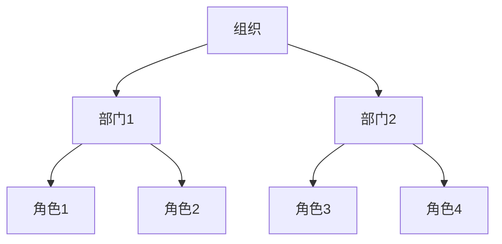
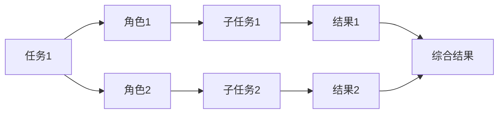
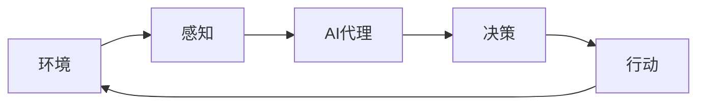

# AI Agent: AI的下一个风口 模拟真实世界的组织结构与工作流程

## 1. 背景介绍

### 1.1 人工智能的发展历程

人工智能(Artificial Intelligence, AI)是当代科技发展的前沿领域,其影响力已经渗透到了我们生活的方方面面。从20世纪50年代人工智能的概念被正式提出,到今天的深度学习、机器学习、自然语言处理等技术的飞速发展,AI已经成为推动科技进步的重要驱动力。

### 1.2 AI代理的兴起

随着AI技术的不断演进,人们开始探索如何将AI应用到更多的场景中。传统的AI系统往往是针对特定任务进行训练和优化,但现实世界中的问题往往是复杂多变的。因此,出现了一种新型的AI系统——AI代理(AI Agent),旨在模拟真实世界中的组织结构和工作流程,更好地解决复杂问题。

### 1.3 AI代理的重要性

AI代理具有以下重要意义:

1. **模拟真实环境**:AI代理可以模拟真实世界中的组织结构、工作流程和决策过程,帮助我们更好地理解和优化复杂系统。

2. **提高决策效率**:通过模拟不同场景,AI代理可以快速评估各种决策的影响,从而提高决策的质量和效率。

3. **促进人机协作**:AI代理可以与人类专家协作,充分发挥人机各自的优势,提高工作效率和决策质量。

4. **推动AI技术发展**:AI代理的研究和应用将推动AI技术在更多领域的创新和突破。

## 2. 核心概念与联系

### 2.1 AI代理的定义

AI代理是一种基于AI技术的软件实体,能够感知环境、处理信息、做出决策并采取行动。它模拟真实世界中的组织结构和工作流程,具有自主性、反应性、主动性和社会性等特征。

### 2.2 组织结构模拟

AI代理可以模拟真实世界中的组织结构,包括不同层级的角色、职责和权限。每个AI代理都扮演着特定的角色,并与其他代理进行协作和交互。



### 2.3 工作流程模拟

AI代理还可以模拟真实世界中的工作流程,包括任务分配、协作方式、决策过程等。每个AI代理根据自身的角色和职责,完成特定的任务,并与其他代理进行信息交换和协作。



### 2.4 AI代理与环境的交互

AI代理需要与环境进行交互,感知环境状态、获取信息,并根据信息做出决策和行动。环境可以是虚拟的,也可以是真实世界。AI代理的目标是通过与环境的交互,完成特定的任务或优化特定的目标。



## 3. 核心算法原理具体操作步骤

### 3.1 马尔可夫决策过程(MDP)

马尔可夫决策过程(Markov Decision Process, MDP)是AI代理决策的核心算法之一。它描述了代理与环境的交互过程,包括代理的状态、行动、奖励和转移概率等要素。

1. 定义MDP的基本元素:
   - 状态集合 $S$
   - 行动集合 $A$
   - 转移概率 $P(s'|s,a)$,表示在状态 $s$ 下执行行动 $a$ 后,转移到状态 $s'$ 的概率
   - 奖励函数 $R(s,a,s')$,表示在状态 $s$ 下执行行动 $a$ 后,转移到状态 $s'$ 所获得的奖励

2. 确定代理的策略 $\pi(a|s)$,表示在状态 $s$ 下选择行动 $a$ 的概率。

3. 计算策略的价值函数 $V^\pi(s)$,表示在状态 $s$ 下遵循策略 $\pi$ 所能获得的期望回报。

4. 使用动态规划或强化学习算法求解最优策略 $\pi^*$,使价值函数 $V^{\pi^*}(s)$ 最大化。

5. 根据最优策略 $\pi^*$,代理在每个状态下选择相应的行动,与环境交互并获得最大化的期望回报。

### 3.2 Q-Learning算法

Q-Learning是一种常用的强化学习算法,用于求解MDP中的最优策略。它通过不断与环境交互,更新状态-行动值函数 $Q(s,a)$,逐步逼近最优策略。

算法步骤如下:

1. 初始化 $Q(s,a)$ 为任意值。

2. 对于每个时间步:
   - 观察当前状态 $s$
   - 根据 $\epsilon$-贪婪策略选择行动 $a$
   - 执行行动 $a$,观察奖励 $r$ 和下一状态 $s'$
   - 更新 $Q(s,a)$ 值:
     $$Q(s,a) \leftarrow Q(s,a) + \alpha \left[ r + \gamma \max_{a'} Q(s',a') - Q(s,a) \right]$$
     其中 $\alpha$ 是学习率, $\gamma$ 是折扣因子。

3. 重复步骤2,直到收敛。

通过不断更新 $Q(s,a)$ 值,算法最终会收敛到最优策略 $\pi^*(s) = \arg\max_a Q(s,a)$。

### 3.3 深度强化学习

对于复杂的环境,传统的Q-Learning算法可能会受到维数灾难的影响。深度强化学习通过将深度神经网络引入强化学习,能够有效处理高维状态和行动空间。

1. 使用深度神经网络来近似 $Q(s,a)$ 函数,即 $Q(s,a;\theta) \approx Q^*(s,a)$,其中 $\theta$ 是网络参数。

2. 通过与环境交互获取样本 $(s,a,r,s')$,构建经验回放池。

3. 从经验回放池中采样批数据,使用下式作为损失函数进行网络参数 $\theta$ 的更新:
   $$L(\theta) = \mathbb{E}_{(s,a,r,s')\sim D}\left[ \left(r + \gamma \max_{a'} Q(s',a';\theta^-) - Q(s,a;\theta)\right)^2 \right]$$
   其中 $\theta^-$ 是目标网络的参数,用于估计 $\max_{a'} Q(s',a')$ 的值,增加训练稳定性。

4. 重复步骤2和3,直到收敛。

深度强化学习算法能够自动从环境中学习特征表示,处理复杂的状态和行动空间,提高了强化学习在实际应用中的性能。

## 4. 数学模型和公式详细讲解举例说明

在AI代理的决策过程中,数学模型和公式扮演着重要的角色。下面将详细讲解一些常见的数学模型和公式。

### 4.1 马尔可夫决策过程(MDP)

马尔可夫决策过程(MDP)是AI代理决策的核心数学模型之一。它描述了代理与环境的交互过程,包括代理的状态、行动、奖励和转移概率等要素。

MDP可以用一个五元组 $(S, A, P, R, \gamma)$ 来表示:

- $S$ 是状态集合
- $A$ 是行动集合
- $P(s'|s,a)$ 是转移概率,表示在状态 $s$ 下执行行动 $a$ 后,转移到状态 $s'$ 的概率
- $R(s,a,s')$ 是奖励函数,表示在状态 $s$ 下执行行动 $a$ 后,转移到状态 $s'$ 所获得的奖励
- $\gamma \in [0,1)$ 是折扣因子,用于权衡即时奖励和长期回报

代理的目标是找到一个最优策略 $\pi^*$,使得在遵循该策略时,期望的累积折扣回报最大化:

$$\pi^* = \arg\max_\pi \mathbb{E}_\pi \left[ \sum_{t=0}^\infty \gamma^t R(s_t, a_t, s_{t+1}) \right]$$

其中 $s_t$ 和 $a_t$ 分别表示第 $t$ 个时间步的状态和行动。

为了求解最优策略,我们可以定义状态价值函数 $V^\pi(s)$ 和状态-行动价值函数 $Q^\pi(s,a)$:

$$V^\pi(s) = \mathbb{E}_\pi \left[ \sum_{t=0}^\infty \gamma^t R(s_t, a_t, s_{t+1}) \mid s_0 = s \right]$$

$$Q^\pi(s,a) = \mathbb{E}_\pi \left[ \sum_{t=0}^\infty \gamma^t R(s_t, a_t, s_{t+1}) \mid s_0 = s, a_0 = a \right]$$

通过动态规划或强化学习算法,我们可以求解出最优的价值函数 $V^*(s)$ 和 $Q^*(s,a)$,从而得到最优策略 $\pi^*(s) = \arg\max_a Q^*(s,a)$。

### 4.2 Q-Learning算法

Q-Learning是一种常用的强化学习算法,用于求解MDP中的最优策略。它通过不断与环境交互,更新状态-行动值函数 $Q(s,a)$,逐步逼近最优策略。

Q-Learning算法的更新规则如下:

$$Q(s_t,a_t) \leftarrow Q(s_t,a_t) + \alpha \left[ r_t + \gamma \max_{a} Q(s_{t+1},a) - Q(s_t,a_t) \right]$$

其中:

- $\alpha$ 是学习率,控制了新信息对 $Q$ 值的影响程度
- $r_t$ 是在时间步 $t$ 获得的即时奖励
- $\gamma$ 是折扣因子,用于权衡即时奖励和长期回报
- $\max_{a} Q(s_{t+1},a)$ 是在状态 $s_{t+1}$ 下可获得的最大期望回报

通过不断更新 $Q(s,a)$ 值,算法最终会收敛到最优策略 $\pi^*(s) = \arg\max_a Q(s,a)$。

以下是一个简单的示例,说明Q-Learning算法如何在格子世界(GridWorld)环境中寻找从起点到终点的最短路径。

```python
import numpy as np

# 定义格子世界环境
grid = np.array([
    [0, 0, 0, 1],
    [0, 0, 0, -1],
    [-1, 0, 0, 0]
])

# 定义行动集合
actions = [(-1, 0), (1, 0), (0, -1), (0, 1)]  # 上下左右

# 初始化Q值
Q = np.zeros((grid.shape[0], grid.shape[1], len(actions)))

# 设置超参数
alpha = 0.1  # 学习率
gamma = 0.9  # 折扣因子
epsilon = 0.1  # 探索率

# 训练Q-Learning算法
for episode in range(1000):
    state = (2, 0)  # 起点
    done = False
    while not done:
        # 选择行动
        if np.random.rand() < epsilon:
            action = np.random.randint(len(actions))
        else:
            action = np.argmax(Q[state])
        
        # 执行行动
        next_state = (state[0] + actions[action][0], state[1] + actions[action][1])
        reward = grid[next_state]
        
        # 更新Q值
        Q[state][action] += alpha * (reward + gamma * np.max(Q[next_state]) - Q[state][action])
        
        # 更新状态
        state = next_state
        
        # 检查是否到达终点
        if grid[state] == 1:
            done = True

# 输出最优路径
state = (2, 0)
path = []
while state != (0, 3):
    path.append(state)
    action = np.argmax(Q[state])