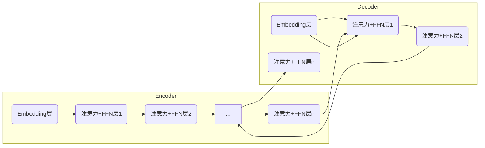
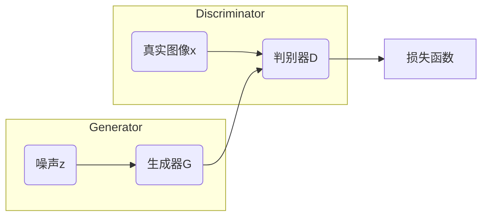

# AIGC从入门到实战：AIGC小知识

## 1. 背景介绍

### 1.1 什么是AIGC?

AIGC(Artificial Intelligence Generated Content)是指利用人工智能技术生成的内容,包括文本、图像、音频、视频等多种形式。随着人工智能技术的不断发展,AIGC已经渗透到了内容创作的方方面面,给传统的内容生产方式带来了巨大的变革。

AIGC的出现,源于深度学习、自然语言处理、计算机视觉等人工智能技术的突破性进展。通过训练大规模数据,AI模型能够学习到丰富的知识,并具备生成高质量内容的能力。

### 1.2 AIGC的重要性

在信息时代,内容就是王道。高质量、个性化的内容,不仅能够满足人们日益增长的需求,也是企业获取用户、提升品牌影响力的关键。然而,传统的内容生产效率低下、成本高昂,难以满足快速迭代的市场需求。

AIGC的出现,为内容创作提供了新的思路和解决方案。AI可以高效、低成本地生成大量内容,极大地提高了内产出效率。同时,AIGC还能够根据用户偏好定制个性化内容,提升用户体验。

此外,AIGC还在教育、医疗、法律等多个领域发挥着重要作用,为人类赋能,提高工作效率。因此,掌握AIGC技术,对于个人和企业来说都是非常有价值的。

## 2. 核心概念与联系

### 2.1 AIGC的核心技术

AIGC的核心技术主要包括以下几个方面:

1. **自然语言处理(NLP)**: 用于理解和生成自然语言文本,是文本内容生成的基础。
2. **计算机视觉(CV)**: 用于识别、理解和生成图像、视频等视觉内容。
3. **深度学习**: 通过训练大规模数据,学习到丰富的知识表示,是AIGC的核心驱动力。
4. **生成对抗网络(GAN)**: 一种用于生成式建模的深度学习架构,在图像、视频生成中发挥重要作用。
5. **transformer**: 一种基于注意力机制的序列到序列模型,在NLP和CV领域都有广泛应用。

### 2.2 AIGC的主要模型

目前,一些主流的AIGC模型包括:

- **GPT(Generative Pre-trained Transformer)**: 一种基于transformer的大型语言模型,擅长生成高质量的自然语言文本。
- **DALL-E**: 一种结合了NLP和CV的多模态模型,能够根据自然语言描述生成图像。
- **Stable Diffusion**: 一种基于潜在扩散模型的文本到图像生成模型,生成效果出色。
- **Whisper**: 一种多语种自动语音识别(ASR)模型,可以将语音转录为文本。

### 2.3 AIGC的应用领域

AIGC技术可以广泛应用于以下领域:

- **内容创作**: 生成文章、小说、广告文案、社交媒体内容等。
- **设计制作**: 生成图像、图标、插画、UI设计等。
- **教育培训**: 生成教学资料、习题、教育辅助等。
- **客户服务**: 生成智能客服对话、FAQ等。
- **金融保险**: 生成报告、分析、投资建议等。
- **医疗健康**: 生成病历、诊断报告、医疗资讯等。

## 3. 核心算法原理具体操作步骤

### 3.1 自然语言生成(NLG)

自然语言生成是AIGC中最基础和最重要的一个环节。主要分为以下几个步骤:

1. **文本表示**:将文本转换为机器可以理解的数字表示,常用的方法有One-hot编码、Word Embedding等。

2. **语言模型训练**:在大规模语料库上训练语言模型,学习文本的语义和语法知识。常用的模型有RNN、LSTM、Transformer等。

3. **生成策略**:根据训练好的语言模型,采用不同的生成策略输出文本,如Greedy Search、Beam Search、Top-K/Top-P Sampling等。

4. **重复惩罚**:为了避免生成重复无意义的文本,需要对重复的token给予一定惩罚。

5. **结果重拾**:对生成的文本进行后处理,如拼写检查、语法纠正等,提高质量。

下面是一个使用Transformer模型生成文本的示例代码:

```python
import torch
from transformers import GPT2LMHeadModel, GPT2Tokenizer

# 加载预训练模型和tokenizer
model = GPT2LMHeadModel.from_pretrained('gpt2')
tokenizer = GPT2Tokenizer.from_pretrained('gpt2')

# 输入文本
input_text = "写一篇关于人工智能的文章"
input_ids = tokenizer.encode(input_text, return_tensors='pt')

# 生成文本
output_ids = model.generate(input_ids, max_length=200, num_beams=5, early_stopping=True)
output_text = tokenizer.decode(output_ids[0], skip_special_tokens=True)

print(output_text)
```

### 3.2 图像生成(Image Generation)

图像生成是AIGC中另一个非常重要的环节,主要分为以下几个步骤:

1. **图像编码**:将图像转换为机器可以理解的数字表示,常用的方法有CNN、ViT等。

2. **条件编码**:将生成条件(如文本描述)也编码为数字表示。

3. **生成模型训练**:在大规模图像-文本对数据上训练生成模型,学习图像和文本之间的映射关系。常用的模型有GAN、VAE、Diffusion Model等。

4. **生成策略**:根据训练好的生成模型,输入条件编码,采用不同的生成策略输出图像,如随机采样、DDPM Sampling等。

5. **结果后处理**:对生成的图像进行后处理,如去噪、上色、超分辨率等,提高质量。

下面是一个使用Stable Diffusion模型生成图像的示例代码:

```python
import torch
from diffusers import StableDiffusionPipeline

# 加载预训练模型
pipe = StableDiffusionPipeline.from_pretrained("runwayml/stable-diffusion-v1-5")

# 输入文本描述
prompt = "一只可爱的小狗在草地上玩耍"

# 生成图像
image = pipe(prompt)["sample"][0]

# 保存图像
image.save("cute_puppy.png")
```

## 4. 数学模型和公式详细讲解举例说明

### 4.1 Transformer模型

Transformer是一种基于注意力机制的序列到序列模型,在NLP和CV领域都有广泛应用。它的核心思想是利用注意力机制捕捉输入序列中不同位置元素之间的依赖关系,从而更好地建模序列数据。

Transformer的主要组成部分包括:

- **Embedding层**:将输入序列(如文本)转换为向量表示。
- **多头注意力层**:通过注意力机制捕捉序列元素之间的依赖关系。
- **前馈神经网络层**:对注意力层的输出进行非线性变换。
- **层归一化**:加速模型收敛,提高训练稳定性。

多头注意力机制是Transformer的核心,它的计算公式如下:

$$\begin{aligned}
\text{Attention}(Q, K, V) &= \text{softmax}\left(\frac{QK^T}{\sqrt{d_k}}\right)V \\
\text{MultiHead}(Q, K, V) &= \text{Concat}(head_1, \ldots, head_h)W^O\\
\text{where}\ head_i &= \text{Attention}(QW_i^Q, KW_i^K, VW_i^V)
\end{aligned}$$

其中$Q$、$K$、$V$分别表示查询(Query)、键(Key)和值(Value)。通过计算查询和键之间的相似性得分,然后对值进行加权求和,即可获得注意力输出。

在实际应用中,Transformer通常会堆叠多个编码器(Encoder)和解码器(Decoder)层,形成深层次的网络结构,从而提高模型的表达能力。



### 4.2 生成对抗网络(GAN)

生成对抗网络是一种用于生成式建模的深度学习架构,在图像、视频生成中发挥着重要作用。GAN由两个网络组成:生成器(Generator)和判别器(Discriminator),它们相互对抗地训练,最终达到生成器生成的图像无法被判别器区分的目标。

GAN的目标函数可以表示为:

$$\min_G \max_D V(D, G) = \mathbb{E}_{x\sim p_\text{data}(x)}[\log D(x)] + \mathbb{E}_{z\sim p_z(z)}[\log(1-D(G(z)))]$$

其中$G$试图最小化这个目标函数,使得$D$无法区分生成的图像$G(z)$和真实图像$x$;而$D$则试图最大化这个目标函数,以更好地区分生成图像和真实图像。

在训练过程中,$G$和$D$会不断地相互对抗,促使彼此提高性能。当训练收敛时,生成器$G$就能够生成逼真的图像,而判别器$D$无法有效区分真假图像。



### 4.3 扩散模型(Diffusion Model)

扩散模型是一种新兴的生成模型,在文本、图像、音频等多个领域表现出色。它的基本思想是将数据生成过程看作是一个由简单分布(如高斯噪声)逐步扩散到复杂数据分布的过程,而生成过程则是这一过程的逆向。

扩散模型的训练过程可以概括为以下步骤:

1. **正向扩散过程**:从真实数据$x_0$开始,添加逐步增大的高斯噪声,得到一系列噪声数据$\{x_t\}_{t=1}^T$。
2. **学习逆向过程**:训练一个网络$p_\theta(x_{t-1}|x_t)$,使其能够从$x_t$中去除噪声,恢复到$x_{t-1}$。
3. **生成过程**:从纯噪声$x_T$开始,通过learned reverse process反复去噪,最终生成出真实数据$x_0$。

扩散模型的反向过程可以用如下公式表示:

$$\begin{aligned}
q(x_{t-1}|x_t, x_0) &= \mathcal{N}(x_{t-1};\tilde\alpha_t x_0 + \tilde\beta_t x_t, \sigma_t^2\mathbf{I}) \\
p_\theta(x_{t-1}|x_t) &= \mathcal{N}(x_{t-1};\mu_\theta(x_t, t), \sigma_\theta^2(x_t, t)\mathbf{I})
\end{aligned}$$

其中$q$是真实的逆向过程,$p_\theta$是要学习的逆向过程。通过最小化两个分布之间的KL散度,可以训练出能够很好逼近$q$的$p_\theta$。

扩散模型的优点是可以生成高质量、多样化的样本,同时具有很好的可控性和可扩展性。目前,扩散模型在图像、音频、视频等领域都取得了卓越的生成效果。

## 5. 项目实践:代码实例和详细解释说明

在这一部分,我们将通过一个实际项目,演示如何使用AIGC技术生成文本和图像内容。

### 5.1 文本生成:使用GPT-2生成文章

在这个例子中,我们将使用GPT-2模型生成一篇关于"人工智能"的文章。GPT-2是一种基于Transformer的大型语言模型,由OpenAI开发,在文本生成任务上表现出色。

首先,