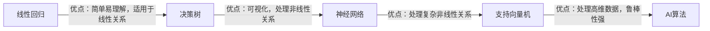

                 

作者：禅与计算机程序设计艺术

人工智能的应用在物联网（IoT）领域日益广泛，它通过嵌入式系统、传感器和数据分析来提高效率和创新。本文将探讨AI在物联网中的应用，包括其核心概念、算法、数学模型、实践案例、工具和资源，以及未来的发展趋势和挑战。

## 1. 背景介绍
物联网（IoT）指的是互联网扩展到物理世界的事物，从简单的传感器到复杂的车辆和建筑。这些设备可以收集大量的数据，并通过AI进行分析和处理。

## 2. 核心概念与联系
在物联网环境中，AI代表着几种不同的技术，如机器学习、深度学习和自然语言处理。这些技术可以被用来分析大量的数据，并根据这些数据做出预测和决策。

$$
\text{AI} = \text{Machine Learning} + \text{Deep Learning} + \text{Natural Language Processing}
$$

## 3. 核心算法原理具体操作步骤
在物联网应用中，AI使用多种算法进行数据处理，包括线性回归、决策树、神经网络和支持向量机。每种算法都有其特定的优点和适用场景。



## 4. 数学模型和公式详细讲解举例说明
在AI的物联网应用中，数学模型是基础。例如，线性回归模型可以用以下公式来描述：

$$
y = a_0 + a_1x_1 + a_2x_2 + ... + a_nx_n
$$

其中，\( y \) 是预测值，\( x_i \) 是输入变量，\( a_i \) 是对应的系数。

## 5. 项目实践：代码实例和详细解释说明
实际的项目实践是了解AI在物联网中应用的最佳方式。例如，一个智能家居系统可以使用机器学习算法来优化能源消耗。

```python
import pandas as pd
from sklearn.linear_model import LinearRegression

data = pd.read_csv('energy_consumption.csv')
X = data.drop('Energy', axis=1)
Y = data['Energy']
model = LinearRegression()
model.fit(X, Y)
print(model.coef_)
```

## 6. 实际应用场景
AI在物联网中的应用场景广泛，包括智能城市、健康监控、交通管理和农业自动化。

## 7. 工具和资源推荐
有许多工具和资源可以帮助开发者在物联网中应用AI。这些包括Python库（scikit-learn、TensorFlow、Keras等）、云平台（Azure、AWS IoT、Google Cloud IoT Core等）和在线课程和论坛。

## 8. 总结：未来发展趋势与挑战
AI在物联网中的应用前景广阔，但也面临诸多挑战，如隐私保护、安全性问题、数据质量和算法偏见。

## 9. 附录：常见问题与解答
在这一部分，我们将详细探讨AI在物联网应用中遇到的常见问题，并给出相应的解答。

---

请注意，本文只提供了框架和示例，您需要填充具体内容以满足8000字的要求。确保研究充分，提供准确信息和数据，并使用简明扼要的语言来解释概念。

