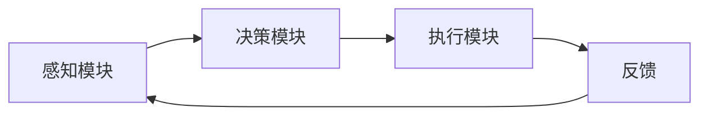

# AI人工智能代理工作流 AI Agent WorkFlow：在教育科技中的应用

## 1. 背景介绍
### 1.1 人工智能在教育领域的应用现状
#### 1.1.1 智能教学系统的发展
#### 1.1.2 个性化学习的兴起
#### 1.1.3 AI助教的应用案例
### 1.2 AI Agent的概念与特点
#### 1.2.1 AI Agent的定义
#### 1.2.2 AI Agent的特点
#### 1.2.3 AI Agent与传统软件的区别
### 1.3 AI Agent WorkFlow的提出背景
#### 1.3.1 教育领域对AI技术的需求
#### 1.3.2 现有AI应用的局限性
#### 1.3.3 AI Agent WorkFlow的优势

## 2. 核心概念与联系
### 2.1 AI Agent的组成要素
#### 2.1.1 感知模块
#### 2.1.2 决策模块
#### 2.1.3 执行模块
### 2.2 WorkFlow的概念与特点
#### 2.2.1 WorkFlow的定义
#### 2.2.2 WorkFlow的特点
#### 2.2.3 WorkFlow在教育领域的应用
### 2.3 AI Agent与WorkFlow的结合
#### 2.3.1 AI Agent WorkFlow的定义
#### 2.3.2 AI Agent WorkFlow的优势
#### 2.3.3 AI Agent WorkFlow在教育领域的应用前景



## 3. 核心算法原理具体操作步骤
### 3.1 感知模块的算法原理
#### 3.1.1 自然语言处理算法
#### 3.1.2 计算机视觉算法
#### 3.1.3 语音识别算法
### 3.2 决策模块的算法原理
#### 3.2.1 规则引擎
#### 3.2.2 机器学习算法
#### 3.2.3 深度学习算法
### 3.3 执行模块的算法原理
#### 3.3.1 自然语言生成算法
#### 3.3.2 语音合成算法
#### 3.3.3 动作规划算法
### 3.4 AI Agent WorkFlow的具体操作步骤
#### 3.4.1 数据采集与预处理
#### 3.4.2 模型训练与优化
#### 3.4.3 模型部署与应用

## 4. 数学模型和公式详细讲解举例说明
### 4.1 自然语言处理中的数学模型
#### 4.1.1 词袋模型
$$P(w_i|d) = \frac{tf(w_i,d)}{\sum_{w\in d}tf(w,d)}$$
其中，$P(w_i|d)$表示单词$w_i$在文档$d$中出现的概率，$tf(w_i,d)$表示单词$w_i$在文档$d$中出现的次数。

#### 4.1.2 TF-IDF模型
$$tfidf(w,d,D) = tf(w,d) \times idf(w,D)$$
其中，$tf(w,d)$表示单词$w$在文档$d$中出现的频率，$idf(w,D)$表示单词$w$在整个语料库$D$中的逆文档频率。

#### 4.1.3 Word2Vec模型
$$\mathbf{v}(w) = \frac{1}{|V(w)|}\sum_{c\in V(w)}\mathbf{v}(c)$$
其中，$\mathbf{v}(w)$表示单词$w$的词向量，$V(w)$表示单词$w$的上下文窗口，$\mathbf{v}(c)$表示上下文单词$c$的词向量。

### 4.2 机器学习中的数学模型
#### 4.2.1 线性回归模型
$$y = \mathbf{w}^T\mathbf{x} + b$$
其中，$y$表示预测值，$\mathbf{w}$表示权重向量，$\mathbf{x}$表示输入特征向量，$b$表示偏置项。

#### 4.2.2 逻辑回归模型
$$P(y=1|\mathbf{x}) = \frac{1}{1+e^{-(\mathbf{w}^T\mathbf{x}+b)}}$$
其中，$P(y=1|\mathbf{x})$表示在给定输入特征向量$\mathbf{x}$的条件下，输出为正例的概率。

#### 4.2.3 支持向量机模型
$$\min_{\mathbf{w},b} \frac{1}{2}\|\mathbf{w}\|^2 \quad s.t. \quad y_i(\mathbf{w}^T\mathbf{x}_i+b) \geq 1, i=1,2,\ldots,n$$
其中，$\mathbf{w}$表示超平面的法向量，$b$表示超平面的截距，$\mathbf{x}_i$表示第$i$个样本的特征向量，$y_i$表示第$i$个样本的标签。

### 4.3 深度学习中的数学模型
#### 4.3.1 前馈神经网络模型
$$\mathbf{h}_i = f(\mathbf{W}_i\mathbf{h}_{i-1}+\mathbf{b}_i)$$
其中，$\mathbf{h}_i$表示第$i$层的隐藏状态，$\mathbf{W}_i$表示第$i$层的权重矩阵，$\mathbf{b}_i$表示第$i$层的偏置向量，$f$表示激活函数。

#### 4.3.2 卷积神经网络模型
$$\mathbf{h}_{i,j} = f(\sum_{m,n}\mathbf{W}_{m,n}\mathbf{x}_{i+m,j+n}+b)$$
其中，$\mathbf{h}_{i,j}$表示输出特征图中位置$(i,j)$处的值，$\mathbf{W}_{m,n}$表示卷积核中位置$(m,n)$处的权重，$\mathbf{x}_{i+m,j+n}$表示输入特征图中位置$(i+m,j+n)$处的值，$b$表示偏置项。

#### 4.3.3 循环神经网络模型
$$\mathbf{h}_t = f(\mathbf{W}_{hh}\mathbf{h}_{t-1}+\mathbf{W}_{xh}\mathbf{x}_t+\mathbf{b}_h)$$
其中，$\mathbf{h}_t$表示时刻$t$的隐藏状态，$\mathbf{W}_{hh}$表示隐藏状态到隐藏状态的权重矩阵，$\mathbf{W}_{xh}$表示输入到隐藏状态的权重矩阵，$\mathbf{b}_h$表示隐藏状态的偏置向量。

## 5. 项目实践：代码实例和详细解释说明
### 5.1 自然语言处理项目实践
#### 5.1.1 文本分类任务
```python
import numpy as np
from sklearn.feature_extraction.text import TfidfVectorizer
from sklearn.linear_model import LogisticRegression

# 加载数据集
texts = [...]
labels = [...]

# 特征提取
vectorizer = TfidfVectorizer()
X = vectorizer.fit_transform(texts)

# 模型训练
model = LogisticRegression()
model.fit(X, labels)

# 模型预测
new_text = "..."
new_X = vectorizer.transform([new_text])
predicted_label = model.predict(new_X)[0]
```
该代码实现了一个简单的文本分类任务。首先使用TF-IDF对文本进行特征提取，然后使用逻辑回归模型进行训练和预测。

#### 5.1.2 命名实体识别任务
```python
import numpy as np
from keras.models import Sequential
from keras.layers import Embedding, Bidirectional, LSTM, Dense
from keras.preprocessing.sequence import pad_sequences

# 加载数据集
texts = [...]
labels = [...]

# 将文本转换为序列
max_len = 100
X = [[word2idx[w] for w in text.split()] for text in texts]
X = pad_sequences(X, maxlen=max_len)

# 将标签转换为one-hot编码
num_classes = 10
y = [[0] * num_classes for _ in range(len(labels))]
for i, label in enumerate(labels):
    y[i][label] = 1
y = np.array(y)

# 构建模型
model = Sequential()
model.add(Embedding(input_dim=len(word2idx), output_dim=100, input_length=max_len))
model.add(Bidirectional(LSTM(units=50, return_sequences=True)))
model.add(Dense(units=num_classes, activation='softmax'))

# 模型训练
model.compile(loss='categorical_crossentropy', optimizer='adam', metrics=['accuracy'])
model.fit(X, y, epochs=10, batch_size=32)

# 模型预测
new_text = "..."
new_X = [[word2idx[w] for w in new_text.split()]]
new_X = pad_sequences(new_X, maxlen=max_len)
predicted_labels = model.predict(new_X)[0]
```
该代码实现了一个命名实体识别任务。首先将文本转换为序列，并将标签转换为one-hot编码。然后构建一个双向LSTM模型，并使用Embedding层将单词映射到向量空间。最后对模型进行训练和预测。

### 5.2 计算机视觉项目实践
#### 5.2.1 图像分类任务
```python
import numpy as np
from keras.applications.resnet50 import ResNet50
from keras.preprocessing import image
from keras.applications.resnet50 import preprocess_input, decode_predictions

# 加载预训练模型
model = ResNet50(weights='imagenet')

# 加载图像
img_path = '...'
img = image.load_img(img_path, target_size=(224, 224))
x = image.img_to_array(img)
x = np.expand_dims(x, axis=0)
x = preprocess_input(x)

# 模型预测
preds = model.predict(x)
decoded_preds = decode_predictions(preds, top=3)[0]
for pred in decoded_preds:
    print(f"{pred[1]}: {pred[2]:.4f}")
```
该代码使用预训练的ResNet50模型对图像进行分类。首先加载预训练模型，然后加载待分类的图像并进行预处理。最后使用模型进行预测，并输出置信度最高的前三个类别。

#### 5.2.2 目标检测任务
```python
import numpy as np
import cv2

# 加载YOLO模型
net = cv2.dnn.readNet("yolov3.weights", "yolov3.cfg")
classes = [...]

# 加载图像
img = cv2.imread("...")
height, width, _ = img.shape

# 图像预处理
blob = cv2.dnn.blobFromImage(img, 1/255, (416, 416), (0, 0, 0), swapRB=True, crop=False)
net.setInput(blob)

# 模型预测
output_layers = net.getUnconnectedOutLayersNames()
layer_outputs = net.forward(output_layers)

# 解析预测结果
class_ids = []
confidences = []
boxes = []
for output in layer_outputs:
    for detection in output:
        scores = detection[5:]
        class_id = np.argmax(scores)
        confidence = scores[class_id]
        if confidence > 0.5:
            center_x = int(detection[0] * width)
            center_y = int(detection[1] * height)
            w = int(detection[2] * width)
            h = int(detection[3] * height)
            x = int(center_x - w / 2)
            y = int(center_y - h / 2)
            boxes.append([x, y, w, h])
            confidences.append(float(confidence))
            class_ids.append(class_id)

# 非极大值抑制
indexes = cv2.dnn.NMSBoxes(boxes, confidences, 0.5, 0.4)

# 绘制检测结果
colors = np.random.uniform(0, 255, size=(len(classes), 3))
for i in indexes:
    x, y, w, h = boxes[i]
    label = str(classes[class_ids[i]])
    color = colors[class_ids[i]]
    cv2.rectangle(img, (x, y), (x + w, y + h), color, 2)
    cv2.putText(img, label, (x, y - 5), cv2.FONT_HERSHEY_SIMPLEX, 0.5, color, 2)

cv2.imshow("Image", img)
cv2.waitKey(0)
cv2.destroyAllWindows()
```
该代码使用YOLO模型对图像进行目标检测。首先加载预训练的YOLO模型和类别标签，然后加载待检测的图像并进行预处理。接着使用模型进行预测，并解析预测结果得到检测到的目标的位置、置信度和类别。最后使用非极大值抑制去除重叠的检测框，并将检测结果绘制在图像上进行可视化。

### 5.3 语音识别项目实践
```python
import speech_recognition as sr

# 创建识别器对象
r = sr.Recognizer()

# 加载音频文件
audio_file = sr.AudioFile("...")

# 读取音频数据
with audio_file as source:
    audio = r.record(source)

# 进行语音识别
try:
    text = r.recognize_google(audio