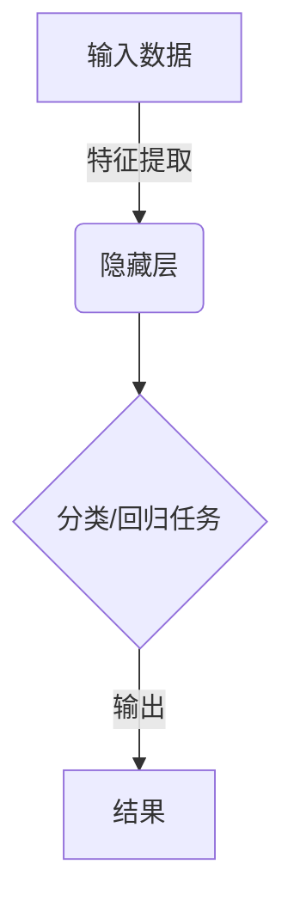
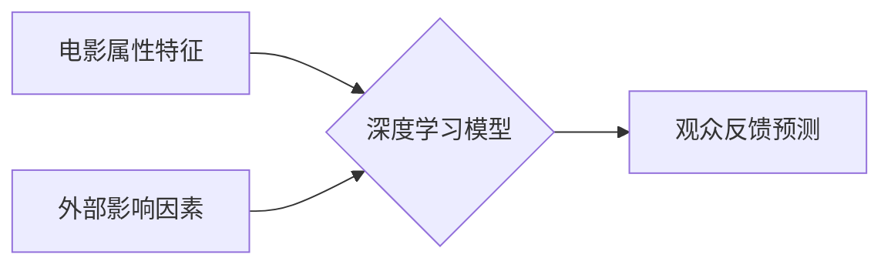
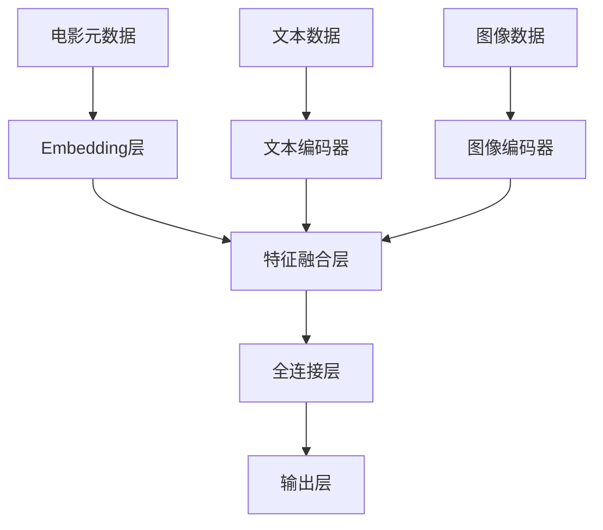

# AI人工智能深度学习算法：在电影反馈预测中的应用

## 1.背景介绍

### 1.1 电影行业的重要性

电影作为一种重要的大众娱乐媒体和文化艺术形式,在现代社会中扮演着重要角色。它不仅能够带给观众愉悦的观影体验,还能反映时代风貌,传递价值观念。电影行业的发展与繁荣,对于一个国家的文化软实力和经济发展都有着深远影响。

### 1.2 电影反馈预测的意义

在电影制作和发行过程中,能够准确预测观众的反馈对于制作方来说至关重要。良好的口碑可以带来可观的票房收益,而负面评价则可能导致失败。因此,对电影反馈进行准确预测,不仅能为制作方提供决策依据,还能帮助他们及时调整营销策略,最大限度实现利润最大化。

### 1.3 传统预测方法的局限性

传统的电影反馈预测方法主要依赖于人工分析和统计模型,存在以下局限性:

1. 主观性强,难以客观评估
2. 数据来源有限,难以全面把握影响因素
3. 分析模型简单,难以处理高维复杂数据
4. 预测准确率有限,存在较大偏差

### 1.4 AI深度学习算法的优势

近年来,人工智能尤其是深度学习算法在数据分析和预测领域展现出了巨大潜力。相比传统方法,AI深度学习具有以下优势:

1. 能够自动从海量数据中提取特征,降低人工分析成本
2. 建模能力强,可以处理高维复杂非线性数据
3. 泛化能力好,可以有效应对未知情况
4. 持续学习能力,可以不断优化模型,提高预测精度

基于以上优势,将AI深度学习算法应用于电影反馈预测,有望极大提高预测的准确性和可靠性。

## 2.核心概念与联系

### 2.1 深度学习概述

深度学习(Deep Learning)是机器学习的一个新的领域,它模仿人脑的机制来解释数据,例如图像、声音和文本。深度学习能够通过神经网络模型对输入数据进行表示学习,捕捉其内在的分布式特征表示,并对其进行建模,从而使计算机具备人类水平的感知和分析能力。

深度学习的核心思想是通过构建具有多层非线性变换的神经网络模型,对输入数据进行层层表示和抽象,逐步提炼出高层次的特征表示,从而完成相应的机器学习任务,如分类、回归、聚类等。

### 2.2 电影反馈预测任务

电影反馈预测可以被视为一个监督学习任务,目标是基于电影的各种属性特征(如类型、导演、演员、剧情等)以及其他外部影响因素(如时间、地区、宣传等),对观众的反馈(如评分、口碑等)进行预测。这可以被建模为一个回归问题或分类问题。

将深度学习算法应用于此任务,主要优势在于:

1. 能够自动从海量电影数据中提取高维特征
2. 可以同时考虑多种影响因素,建模复杂非线性关系
3. 具备端到端的学习能力,无需人工设计特征
4. 可以不断从新数据中学习,持续优化模型

### 2.3 相关技术

应用深度学习算法进行电影反馈预测,通常需要整合多种技术,包括但不限于:

- **数据采集与预处理**: 从各种渠道收集电影相关数据,对其进行清洗、标注、特征工程等预处理
- **自然语言处理(NLP)**: 对电影文本数据(如剧情简介、评论等)进行分析和向量化表示
- **计算机视觉(CV)**: 对电影视觉数据(如海报、预告片等)进行理解和特征提取
- **神经网络模型**: 设计合适的深度学习网络架构,如卷积神经网络、递归神经网络、注意力机制等
- **模型优化与集成**: 通过超参数调优、模型集成等方法提升模型性能
- **可解释性分析**: 探究模型内在机理,提高模型可信度和可解释性

## 3.核心算法原理具体操作步骤

### 3.1 问题建模

将电影反馈预测问题形式化为一个监督学习任务,目标是学习一个映射函数 $f$,使得对于给定的电影特征向量 $\boldsymbol{x}$,能够预测其对应的反馈值 $y$:

$$y = f(\boldsymbol{x};\boldsymbol{\theta})$$

其中 $\boldsymbol{\theta}$ 为模型参数,通过学习算法从训练数据中估计得到。

根据反馈值 $y$ 的性质,该问题可以建模为:

- **回归问题**: 当反馈值为连续值(如评分)时,将 $f$ 建模为回归函数
- **分类问题**: 当反馈值为离散值(如好坏评价)时,将 $f$ 建模为分类函数

### 3.2 数据预处理

电影数据通常来源于多个异构数据源,包括结构化数据(如元数据)和非结构化数据(如文本、图像、视频等)。需要对这些原始数据进行预处理,主要包括:

1. **数据采集与清洗**: 从各种渠道(如网站、API等)收集相关数据,对其进行去重、填补缺失值等清洗操作。
2. **特征工程**: 从原始数据中提取或构造有意义的特征,如将类别型特征进行One-Hot编码,对文本特征进行分词、向量化表示等。
3. **数据标注**: 对部分数据(如评论文本)进行人工标注,作为监督信号。
4. **数据划分**: 将数据划分为训练集、验证集和测试集。

### 3.3 模型架构

对于电影反馈预测任务,我们可以设计一种端到端的深度神经网络模型,整合多种技术来处理异构输入数据。一种可能的模型架构如下:

1. **Embedding层**: 对电影元数据(如类型、导演、演员等)进行Embedding编码,获得向量表示。
2. **文本编码器**: 使用RNN、Transformer等模型对文本数据(如剧情简介、评论等)进行编码,获得文本特征向量。
3. **图像编码器**: 使用CNN等模型对图像数据(如海报、预告片等)进行编码,获得视觉特征向量。
4. **特征融合层**: 将不同模态的特征向量进行融合,可采用简单拼接或注意力机制等方法。
5. **全连接层**: 对融合后的特征向量进行非线性变换和处理。
6. **输出层**: 根据任务类型选择合适的输出层,如对于回归任务使用线性层,对于分类任务使用Softmax层。

该模型架构的优点是能够同时利用电影的多源异构数据,捕捉不同模态的特征信息,并将其融合在一起进行综合建模和预测。

### 3.4 模型训练

在获得标注好的训练数据后,我们可以使用监督学习的方式对模型进行训练。具体步骤如下:

1. **定义损失函数**: 根据任务类型选择合适的损失函数,如对于回归任务使用均方误差损失,对于分类任务使用交叉熵损失等。
2. **选择优化算法**: 常用的优化算法有随机梯度下降(SGD)、Adam等,用于迭代更新模型参数,最小化损失函数。
3. **超参数设置**: 设置合理的超参数,如学习率、批量大小、正则化系数等,可通过验证集进行调优。
4. **模型训练**: 使用训练数据对模型进行端到端的训练,通过多次迭代优化模型参数,使损失函数最小化。
5. **早停策略**: 在训练过程中监控验证集上的性能指标,当性能开始下降时,提前停止训练以防止过拟合。

### 3.5 模型评估与优化

在模型训练完成后,我们需要在保留的测试集上对模型进行评估,并根据评估结果对模型进行必要的优化。

1. **评估指标**: 根据任务类型选择合适的评估指标,如对于回归任务使用均方根误差(RMSE)、决定系数($R^2$)等,对于分类任务使用准确率、F1分数等。
2. **模型分析**: 分析模型在测试集上的表现,找出其中的薄弱环节,如某些特定类型的电影预测效果较差等。
3. **误差分析**: 对模型的错误预测样本进行分析,探究产生误差的原因,如数据噪声、模型偏差等。
4. **模型优化**:
    - **数据增强**: 通过数据扩增、标注优化等方式丰富训练数据,提高模型的泛化能力。
    - **模型集成**: 使用Bagging、Boosting等策略对多个模型进行集成,提升预测性能。
    - **迁移学习**: 利用在其他领域预训练的模型,将知识迁移到当前任务中,提高模型初始化质量。
    - **注意力机制**: 引入注意力机制,使模型能够自适应地关注输入数据的不同部分。
    - **可解释性增强**: 通过可解释性技术(如LIME、SHAP等)赋予模型可解释性,提高模型的可信度。

通过上述步骤的不断迭代优化,我们可以获得更加准确、可靠和可解释的电影反馈预测模型。

## 4.数学模型和公式详细讲解举例说明

在电影反馈预测任务中,我们通常需要处理多种形式的输入数据,如结构化的元数据、非结构化的文本数据和图像数据等。对于不同类型的数据,我们需要采用不同的数学模型和技术进行建模和特征提取。

### 4.1 结构化数据建模

对于结构化的电影元数据(如类型、导演、演员等),我们可以使用Embedding技术将其转换为向量表示。设有 $N$ 个不同的类别,我们可以为每个类别 $i$ 学习一个 $d$ 维的Embedding向量 $\boldsymbol{v}_i \in \mathbb{R}^d$,将类别 $i$ 映射到 $\boldsymbol{v}_i$。对于一个电影 $x$,其元数据特征可以表示为:

$$\boldsymbol{x}_{meta} = \boldsymbol{v}_{type} \oplus \boldsymbol{v}_{director} \oplus \boldsymbol{v}_{actor_1} \oplus \cdots \oplus \boldsymbol{v}_{actor_n}$$

其中 $\oplus$ 表示向量拼接操作。在模型训练过程中,这些Embedding向量将通过反向传播算法不断更新和优化。

### 4.2 文本数据建模

对于电影相关的文本数据(如剧情简介、评论等),我们可以使用自然语言处理技术对其进行建模。常用的方法包括:

1. **Word Embedding**

将每个单词 $w$ 映射为一个固定长度的向量表示 $\boldsymbol{w} \in \mathbb{R}^d$,相似的单词在向量空间中距离较近。可以使用预训练的Word Embedding(如Word2Vec、GloVe等)或在当前任务上进行联合训练。

2. **序列编码器**

使用递归神经网络(RNN)或Transformer等序列模型,对文本序列 $\boldsymbol{w} = (w_1, w_2, \ldots, w_n)$ 进行编码,获得对应