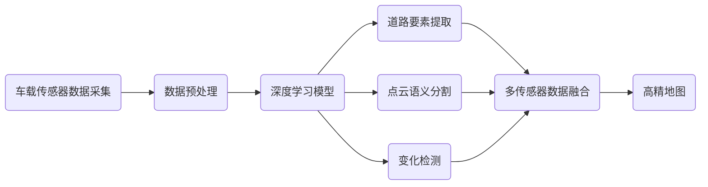

# AI人工智能深度学习算法：在高精地图构建中的应用

## 1. 背景介绍

### 1.1 高精地图的重要性
高精度地图(High Definition Map, 简称HD Map)是自动驾驶技术的关键组成部分之一。相比于传统导航地图,高精地图可以提供更加精确、细粒度的道路信息,例如车道线、交通标识、路沿等,这些信息对于自动驾驶车辆实现精准定位、感知周围环境以及做出合理决策至关重要。

### 1.2 高精地图构建的挑战
构建高精地图是一项复杂而耗时的工作,传统方法主要依赖人工采集和标注,效率低下且成本高昂。随着自动驾驶技术的快速发展,亟需一种高效、智能化的高精地图构建方案。

### 1.3 AI与深度学习在高精地图构建中的应用前景
人工智能技术的飞速进步,特别是深度学习算法在计算机视觉、语音识别等领域取得的突破性进展,为高精地图的自动化构建提供了新的思路和方法。利用AI算法从海量的车载传感器数据(如相机图像、激光雷达点云等)中自动提取道路要素信息,将极大提升制图效率和质量。本文将重点探讨深度学习算法在高精地图构建中的应用。

## 2. 核心概念与联系

### 2.1 高精地图
高精地图是对道路环境进行高精度三维重建的地图产品,通常精度可达厘米级。其核心要素包括:

- 车道线:道路中心线、车道分界线等
- 路沿:道路边界
- 交通标识:交通灯、交通标志牌等
- 道路标线:停止线、导流线、人行横道线等
- 语义信息:道路、路口、车道、行驶方向等

### 2.2 深度学习 
深度学习是机器学习的一个分支,其核心是通过构建多层神经网络,从大量数据中学习多层次的特征表示。常见的深度学习模型包括:

- 卷积神经网络(CNN):主要用于图像识别、语义分割等
- 循环神经网络(RNN):适用于序列数据如语音、文本等
- 生成对抗网络(GAN):可用于图像风格转换、数据增强等

### 2.3 深度学习在高精地图构建中的作用

在高精地图构建的各个环节中,深度学习算法可发挥重要作用:

- 道路要素提取:利用CNN等模型从车载相机图像、激光雷达点云中识别车道线、交通标识等关键要素
- 点云语义分割:通过深度学习将激光雷达点云划分为道路、建筑、车辆等不同类别,为场景理解提供基础
- 变化检测:通过深度学习比较不同时期的地图数据,自动发现道路工程施工、交通设施变更等情况
- 数据融合:利用深度神经网络融合多传感器信息,生成更加准确、细粒度的高精地图

下图展示了深度学习算法在高精地图构建流程中的关键作用:



## 3. 核心算法原理与操作步骤

本节将重点介绍几种应用于高精地图构建的深度学习算法,包括用于图像语义分割的全卷积网络FCN、用于点云语义分割的PointNet以及用于变化检测的孪生网络等。

### 3.1 全卷积网络FCN用于车道线提取

FCN是图像语义分割的经典算法,通过将传统CNN中的全连接层替换为卷积层,实现了端到端、像素到像素的分割。其主要步骤如下:

1. 特征提取:利用VGG、ResNet等预训练的CNN提取图像特征
2. 上采样:通过反卷积等操作将特征图上采样到原始分辨率
3. 跳跃连接:将浅层特征与深层特征融合,兼顾局部细节和全局语义
4. 逐像素分类:通过softmax层输出每个像素的类别概率

在车道线提取任务中,可将图像划分为车道线/非车道线两类,训练FCN模型对每个像素进行分类,提取出车道线区域。

### 3.2 PointNet用于点云语义分割

不同于图像数据有规则的2D网格结构,点云数据是稀疏、无序的3D点集。PointNet设计了一种直接作用于点云的神经网络,实现了高效的点云语义分割。其核心思想是:

1. 点云输入:将原始点云(N×3的坐标矩阵)输入网络
2. 特征提取:通过一系列全连接层提取点云的全局特征
3. 特征融合:将全局特征与每个点的局部特征拼接,得到点级特征
4. 逐点分类:通过全连接层对每个点进行类别预测

PointNet在道路场景点云语义分割中可发挥重要作用,如将点云划分为地面、建筑、车辆、行人等类别,为后续高精地图构建提供重要先验。

### 3.3 孪生网络用于变化检测

孪生网络由两个结构相同的子网络组成,可用于比较两个输入数据的相似性。将其应用于变化检测任务的基本步骤为:

1. 数据准备:选取不同时期的两张图像作为输入数据对
2. 特征提取:两个子网络分别对输入图像提取特征,得到特征向量
3. 相似度度量:计算两个特征向量的差异,如欧氏距离、余弦相似度等
4. 阈值判决:根据相似度与预设阈值的比较结果,判断两张图像是否发生变化

利用孪生网络可以自动比较不同时期的高精地图,及时发现道路施工、设施更新等变化情况,为地图更新维护提供依据。

## 4. 数学模型与公式详解

### 4.1 FCN的数学模型

FCN的核心是卷积操作和上采样操作,其数学模型可表示为:

$$ y = f_u(f_c(x)) $$

其中,$x$为输入图像,$f_c$为卷积操作,提取图像特征,$f_u$为上采样操作,恢复特征图尺寸,$y$为输出的像素级分割结果。

卷积操作可表示为:

$$ f_c(x) = w * x + b $$

其中,$w$为卷积核,$b$为偏置项,*表示卷积操作。上采样操作可通过反卷积或双线性插值等方式实现,将低分辨率的特征图恢复到原始尺寸。

假设输入图像尺寸为$H \times W$,卷积核尺寸为$k \times k$,则反卷积操作可表示为:

$$ f_u(x) = \hat{w} * x $$

其中, $\hat{w}$为反卷积核,尺寸为$k \times k$,*表示反卷积操作(即转置卷积)。通过学习 $\hat{w}$,可实现特征图的上采样。

### 4.2 PointNet的数学模型

PointNet的核心是通过全连接层提取点云的全局特征,可表示为:

$$ g = \gamma(MAX\{h(x_i)\}) $$

其中,$x_i$为点云中的第$i$个点,$h$为全连接层,对每个点提取特征, $MAX$为最大池化操作,提取点集的全局特征,$\gamma$为另一全连接层,将全局特征映射到高维空间。

对于点云语义分割任务,PointNet将全局特征 $g$ 与每个点的局部特征拼接,再通过全连接层进行逐点分类:

$$ y_i = f(g, h(x_i)) $$

其中,$y_i$为第$i$个点的类别预测结果,$f$为全连接层。通过端到端训练,PointNet可以同时提取点云的全局和局部特征,实现高效、准确的语义分割。

### 4.3 孪生网络的数学模型

孪生网络由两个结构相同的子网络组成,用于比较两个输入数据的相似性。设两个子网络为 $f_1$ 和 $f_2$,它们共享参数 $\theta$,则孪生网络可表示为:

$$ d = ||f_1(x_1; \theta) - f_2(x_2; \theta)||_2 $$

其中,$x_1$和$x_2$为两个输入数据(如两张图像), $||\cdot||_2$表示二范数(欧氏距离)。孪生网络的目标是学习一个特征空间,使得相似的数据对(如同一位置不同时期的图像)在该空间中的距离尽可能小,而不同的数据对距离尽可能大。

常见的孪生网络损失函数包括对比损失(Contrastive Loss):

$$ L = (1-y)\frac{1}{2}d^2 + y\frac{1}{2}\{max(0, m-d)\}^2 $$

其中,$y$为数据对的标签(相似为0,不同为1),$m$为间隔阈值。该损失函数鼓励相似数据对的距离小于阈值,不同数据对的距离大于阈值,从而学习到一个有判别力的特征空间。

## 5. 项目实践:代码实例与详解

下面以车道线提取任务为例,演示如何使用PyTorch实现FCN模型。

### 5.1 数据准备

假设我们已经有一批车道线图像数据,以及对应的像素级标注(0为背景,1为车道线)。我们将图像和标注数据划分为训练集和测试集,并使用`torch.utils.data.DataLoader`进行批量读取:

```python
from torch.utils.data import Dataset, DataLoader

class LaneDataset(Dataset):
    def __init__(self, image_dir, label_dir, transform=None):
        self.image_dir = image_dir
        self.label_dir = label_dir
        self.transform = transform
        self.images = os.listdir(image_dir)
    
    def __len__(self):
        return len(self.images)
    
    def __getitem__(self, index):
        img_path = os.path.join(self.image_dir, self.images[index])
        label_path = os.path.join(self.label_dir, self.images[index].replace(".jpg", "_label.png"))
        
        image = io.imread(img_path)
        label = io.imread(label_path)
        
        if self.transform:
            image = self.transform(image)
        
        return image, label
        
train_dataset = LaneDataset(train_image_dir, train_label_dir, transform)
test_dataset = LaneDataset(test_image_dir, test_label_dir, transform)

train_loader = DataLoader(train_dataset, batch_size=4, shuffle=True)
test_loader = DataLoader(test_dataset, batch_size=4, shuffle=False)
```

### 5.2 模型定义

接下来定义FCN模型,这里我们使用ResNet-18作为骨干网络,并将最后两个全连接层替换为卷积层和上采样层:

```python
import torch
import torch.nn as nn
import torchvision.models as models

class FCN(nn.Module):
    def __init__(self, num_classes=2):
        super(FCN, self).__init__()
        resnet = models.resnet18(pretrained=True)
        
        self.features = nn.Sequential(*list(resnet.children())[:-2])
        
        self.conv = nn.Conv2d(512, num_classes, 1)
        self.upsample = nn.Upsample(scale_factor=32, mode='bilinear', align_corners=True)
        
    def forward(self, x):
        x = self.features(x)
        x = self.conv(x)
        x = self.upsample(x)
        return x
        
model = FCN(num_classes=2)
```

### 5.3 训练与测试

定义好模型后,我们就可以进行训练和测试了。这里使用交叉熵损失函数和Adam优化器,并在每个epoch结束后在测试集上评估模型性能:

```python
criterion = nn.CrossEntropyLoss()
optimizer = torch.optim.Adam(model.parameters(), lr=1e-4)

num_epochs = 50
for epoch in range(num_epochs):
    
    train_loss = 0.0
    model.train()
    for images, labels in train_loader:
        optimizer.zero_grad()
        
        outputs = model(images)
        loss = criterion(outputs, labels)
        
        loss.backward()
        optimizer.step()
        
        train_loss += loss.item() * images.size(0)