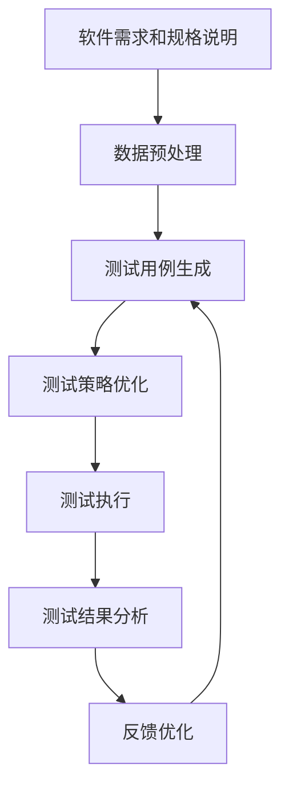
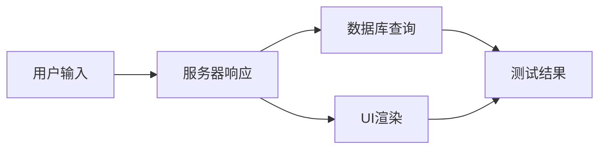

# AI代理在自动化测试中的工作流及应用

## 1.背景介绍

随着软件系统日益复杂和不断发展的需求,软件测试已成为保证软件质量的关键环节。传统的手工测试耗时耗力,无法满足现代软件开发的高效率要求。自动化测试应运而生,通过编写脚本程序执行重复的测试用例,大大提高了测试效率和覆盖率。然而,编写自动化测试脚本本身也是一个复杂的过程,需要专业的技能和大量的人力投入。

近年来,人工智能(AI)技术在软件测试领域的应用备受关注。AI代理作为一种新兴的自动化测试方法,通过机器学习和自然语言处理等技术,可以自主生成和执行测试用例,减轻人工测试的工作量。AI代理在自动化测试中的应用前景广阔,有望推动软件测试的革新。

## 2.核心概念与联系

### 2.1 AI代理

AI代理是指具有一定智能的软件实体,能够感知环境、做出决策并执行相应的动作。在自动化测试中,AI代理可以根据软件需求和规格说明,自主生成测试用例、执行测试并分析测试结果。

AI代理通常由以下几个核心模块组成:

1. **感知模块**: 用于获取测试对象的信息,如UI界面、API接口等。
2. **决策模块**: 基于感知到的信息和预设的测试策略,生成测试用例并决定执行顺序。
3. **执行模块**: 执行生成的测试用例,与被测系统进行交互。
4. **分析模块**: 对测试结果进行分析,输出测试报告和反馈。

### 2.2 机器学习在AI代理中的应用

机器学习是AI代理实现智能化的关键技术。在自动化测试中,机器学习可以应用于以下几个方面:

1. **测试用例生成**: 基于历史测试数据和软件规格说明,使用深度学习等技术自动生成高质量的测试用例。
2. **测试执行优化**: 通过强化学习等技术,优化测试用例的执行顺序和策略,提高测试效率。
3. **异常检测**: 利用无监督学习等技术,从测试结果中发现潜在的异常和缺陷。
4. **测试报告分析**: 使用自然语言处理技术,自动生成可读性强的测试报告。

### 2.3 AI代理与传统自动化测试的区别

相比传统的基于脚本的自动化测试,AI代理具有以下优势:

1. **自适应性强**: AI代理可以根据软件变化自主调整测试策略,而不需要人工修改脚本。
2. **智能化程度高**: AI代理可以通过机器学习技术自动生成和优化测试用例,减轻人工工作量。
3. **可解释性好**: AI代理的决策过程具有一定的透明度,有利于问题诊断和改进。

然而,AI代理也面临一些挑战,如训练数据质量的依赖、决策过程的不确定性等,需要在实践中不断完善。

## 3.核心算法原理具体操作步骤

AI代理在自动化测试中的核心算法原理可以概括为以下几个步骤:



### 3.1 数据预处理

AI代理需要基于软件需求和规格说明文档生成测试用例。因此,第一步是对这些文本数据进行预处理,包括去除无关信息、提取关键词和语义信息等,为后续的自然语言处理做准备。

常用的数据预处理技术包括词干提取(Stemming)、词性标注(POS Tagging)、命名实体识别(NER)等。

### 3.2 测试用例生成

测试用例生成是AI代理的核心功能之一。常见的方法包括:

1. **基于模板的生成**: 使用预定义的测试用例模板,结合软件需求和规格说明,生成具体的测试用例。
2. **基于规则的生成**: 根据一系列预设的规则和约束条件,构建测试用例。
3. **基于机器学习的生成**: 利用深度学习等技术,从历史测试数据中自动学习生成高质量的测试用例。

### 3.3 测试策略优化

生成的测试用例需要按照一定的策略进行执行,以提高测试效率和覆盖率。常见的优化策略包括:

1. **基于代码覆盖率的优化**: 优先执行能够提高代码覆盖率的测试用例。
2. **基于风险优先级的优化**: 优先执行与高风险模块相关的测试用例。
3. **基于强化学习的优化**: 使用强化学习算法,根据历史测试结果动态调整测试策略。

### 3.4 测试执行

根据优化后的测试策略,AI代理执行测试用例,与被测系统进行交互。执行过程中,AI代理需要记录测试输入、输出和相关上下文信息,为后续的结果分析做准备。

### 3.5 测试结果分析

AI代理对测试结果进行分析,包括:

1. **异常检测**: 使用无监督学习等技术,从测试结果中发现潜在的异常和缺陷。
2. **根因分析**: 结合测试用例和执行上下文,分析异常的根本原因。
3. **测试报告生成**: 使用自然语言处理技术,自动生成可读性强的测试报告。

### 3.6 反馈优化

根据测试结果分析,AI代理可以对测试策略、测试用例等进行优化,形成闭环反馈,不断提高测试质量。

## 4.数学模型和公式详细讲解举例说明

在AI代理的核心算法中,数学模型和公式扮演着重要角色。下面将详细介绍几种常见的数学模型及其在自动化测试中的应用。

### 4.1 马尔可夫决策过程(MDP)

马尔可夫决策过程(Markov Decision Process, MDP)是一种描述序列决策过程的数学框架,常用于强化学习算法中。在自动化测试中,MDP可以用于优化测试用例的执行策略。

MDP由以下几个要素组成:

- 状态集合 $\mathcal{S}$: 描述系统可能处于的所有状态。
- 动作集合 $\mathcal{A}$: 代理可以执行的所有动作。
- 转移概率 $\mathcal{P}_{ss'}^a = \mathbb{P}(s'|s,a)$: 在状态 $s$ 执行动作 $a$ 后,转移到状态 $s'$ 的概率。
- 奖励函数 $\mathcal{R}_s^a$: 在状态 $s$ 执行动作 $a$ 后获得的即时奖励。

在自动化测试中,可以将测试用例的执行过程建模为MDP:

- 状态 $s$ 表示当前已执行的测试用例集合和被测系统的状态。
- 动作 $a$ 表示执行下一个测试用例。
- 转移概率 $\mathcal{P}_{ss'}^a$ 表示执行测试用例 $a$ 后,被测系统状态的变化概率。
- 奖励函数 $\mathcal{R}_s^a$ 可以设置为代码覆盖率、发现缺陷数等指标,用于评估执行测试用例 $a$ 的效果。

目标是找到一个策略 $\pi: \mathcal{S} \rightarrow \mathcal{A}$,使得期望的累积奖励最大化:

$$
\max_\pi \mathbb{E}_\pi \left[ \sum_{t=0}^\infty \gamma^t R_{s_t}^{a_t} \right]
$$

其中 $\gamma \in (0,1)$ 是折现因子,用于平衡即时奖励和长期奖励。

通过强化学习算法(如 Q-Learning、Policy Gradient 等)可以求解出最优策略 $\pi^*$,指导 AI 代理执行测试用例的顺序。

### 4.2 贝叶斯网络

贝叶斯网络(Bayesian Network)是一种概率图模型,用于表示随机变量之间的条件独立性和因果关系。在自动化测试中,贝叶斯网络可以用于异常检测和根因分析。

贝叶斯网络由以下两个部分组成:

- 有向无环图 $\mathcal{G} = (\mathcal{V}, \mathcal{E})$,其中 $\mathcal{V}$ 是节点集合(表示随机变量), $\mathcal{E}$ 是有向边集合(表示变量之间的依赖关系)。
- 条件概率分布 $\mathcal{P}(X_i | \text{Parents}(X_i))$,描述每个节点在给定其父节点取值的条件下的条件概率分布。

在自动化测试中,可以将测试结果、被测系统状态等作为节点,构建贝叶斯网络模型。例如,对于一个Web应用程序,可以构建如下贝叶斯网络:



上图中,节点 A、B、C、D 表示系统的不同组件状态,节点 E 表示测试结果(是否异常)。给定测试输入和相关组件状态,可以计算出测试结果异常的概率:

$$
\mathcal{P}(\text{测试结果异常} | \text{用户输入}, \text{服务器响应}, \text{数据库查询}, \text{UI渲染})
$$

如果异常概率较高,则可以进一步分析异常的根源,即在给定测试结果异常的条件下,计算每个组件状态异常的条件概率:

$$
\mathcal{P}(\text{组件状态异常} | \text{测试结果异常})
$$

从而定位导致测试失败的潜在原因。

### 4.3 其他模型

除了上述两种模型外,AI 代理在自动化测试中还可以应用其他数学模型,如:

- **决策树**(Decision Tree): 用于测试用例生成和异常检测。
- **支持向量机**(Support Vector Machine, SVM): 用于测试报告的自动分类。
- **隐马尔可夫模型**(Hidden Markov Model, HMM): 用于从测试日志中提取关键信息。
- **神经网络**(Neural Network): 用于端到端的测试用例生成和优化。

这些模型各有特点,需要根据具体的应用场景选择合适的模型。

## 5.项目实践:代码实例和详细解释说明

为了更好地理解 AI 代理在自动化测试中的应用,下面将给出一个基于强化学习的测试用例执行优化的实例。

### 5.1 问题描述

给定一个Web应用程序和一系列测试用例,我们希望找到一个执行策略,使得在有限的时间内,能够最大程度地提高代码覆盖率。

### 5.2 环境建模

我们将测试用例执行过程建模为马尔可夫决策过程(MDP):

- 状态 $s$: 表示当前已执行的测试用例集合和被测应用的代码覆盖率。
- 动作 $a$: 执行下一个测试用例。
- 转移概率 $\mathcal{P}_{ss'}^a$: 执行测试用例 $a$ 后,代码覆盖率发生变化的概率。
- 奖励函数 $\mathcal{R}_s^a$: 执行测试用例 $a$ 后,代码覆盖率的增量。

### 5.3 算法实现

我们使用 Q-Learning 算法求解最优策略。Q-Learning 是一种无模型的强化学习算法,通过不断尝试和更新 Q 值函数,逐步找到最优策略。

Q 值函数 $Q(s,a)$ 表示在状态 $s$ 执行动作 $a$ 后,可获得的期望累积奖励。算法目标是找到一个 Q 值函数,使得在任意状态 $s$ 下,执行 $\arg\max_a Q(s,a)$ 即可获得最大的期望累积奖励。

算法伪代码如下:

```