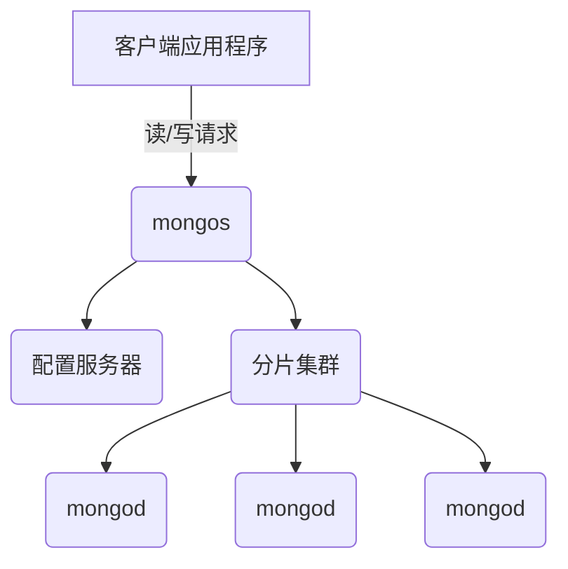

# AI系统MongoDB原理与代码实战案例讲解

## 1. 背景介绍

### 1.1 什么是MongoDB?

MongoDB是一个开源的NoSQL数据库,它使用文档存储结构来存储数据,这与传统的基于表的关系型数据库不同。MongoDB被设计为可以轻松扩展和支持大规模数据存储,同时还提供高性能的数据访问。它的名字来源于英语单词"Humongous"(巨大的),暗示它可以存储大量的数据。

### 1.2 为什么使用MongoDB?

在当今的数字时代,数据量呈指数级增长。传统的关系型数据库在处理大规模、非结构化和快速变化的数据时存在一些限制。MongoDB的出现旨在解决这些挑战,为应用程序提供更好的可扩展性、灵活性和性能。以下是使用MongoDB的一些主要原因:

1. **可扩展性**: MongoDB支持水平扩展,可以轻松添加更多服务器来处理更大的数据量和更高的负载。
2. **灵活的数据模型**: MongoDB使用灵活的文档数据模型,可以存储各种类型的数据结构,包括嵌套对象和数组。
3. **高性能**: MongoDB采用内存映射文件系统,提供高效的数据访问和查询性能。
4. **丰富的查询语言**: MongoDB支持丰富的查询语言,包括地理空间查询、文本搜索和聚合管道等高级功能。
5. **云友好**: MongoDB可以轻松部署在云环境中,支持自动分片和复制等功能,确保数据的高可用性和容错性。

### 1.3 MongoDB在AI系统中的应用

在人工智能(AI)系统中,MongoDB已经被广泛采用。以下是一些典型的应用场景:

1. **机器学习模型存储**: AI系统通常需要存储和管理大量的机器学习模型及其元数据。MongoDB的灵活数据模型和高性能查询能力使其成为存储这些数据的理想选择。
2. **日志和传感器数据存储**: AI系统通常需要处理来自各种传感器和日志的大量非结构化数据。MongoDB可以高效地存储和查询这些数据。
3. **内容管理系统**: AI系统常常需要处理大量的非结构化内容数据,如文本、图像和视频。MongoDB可以存储和管理这些数据,并支持丰富的查询和索引功能。
4. **实时数据处理**: MongoDB支持实时数据处理,可以高效地存储和查询实时数据流,这在许多AI系统中都是必需的。
5. **物联网(IoT)数据管理**:在物联网环境中,MongoDB可以存储和管理来自各种设备和传感器的大量数据,支持实时数据处理和分析。

总的来说,MongoDB的灵活性、可扩展性和高性能使其成为AI系统中存储和管理大量数据的理想选择。

## 2. 核心概念与联系

在深入探讨MongoDB的原理和实践之前,让我们先了解一些核心概念及它们之间的联系。

### 2.1 文档(Document)

在MongoDB中,数据以文档的形式存储,类似于JSON对象。每个文档都有一个唯一的`_id`字段作为主键,其他字段可以存储各种类型的数据,包括嵌套对象和数组。文档的结构是自描述的,这意味着不需要预先定义模式。

```json
{
  "_id": ObjectId("5f8e9d6b7c3b9c4d6c8e7d6b"),
  "name": "John Doe",
  "age": 32,
  "email": "john.doe@example.com",
  "address": {
    "street": "123 Main St",
    "city": "Anytown",
    "state": "CA",
    "zip": "12345"
  },
  "interests": ["reading", "hiking", "photography"]
}
```

### 2.2 集合(Collection)

集合是MongoDB中用于存储文档的逻辑容器,类似于关系型数据库中的表。集合没有固定的模式,可以存储不同结构的文档。在同一个集合中,文档可以有不同的字段和数据类型。

### 2.3 数据库(Database)

MongoDB中的数据库是存储集合的物理容器。每个MongoDB实例可以托管多个数据库,每个数据库可以包含多个集合。数据库和集合的命名必须遵循一定的规则,例如不能包含空字符或者以`system.`开头。

### 2.4 BSON

BSON(Binary JSON)是MongoDB使用的二进制编码格式,用于存储文档。它是JSON的扩展版本,支持更多的数据类型,如日期、正则表达式和二进制数据等。BSON的设计目标是提供一种轻量级、可遍历和高效的二进制数据存储格式。

### 2.5 MongoDB架构

MongoDB的架构由以下几个主要组件组成:

1. **mongod**: MongoDB服务器进程,负责数据存储和查询处理。
2. **mongos**: MongoDB路由进程,用于在分片集群环境中路由查询和写操作。
3. **配置服务器(Config Servers)**: 存储集群元数据和配置设置的内部进程。
4. **查询路由器(Query Router)**: 在分片集群中协调查询操作的进程。

这些组件协同工作,提供了MongoDB的核心功能,如数据存储、查询处理、分片和复制等。



上图展示了MongoDB分片集群架构的基本组成部分及其之间的交互关系。客户端应用程序通过`mongos`路由进程发送读写请求,`mongos`根据集群配置信息(存储在配置服务器中)将请求路由到相应的分片,每个分片由一个或多个`mongod`进程组成。

## 3. 核心算法原理具体操作步骤

MongoDB的核心算法和原理涉及多个方面,包括数据存储、索引、查询优化、分片和复制等。在这一部分,我们将重点介绍其中几个关键算法的原理和具体操作步骤。

### 3.1 数据存储算法

MongoDB采用了内存映射文件系统(Memory Mapped Files)来存储数据,这种方式可以提高数据访问的效率。具体操作步骤如下:

1. MongoDB将数据文件映射到内存中的视图(view)。
2. 当需要读取数据时,MongoDB直接从内存视图中读取,避免了传统的磁盘I/O操作。
3. 当需要写入数据时,MongoDB先将数据写入内存视图,然后定期将内存视图中的数据刷新到磁盘文件中。
4. 为了确保数据的持久性和一致性,MongoDB采用了写入前日志(Write-Ahead Logging)机制,所有的写操作都会先记录在日志文件中,然后再写入数据文件。

这种内存映射文件系统的设计,可以大大提高MongoDB的读写性能,尤其是对于读操作密集型的应用程序。

### 3.2 索引算法

索引是MongoDB提高查询性能的关键机制。MongoDB支持多种类型的索引,包括单字段索引、复合索引、多键索引、地理空间索引和文本索引等。索引的创建和使用过程如下:

1. 在集合上创建索引,MongoDB会为索引字段构建一个B树(B-Tree)数据结构。
2. 当执行查询时,MongoDB会先检查是否有合适的索引可用。
3. 如果有合适的索引,MongoDB会使用索引来快速定位符合条件的文档。
4. 如果没有合适的索引,MongoDB将执行全集合扫描,性能会相对较低。

索引的选择和创建需要根据具体的查询模式和数据分布情况进行优化。合理使用索引可以极大地提高MongoDB的查询性能。

### 3.3 聚合管道算法

MongoDB的聚合管道(Aggregation Pipeline)是一种强大的数据处理工具,可以对数据进行转换和分析。聚合管道由一系列阶段(stage)组成,每个阶段对输入数据进行特定的操作,并将结果传递给下一个阶段。聚合管道的工作原理如下:

1. 客户端发送聚合管道请求到MongoDB。
2. MongoDB解析聚合管道,构建一个执行计划。
3. 执行计划中的每个阶段依次处理数据,并将结果传递给下一个阶段。
4. 最终结果被返回给客户端。

聚合管道支持多种操作,如过滤(`$match`)、投影(`$project`)、分组(`$group`)、排序(`$sort`)、连接(`$lookup`)等。通过组合不同的阶段,可以实现复杂的数据转换和分析任务。

下面是一个示例聚合管道,用于计算每个城市的总人口:

```javascript
db.people.aggregate([
  { $group: { _id: "$city", totalPopulation: { $sum: "$population" } } },
  { $sort: { totalPopulation: -1 } }
])
```

这个聚合管道首先按城市分组,计算每个城市的总人口,然后按总人口降序排序。

### 3.4 分片算法

随着数据量的不断增长,单个MongoDB实例可能无法满足存储和处理需求。为了解决这个问题,MongoDB提供了分片(Sharding)功能,将数据水平分布在多个分片上。分片算法的工作原理如下:

1. 根据分片键(Shard Key)将数据分布到不同的分片上。
2. `mongos`路由进程接收客户端的查询请求,并根据分片键计算出数据所在的分片。
3. `mongos`将查询请求路由到相应的分片,由分片上的`mongod`进程执行查询。
4. 如果查询涉及多个分片,`mongos`会对结果进行合并并返回给客户端。

选择合适的分片键对于实现良好的数据分布和查询性能至关重要。通常,分片键应该是高基数(高唯一性)的字段或字段组合,以确保数据均匀分布在各个分片上。

下面是一个示例,展示如何在`people`集合上基于`city`字段进行分片:

```javascript
sh.enableSharding("mydb")
sh.shardCollection("mydb.people", { "city": 1 })
```

这将在`mydb`数据库上启用分片,并将`people`集合按`city`字段进行分片。

### 3.5 复制集算法

为了确保数据的高可用性和容错性,MongoDB提供了复制集(Replica Set)功能。复制集是一组MongoDB实例的集合,其中一个实例被选举为主节点(Primary),其他实例为从节点(Secondary)。复制集算法的工作原理如下:

1. 主节点接收所有写操作。
2. 主节点将写操作记录在自己的操作日志(Oplog)中。
3. 从节点从主节点复制操作日志,并应用这些操作,保持数据的一致性。
4. 如果主节点发生故障,从节点中会自动选举出一个新的主节点。

复制集算法确保了数据的冗余备份,提高了系统的可用性和容错性。同时,它也支持读取从节点,进一步提高了读取性能。

下面是一个示例,展示如何创建一个三节点的复制集:

```javascript
rs.initiate({
  _id: "myReplicaSet",
  members: [
    { _id: 0, host: "mongodb1.example.com:27017" },
    { _id: 1, host: "mongodb2.example.com:27017" },
    { _id: 2, host: "mongodb3.example.com:27017", arbiterOnly: true }
  ]
})
```

这个示例创建了一个名为`myReplicaSet`的复制集,包含三个节点。第三个节点是一个仲裁节点(Arbiter),用于在选举过程中进行投票,但不存储数据。

## 4. 数学模型和公式详细讲解举例说明

在MongoDB的核心算法和原理中,有一些涉及到数学模型和公式。在这一部分,我们将详细讲解其中几个重要的数学模型和公式,并提供具体的例子说明。

### 4.1 B树索引

MongoDB使用B树(B-Tree)数据结构来实现索引。B树是一种自平衡的树形数据结构,可以高效地插入、删除和查找数据。它的核心思想是将数据分布在多个节点上,每个节点可以存储多个键值对,从而减少树的高度,提高查找效率。

B树的数学模型可以用以下公式表示:

$$
n = \lceil\frac{m}{2}\rceil - 1
$$

其中:

- $n$