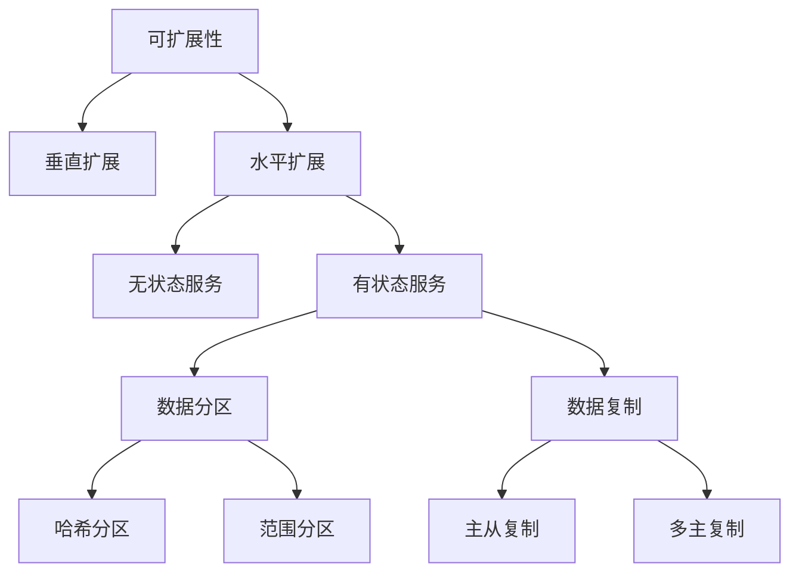
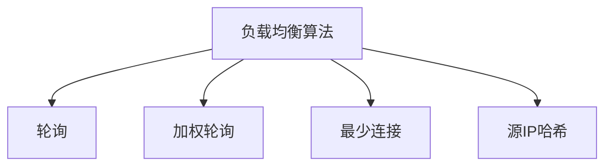
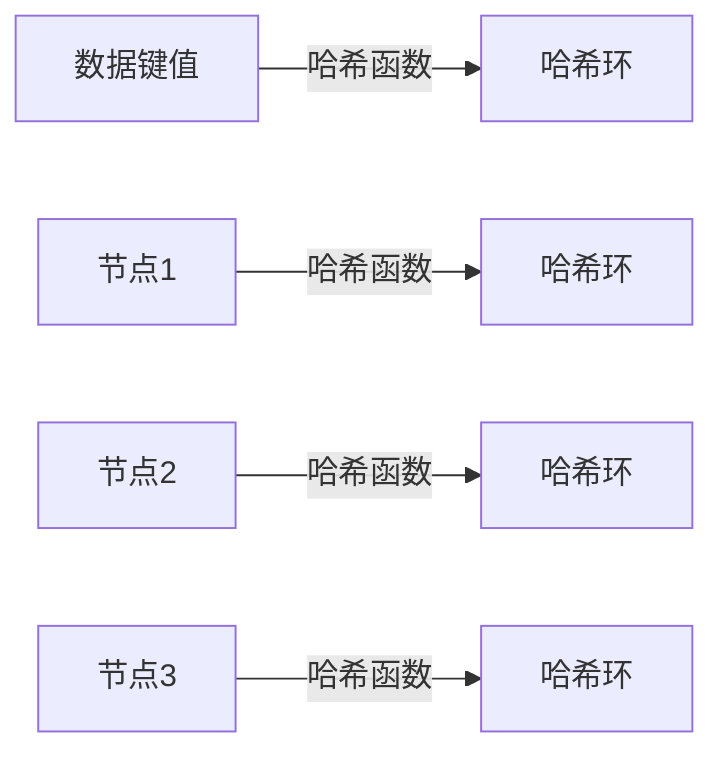
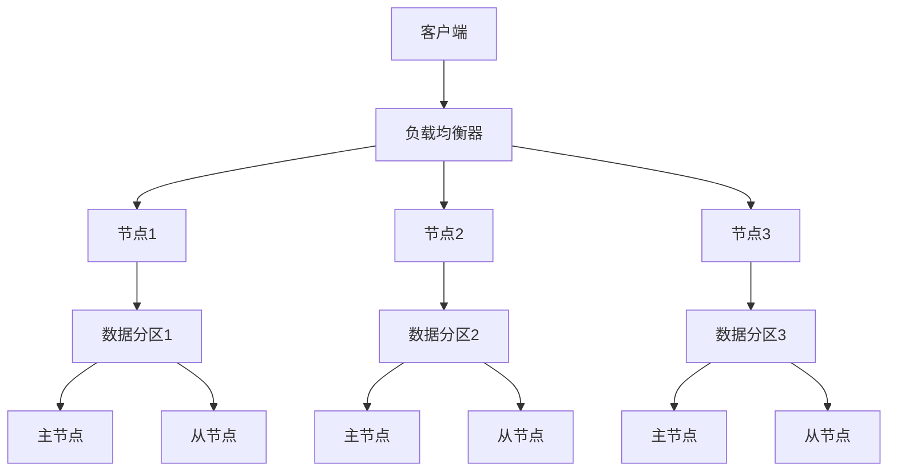

# AI系统可扩展性原理与代码实战案例讲解

## 1.背景介绍

在当今数字时代,人工智能(AI)系统无处不在,从语音助手到自动驾驶汽车,再到医疗诊断和金融风险管理等各个领域。随着数据量和用户数量的不断增长,AI系统的可扩展性变得至关重要。可扩展性是指系统能够优雅地处理更多的工作负载、数据和用户,而不会导致性能下降或资源耗尽。本文将探讨AI系统可扩展性的核心原理,并通过实际案例展示如何在代码层面实现可扩展性。

## 2.核心概念与联系

### 2.1 垂直扩展与水平扩展

实现AI系统可扩展性的两种主要方式是垂直扩展和水平扩展。

**垂直扩展**是通过升级单个节点的硬件资源(CPU、内存、存储等)来提高系统性能。这种方式简单直接,但存在硬件上限和单点故障风险。

**水平扩展**则是通过添加更多的节点(服务器或虚拟机)来分担工作负载。这种方式更加灵活和可扩展,但需要解决负载均衡、数据一致性等问题。

### 2.2 无状态与有状态服务

根据服务是否需要保存内部状态,可以将其划分为无状态服务和有状态服务。

**无状态服务**不需要保存任何客户端相关的上下文状态,每个请求都是独立的。无状态服务易于扩展,因为可以在多个实例之间自由分配请求。

**有状态服务**需要保存与客户端交互的状态信息,例如会话数据或事务上下文。扩展有状态服务更加复杂,需要解决状态共享和一致性问题。

### 2.3 数据分区与复制

为了实现水平扩展,通常需要将数据分区存储在多个节点上。常见的数据分区策略包括:

- **哈希分区**:根据键的哈希值将数据分布到不同的节点。
- **范围分区**:根据键值的范围将数据划分到不同的节点。

另一个重要概念是数据复制,即在多个节点上保存数据的副本,以提高数据的可用性和容错性。常见的复制策略有主从复制、多主复制等。



## 3.核心算法原理具体操作步骤

### 3.1 负载均衡算法

在水平扩展的架构中,负载均衡器负责将请求合理地分发到多个节点上。常见的负载均衡算法包括:

1. **轮询(Round Robin)**: 按顺序将请求分发到不同的节点,实现最简单的负载均衡。
2. **加权轮询(Weighted Round Robin)**: 根据节点的性能给予不同的权重,性能好的节点获得更多的请求。
3. **最少连接(Least Connections)**: 将请求分发到当前连接数最少的节点,避免某些节点过载。
4. **源IP哈希(Source IP Hash)**: 根据客户端IP的哈希值将请求分发到固定的节点,保持会话粘性。



### 3.2 一致性哈希算法

在分布式系统中,一致性哈希算法常用于数据分区和负载均衡。其核心思想是将节点和数据键值映射到同一个哈希环上,并根据顺时针方向寻找距离最近的节点存储数据。当节点加入或离开时,只有部分数据需要重新分配,从而提高了系统的可扩展性和容错性。

具体操作步骤如下:

1. 选择一个哈希函数(如MD5、SHA-1等)和一个较大的哈希环空间(如2^32)。
2. 将节点的IP地址或主机名通过哈希函数映射到哈希环上。
3. 将数据键值也通过相同的哈希函数映射到哈希环上。
4. 顺时针寻找距离数据键值最近的节点,将数据存储在该节点上。
5. 当节点加入或离开时,只需要重新分配该节点附近的数据即可。



## 4.数学模型和公式详细讲解举例说明

### 4.1 小世界网络模型

小世界网络模型是描述复杂网络结构的一种重要数学模型,它能够解释许多实际网络(如社交网络、互联网等)中存在的"小世界"现象。在AI系统的设计中,小世界网络模型可以用于优化数据分区和复制策略,提高系统的可扩展性和容错性。

小世界网络模型由两个参数控制:

- 聚集系数 $C$: 表示网络中节点之间形成紧密连接的程度。
- 平均最短路径长度 $L$: 表示任意两个节点之间的平均最短路径长度。

在随机网络中,聚集系数 $C$ 较小,但平均最短路径长度 $L$ 也较小。而在规则网络中,聚集系数 $C$ 较大,但平均最短路径长度 $L$ 也较大。小世界网络模型则兼具了较大的聚集系数 $C$ 和较小的平均最短路径长度 $L$,这种特性使得信息在网络中可以快速传播。

在实际应用中,我们可以通过调整数据分区和复制策略,使得AI系统的网络结构接近于小世界网络模型,从而提高系统的可扩展性和效率。

### 4.2 一致性哈希的数学模型

一致性哈希算法可以用数学模型来描述。假设哈希环的空间为 $[0, 2^{m}-1]$,其中 $m$ 是哈希函数的输出位数。将节点和数据键值通过哈希函数映射到哈希环上,记为 $h(x)$。

对于任意一个数据键值 $k$,我们需要找到距离 $h(k)$ 最近的节点 $n$,满足:

$$\min_{n \in N} \{ d(h(k), h(n)) \}$$

其中 $N$ 是所有节点的集合,$ d(x, y)$ 表示 $x$ 和 $y$ 在哈希环上的距离。

当节点加入或离开时,只需要重新分配位于该节点附近的数据即可。具体来说,如果节点 $n$ 加入,那么所有满足以下条件的数据键值 $k$ 都需要重新分配:

$$d(h(k), h(n)) < \min_{n' \in N, n' \neq n} \{ d(h(k), h(n')) \}$$

通过这种方式,一致性哈希算法可以有效地实现数据的分区和负载均衡,提高系统的可扩展性和容错性。

## 5.项目实践:代码实例和详细解释说明

为了更好地理解AI系统可扩展性的实现,我们将通过一个简单的分布式键值存储系统的示例代码来进行说明。该系统采用了一致性哈希算法进行数据分区,并使用主从复制策略提高数据的可用性。

### 5.1 系统架构



该系统由以下几个主要组件构成:

- **客户端**: 发起键值存储和查询的请求。
- **负载均衡器**: 将客户端请求分发到不同的节点上。
- **节点**: 负责存储和管理数据分区,每个节点包含一个主节点和一个从节点。
- **数据分区**: 使用一致性哈希算法将数据划分到不同的节点上。
- **主节点**: 负责处理读写请求,并将数据复制到从节点。
- **从节点**: 作为主节点的备份,提高数据的可用性。

### 5.2 代码实现

#### 5.2.1 一致性哈希算法

```python
import hashlib

class ConsistentHash:
    def __init__(self, nodes, replicas=3):
        self.nodes = nodes
        self.replicas = replicas
        self.ring = {}
        self.setup_ring()

    def setup_ring(self):
        for node in self.nodes:
            for i in range(self.replicas):
                key = f"{node}:{i}"
                hash_value = self.hash(key)
                self.ring[hash_value] = node

    def hash(self, key):
        m = hashlib.sha1()
        m.update(key.encode('utf-8'))
        return int(m.hexdigest(), 16)

    def get_node(self, key):
        hash_value = self.hash(key)
        sorted_ring = sorted(self.ring.keys())
        for value in sorted_ring:
            if value > hash_value:
                return self.ring[value]
        return self.ring[sorted_ring[0]]
```

在上述代码中,我们首先初始化一致性哈希环,并为每个节点创建多个虚拟节点(replicas)以提高数据的冗余性。`setup_ring`方法将节点和虚拟节点映射到哈希环上。`hash`方法使用SHA-1哈希函数计算键值的哈希值。`get_node`方法则根据键值的哈希值,在哈希环上顺时针寻找距离最近的节点。

#### 5.2.2 节点和数据分区

```python
class Node:
    def __init__(self, id, replicas=3):
        self.id = id
        self.replicas = replicas
        self.data = {}
        self.replica_nodes = []

    def put(self, key, value):
        self.data[key] = value
        for replica_node in self.replica_nodes:
            replica_node.replicate(key, value)

    def get(self, key):
        return self.data.get(key)

    def replicate(self, key, value):
        self.data[key] = value

class Partition:
    def __init__(self, nodes, replicas=3):
        self.nodes = nodes
        self.replicas = replicas
        self.consistent_hash = ConsistentHash(nodes, replicas)
        self.setup_replicas()

    def setup_replicas(self):
        for node in self.nodes:
            node_replicas = []
            for i in range(self.replicas - 1):
                replica_node = self.get_replica_node(node)
                node_replicas.append(replica_node)
                node.replica_nodes = node_replicas

    def get_replica_node(self, node):
        replica_node = None
        while not replica_node or replica_node == node:
            key = f"replica:{node.id}"
            replica_node = self.consistent_hash.get_node(key)
        return replica_node

    def put(self, key, value):
        node = self.consistent_hash.get_node(key)
        node.put(key, value)

    def get(self, key):
        node = self.consistent_hash.get_node(key)
        return node.get(key)
```

在上述代码中,我们定义了`Node`和`Partition`两个类。`Node`类表示一个节点,包含了数据存储和复制功能。`Partition`类管理整个数据分区,使用一致性哈希算法将数据分配到不同的节点上,并为每个节点设置备份节点以实现数据复制。

`setup_replicas`方法为每个节点选择其他节点作为备份节点。`get_replica_node`方法使用一致性哈希算法选择一个不同于当前节点的备份节点。`put`和`get`方法则根据键值的哈希值,将请求路由到对应的节点上。

#### 5.2.3 客户端和负载均衡器

```python
import random

class LoadBalancer:
    def __init__(self,