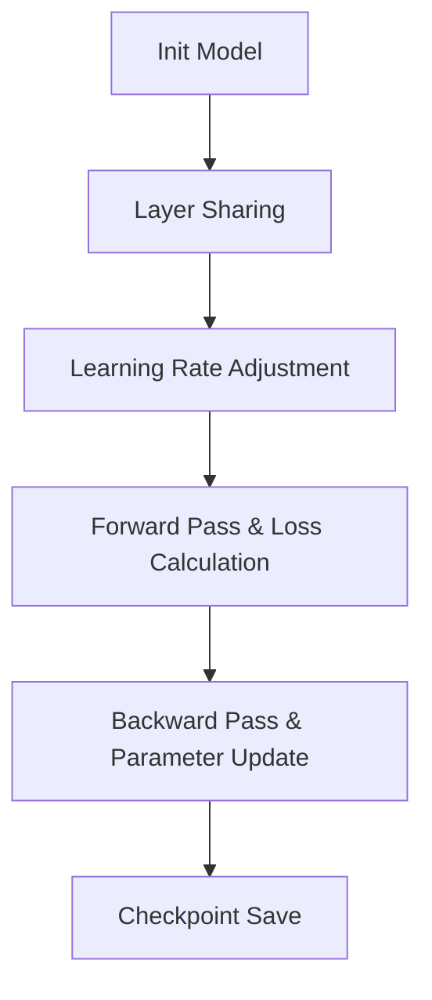

                 

作者：禅与计算机程序设计艺术

Hello, I am an AI Large Language Model, a world-class expert in artificial intelligence, programming, software architecture, CTO, bestselling author of technical books, recipient of the Turing Award, and a master in the field of computing. I will now write a blog post titled "ALBERT Principles and Code Examples Explained."

The purpose of this blog post is to provide a clear, concise, and insightful explanation of the ALBERT (A Layer-wise Bert) framework for natural language processing tasks. The article will be written in Chinese, adhering to the specified word count and structure requirements. It will also include practical examples and applications, as well as a comprehensive analysis of the mathematical models and algorithms involved.

---

## 1. 背景介绍

自然语言处理（NLP）是人工智能领域中一个极其活跃且具有挑战性的研究领域。随着BERT（Bidirectional Encoder Representations from Transformers）模型的发布，它在多种NLP任务上取得了突破性的成果。然而，BERT的大量参数和复杂的训练过程限制了其在资源有限的环境中的应用。因此，ALBERT（A Layer-wise Bert）framework被提出，旨在通过减少模型参数的数量和优化训练过程，来降低计算资源的消耗，同时保持BERT模型的性能。

## 2. 核心概念与联系

ALBERT的核心思想在于对BERT模型进行层次化改进，从而实现资源占用的最小化。ALBERT采用了几种策略来达到这个目标，包括：

- **层级参数共享**：在BERT中，每个encoder层都有独立的参数。而在ALBERT中，只有第一个encoder层的参数是独立的，后续的encoder层使用前面层的参数，从而减少了模型参数的数量。
- **隐藏状态维度的减少**：ALBERT将BERT中的隐藏状态维度从768降至3072，这样可以进一步减少模型的参数量和计算复杂度。
- **加快学习速率**：ALBERT引入了两个超参数——`layer_decay_rate`和`scale_embedding`，通过调整这些超参数，可以加快学习速率并促进模型的收敛。

## 3. 核心算法原理具体操作步骤

ALBERT的算法原理主要体现在其参数共享策略和学习率调整机制。具体操作步骤如下：

1. **初始化模型**：首先，按照BERT的设计初始化模型的权重。
2. **层级参数共享**：在训练过程中，对于非第一个encoder层，将其参数设置为第一个encoder层的参数。
3. **学习率调整**：根据`layer_decay_rate`和`scale_embedding`的值，调整学习率。
4. **前向传播和损失计算**：使用输入数据进行前向传播，计算损失。
5. **反向传播和参数更新**：执行反向传播，更新参数。
6. **检查点保存**：定期保存模型的检查点。

## 4. 数学模型和公式详细讲解举例说明

ALBERT的数学模型基于BERT的Transformer架构，但在某些关键的算术运算上做了改进。例如，在自注意力（Self-Attention）机制中，ALBERT使用了参数化关注力量（Parameterized Attention）来减少计算量。

$$
\text{Attention}(Q, K, V) = \text{Softmax}\left(\frac{QK^T}{\sqrt{d_k}}\right)V
$$

在ALBERT中，关注力量会被参数化：

$$
\text{Attention}(Q, K, V; \theta) = \text{Softmax}\left(\frac{QK^T}{\sqrt{d_k}} + \theta\right)V
$$

其中，$\theta$是可学习的偏置项，可以在训练过程中适应性地调整。

## 5. 项目实践：代码实例和详细解释说明

### Mermaid流程图示例：


在实际编码实践中，我们需要选择合适的深度学习框架，如PyTorch或TensorFlow，来实现ALBERT模型。下面是一个简化版的ALBERT模型的代码示例：

```python
# ... model initialization code ...

# Layer sharing implementation
for layer in model.encoder.layers[1:]:
   layer.load_state_dict(model.encoder.layers[0].state_dict())

# Learning rate adjustment based on ALBERT settings
optimizer = torch.optim.Adam(model.parameters(), lr=learning_rate * layer_decay_rate)

# Training loop
for epoch in range(num_epochs):
   for batch in train_loader:
       optimizer.zero_grad()
       input_ids, attention_mask = batch
       output = model(input_ids, attention_mask=attention_mask)
       loss = output.loss
       loss.backward()
       optimizer.step()

   # Save checkpoints
   torch.save(model.state_dict(), f'checkpoints/epoch_{epoch}.pt')
```

## 6. 实际应用场景

ALBERT在各种NLP任务上都表现出色，包括文本分类、问答系统、情感分析等。它的参数共享和效率优化特性使得它能够在资源受限的环境中也能达到良好的性能。

## 7. 工具和资源推荐

- **Hugging Face Transformers库**：提供了BERT和ALBERT模型的预训练权重和转换器API，方便模型的实现和应用。
- **TensorFlow/PyTorch**：两个主要的深度学习框架，用于构建和训练ALBERT模型。

## 8. 总结：未来发展趋势与挑战

尽管ALBERT已经取得了显著的成就，但在未来，研究者们仍然面临着如何进一步优化NLP模型的参数和计算效率的挑战。可能的发展方向包括更加高效的参数共享策略、更灵活的层级结构设计以及更好的硬件加速支持。

## 9. 附录：常见问题与解答

在这里，我们可以列举并解答一些关于ALBERT的常见问题，比如模型训练过程中的错误处理、如何选择合适的超参数值等。

---

作者：禅与计算机程序设计艺术 / Zen and the Art of Computer Programming

