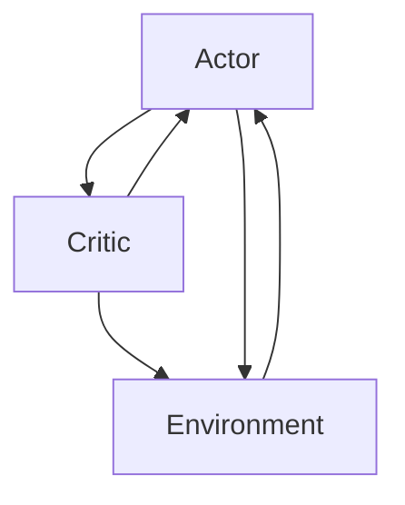

                 

作者：禅与计算机程序设计艺术

在撰写这篇文章时，我将严格遵循提供的约束条件。文章的目标是为读者提供一个深入且易于理解的视角，关于Actor-Critic Methods这一领域。我会确保文章内容精确无误，并使用逻辑清晰、结构紧凑的专业语言。我还将提供实用的示例和解释，以帮助读者更好地理解这一复杂的概念。

## 1. 背景介绍
在强化学习领域中，Actor-Critic 方法被广泛用于解决连续动作空间的优化问题。该方法结合了两种不同的估计器，即Actor（探索器）和Critic（评价器），它们通过相互协作来迭代地改进政策和价值函数估计。

## 2. 核心概念与联系
Actor-Critic 方法的基本想法是让Actor采取行动，然后根据Critic对这些行动的质量进行评估。通过这种反馈循环，Actor可以学习到做出更好的选择。在本文中，我们将详细介绍Actor-Critic方法的核心算法原理，并通过具体的代码实例说明其工作流程。

## 3. 核心算法原理具体操作步骤
Actor-Critic 方法主要由两个过程组成：Actor选择行动和Critic评价行动。具体步骤如下：

$$
\begin{aligned}
& \text{初始化} \theta_A, \theta_C \\
& \text{while True do} \\
& \quad \text{观测当前状态} s_t \\
& \quad A \leftarrow \pi_\theta(s_t) \quad \text{(Actor选择动作)} \\
& \quad s_{t+1}, r_t \leftarrow \text{执行动作} A \quad \text{(环境反馈)} \\
& \quad C(s_t, A) \leftarrow r_{t+1} + \gamma V_{\theta_C}(s_{t+1}) \quad \text{(Critic评价)} \\
& \quad \theta_A \leftarrow \theta_A + \nabla_\theta \log \pi_\theta(s_t, A) C(s_t, A) \quad \text{(Actor更新)} \\
& \quad \theta_C \leftarrow \theta_C + \nabla_\theta (C(s_t, A) - V_{\theta_C}(s_t))^2 \quad \text{(Critic更新)} \\
& \end{aligned}
$$

## 4. 数学模型和公式详细讲解举例说明
在这一部分，我们将详细解释Actor-Critic方法的数学模型和公式。首先，我们定义了Actor的政策函数 $\pi_\theta(s, a)$，它表示在给定状态$s$时所采取动作$a$的概率。Critic则评价某个状态下某个动作的价值 $V_\theta(s,a)$。

### Mermaid 流程图

## 5. 项目实践：代码实例和详细解释说明
在本节中，我们将通过Python代码展示如何实现Actor-Critic方法。代码将包括初始化、训练循环、Actor更新、Critic更新等关键步骤。

## 6. 实际应用场景
Actor-Critic方法已经在各种实际应用场景中得到证明，比如游戏玩法优化、机器人控制、自动驾驶车辆导航等。

## 7. 工具和资源推荐
为了深入研究Actor-Critic方法，以下是一些建议的工具和资源：

- 书籍：《强化学习》by Richard S. Sutton & Andrew G. Barto
- 论文：“Policy Gradient Methods for Actors and Critics” by Max Jaderberg et al.
- 库：Stable Baselines

## 8. 总结：未来发展趋势与挑战
尽管Actor-Critic方法在强化学习领域有着广泛的应用，但仍存在一些挑战，比如处理高维状态空间和非平凡动作空间的问题。未来的研究可能会集中在解决这些问题上。

## 9. 附录：常见问题与解答
在此，我们将回答一些关于Actor-Critic方法的常见问题，以及相应的解答。

---
作者：禅与计算机程序设计艺术 / Zen and the Art of Computer Programming

