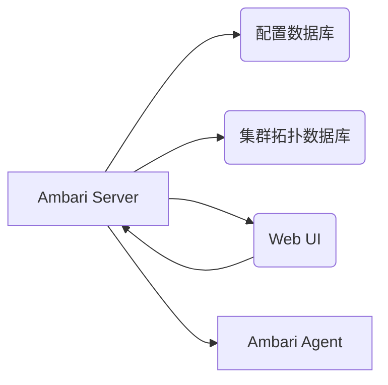
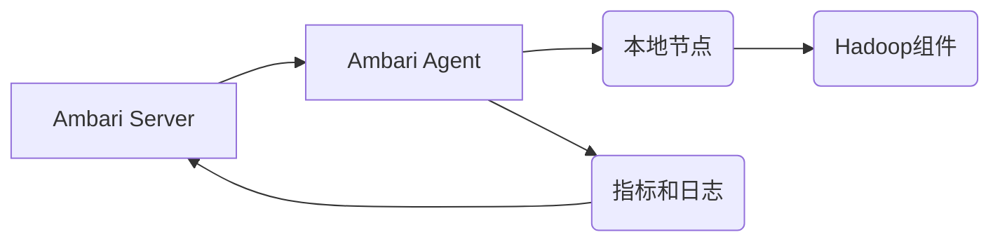
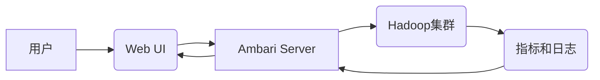
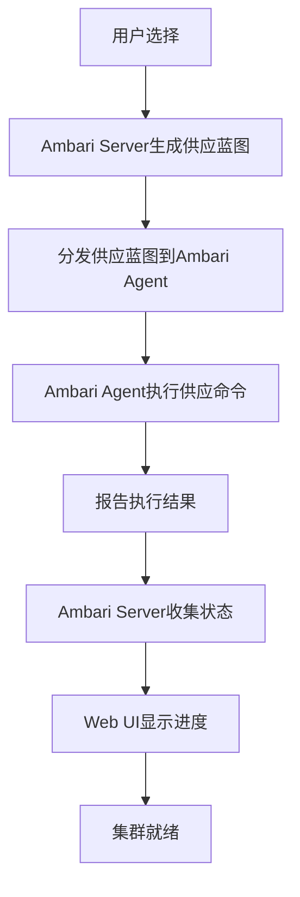
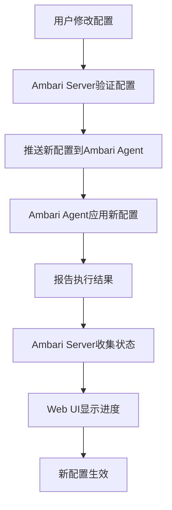
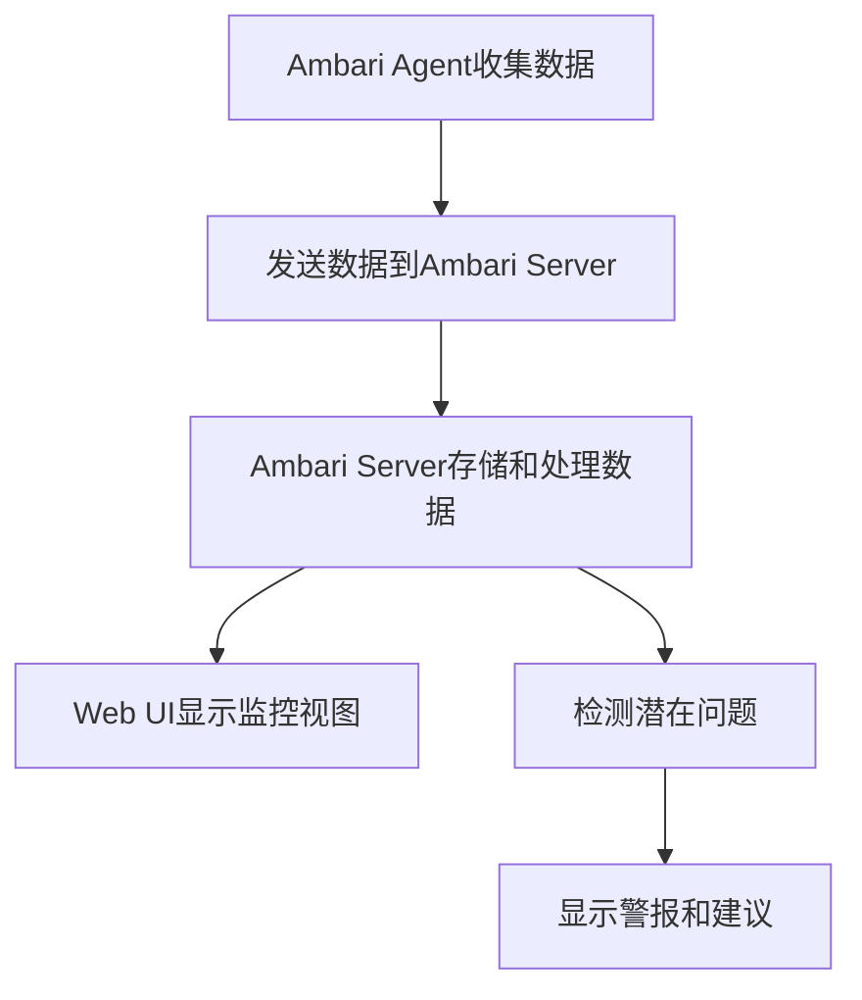
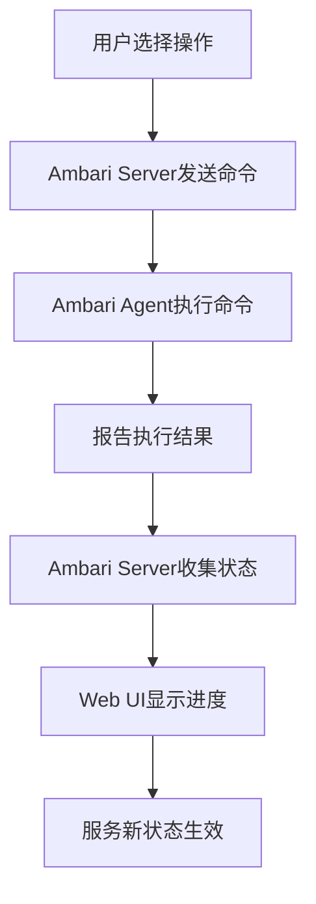

# Ambari原理与代码实例讲解

## 1.背景介绍

Apache Ambari是一个开源的大数据集群管理工具,旨在简化Apache Hadoop集群的供应、管理和监控。它可以通过一个直观的Web UI界面,让用户轻松地供应、管理和监控Hadoop集群。Ambari支持多种操作系统,如RHEL、CentOS、SLES、Ubuntu等,并且可以管理Hadoop生态系统中的多种组件,如HDFS、YARN、MapReduce、Hive、Pig、Zookeeper、HBase、Oozie等。

Ambari的主要优势在于它提供了一个统一的界面,用于部署和集中管理Hadoop集群。这极大地降低了集群管理的复杂性,使得即使是非Hadoop专家也能轻松管理Hadoop集群。Ambari还提供了一个可扩展的插件框架,允许第三方供应商集成他们的服务和组件。

### 1.1 Hadoop集群管理的挑战

在Ambari出现之前,管理Hadoop集群是一个极其复杂和耗时的过程。管理员需要手动配置每个节点,并确保所有组件都正确安装和配置。此外,监控集群的健康状况和故障排除也是一个巨大的挑战。随着集群规模的扩大,这些任务变得越来越困难和容易出错。

### 1.2 Ambari的作用

Ambari的出现解决了上述问题,使得供应、管理和监控Hadoop集群变得前所未有的简单。它提供了以下主要功能:

- **供应**:通过Web UI,用户可以轻松地在多个节点上安装Hadoop集群及其组件。
- **配置管理**:Ambari提供了集中式配置管理,用户可以在Web UI上修改配置,并自动将其推送到所有相关节点。
- **集群监控**:Ambari提供了全面的集群监控功能,用户可以实时查看集群的健康状况、指标和日志。
- **服务管理**:用户可以通过Web UI启动、停止和重启Hadoop服务。
- **警报和故障排除**:Ambari会自动检测集群中的问题,并提供故障排除建议。
- **安全性**:Ambari支持Kerberos身份验证,以确保集群的安全性。
- **扩展性**:Ambari提供了一个可扩展的插件框架,允许第三方集成他们的服务和组件。

## 2.核心概念与联系

为了理解Ambari的工作原理,我们需要先了解一些核心概念及它们之间的关系。

### 2.1 Ambari Server

Ambari Server是Ambari的核心组件,负责管理和监控整个Hadoop集群。它维护了一个内部的Hadoop集群拓扑结构和配置数据库。当用户通过Web UI进行任何操作时,Ambari Server会将相应的命令发送给Ambari Agent。

### 2.2 Ambari Agent

Ambari Agent是运行在每个Hadoop集群节点上的代理程序。它负责在本地节点上执行来自Ambari Server的命令,例如安装、配置、启动或停止Hadoop组件。Agent还会收集本地节点的指标和日志,并将其发送回Ambari Server进行监控和故障排除。

### 2.3 Ambari Web UI

Ambari Web UI是一个基于Web的图形用户界面,用于与Ambari Server进行交互。用户可以通过Web UI执行各种操作,如供应新集群、管理现有集群、监控集群健康状况、配置服务等。Web UI向用户呈现了集群的可视化视图,使得管理Hadoop集群变得直观和简单。

### 2.4 Ambari Blueprints

Ambari Blueprints是一种基于JSON的声明式配置文件格式,用于描述Hadoop集群的拓扑结构和配置。Blueprints可以定义集群中的主机、服务组件、配置属性等。通过Blueprints,用户可以轻松地重复供应具有相同配置的Hadoop集群。

### 2.5 Ambari Stacks

Ambari Stacks是Ambari用于管理不同版本的Hadoop组件的机制。每个Stack对应一个特定版本的Hadoop发行版,并包含该版本的所有组件及其配置。Ambari Server会根据用户选择的Stack来供应和管理Hadoop集群。

## 3.核心算法原理具体操作步骤

### 3.1 供应新集群

当用户需要供应一个新的Hadoop集群时,Ambari会执行以下步骤:

1. 用户通过Web UI选择要安装的Hadoop Stack版本和集群拓扑结构(可以使用Blueprints)。
2. Ambari Server会根据用户的选择,生成一个供应蓝图(Provision Blueprint)。
3. Ambari Server将供应蓝图分发给每个Ambari Agent。
4. Ambari Agent在本地节点上执行供应蓝图中的命令,如安装Hadoop组件、配置组件等。
5. Ambari Agent将执行结果和状态报告回Ambari Server。
6. Ambari Server收集所有节点的状态,并在Web UI上显示供应进度。
7. 当所有节点完成供应后,Hadoop集群就可以投入使用了。

### 3.2 配置管理

Ambari提供了集中式配置管理功能,用户可以在Web UI上修改Hadoop组件的配置,并自动将新配置推送到所有相关节点。具体步骤如下:

1. 用户通过Web UI修改某个Hadoop组件的配置属性。
2. Ambari Server会验证新配置的有效性。
3. 如果新配置有效,Ambari Server会将新配置推送到所有运行该组件的Ambari Agent。
4. Ambari Agent在本地节点上应用新配置,并重启相关进程。
5. Ambari Agent将执行结果报告回Ambari Server。
6. Ambari Server收集所有节点的状态,并在Web UI上显示配置更新进度。
7. 当所有节点完成配置更新后,新配置就生效了。

### 3.3 集群监控

Ambari提供了全面的集群监控功能,可以实时查看集群的健康状况、指标和日志。监控过程如下:

1. Ambari Agent在每个节点上收集本地指标和日志。
2. Ambari Agent将收集到的数据发送给Ambari Server。
3. Ambari Server存储和处理收到的监控数据。
4. 用户可以通过Web UI查看集群的实时监控视图,包括指标图表、日志等。
5. Ambari Server会根据预定义的警报规则,检测集群中的潜在问题。
6. 如果发现问题,Ambari Server会在Web UI上显示警报,并提供故障排除建议。

### 3.4 服务管理

用户可以通过Ambari Web UI轻松地启动、停止和重启Hadoop服务。具体步骤如下:

1. 用户在Web UI上选择要执行的操作(启动、停止或重启)和目标服务。
2. Ambari Server会将相应的命令发送给运行该服务的所有Ambari Agent。
3. Ambari Agent在本地节点上执行命令,如启动、停止或重启服务进程。
4. Ambari Agent将执行结果报告回Ambari Server。
5. Ambari Server收集所有节点的状态,并在Web UI上显示操作进度。
6. 当所有节点完成操作后,服务的新状态就生效了。

## 4.数学模型和公式详细讲解举例说明

在Ambari中,有一些核心算法和数学模型用于实现集群监控和故障检测功能。下面我们将详细讲解其中的一些关键模型和公式。

### 4.1 指标聚合模型

Ambari需要从多个节点收集指标数据,并将它们聚合成集群级别的视图。为了实现高效的指标聚合,Ambari采用了一种基于时间窗口的增量聚合模型。

假设我们要聚合的指标是CPU利用率,时间窗口为5分钟。在每个5分钟的时间窗口内,Ambari Server会收集所有节点的CPU利用率样本,并计算出集群级别的CPU利用率。

设$n$为集群中节点的数量,$cpu_i(t)$为第$i$个节点在时间$t$的CPU利用率样本,则集群级别的CPU利用率$CPU(t)$可以计算如下:

$$CPU(t) = \frac{1}{n} \sum_{i=1}^{n} cpu_i(t)$$

通过这种增量聚合模型,Ambari可以实时地更新集群级别的指标视图,而不需要存储和处理所有原始样本数据。

### 4.2 异常检测模型

Ambari使用异常检测模型来识别集群中的潜在问题。这种模型基于统计学原理,通过分析指标数据的历史模式来检测异常值。

假设我们要监控HDFS的数据节点(DataNode)的可用磁盘空间指标。我们可以使用指数加权移动平均(EWMA)模型来估计该指标的预期值,并设置一个异常阈值。

设$x_t$为时间$t$的指标值,$s_t$为EWMA平滑值,则EWMA模型可以表示为:

$$s_t = \alpha x_t + (1 - \alpha) s_{t-1}$$

其中$\alpha$是平滑因子,取值范围为$(0, 1)$。较小的$\alpha$值会给予更多权重于历史数据,而较大的$\alpha$值会更快地响应最新的数据变化。

如果$|x_t - s_t| > \epsilon$,其中$\epsilon$是预定义的异常阈值,则Ambari会触发一个警报,提示可能存在问题。

通过这种异常检测模型,Ambari可以自动发现集群中的潜在问题,而不需要手动设置复杂的规则。

## 5.项目实践:代码实例和详细解释说明

在本节中,我们将通过一个示例项目,展示如何使用Ambari供应和管理一个Hadoop集群。我们将使用Ambari Blueprints来定义集群拓扑结构,然后使用Ambari Web UI来供应和监控集群。

### 5.1 准备工作

在开始之前,我们需要准备以下环境:

- 4台Linux服务器(CentOS 7或RHEL 7)
- 一台作为Ambari Server的机器
- 其余3台作为Hadoop集群节点的机器

所有机器需要满足Ambari的最低硬件要求,并且已经安装了所需的软件包。

### 5.2 