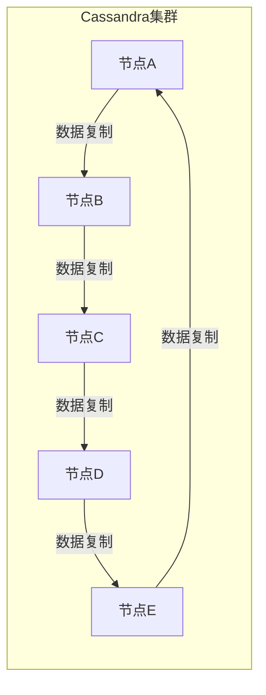
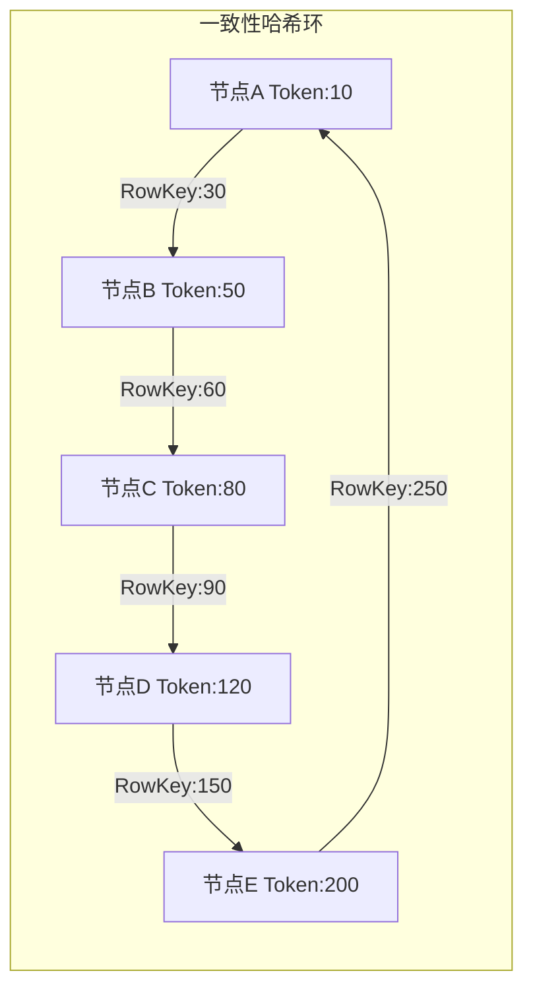
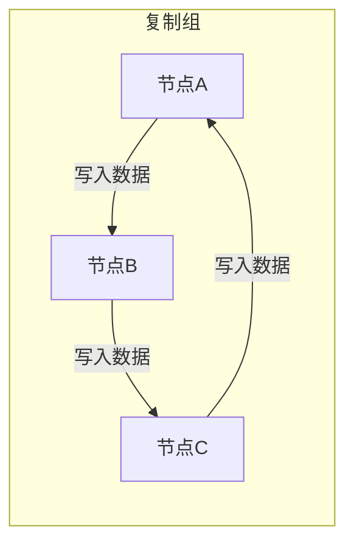

# Cassandra原理与代码实例讲解

## 1.背景介绍

在当今数据爆炸式增长的时代,传统的关系型数据库已经无法满足大规模数据存储和高并发访问的需求。这种需求催生了NoSQL(Not Only SQL)数据库的诞生,Cassandra就是其中一种广为人知的分布式NoSQL数据库。

Cassandra最初由Facebook设计,用于支持其内部海量数据的存储和查询。后来,它被Apache软件基金会纳入开源项目,并逐渐发展成为一个成熟的分布式数据库系统。Cassandra具有高可扩展性、高可用性和容错性,可以轻松处理大规模数据集,并提供快速写入和读取性能。

Cassandra广泛应用于各种场景,如物联网、电子商务、社交网络等领域,成为大数据时代的重要数据存储和处理引擎。

## 2.核心概念与联系

### 2.1 数据模型

Cassandra采用了与关系型数据库不同的数据模型,被称为"列存储"模型。在这种模型中,数据被组织成行,每行由多个列组成。与关系型数据库的行列结构不同,Cassandra的列是由键值对组成的,可以灵活地添加新列而无需预先定义模式。

```
RowKey: user1
| Column1 | Column2 | Column3 |
|---------|---------|---------|
|  value1 | value2  | value3  |
```

### 2.2 分布式架构

Cassandra采用了完全分布式的无主(Masterless)架构,没有单点故障问题。数据通过一致性哈希(Consistent Hashing)算法分布在多个节点上,每个节点都是对等的,可以处理读写请求。这种架构提供了高可用性和线性可扩展性。



### 2.3 复制与一致性

为了提高数据可靠性,Cassandra采用了数据复制机制。每个数据块都会复制到多个节点上,形成复制组。当写入数据时,只需要写入到复制组的部分节点即可。读取数据时,Cassandra会从复制组中获取数据,并根据一致性级别(Consistency Level)进行校验和合并。

Cassandra支持多种一致性级别,如QUORUM、LOCAL_QUORUM等,用户可以根据实际需求进行权衡,在数据一致性和可用性之间做出取舍。

## 3.核心算法原理具体操作步骤

### 3.1 一致性哈希算法

Cassandra使用一致性哈希算法将数据分布到不同的节点上。具体步骤如下:

1. 为每个节点分配一个Token,Token是一个范围在0到2^127之间的值。
2. 通过哈希函数(如MD5或FNV)将数据的RowKey哈希到同一个环形空间。
3. 将RowKey映射到环上的第一个Token之前的节点,该节点就是存储该RowKey的节点。



### 3.2 数据复制

为了提高数据可靠性,Cassandra采用了数据复制策略。主要步骤如下:

1. 为每个键值确定复制因子(Replication Factor),即需要复制的节点数量。
2. 使用复制策略(Replication Strategy)确定复制节点。常见策略有SimpleStrategy和NetworkTopologyStrategy。
3. 将数据复制到指定的节点上,形成复制组。



### 3.3 读写流程

读写数据时,Cassandra会根据一致性级别的要求,与复制组中的节点进行协调。

写入流程:

1. 客户端向协调节点发送写入请求。
2. 协调节点将数据传播到复制组中的所有节点,或根据一致性级别要求的节点数量。
3. 等待指定数量的节点响应成功后,返回客户端。

读取流程:

1. 客户端向协调节点发送读取请求。
2. 协调节点从复制组中获取数据,根据一致性级别要求的节点数量。
3. 协调节点合并响应数据,并返回给客户端。

## 4.数学模型和公式详细讲解举例说明

### 4.1 一致性哈希算法

一致性哈希算法的核心思想是将节点和数据映射到同一个环形空间,并通过哈希函数将数据映射到距离最近的节点上。

假设哈希函数为$H(x)$,将节点和数据映射到$[0,2^{32})$的环形空间中。对于一个数据项$key$,计算其哈希值$H(key)$,然后顺时针找到第一个大于等于$H(key)$的节点$N$,就将$key$映射到节点$N$上。

$$
Node(key) = \min\{N | H(N) \geq H(key)\}
$$

例如,有3个节点A、B、C,其哈希值分别为$H(A)=10$、$H(B)=24$、$H(C)=38$。对于一个数据项$key$,其哈希值为$H(key)=16$,则$key$将被映射到节点B上。

### 4.2 复制策略

Cassandra采用多种复制策略来确定数据的复制节点。常见的复制策略包括SimpleStrategy和NetworkTopologyStrategy。

**SimpleStrategy**

SimpleStrategy是最简单的复制策略,它将数据复制到指定数量的节点上,而不考虑节点的拓扑结构。对于一个复制因子$RF$,数据将被复制到$RF$个不同的节点上。

例如,有5个节点A、B、C、D、E,复制因子$RF=3$。那么对于一个数据项$key$,它将被复制到3个节点上,比如A、B、C。

**NetworkTopologyStrategy**

NetworkTopologyStrategy考虑了节点的拓扑结构,可以在不同的数据中心和机架之间进行数据复制,提高了数据的可用性和容错能力。

对于一个复制策略$\{DC1:3,DC2:2,Rack1:2\}$,表示在数据中心DC1复制3份,在DC2复制2份,在机架Rack1复制2份。Cassandra会优先在同一个数据中心和机架内复制数据,以减少跨数据中心和机架的网络开销。

## 5.项目实践:代码实例和详细解释说明

### 5.1 创建键空间和表

使用CQL(Cassandra Query Language)创建键空间和表:

```sql
-- 创建键空间
CREATE KEYSPACE demo 
WITH replication = {'class': 'SimpleStrategy', 'replication_factor': 3};

-- 创建表
CREATE TABLE demo.users (
    user_id uuid PRIMARY KEY,
    username text,
    email text,
    created_at timestamp
);
```

上面的代码创建了一个名为`demo`的键空间,并使用`SimpleStrategy`复制策略,复制因子为3。然后在`demo`键空间中创建了一个名为`users`的表,包含`user_id`、`username`、`email`和`created_at`四个列。

### 5.2 插入数据

```python
from uuid import uuid4
from cassandra.cluster import Cluster

# 连接Cassandra集群
cluster = Cluster(['127.0.0.1'])
session = cluster.connect('demo')

# 准备插入语句
insert_stmt = session.prepare("INSERT INTO users (user_id, username, email, created_at) VALUES (?, ?, ?, ?)")

# 插入数据
user_id = uuid4()
session.execute(insert_stmt, [user_id, 'john_doe', 'john@example.com', datetime.now()])
```

上面的Python代码使用`cassandra-driver`库连接到Cassandra集群,并准备一条插入语句。然后生成一个UUID作为`user_id`,并执行插入操作,将一条用户数据插入到`users`表中。

### 5.3 查询数据

```python
# 准备查询语句
select_stmt = session.prepare("SELECT * FROM users WHERE user_id=?")

# 查询数据
rows = session.execute(select_stmt, [user_id])
for row in rows:
    print(row)
```

上面的代码准备了一条查询语句,使用`user_id`作为条件查询`users`表。然后执行查询语句,并打印出查询结果。

### 5.4 更新数据

```python
# 准备更新语句
update_stmt = session.prepare("UPDATE users SET email=? WHERE user_id=?")

# 更新数据
new_email = 'john.doe@example.com'
session.execute(update_stmt, [new_email, user_id])
```

上面的代码准备了一条更新语句,将指定`user_id`的用户的`email`列更新为新的值。然后执行更新操作。

### 5.5 删除数据

```python
# 准备删除语句
delete_stmt = session.prepare("DELETE FROM users WHERE user_id=?")

# 删除数据
session.execute(delete_stmt, [user_id])
```

上面的代码准备了一条删除语句,使用`user_id`作为条件删除`users`表中的数据。然后执行删除操作。

## 6.实际应用场景

Cassandra由于其高可扩展性、高可用性和容错性,在各种应用场景中得到了广泛的应用,包括但不限于:

### 6.1 物联网(IoT)数据处理

在物联网领域,需要处理来自大量传感器和设备的海量数据。Cassandra可以轻松存储和处理这些数据,并提供快速的写入和读取性能。

### 6.2 时序数据存储

Cassandra非常适合存储时序数据,如日志数据、监控数据等。它的数据模型和分布式架构可以很好地支持大规模的时序数据存储和查询。

### 6.3 内容分发网络(CDN)

在内容分发网络中,需要将大量静态内容(如图像、视频等)缓存到边缘节点上,以提高用户访问速度。Cassandra可以作为一个高效的分布式缓存系统,存储和分发这些内容。

### 6.4 电子商务系统

在电子商务系统中,需要存储和查询大量的产品数据、订单数据和用户数据。Cassandra可以提供高性能的数据存储和查询能力,支持这些系统的核心业务需求。

### 6.5 社交网络

社交网络中需要存储和处理大量的用户数据、关系数据和内容数据。Cassandra的分布式架构和高性能读写能力可以很好地支持这些需求。

## 7.工具和资源推荐

### 7.1 Cassandra工具

- **Apache Cassandra**: Cassandra官方发行版,包含了完整的Cassandra服务器和客户端工具。
- **DataStax Enterprise**: DataStax公司提供的商业版Cassandra,包含了额外的企业级功能和支持。
- **Cassandra Web工具**: 如Cassandra Web、PhpPgAdmin等,提供了基于Web的Cassandra管理和查询界面。

### 7.2 Cassandra客户端驱动

- **DataStax Java Driver**: DataStax公司提供的Java驱动程序,支持最新的Cassandra版本和特性。
- **Python Cassandra Driver**: 官方提供的Python驱动程序,方便在Python应用中访问Cassandra。
- **Node.js Cassandra Driver**: 用于在Node.js应用中访问Cassandra的驱动程序。

### 7.3 Cassandra资源

- **Planet Cassandra**: Cassandra官方博客,提供最新的Cassandra新闻和技术文章。
- **Cassandra官方文档**: Cassandra官方提供的详细文档,包括安装、配置、操作和最佳实践等内容。
- **Cassandra在线培训课程**: 提供由Cassandra专家讲授的在线培训课程,帮助快速掌握Cassandra。

## 8.总结:未来发展趋势与挑战

Cassandra作为一种成熟的分布式NoSQL数据库,在大数据时代扮演着重要的角色。然而,它也面临着一些挑战和发展趋势:

### 8.1 云原生支持

随着云计算的普及,Cassandra需要