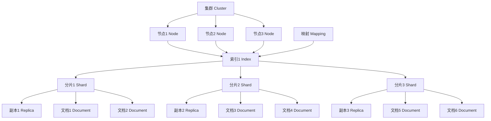

# ElasticSearch原理与代码实例讲解

## 1.背景介绍

在当今信息时代,数据已经成为企业最宝贵的资产之一。随着数据量的不断增长,传统的数据库系统在处理海量数据时往往会面临查询效率低下、扩展性差等诸多挑战。为了解决这些问题,ElasticSearch作为一种分布式、RESTful 风格的搜索和数据分析引擎应运而生。

ElasticSearch基于Apache Lucene构建,它不仅具有全文搜索引擎的核心功能,还提供了分布式多租户能力、高可用性、易于水平扩展等特性,使其成为了大数据场景下的不二之选。无论是在电子商务网站、日志分析、安全监控还是其他涉及海量数据处理的领域,ElasticSearch都有着广泛的应用。

## 2.核心概念与联系

### 2.1 索引(Index)

索引是ElasticSearch中存储数据的地方,类似于关系型数据库中的"数据库"概念。一个索引可以存储大量的文档,并对这些文档进行检索和分析。索引由若干个分片(Shard)组成,分片是索引的最小单位,用于实现数据的分布式存储和并行处理。

### 2.2 文档(Document)

文档是ElasticSearch中存储数据的基本单元,类似于关系型数据库中的"行"概念。一个文档由多个字段(Field)组成,每个字段都有对应的数据类型和值。文档采用JSON格式进行序列化存储。

### 2.3 映射(Mapping)

映射类似于关系型数据库中的"Schema"概念,它定义了文档字段的名称、数据类型以及如何对数据进行分析等信息。映射可以在创建索引时显式定义,也可以由ElasticSearch自动推导出来。

### 2.4 节点(Node)

节点是ElasticSearch集群中的一个实例,它可以存储数据,也可以参与集群的协调管理。节点分为主节点(Master Node)和数据节点(Data Node),前者负责集群管理,后者负责数据存储和查询。

### 2.5 集群(Cluster)

集群是一组协同工作的节点,它们共同承担数据的存储和处理任务。集群可以通过添加或移除节点来实现横向扩展,提高系统的容错性和可用性。

### 2.6 分片(Shard)

分片是索引的最小单位,它是一个底层的工作单元,用于实现数据的分布式存储和并行处理。每个索引都由多个分片组成,这些分片分布在不同的节点上,从而实现了数据的水平扩展。

### 2.7 副本(Replica)

副本是分片的备份,用于提高数据的可用性和容错性。当某个节点发生故障时,副本可以接管该节点上的分片,从而保证数据的可用性。副本也可以参与查询操作,提高查询性能。

这些核心概念相互关联、相互依赖,共同构建了ElasticSearch的分布式架构。下面我们将通过一个 Mermaid 流程图来直观地展示它们之间的关系:



## 3.核心算法原理具体操作步骤

ElasticSearch的核心算法主要包括倒排索引、分词、相关性评分等部分,下面我们将详细介绍它们的原理和具体操作步骤。

### 3.1 倒排索引

倒排索引是ElasticSearch实现全文搜索的核心算法,它的基本思想是将文档中的每个词及其在文档中的位置信息存储在一个结构化的文件中,用于快速查找包含某个词的文档。

具体来说,倒排索引的构建过程如下:

1. **收集文档**:从数据源收集文档,如网页、文本文件等。
2. **分词**:将文档内容按照一定的规则分解成多个词条(Term)。
3. **词条过滤**:去除无用的词条,如停用词(the、is等)。
4. **记录词条**:为每个词条创建一个倒排索引项,记录该词条所在的文档ID及其在文档中的位置信息。
5. **构建索引**:将所有倒排索引项组织成一个倒排索引文件。

当用户输入查询关键词时,ElasticSearch会直接从倒排索引中查找包含这些关键词的文档,而不需要遍历所有文档,从而大大提高了查询效率。

### 3.2 分词

分词是指将一段文本按照一定的规则分解成多个词条(Term)的过程,它是构建倒排索引的基础。ElasticSearch支持多种分词器,如标准分词器(Standard Analyzer)、简单分词器(Simple Analyzer)、空白分词器(Whitespace Analyzer)等。

以标准分词器为例,其分词过程包括以下步骤:

1. **字符过滤**:去除HTML标记、特殊字符等。
2. **分词**:按照一定规则将文本分解成多个词条,如将"Hello World"分解成"Hello"和"World"。
3. **词条过滤**:去除无用的词条,如停用词。

我们可以通过以下代码示例来了解标准分词器的具体使用:

```java
// 创建分词器
Analyzer analyzer = new StandardAnalyzer();

// 分词
TokenStream tokenStream = analyzer.tokenStream("test", "Hello World");
CharTermAttribute charTermAttribute = tokenStream.addAttribute(CharTermAttribute.class);

// 遍历分词结果
tokenStream.reset();
while (tokenStream.incrementToken()) {
    System.out.println(charTermAttribute.toString());
}
tokenStream.close();
```

输出结果:

```
Hello
World
```

### 3.3 相关性评分

当用户输入查询关键词时,ElasticSearch会根据倒排索引查找到包含这些关键词的文档,但是不同文档与查询的相关程度是不同的。为了返回最相关的结果,ElasticSearch采用了一种基于TF-IDF算法的相关性评分机制。

TF-IDF(Term Frequency-Inverse Document Frequency)算法包括两个部分:

1. **词频(TF)**:某个词条在文档中出现的频率。出现频率越高,则该词条对文档的重要性越大。
2. **逆向文档频率(IDF)**:某个词条在整个文档集合中出现的频率。出现频率越低,则该词条的区分度越高。

ElasticSearch会根据TF-IDF算法计算每个文档与查询的相关性得分,并按照得分从高到低的顺序返回结果。

具体来说,ElasticSearch的相关性评分公式如下:

$$
score(q,d) = \sum_{t \in q} \frac{tf(t,d)}{k_1 \times ((1-b)+b \times \frac{|d|}{avgdl})} \times idf(t)^2 \times t.getBoost() \times \text{norm}(t,d)
$$

其中:

- $q$表示查询
- $d$表示文档
- $t$表示词条
- $tf(t,d)$表示词条$t$在文档$d$中的词频
- $idf(t)$表示词条$t$的逆向文档频率
- $|d|$表示文档$d$的长度
- $avgdl$表示文档集合的平均长度
- $k_1$和$b$是用于调节词频和文档长度权重的常量
- $t.getBoost()$表示词条$t$的权重增量
- $\text{norm}(t,d)$表示词条$t$在文档$d$中的规范化因子

通过调节上述公式中的各个参数,我们可以调整不同因素对相关性评分的影响,从而优化搜索结果的排序。

## 4.数学模型和公式详细讲解举例说明

在上一节中,我们介绍了ElasticSearch的相关性评分公式。现在,我们将通过一个具体的例子来详细解释这个公式的各个部分。

假设我们有一个包含以下三个文档的索引:

1. "Hello World"
2. "Hello Lucene"
3. "Hello Elasticsearch"

现在,用户输入查询"Hello Lucene",我们来计算每个文档与这个查询的相关性得分。

### 4.1 词频(TF)

首先,我们需要计算每个词条在每个文档中的词频。

- 对于文档1,"Hello"的词频为1,"World"的词频为1。
- 对于文档2,"Hello"的词频为1,"Lucene"的词频为1。
- 对于文档3,"Hello"的词频为1,"Elasticsearch"的词频为1。

### 4.2 逆向文档频率(IDF)

接下来,我们需要计算每个词条的逆向文档频率。假设我们的文档集合总共包含10个文档,那么:

- "Hello"出现在3个文档中,所以$idf("Hello") = \log(\frac{10}{3}) \approx 1.04$
- "Lucene"出现在1个文档中,所以$idf("Lucene") = \log(\frac{10}{1}) \approx 2.30$

### 4.3 相关性得分计算

现在,我们可以根据相关性评分公式计算每个文档的得分了。为了简化计算,我们假设$k_1=1.2$、$b=0.75$、$avgdl=10$、所有词条的权重增量为1、规范化因子为1。

对于文档1:

$$
\begin{aligned}
score &= \frac{1}{1.2 \times ((1-0.75)+0.75 \times \frac{2}{10})} \times 1.04^2 \times 1 \times 1 \\
      &+ \frac{1}{1.2 \times ((1-0.75)+0.75 \times \frac{2}{10})} \times 0^2 \times 1 \times 1 \\
      &= 0.72
\end{aligned}
$$

对于文档2:

$$
\begin{aligned}
score &= \frac{1}{1.2 \times ((1-0.75)+0.75 \times \frac{2}{10})} \times 1.04^2 \times 1 \times 1 \\
      &+ \frac{1}{1.2 \times ((1-0.75)+0.75 \times \frac{2}{10})} \times 2.30^2 \times 1 \times 1 \\
      &= 4.48
\end{aligned}
$$

对于文档3:

$$
\begin{aligned}
score &= \frac{1}{1.2 \times ((1-0.75)+0.75 \times \frac{2}{10})} \times 1.04^2 \times 1 \times 1 \\
      &+ \frac{1}{1.2 \times ((1-0.75)+0.75 \times \frac{2}{10})} \times 0^2 \times 1 \times 1 \\
      &= 0.72
\end{aligned}
$$

因此,文档2与查询"Hello Lucene"的相关性最高,得分为4.48;文档1和文档3的得分都是0.72。

通过这个例子,我们可以更好地理解ElasticSearch的相关性评分公式,以及词频、逆向文档频率等因素对最终得分的影响。在实际应用中,我们可以根据具体需求调整公式中的参数,以获得更加准确的搜索结果排序。

## 5.项目实践:代码实例和详细解释说明

在了解了ElasticSearch的核心原理之后,我们将通过一个实际的项目案例来展示如何使用ElasticSearch进行数据存储、检索和分析。

### 5.1 项目背景

假设我们需要为一个电子商务网站构建一个商品搜索系统,能够根据用户输入的关键词快速查找相关商品,并按照相关性对结果进行排序。同时,我们还需要支持对商品数据的实时更新和删除操作。

### 5.2 环境准备

在开始编码之前,我们需要先准备好El