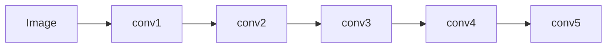
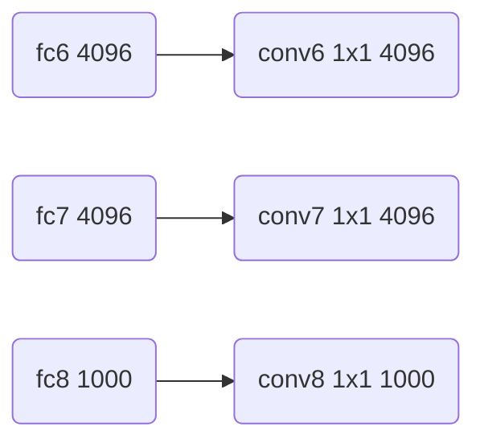
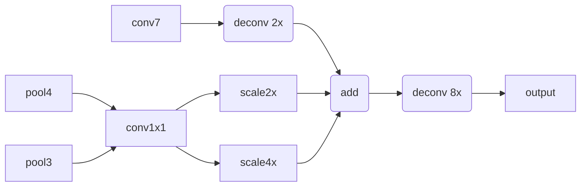

# FCN原理与代码实例讲解

## 1. 背景介绍
### 1.1 语义分割的重要性
语义分割是计算机视觉领域的一个重要任务,旨在对图像中的每个像素进行分类,以识别图像中不同的物体和区域。语义分割在自动驾驶、医学影像分析、遥感图像解译等领域有广泛应用。

### 1.2 FCN的突破性贡献
全卷积网络(Fully Convolutional Networks, FCN)是2015年由Jonathan Long等人提出的用于语义分割的开创性工作。FCN将传统的卷积神经网络改造成了一个端到端、像素到像素的分割模型,实现了从图像级别特征到像素级别预测的飞跃。FCN的提出极大地推动了语义分割技术的发展。

## 2. 核心概念与联系
### 2.1 卷积神经网络(CNN)
- 卷积层:通过卷积操作提取局部特征
- 池化层:下采样,增大感受野
- 全连接层:对特征进行分类

### 2.2 FCN的关键思想
- 用卷积层替代全连接层,实现空间信息的保留 
- 引入反卷积层对特征图进行上采样,恢复空间分辨率
- 跳跃连接融合不同尺度的特征,提高分割精度

### 2.3 端到端训练
FCN实现了从输入图像到像素级别预测的直接映射,无需分割中间步骤,简化了训练和推理过程。

## 3. 核心算法原理具体操作步骤
### 3.1 骨干网络
FCN通常采用经典的CNN网络如VGG、ResNet等作为骨干网络,用于提取图像的层次化特征。以VGG16为例:



### 3.2 全卷积化
将VGG16的全连接层转化为卷积层,保留了特征图的空间信息。转化示意图:



### 3.3 上采样
- 使用反卷积层(转置卷积)对conv7的特征图进行上采样,恢复空间分辨率。
- 上采样的步长和卷积核大小决定了上采样的倍数。
- 示例:以32倍上采样为例


### 3.4 跳跃连接
为了融合高层语义特征和底层细节特征,FCN提出了跳跃连接的思想。将conv7、pool4、pool3的特征图相加,得到融合的多尺度特征。



### 3.5 损失函数与训练
- 使用交叉熵损失函数,对每个像素进行多分类
- 端到端的反向传播,更新网络权重
- 数据增强如随机裁剪、水平翻转等提高泛化能力

## 4. 数学模型和公式详细讲解举例说明
### 4.1 卷积运算
对于输入特征图 $x$,卷积核 $W$,卷积运算定义为:

$$(W*x)(i,j) = \sum_{a}\sum_{b}W(a,b)x(i+a,j+b)$$

其中 $(i,j)$ 为特征图上的位置坐标, $a,b$ 为卷积核的坐标。

### 4.2 转置卷积
转置卷积可以看作卷积运算的逆过程,对特征图进行上采样。数学表达为:

$$y = C^T(x)$$

其中 $x$ 为输入特征图, $C^T$ 为转置卷积操作。

设输入特征图大小为 $H \times W$,转置卷积核大小为 $K \times K$,步长为 $S$,则输出特征图大小为:

$$H_{out} = S(H-1) + K, W_{out} = S(W-1) + K$$

### 4.3 交叉熵损失
对于像素 $i$,真实类别为 $y_i$,模型预测概率为 $p_i$,交叉熵损失定义为:

$$L(y_i, p_i) = -\sum_i y_ilog(p_i)$$

最小化交叉熵损失,即可使模型的预测结果接近真实标签。

## 5. 项目实践:代码实例和详细解释说明
下面以PyTorch为例,给出FCN的核心代码实现:

```python
import torch
import torch.nn as nn

class FCN(nn.Module):
    def __init__(self, num_classes):
        super(FCN, self).__init__()
        # 骨干网络 VGG16
        vgg = models.vgg16(pretrained=True)
        features = list(vgg.features.children())
        self.features3 = nn.Sequential(*features[:17])
        self.features4 = nn.Sequential(*features[17:24])
        self.features5 = nn.Sequential(*features[24:])
        
        # 全卷积化
        self.fc6 = nn.Conv2d(512, 4096, kernel_size=1)
        self.fc7 = nn.Conv2d(4096, 4096, kernel_size=1)
        self.score_fr = nn.Conv2d(4096, num_classes, kernel_size=1)
        
        # 跨层连接的卷积层
        self.score_pool3 = nn.Conv2d(256, num_classes, kernel_size=1)
        self.score_pool4 = nn.Conv2d(512, num_classes, kernel_size=1)
        
        # 上采样
        self.upscore2 = nn.ConvTranspose2d(num_classes, num_classes, kernel_size=4, stride=2)
        self.upscore8 = nn.ConvTranspose2d(num_classes, num_classes, kernel_size=16, stride=8)
        self.upscore_pool4 = nn.ConvTranspose2d(num_classes, num_classes, kernel_size=4, stride=2)
        
    def forward(self, x):
        pool3 = self.features3(x)
        pool4 = self.features4(pool3)
        pool5 = self.features5(pool4)
        
        fc6 = self.fc6(pool5)
        fc7 = self.fc7(fc6)
        score_fr = self.score_fr(fc7)
        
        score_pool4 = self.score_pool4(pool4)
        score_pool3 = self.score_pool3(pool3)
        
        upscore2 = self.upscore2(score_fr)
        
        # 跨层融合
        fuse_pool4 = upscore2 + score_pool4
        upscore_pool4 = self.upscore_pool4(fuse_pool4)
        
        fuse_pool3 = upscore_pool4 + score_pool3
        output = self.upscore8(fuse_pool3)
        
        return output
```

- `__init__`方法定义了FCN的网络结构,包括骨干网络、全卷积化、跨层连接和上采样等组件。
- `forward`方法定义了前向传播过程,将输入图像通过骨干网络提取特征,然后经过全卷积化、跨层融合和上采样得到最终的分割结果。
- 在训练过程中,将FCN的输出与真实标签计算交叉熵损失,并通过反向传播更新网络权重。

## 6. 实际应用场景
FCN可以应用于以下场景:

- 自动驾驶:对道路场景进行语义分割,识别道路、车辆、行人等
- 医学影像分析:肿瘤分割、器官分割等
- 遥感图像解译:土地利用分类、变化检测等
- 人体解析:对人体图像进行部位分割,如头、躯干、四肢等

## 7. 工具和资源推荐
- 深度学习框架:PyTorch、TensorFlow等
- 骨干网络:VGG、ResNet、MobileNet等
- 数据集:PASCAL VOC、Cityscapes、医学影像数据集等
- 开源实现:torchvision、MMSegmentation等

## 8. 总结:未来发展趋势与挑战
- 轻量化模型:设计适合移动端部署的高效分割模型
- 小样本学习:利用少量标注样本实现分割模型的快速迁移和适应
- 域适应:解决训练数据与应用场景数据分布不一致的问题
- 实时性:优化模型速度,实现实时语义分割

尽管FCN取得了突破性进展,但语义分割仍然面临诸多挑战,需要学术界和工业界的共同努力。

## 9. 附录:常见问题与解答
### 9.1 FCN相比传统CNN的优势是什么?
FCN通过全卷积化和跨层连接,克服了传统CNN的局限性,实现了端到端的像素级分割。FCN可以接受任意大小的输入图像,生成与输入尺寸相同的分割结果。

### 9.2 FCN的缺点有哪些?
FCN的分割结果相对粗糙,对小目标和细节的刻画能力有限。此外,FCN对像素的分类是独立的,没有很好地考虑像素间的关联性。

### 9.3 如何提高FCN的分割精度?
可以采用以下策略:
- 增强数据集,引入更多样化的训练样本
- 使用更强大的骨干网络,提取更高层次的语义特征  
- 改进上采样方式,如引入反卷积层、插值上采样等
- 后处理优化,如条件随机场(CRF)

### 9.4 FCN可以应用于实例分割吗?
FCN是针对语义分割任务设计的,无法直接用于实例分割。但FCN的思想启发了后续的实例分割方法,如Mask R-CNN等。

作者：禅与计算机程序设计艺术 / Zen and the Art of Computer Programming