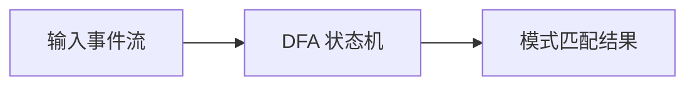
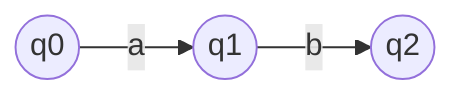

# Flink CEP 原理与代码实例讲解

## 1. 背景介绍

### 1.1 什么是 CEP?

CEP(复杂事件处理)是一种从大量事件数据中识别出有意义的事件模式的技术。它可以实时分析和处理由各种来源产生的事件流,从而发现重要的事件模式或情况。CEP 广泛应用于各种领域,如金融交易监控、网络安全、物联网等。

### 1.2 Apache Flink 介绍

Apache Flink 是一个开源的分布式大数据处理引擎,支持有状态计算和准确一次的状态一致性。Flink 具有低延迟、高吞吐、高容错等优点,非常适合构建流处理应用程序。Flink CEP 库提供了一组丰富的 API,可以方便地对流数据进行复杂事件处理。

## 2. 核心概念与联系

### 2.1 事件 (Event)

事件是 CEP 的基本单元,表示在特定时间发生的一个动作或状态变化。事件通常包含时间戳、事件类型和事件负载数据等信息。

### 2.2 模式 (Pattern)

模式描述了一系列相关事件的有序组合,用于表示我们感兴趣的情况。模式可以由多个模式组合而成,形成更复杂的模式。

### 2.3 模式流 (Pattern Stream)

模式流是一个由检测到的模式组成的流,它是 CEP 的核心。模式流可以作为下游算子的输入,进行进一步的处理和分析。

### 2.4 时间语义

Flink CEP 支持三种时间语义:事件时间、IngestionTime 和处理时间。正确设置时间语义对于准确检测事件模式至关重要。

## 3. 核心算法原理具体操作步骤

Flink CEP 的核心算法原理可以概括为以下几个步骤:

### 3.1 事件流输入

将事件流作为输入源,可以是 Kafka 主题、文件或套接字等。

### 3.2 模式定义

使用 Flink CEP 提供的 API 定义感兴趣的事件模式,可以使用模式序列、模式组合等方式构建复杂模式。

### 3.3 模式匹配

Flink CEP 使用有限状态机 (Deterministic Finite Automaton, DFA) 算法进行模式匹配。DFA 根据输入事件流和定义的模式,对事件进行状态转移,从而识别出符合模式的事件序列。



### 3.4 模式选择

对于同一个事件序列,可能存在多个匹配的模式。Flink CEP 提供了多种模式选择策略,如:

- 严格近邻 (Strict Contiguity)
- 松散近邻 (Relaxed Contiguity)
- 严格近邻有界 (Strict Contiguity Bounded)

根据具体场景选择合适的策略。

### 3.5 结果输出

将匹配到的模式输出为模式流,可以作为下游算子的输入,进行进一步的处理和分析。

## 4. 数学模型和公式详细讲解举例说明

Flink CEP 的核心算法 DFA 可以用数学模型进行描述。DFA 是一个五元组 $M = (Q, \Sigma, \delta, q_0, F)$,其中:

- $Q$ 是有限状态集合
- $\Sigma$ 是输入事件集合
- $\delta$ 是状态转移函数,定义为 $\delta: Q \times \Sigma \rightarrow Q$
- $q_0 \in Q$ 是初始状态
- $F \subseteq Q$ 是终止状态集合

DFA 的工作过程如下:

1. 初始状态为 $q_0$
2. 对于每个输入事件 $a \in \Sigma$,根据当前状态 $q$ 和状态转移函数 $\delta(q, a)$ 进行状态转移
3. 如果转移到终止状态 $q \in F$,则表示匹配到一个模式

以下是一个简单的 DFA 示例,用于匹配模式 "ab":

$$
\begin{aligned}
Q &= \{q_0, q_1, q_2\} \\
\Sigma &= \{a, b\} \\
\delta(q_0, a) &= q_1 \\
\delta(q_1, b) &= q_2 \\
q_0 &= \text{初始状态} \\
F &= \{q_2\}
\end{aligned}
$$

该 DFA 的状态转移图如下:



对于输入事件序列 "abcab",DFA 的状态转移过程如下:

1. 初始状态 $q_0$
2. 输入 "a",转移到状态 $q_1$
3. 输入 "b",转移到终止状态 $q_2$,匹配到模式 "ab"
4. 输入 "c",无法转移,回到初始状态 $q_0$
5. 输入 "a",转移到状态 $q_1$
6. 输入 "b",转移到终止状态 $q_2$,再次匹配到模式 "ab"

通过这个示例,我们可以看到 DFA 是如何根据输入事件序列和定义的模式进行状态转移,从而识别出符合模式的事件序列。

## 5. 项目实践: 代码实例和详细解释说明

下面我们通过一个实际项目案例来演示如何使用 Flink CEP 进行复杂事件处理。

### 5.1 场景描述

假设我们需要监控一个电子商务网站的用户行为,当检测到以下模式时,我们需要发出警报:

1. 用户在 5 分钟内连续 3 次尝试登录失败
2. 用户在 10 分钟内连续 5 次将商品加入购物车但未完成下单

### 5.2 数据准备

我们将用户行为事件存储在 Kafka 主题中,事件数据格式如下:

```json
{
  "userId": "user_1",
  "eventTime": "2023-05-31T13:00:00",
  "eventType": "LOGIN_ATTEMPT",
  "eventResult": "SUCCESS"
}
```

其中 `eventType` 包括以下几种:

- `LOGIN_ATTEMPT`: 登录尝试
- `ADD_TO_CART`: 将商品加入购物车
- `CHECKOUT`: 结账

### 5.3 Flink 作业代码

```scala
import org.apache.flink.cep.PatternStream
import org.apache.flink.cep.pattern.conditions.SimpleCondition
import org.apache.flink.cep.scala.CEP
import org.apache.flink.cep.scala.pattern.Pattern
import org.apache.flink.streaming.api.scala._

object CEPJob {

  case class UserEvent(userId: String, eventTime: Long, eventType: String, eventResult: String)

  def main(args: Array[String]): Unit = {
    val env = StreamExecutionEnvironment.getExecutionEnvironment
    env.setStreamTimeCharacteristic(TimeCharacteristic.EventTime)

    val inputStream = env.addSource(new KafkaSource[String](...))
      .map(parseUserEvent)
      .keyBy(_.userId)

    val loginFailurePattern = Pattern
      .begin[UserEvent]("start")
      .where(_.eventType == "LOGIN_ATTEMPT")
      .where(_.eventResult == "FAILURE")
      .timesOrMore(3)
      .within(Time.minutes(5))

    val addToCartPattern = Pattern
      .begin[UserEvent]("start")
      .where(_.eventType == "ADD_TO_CART")
      .timesOrMore(5)
      .within(Time.minutes(10))
      .until(_.eventType == "CHECKOUT")

    val loginFailureStream: PatternStream[UserEvent] = CEP.pattern(inputStream, loginFailurePattern)
    val addToCartStream: PatternStream[UserEvent] = CEP.pattern(inputStream, addToCartPattern)

    loginFailureStream.process(new AlertFunction("Login Failure"))
    addToCartStream.process(new AlertFunction("Cart Abandonment"))

    env.execute("CEP Job")
  }

  def parseUserEvent(line: String): UserEvent = {
    // 解析 JSON 字符串为 UserEvent 对象
  }
}
```

### 5.4 代码解释

1. 定义 `UserEvent` 样例类,用于表示用户行为事件。
2. 从 Kafka 读取事件数据,并使用 `map` 算子解析为 `UserEvent` 对象。
3. 使用 `keyBy` 算子按照 `userId` 对事件流进行分区。
4. 定义登录失败模式 `loginFailurePattern`:
   - 以 `LOGIN_ATTEMPT` 事件开始
   - 事件结果为 `FAILURE`
   - 连续出现 3 次或更多次
   - 时间窗口为 5 分钟
5. 定义购物车放弃模式 `addToCartPattern`:
   - 以 `ADD_TO_CART` 事件开始
   - 连续出现 5 次或更多次
   - 时间窗口为 10 分钟
   - 直到出现 `CHECKOUT` 事件为止
6. 使用 `CEP.pattern` 方法应用模式,得到模式流 `loginFailureStream` 和 `addToCartStream`。
7. 对于匹配到的模式,使用 `process` 算子调用 `AlertFunction` 发出警报。

通过这个示例,我们可以看到如何使用 Flink CEP 定义复杂的事件模式,并对匹配到的模式进行进一步处理。代码清晰易懂,展示了 Flink CEP 在实际项目中的应用。

## 6. 实际应用场景

Flink CEP 在许多领域都有广泛的应用,下面列举了一些典型场景:

### 6.1 金融交易监控

在金融领域,CEP 可以用于监控可疑的交易活动,如洗钱、内幕交易等。例如,可以定义模式来检测在短时间内进行大额转账、频繁交易等异常行为。

### 6.2 网络安全

CEP 可以用于实时检测网络入侵、病毒攻击等安全威胁。通过分析网络流量、系统日志等事件数据,并定义相应的模式,就能及时发现并响应安全事件。

### 6.3 物联网

在物联网领域,CEP 可以用于监控传感器数据,检测设备故障或异常状态。例如,可以定义模式来检测温度、压力等指标连续超过阈值的情况。

### 6.4 业务活动监控

CEP 也可以应用于业务活动监控,如电子商务网站的用户行为分析、订单处理流程监控等。通过分析业务事件数据,可以发现潜在的问题或改进机会。

### 6.5 预测维护

在制造业中,CEP 可以用于预测性维护。通过分析设备传感器数据,定义相应的模式,就能提前发现设备故障的迹象,从而进行及时维护,避免更大的损失。

## 7. 工具和资源推荐

### 7.1 Flink CEP 官方文档

Apache Flink 官方网站提供了详细的 CEP 库文档,包括概念介绍、API 使用指南等,是学习 Flink CEP 的绝佳资源。

### 7.2 Flink CEP 示例项目

Flink 官方提供了一些 CEP 示例项目,可以帮助您快速上手和了解 CEP 的使用方式。

### 7.3 CEP 在线课程

网上有许多优质的 CEP 在线课程,如 Coursera、Udemy 等平台上的课程,可以系统地学习 CEP 相关理论和实践。

### 7.4 CEP 书籍

一些优秀的 CEP 相关书籍,如《Event Processing in Action》、《Complex Event Processing》等,对于深入理解 CEP 概念和原理非常有帮助。

### 7.5 CEP 社区

加入 Apache Flink 的邮件列表或社区,可以与其他开发者交流、讨论 CEP 相关问题,获取最新动态和最佳实践。

## 8. 总结: 未来发展趋势与挑战

### 8.1 发展趋势

#### 8.1.1 人工智能与 CEP 结合

未来,人工智能技术如机器学习、深度学习等可能会与 CEP 结合,提高模式识别和事件处理的智能化水平。

#### 8.1.2 流处理与批处理融合

随着流处理和批处理的融合,CEP 可能会与批量数据处理技术相结合,实现更加全面的数据分析和处理。

#### 8.1.3 边缘计算与 CEP

随着物联网和边缘计算的发展,CEP 可能会在边缘设备上进行部署,实