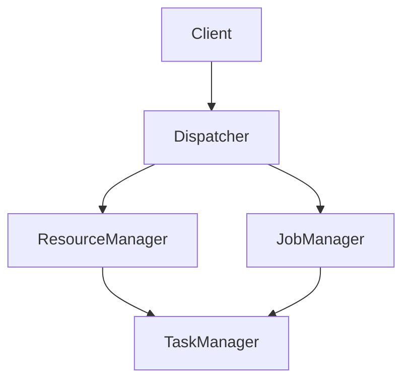
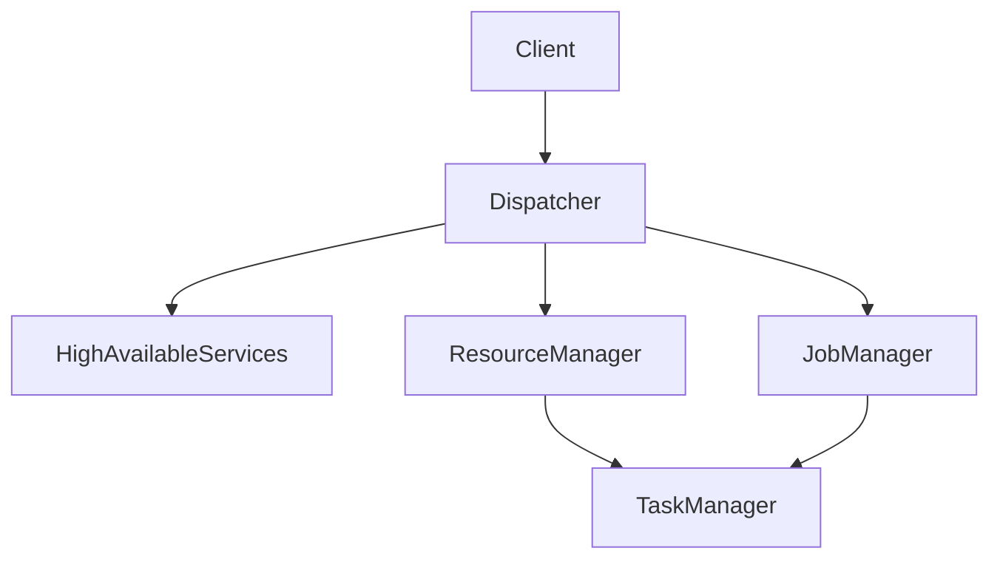
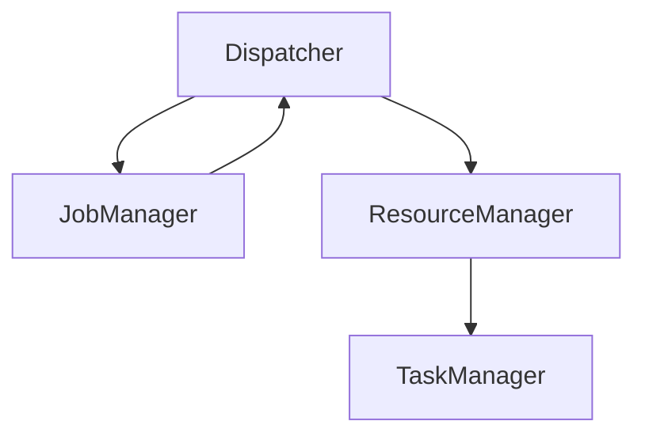

# Flink Dispatcher原理与代码实例讲解

## 1.背景介绍

Apache Flink 是一个开源的分布式流处理框架,广泛应用于大数据领域的实时计算场景。作为 Flink 的核心组件之一,Dispatcher 在整个系统中扮演着关键角色。它负责接收客户端提交的作业,协调资源管理器 (ResourceManager) 和作业管理器 (JobManager) 的生命周期,并监控作业的执行状态。本文将深入探讨 Flink Dispatcher 的原理、架构和实现细节,并通过代码示例帮助读者更好地理解其工作机制。

## 2.核心概念与联系

### 2.1 Flink 架构概览

在了解 Dispatcher 之前,我们先简单回顾一下 Flink 的整体架构。Flink 采用了主从架构,主要由以下几个核心组件组成:

- **Client**: 客户端用于提交作业并与集群进行交互。
- **JobManager**: 负责协调分布式执行,调度任务,协调 CheckPoint 等。
- **TaskManager**: 执行实际的数据处理任务,在 TaskManager 上运行的是 Task。
- **ResourceManager**: 负责管理任务执行的资源,并与资源提供者(如 YARN、Kubernetes)进行通信,从而获取或释放资源。
- **Dispatcher**: 作为客户端与集群之间的通信口,负责接收作业并将其转发给相应的组件。

### 2.2 Dispatcher 在 Flink 架构中的位置

Dispatcher 位于 Flink 架构的最前端,扮演着"门卫"的角色。当客户端提交作业时,Dispatcher 会首先接收到该请求。之后,它会与 ResourceManager 协作,为作业分配所需的资源。一旦资源准备就绪,Dispatcher 会启动 JobManager 并将作业提交给它。在作业执行期间,Dispatcher 还会持续监控作业的状态,并在作业完成后进行相应的清理工作。



## 3.核心算法原理具体操作步骤

### 3.1 作业提交流程

当客户端提交作业时,Dispatcher 会执行以下步骤:

1. **接收作业请求**: Dispatcher 通过 REST 接口或 RPC 接口接收客户端提交的作业。
2. **持久化作业元数据**: Dispatcher 会将作业的元数据(如作业图、执行配置等)持久化到高可用存储(如 ZooKeeper 或文件系统)中。
3. **请求资源分配**: Dispatcher 向 ResourceManager 发送资源请求,以获取执行作业所需的资源。
4. **启动 JobManager**: 一旦资源准备就绪,Dispatcher 会启动 JobManager 进程。
5. **提交作业给 JobManager**: Dispatcher 将作业提交给 JobManager,后者会负责协调作业的执行。



### 3.2 作业执行监控

在作业执行期间,Dispatcher 会持续监控作业的状态,并在作业完成后进行清理工作:

1. **监控作业状态**: Dispatcher 会定期从 JobManager 获取作业的执行状态,包括运行中的任务数、CheckPoint 状态等。
2. **处理作业状态变化**: 如果作业状态发生变化(如失败或取消),Dispatcher 会相应地处理该事件。
3. **作业完成后的清理**: 当作业执行完成后,Dispatcher 会向 ResourceManager 发送释放资源的请求,并终止 JobManager 进程。



## 4.数学模型和公式详细讲解举例说明

在 Flink 中,作业调度和资源分配是一个复杂的过程,涉及到多个组件之间的协作。为了实现高效的资源利用和公平调度,Flink 采用了一种基于插槽(Slot)的资源模型。

### 4.1 插槽(Slot)资源模型

在 Flink 中,TaskManager 提供了一组插槽,每个插槽可以执行一个任务。插槽的数量由 TaskManager 的配置决定,如CPU核数和内存大小。ResourceManager 负责管理集群中所有可用的插槽,并将它们分配给不同的作业。

我们可以用下面的公式来表示插槽和任务之间的关系:

$$
N_{slots} = \sum_{i=1}^{M} N_{slots}^{TM_i}
$$

其中:
- $N_{slots}$ 表示集群中总的插槽数量
- $M$ 表示 TaskManager 的数量
- $N_{slots}^{TM_i}$ 表示第 $i$ 个 TaskManager 提供的插槽数量

对于一个作业,它需要的插槽数量取决于并行度(Parallelism)的设置。假设一个作业的并行度为 $P$,那么它需要的插槽数量就是 $P$。

$$
N_{slots}^{job} = P
$$

ResourceManager 会根据作业的插槽需求,从可用插槽中分配资源。如果当前可用插槽不足,作业将被暂时挂起,等待有足够的插槽资源时再执行。

### 4.2 插槽共享

为了提高资源利用率,Flink 支持插槽共享。这意味着同一个 TaskManager 上的插槽可以被多个作业共享。当一个作业完成后,它占用的插槽将被释放,可以被其他作业重新使用。

我们可以用下面的公式来表示插槽共享的情况:

$$
\sum_{j=1}^{N} N_{slots}^{job_j} \leq N_{slots}
$$

其中:
- $N$ 表示正在运行的作业数量
- $N_{slots}^{job_j}$ 表示第 $j$ 个作业需要的插槽数量
- $N_{slots}$ 表示集群中总的插槽数量

通过插槽共享,Flink 可以更好地利用集群资源,提高吞吐量和资源利用率。

## 5.项目实践:代码实例和详细解释说明

为了更好地理解 Dispatcher 的工作原理,我们来看一下 Flink 源码中相关的实现细节。

### 5.1 Dispatcher 服务

Dispatcher 作为一个独立的服务运行在 Flink 集群中。它的主要入口点是 `DispatcherRunner` 类,该类负责启动和停止 Dispatcher 服务。

```java
public class DispatcherRunner implements AutoCloseableAsync {

    public DispatcherRunner(
            DispatcherServiceFactory dispatcherFactory,
            StreamManagerDispatcherServices initializeDispatchers)
            throws Exception {
        ...
    }

    public CompletableFuture<Void> start() {
        ...
        dispatcherLeaderRetrievalService.start(dispatcherGatewayRetriever);
        ...
    }

    public CompletableFuture<Void> stop() {
        ...
        dispatcherLeaderRetrievalService.stop();
        ...
    }
}
```

`DispatcherRunner` 在启动时会创建一个 `DispatcherServiceFactory`实例,用于生成 Dispatcher 服务。它还会启动一个 `DispatcherLeaderRetrievalService`,用于监听 Dispatcher 领导者的变化。

### 5.2 作业提交

当客户端提交作业时,Dispatcher 会执行一系列操作来处理该请求。下面是 `DispatcherRestEndpoint` 类中处理作业提交的关键代码:

```java
public final CompletableFuture<Acknowledged> submitJob(JobSubmitRequestBody request, Time timeout) {
    final CompletableFuture<Acknowledged> acknowledgedFuture = new CompletableFuture<>();
    
    final JobGraph jobGraph = request.jobGraph();
    
    final JobManagerRunner jobManagerRunner = jobManagerRunnerFactory.createJobManagerRunner(
        jobGraph,
        configuration,
        getRpcService(),
        haServices,
        blobServer,
        jobManagerMetricGroup,
        queryableStateProxy,
        timeout);

    jobManagerRunner.start();
    
    acknowledgedFuture.complete(Acknowledged.get());
    
    return acknowledgedFuture;
}
```

1. 首先,Dispatcher 会从客户端请求中获取作业图 (JobGraph)。
2. 然后,它会创建一个 `JobManagerRunner` 实例,用于启动 JobManager 进程。
3. `JobManagerRunner` 会执行一系列初始化操作,包括持久化元数据、申请资源等。
4. 最后,Dispatcher 会将作业提交给 JobManager,并返回一个 `Acknowledged` 对象,表示作业已被成功接收。

### 5.3 作业执行监控

在作业执行期间,Dispatcher 会定期从 JobManager 获取作业的状态信息。下面是 `DispatcherRestEndpoint` 类中监控作业状态的代码片段:

```java
public final CompletableFuture<JobStatusInfo> getJobStatus(JobID jobId, boolean allowPartialDetails) {
    final CompletableFuture<JobStatusInfo> jobStatusFuture = new CompletableFuture<>();

    final JobManagerRunner jobManagerRunner = getJobManagerRunner(jobId);
    if (jobManagerRunner == null) {
        jobStatusFuture.completeExceptionally(new FlinkJobNotFoundException(jobId));
        return jobStatusFuture;
    }

    jobManagerRunner.getJobStatus(allowPartialDetails)
        .thenAccept(jobStatusFuture::complete)
        .exceptionally(
            (Throwable throwable) -> {
                jobStatusFuture.completeExceptionally(
                    new FlinkException("Failed to retrieve job status for job " + jobId + '.', throwable));
                return null;
            });

    return jobStatusFuture;
}
```

1. 首先,Dispatcher 会根据作业 ID 获取对应的 `JobManagerRunner` 实例。
2. 然后,它会调用 `JobManagerRunner` 的 `getJobStatus` 方法,获取作业的当前状态。
3. 如果获取状态成功,Dispatcher 会将状态信息返回给客户端。否则,它会抛出一个异常。

通过持续监控作业状态,Dispatcher 可以及时发现和处理作业执行中的异常情况,确保作业能够顺利完成。

## 6.实际应用场景

Flink Dispatcher 作为 Flink 架构中的关键组件,在实际应用场景中扮演着重要角色。以下是一些典型的应用场景:

### 6.1 流式数据处理

在流式数据处理场景中,Flink 可以实时处理来自各种数据源(如消息队列、日志文件、传感器等)的数据流。Dispatcher 在这里负责接收客户端提交的流处理作业,协调资源分配,并监控作业的执行状态。

### 6.2 批量数据处理

除了流式数据处理,Flink 也可以用于批量数据处理,如 ETL(提取、转换、加载)任务、机器学习模型训练等。在这些场景中,Dispatcher 同样负责作业的提交、资源协调和状态监控。

### 6.3 事件驱动架构

在事件驱动架构中,Flink 可以作为流处理引擎,实时处理来自各种事件源(如消息队列、日志文件等)的事件数据。Dispatcher 在这里负责接收和调度事件处理作业,确保事件能够及时被处理。

### 6.4 实时数据分析

实时数据分析是 Flink 的另一个重要应用场景。通过 Flink,我们可以对流式数据进行实时分析,如实时报表、实时监控、实时预测等。Dispatcher 在这里负责协调分析作业的执行,确保分析结果能够及时生成。

## 7.工具和资源推荐

在学习和使用 Flink Dispatcher 时,以下工具和资源可能会对您有所帮助:

### 7.1 官方文档

Flink 官方文档(https://nightlies.apache.org/flink/flink-docs-release-1.16/)提供了详细的概念介绍、架构说明和API参考,是学习 Flink 的重要资源。

### 7.2 源码阅读

阅读 Flink 源码(https://github.com/apache/flink)是深入理解 Dispatcher 实现细节的有效方式。您可以从 `flink-runtime` 模块的 `dispatcher` 包开始探索。

### 7.3 社区和邮件列表

Apache Flink 拥有一个活跃的社区,您可以在邮件列表(https://flink.apache.org/community.html#mailing-lists)上提问或参与讨论,获取来自社区的支持和建议。

### 7.4 Flink Meetup 和会议

参加 Flink Meetup 和会议(https://flink.apache.org/community.html#events)是了解 Flink 最新进展、交流经验的好机会。您可以关注官方网站上的活动信息。

### 7.5 在线培训和教程

一些