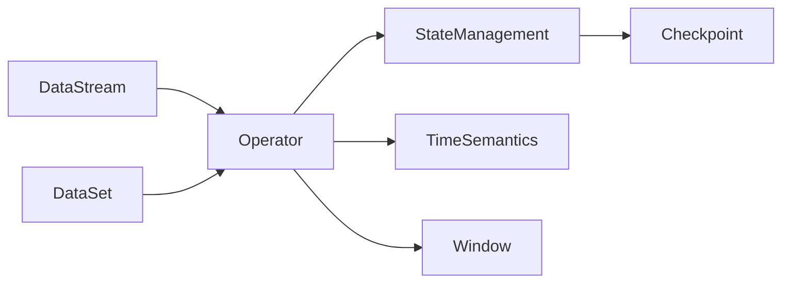

# Flink 原理与代码实例讲解

## 1. 背景介绍
### 1.1 大数据处理的挑战
在当今大数据时代,海量数据的实时处理和分析已成为企业的迫切需求。传统的批处理框架如Hadoop MapReduce已经无法满足实时计算的要求。企业需要一个高效、灵活、可扩展的流式计算框架来应对数据处理的挑战。
### 1.2 Flink的诞生
Apache Flink是一个开源的分布式流处理和批处理框架,由德国柏林工业大学的研究小组于2014年发起。Flink以其卓越的性能、灵活的APIs和强大的状态管理能力迅速成为业界领先的大数据处理引擎之一。
### 1.3 Flink的应用场景
Flink广泛应用于电商、金融、物联网、广告等领域的实时数据处理,典型场景包括:
- 实时ETL
- 实时数据分析
- 实时风控与反欺诈
- 实时推荐与个性化
- 物联网数据处理

## 2. 核心概念与联系
### 2.1 Flink的核心抽象
#### 2.1.1 DataStream
DataStream是Flink对流数据的核心抽象,代表一个无界的、持续生成的数据流。DataStream API提供了丰富的算子(Operator)来对数据流进行转换、聚合、连接等操作。
#### 2.1.2 DataSet 
DataSet是Flink对有界数据集的抽象,类似于Spark中的RDD。DataSet API提供了类似于MapReduce的操作,如map、reduce、join等。
#### 2.1.3 Table & SQL
Flink提供了高层的关系型API,允许用户以声明式的方式操作数据,支持标准SQL和类SQL语法。Table API和SQL查询可以与DataStream和DataSet无缝集成。
### 2.2 Flink架构与组件
#### 2.2.1 Flink运行时架构
Flink采用主从(Master-Slave)架构,由JobManager和TaskManager组成。
- JobManager负责接收客户端提交的任务,调度任务执行,协调检查点等。
- TaskManager是实际执行计算的Worker节点,负责执行任务的一个或多个子任务(subtask)。
#### 2.2.2 时间语义
Flink支持三种时间语义:
- Processing Time:数据被处理的系统时间
- Event Time:数据自带的生成时间
- Ingestion Time:数据进入Flink的时间
#### 2.2.3 状态管理
Flink提供了强大的状态管理机制,支持Keyed State和Operator State。状态可以是内存级的,也可以持久化到外部存储。Flink的检查点(Checkpoint)机制能够周期性地将状态快照持久化,以实现容错和恢复。
#### 2.2.4 时间窗口
Flink提供了灵活的窗口机制,支持滚动窗口(Tumbling Window)、滑动窗口(Sliding Window)、会话窗口(Session Window)等,可以对流数据进行切分和聚合。

### 2.3 Flink核心概念联系图


## 3. 核心算法原理与操作步骤
### 3.1 DataStream转换算子
#### 3.1.1 map
对流中的每个元素执行一次用户定义的函数,将一个元素转换为另一个元素。
```java
DataStream<Integer> intStream = ...
DataStream<String> stringStream = intStream.map(new MapFunction<Integer, String>() {
    @Override
    public String map(Integer value) throws Exception {
        return "String_" + value;
    }
});
```
#### 3.1.2 flatMap
对流中的每个元素执行一次用户定义的函数,将一个元素转换为0到多个元素。
```java
DataStream<String> lines = ...
DataStream<String> words = lines.flatMap(new FlatMapFunction<String, String>() {
    @Override
    public void flatMap(String line, Collector<String> out) throws Exception {
        for (String word : line.split(" ")) {
            out.collect(word);
        }
    }
});
```
#### 3.1.3 filter
对流中的每个元素执行一次用户定义的函数,根据返回值决定是否保留该元素。
```java
DataStream<Integer> intStream = ...
DataStream<Integer> evenStream = intStream.filter(new FilterFunction<Integer>() {
    @Override
    public boolean filter(Integer value) throws Exception {
        return value % 2 == 0;
    }
});
```
### 3.2 DataStream聚合算子
#### 3.2.1 keyBy
根据指定的key对流进行分区,是执行聚合操作的前提。
```java
DataStream<Tuple2<String, Integer>> wordCounts = ...
KeyedStream<Tuple2<String, Integer>, String> keyedStream = wordCounts.keyBy(value -> value.f0);
```
#### 3.2.2 reduce
对KeyedStream中的元素进行滚动聚合,每到来一个元素,就将其与当前聚合结果进行合并。
```java
KeyedStream<Tuple2<String, Integer>, String> keyedStream = ...
DataStream<Tuple2<String, Integer>> wordCounts = keyedStream.reduce(new ReduceFunction<Tuple2<String, Integer>>() {
    @Override
    public Tuple2<String, Integer> reduce(Tuple2<String, Integer> value1, Tuple2<String, Integer> value2) throws Exception {
        return new Tuple2<>(value1.f0, value1.f1 + value2.f1);
    }
});
```
### 3.3 窗口操作
#### 3.3.1 滚动窗口(Tumbling Window)
将数据流按固定大小切分成不重叠的窗口。
```java
DataStream<Tuple2<String, Integer>> wordCounts = ...
DataStream<Tuple2<String, Integer>> windowCounts = wordCounts
    .keyBy(value -> value.f0)
    .window(TumblingProcessingTimeWindows.of(Time.seconds(5)))
    .sum(1);
```
#### 3.3.2 滑动窗口(Sliding Window)  
滑动窗口有固定的大小和滑动间隔,窗口可以重叠。
```java
DataStream<Tuple2<String, Integer>> wordCounts = ...
DataStream<Tuple2<String, Integer>> windowCounts = wordCounts
    .keyBy(value -> value.f0)
    .window(SlidingProcessingTimeWindows.of(Time.seconds(10), Time.seconds(5))) 
    .sum(1);
```
#### 3.3.3 会话窗口(Session Window)
将某段时间内活跃度较高的数据组合成一个窗口,窗口的界限由数据的活跃程度决定。
```java
DataStream<Tuple2<String, Integer>> wordCounts = ...
DataStream<Tuple2<String, Integer>> windowCounts = wordCounts
    .keyBy(value -> value.f0)
    .window(EventTimeSessionWindows.withGap(Time.seconds(10)))
    .reduce((a, b) -> new Tuple2<>(a.f0, a.f1 + b.f1));
```

## 4. 数学模型与公式
### 4.1 窗口计算的数学模型
设数据流为$S=\{e_1,e_2,...,e_n\}$,窗口大小为$w$,滑动步长为$s$。则第$i$个滑动窗口$W_i$包含的元素为:
$$W_i=\{e_j|i\cdot s \leq j < i\cdot s+w\}$$
其中,$i\in[0,\lfloor\frac{n-w}{s}\rfloor]$。

对于每个窗口$W_i$,应用聚合函数$f$得到结果$r_i$:
$$r_i=f(W_i)$$

常见的聚合函数包括:
- sum:$f(W_i)=\sum_{e\in W_i}e$
- avg:$f(W_i)=\frac{1}{|W_i|}\sum_{e\in W_i}e$
- max:$f(W_i)=\max_{e\in W_i}e$
- min:$f(W_i)=\min_{e\in W_i}e$

### 4.2 示例:滑动窗口求平均值
假设数据流$S=\{1,2,3,4,5,6,7,8,9,10\}$,窗口大小$w=5$,滑动步长$s=2$。则滑动窗口及其平均值为:

$W_0=\{1,2,3,4,5\},r_0=\frac{1+2+3+4+5}{5}=3$

$W_1=\{3,4,5,6,7\},r_1=\frac{3+4+5+6+7}{5}=5$

$W_2=\{5,6,7,8,9\},r_2=\frac{5+6+7+8+9}{5}=7$

$W_3=\{7,8,9,10\},r_3=\frac{7+8+9+10}{4}=8.5$

## 5. 项目实践:单词计数
下面以经典的单词计数为例,演示如何使用Flink DataStream API实现流式单词统计。
### 5.1 代码实现
```java
public class StreamWordCount {
    public static void main(String[] args) throws Exception {
        // 创建执行环境
        StreamExecutionEnvironment env = StreamExecutionEnvironment.getExecutionEnvironment();

        // 从socket读取数据
        DataStream<String> inputStream = env.socketTextStream("localhost", 9999);

        // 对数据流进行处理
        DataStream<Tuple2<String, Integer>> resultStream = inputStream
            .flatMap(new Tokenizer())
            .keyBy(value -> value.f0)
            .sum(1);

        // 打印结果
        resultStream.print();

        // 执行任务
        env.execute("Stream Word Count");
    }

    public static class Tokenizer implements FlatMapFunction<String, Tuple2<String, Integer>> {
        @Override
        public void flatMap(String value, Collector<Tuple2<String, Integer>> out) throws Exception {
            String[] tokens = value.toLowerCase().split("\\W+");
            for (String token : tokens) {
                if (token.length() > 0) {
                    out.collect(new Tuple2<>(token, 1));
                }
            }
        }
    }
}
```
### 5.2 代码说明
1. 创建StreamExecutionEnvironment,是Flink程序的入口。
2. 通过`socketTextStream`方法从socket读取字符串数据。
3. 对输入流应用`flatMap`算子,将每行字符串按非单词字符分割成单个单词,并转换成`(word, 1)`的形式。
4. 使用`keyBy`算子根据单词进行分组。
5. 对分组后的数据流应用`sum`算子,对每个单词的计数值进行累加。
6. 通过`print`算子将结果打印到控制台。
7. 调用`execute`方法启动任务执行。

## 6. 实际应用场景
### 6.1 实时日志分析
Flink可用于实时分析应用程序、服务器的日志数据,实现异常检测、故障告警、用户行为分析等。
### 6.2 实时风控
金融领域使用Flink对交易数据、用户行为进行实时分析,构建风险模型,实现欺诈检测、反洗钱等业务。
### 6.3 实时推荐
电商、媒体等行业利用Flink对用户的点击、浏览、购买行为进行实时分析,实现个性化推荐、智能广告投放等。
### 6.4 物联网数据处理
Flink可以实时处理海量的传感器数据,应用于工业生产监控、智慧城市、车联网等场景。

## 7. 工具与资源推荐
### 7.1 Flink官方文档
Flink官网提供了全面的文档,包括架构、API、部署运维等方面的内容。
https://flink.apache.org/zh/
### 7.2 Flink中文社区
Flink中文社区提供了丰富的中文文章、视频资料,是学习和交流Flink技术的好去处。
http://flink-china.org/
### 7.3 Ververica Platform
Ververica Platform(原名Flink Forward Platform)是基于Flink构建的企业级流处理平台,提供了Flink任务的开发、部署、监控、运维等全流程支持。
https://www.ververica.com/platform
### 7.4 Flink CDC
Flink CDC(Change Data Capture)是一个基于Flink的CDC工具,支持从MySQL、PostgreSQL等数据库实时捕获变更数据。
https://github.com/ververica/flink-cdc-connectors
### 7.5 Flink SQL Client
Flink SQL Client允许用户使用SQL查询语言来分析流数据和批数据,支持与Hive、Kafka等系统集成。
https://ci.apache.org/projects/flink/flink-docs-release-1.12/dev/table/sqlClient.html

## 8. 总结与展望
### 8.1 Flink的优势
- 同时支持流处理和批处理
- 支持事件时间语义,处理乱序数据
- 精确的状态管理和容错机制
- 支持高级别API如SQL查询
- 活跃的社区和完善的生