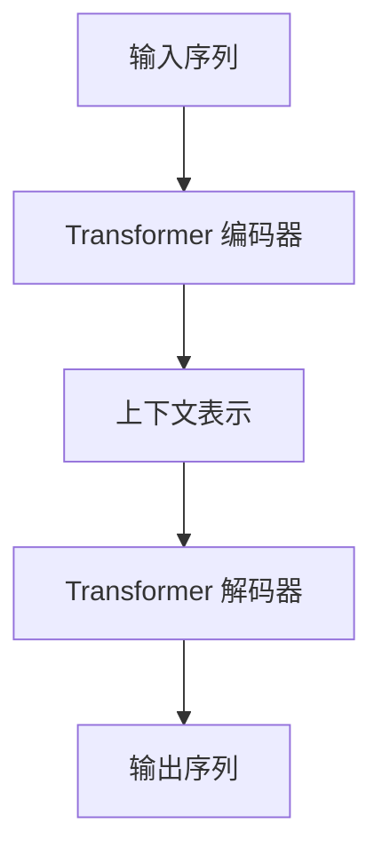

# GPT-3原理与代码实例讲解

## 1.背景介绍

在过去几年中,自然语言处理(NLP)领域取得了长足的进步,很大程度上归功于Transformer模型和大型语言模型(LLM)的出现。其中,GPT-3是一个里程碑式的大型语言模型,由OpenAI在2020年推出,它展示了惊人的自然语言生成能力,在广泛的下游任务中取得了出色的表现。

GPT-3是一个基于Transformer解码器的自回归语言模型,使用了大规模的语料进行预训练。它能够理解和生成自然语言文本,并被应用于各种NLP任务,如机器翻译、问答系统、文本摘要、代码生成等。GPT-3的核心优势在于其巨大的模型规模(拥有1750亿个参数)和多样化的预训练语料,使其能够捕捉到丰富的语言知识和上下文信息。

本文将深入探讨GPT-3的原理、架构和训练方法,并通过代码示例帮助读者更好地理解其内部工作机制。我们还将分析GPT-3在实际应用中的表现,讨论其局限性和未来发展趋势。

## 2.核心概念与联系

### 2.1 Transformer模型

GPT-3的核心架构基于Transformer模型,这是一种革命性的序列到序列(Seq2Seq)模型,在2017年由Google Brain团队提出。Transformer完全依赖于注意力(Attention)机制,摒弃了传统的RNN和CNN结构,显著提高了并行计算能力和长期依赖捕捉能力。

Transformer由编码器(Encoder)和解码器(Decoder)两部分组成。编码器将输入序列映射为上下文表示,解码器则根据上下文表示和先前生成的输出token,预测下一个token。注意力机制在两部分中都扮演着关键角色,用于捕捉输入和输出序列之间的长程依赖关系。



### 2.2 自回归语言模型

GPT-3属于自回归语言模型(Autoregressive Language Model)的范畴。自回归模型的核心思想是基于先前生成的token,预测下一个token的概率分布。形式上,给定一个token序列$x_1, x_2, \ldots, x_n$,自回归模型需要学习联合概率分布:

$$P(x_1, x_2, \ldots, x_n) = \prod_{t=1}^n P(x_t | x_1, \ldots, x_{t-1})$$

在生成过程中,模型会自回归地预测下一个token,并将其作为输入继续预测后续token。这种方式使得模型能够生成连贯、上下文相关的文本。

### 2.3 预训练与微调

GPT-3采用了"预训练+微调"的范式,这是当前主流的大型语言模型训练方式。预训练阶段使用海量的无监督文本语料(包括网页、书籍、代码等)对模型进行通用语言表示学习;微调阶段则在特定的下游任务上,使用相应的标注数据对预训练模型进行进一步调整和优化。

预训练的目标是最大化模型在语料库上的似然概率,即最小化语言模型损失函数。而微调阶段的目标则是最小化特定任务的损失函数,例如机器翻译任务的交叉熵损失。通过这种分阶段的训练方式,大型语言模型能够从通用语料中学习丰富的语言知识,并在特定任务上进行快速适应和迁移。

## 3.核心算法原理具体操作步骤 

### 3.1 Transformer解码器

GPT-3的核心是基于Transformer解码器的自回归语言模型。解码器由多个相同的解码器层组成,每一层包含多头自注意力(Multi-Head Self-Attention)和前馈神经网络(Feed-Forward Neural Network)两个子层。

1. **多头自注意力**

自注意力机制是Transformer的核心,它允许模型关注输入序列中的不同位置,捕捉长程依赖关系。在解码器中,自注意力被应用于先前生成的token序列,以捕捉上下文信息。

具体来说,给定一个输入序列$X = (x_1, x_2, \ldots, x_n)$,自注意力计算过程如下:

$$\begin{aligned}
Q &= XW^Q\\
K &= XW^K\\
V &= XW^V\\
\text{Attention}(Q, K, V) &= \text{softmax}(\frac{QK^T}{\sqrt{d_k}})V
\end{aligned}$$

其中$Q$、$K$、$V$分别表示查询(Query)、键(Key)和值(Value)向量,它们通过不同的线性变换从输入$X$计算得到。$d_k$是缩放因子,用于防止点积过大导致的梯度饱和问题。

多头注意力机制通过并行运行多个注意力头,从不同的表示子空间捕捉信息,进一步提高了模型的表示能力。

2. **前馈神经网络**

前馈神经网络是一个简单的全连接前馈网络,对自注意力的输出进行进一步的非线性映射,丰富特征表示。其计算过程如下:

$$\text{FFN}(x) = \max(0, xW_1 + b_1)W_2 + b_2$$

其中$W_1$、$W_2$、$b_1$、$b_2$分别是可训练的权重和偏置参数。

3. **残差连接和层归一化**

为了缓解深度神经网络的梯度消失和梯度爆炸问题,Transformer在每个子层后使用了残差连接(Residual Connection)和层归一化(Layer Normalization)操作。

残差连接将子层的输入和输出相加,以保持梯度传播的流动性:

$$x' = \text{LayerNorm}(x + \text{Sublayer}(x))$$

层归一化则对输入进行归一化处理,加速收敛并提高模型的泛化能力。

### 3.2 自回归生成过程

在生成过程中,GPT-3自回归地预测下一个token的概率分布,并根据概率最大的token进行采样。具体步骤如下:

1. 将已生成的token序列$x_1, x_2, \ldots, x_t$输入到Transformer解码器中。
2. 解码器计算出下一个时间步$t+1$的条件概率分布$P(x_{t+1} | x_1, \ldots, x_t)$。
3. 从概率分布中采样得到下一个token $x_{t+1}$。
4. 将$x_{t+1}$附加到已生成的序列中,重复步骤1-3,直到达到预设的最大长度或生成终止符号。

在采样过程中,可以使用不同的策略来控制生成质量和多样性,例如top-k采样、nucleus采样(top-p采样)等。这些策略通过截断概率分布的长尾部分,避免生成低概率且不相关的token。

此外,GPT-3还支持条件生成(Conditional Generation),即在生成过程中提供一个提示(Prompt),模型会根据提示生成与之相关的连贯文本。这种方式在许多应用场景中都有实际用途。

## 4.数学模型和公式详细讲解举例说明

### 4.1 自注意力机制

自注意力机制是Transformer模型的核心,它允许模型关注输入序列中的不同位置,捕捉长程依赖关系。我们以一个简单的例子来说明自注意力的计算过程。

假设我们有一个长度为4的输入序列$X = (x_1, x_2, x_3, x_4)$,其中每个$x_i$是一个向量表示。我们希望计算第三个位置$x_3$的注意力输出,即$\text{Attention}(Q_3, K, V)$。

1. 首先,我们需要计算查询(Query)、键(Key)和值(Value)向量:

$$\begin{aligned}
Q_3 &= x_3W^Q\\
K &= (x_1, x_2, x_3, x_4)W^K = (k_1, k_2, k_3, k_4)\\
V &= (x_1, x_2, x_3, x_4)W^V = (v_1, v_2, v_3, v_4)
\end{aligned}$$

其中$W^Q$、$W^K$、$W^V$是可训练的权重矩阵。

2. 接下来,我们计算查询$Q_3$与每个键$k_i$的点积,并除以缩放因子$\sqrt{d_k}$,得到注意力分数(Attention Scores):

$$\text{Attention Scores} = (Q_3k_1^T/\sqrt{d_k}, Q_3k_2^T/\sqrt{d_k}, Q_3k_3^T/\sqrt{d_k}, Q_3k_4^T/\sqrt{d_k})$$

3. 对注意力分数应用softmax函数,得到注意力权重(Attention Weights):

$$\text{Attention Weights} = \text{softmax}(\text{Attention Scores})$$

4. 最后,我们将注意力权重与值向量$V$相乘,得到加权和作为注意力输出:

$$\begin{aligned}
\text{Attention Output} &= \sum_{i=1}^4 \text{Attention Weight}_i \cdot v_i\\
&= \text{Attention}(Q_3, K, V)
\end{aligned}$$

通过这种方式,自注意力机制能够自适应地为每个位置分配不同的注意力权重,捕捉输入序列中的重要信息。

在实际应用中,Transformer使用了多头注意力(Multi-Head Attention),它将注意力机制并行运行多次,每次使用不同的投影向量,最终将所有注意力头的输出进行拼接,从而提高模型的表示能力。

### 4.2 语言模型损失函数

GPT-3在预训练阶段的目标是最大化模型在语料库上的似然概率,即最小化语言模型损失函数。对于一个长度为$N$的token序列$X = (x_1, x_2, \ldots, x_N)$,语言模型损失函数定义为:

$$\mathcal{L}(X) = -\frac{1}{N}\sum_{t=1}^N \log P(x_t | x_1, \ldots, x_{t-1}; \theta)$$

其中$\theta$表示模型的参数,目标是最小化损失函数$\mathcal{L}(X)$,使得模型能够更好地预测序列$X$中的每个token。

在实际训练中,我们通常在整个语料库$\mathcal{D}$上计算损失函数的期望,并使用随机梯度下降法进行优化:

$$\theta^* = \arg\min_\theta \mathbb{E}_{X \sim \mathcal{D}}[\mathcal{L}(X; \theta)]$$

通过最小化语言模型损失函数,GPT-3能够从海量的无监督文本语料中学习丰富的语言知识和上下文信息,为后续的下游任务微调奠定基础。

## 5.项目实践：代码实例和详细解释说明

为了更好地理解GPT-3的工作原理,我们提供了一个基于PyTorch实现的简化版本代码示例。该示例包含了一个小型Transformer解码器模型,用于生成简单的英文句子。

### 5.1 导入必要的库

```python
import torch
import torch.nn as nn
import torch.nn.functional as F
import math
```

### 5.2 定义模型架构

```python
class TransformerDecoderLayer(nn.Module):
    def __init__(self, d_model, nhead, dim_feedforward, dropout=0.1):
        super(TransformerDecoderLayer, self).__init__()
        self.self_attn = nn.MultiheadAttention(d_model, nhead, dropout=dropout)
        self.linear1 = nn.Linear(d_model, dim_feedforward)
        self.dropout = nn.Dropout(dropout)
        self.linear2 = nn.Linear(dim_feedforward, d_model)

        self.norm1 = nn.LayerNorm(d_model)
        self.norm2 = nn.LayerNorm(d_model)
        self.dropout1 = nn.Dropout(dropout)
        self.dropout2 = nn.Dropout(dropout)

    def forward(self, tgt, memory, tgt_mask=None):
        tgt2 = self.self_attn(tgt, tgt, tgt, attn_mask=tgt_mask)[0]
        tgt = tgt + self.dropout1(tgt2)
        tgt = self.norm1(tgt)
        tgt2 = self.linear2(self.dropout(F.relu(self.linear1(tgt))))
        tgt = tgt + self.dropout2(tgt2)
        tgt = self.norm2(tgt)
        return t