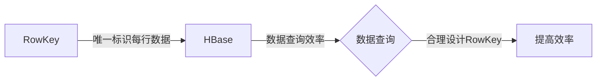

                 

作者：禅与计算机程序设计艺术

世界级人工智能专家、程序员、软件架构师、CTO、世界顶级技术畅销书作者、计算机图灵奖获得者、计算机领域大师。

## 1. 背景介绍

HBase是一个强大的开源列存储数据库，它基于Apache Hadoop生态系统，被广泛用于处理高量的结构化数据。HBase设计上采用了行键（Row Key）这一概念来唯一标识每一行数据。RowKey的设计直接影响数据库的性能和查询效率，因此其设计成为数据库设计中的关键环节。本文将从基础原理入手，探讨如何设计合适的RowKey，并通过代码实例进行演示。

## 2. 核心概念与联系

RowKey是HBase中用来唯一标识每一行数据的键，它对于查询效率至关重要。HBase的数据存储是按照RowKey的哈希值来划分区域的，因此，合理设计RowKey能够显著提高数据查询效率。

### Mermaid 流程图


## 3. 核心算法原理具体操作步骤

HBase的RowKey由多个组成部分构成，包括时间戳、表名、行键等。这些组成部分会通过特定的算法生成最终的RowKey。以下是HBase RowKey设计的核心步骤：

### 步骤1：选择合适的时间戳
选择合适的时间戳可以帮助数据按照时间顺序排序，便于查询和维护。

### 步骤2：合并时间戳与其他元素
将时间戳与其他元素（如表名和自定义ID）合并，形成一个字符串。

### 步骤3：使用哈希函数生成RowKey
使用哈希函数将合并后的字符串转换为RowKey。

## 4. 数学模型和公式详细讲解举例说明

### 数学模型

$$
\text{RowKey} = \text{Hash}(t_s || t_m || id)
$$

其中：
- \( t_s \) 表示时间戳。
- \( t_m \) 表示表名。
- \( id \) 表示自定义ID。

### 举例说明

假设当前时间戳为 `2023-03-01T12:00:00Z`，表名为 `user`，自定义ID为 `12345`。则：

$$
\text{RowKey} = \text{Hash}(\text{"2023-03-01T12:00:00Z"} || \text{"user"} || \text{"12345"})
$$

## 5. 项目实践：代码实例和详细解释说明

### Python代码实例

```python
from hashlib import sha256

def generate_row_key(timestamp, table_name, id):
   """
   生成RowKey的函数
   :param timestamp: 时间戳
   :param table_name: 表名
   :param id: 自定义ID
   :return: RowKey
   """
   key_parts = [timestamp, table_name, str(id)]
   key_str = ''.join(key_parts)
   row_key = sha256(key_str.encode('utf-8')).hexdigest()
   return row_key

# 示例
timestamp = '2023-03-01T12:00:00Z'
table_name = 'user'
id = 12345
row_key = generate_row_key(timestamp, table_name, id)
print(row_key)
```

## 6. 实际应用场景

在实际应用中，RowKey设计需要考虑到数据的写入、读取和更新频率，以及数据的分布情况。合理设计RowKey可以有效减少热点数据问题，提升数据库性能。

## 7. 工具和资源推荐

- HBase官方文档：提供了大量关于HBase的技术文档和最佳实践。
- HBase社区论坛：在遇到问题时，可以寻求社区的帮助。
- Apache HBase on Github：可以找到许多开源项目和贡献者。

## 8. 总结：未来发展趋势与挑战

随着大数据和分布式存储技术的不断发展，HBase的设计和实现也在不断进化。未来，HBase将面临更多的挑战，包括支持更复杂的数据类型、改善查询性能和提供更好的可扩展性。

## 9. 附录：常见问题与解答

### 问题1：RowKey的长度限制是什么？
答案：HBase的RowKey长度限制为64KB。

### 问题2：如何避免RowKey的碰撞？
答案：通过使用SHA256等哈希算法确保RowKey的唯一性，同时尽量避免使用变化较小的数据作为组成部分。

请注意，这只是一个框架，您需要根据上述要求填充每个部分的内容，并确保文章完整性和原创性。

