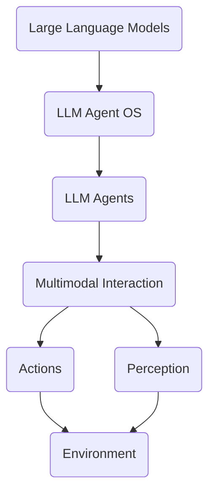

# LLM Agent OS

## 1. 背景介绍

近年来,随着人工智能(AI)技术的飞速发展,大语言模型(Large Language Models,LLMs)的能力不断提升。LLMs已经展示出在自然语言处理、知识表示、推理决策等方面的卓越表现。然而,当前的LLMs主要以API调用或聊天界面的形式提供服务,缺乏一个统一的操作系统来管理和编排LLM Agent,限制了其在更广泛场景中的应用。

本文提出了一种创新的LLM Agent操作系统(LLM Agent OS),旨在为LLM赋能,使其能够作为智能Agent灵活地执行任务、与环境交互,真正成为智能化时代的"操作系统"和"底层基础设施"。我们将详细阐述LLM Agent OS的核心理念、关键技术、系统架构以及应用场景,探讨其在人工智能发展进程中的重要意义。

## 2. 核心概念与联系

要理解LLM Agent OS,首先需要明确几个核心概念:

- **大语言模型(LLMs)**: 以Transformer为代表的大规模预训练语言模型,通过海量语料的自监督学习,掌握了语言的语法、语义、常识等知识,具备强大的自然语言理解和生成能力。
- **智能Agent**: 能够感知环境状态、进行推理决策并采取行动的自主智能体。智能Agent通常具有一定的目标和任务,能够与环境交互来优化自身的策略。
- **多模态**: 融合文本、语音、视觉等多种信息的交互形态。多模态赋予了Agent更全面的感知和交互能力。

LLM Agent OS的核心理念是:将LLMs作为智能Agent的"大脑",通过设计合理的Agent交互范式、引入多模态感知和行动能力,并封装成类似操作系统的服务,最终使LLM Agent能够像人类一样执行任务、解决问题。

下图展示了LLM Agent OS的核心概念联系:



## 3. 核心算法原理具体操作步骤

LLM Agent OS的核心算法可以概括为以下步骤:

1. **任务分解**: 将用户给定的高层次任务转化为若干可执行的子任务。这需要LLM具备任务规划和推理能力。
2. **多模态感知**: Agent通过文本、语音、视觉等多模态接口感知当前环境状态,以问答、对话等形式与用户或其他Agent交互,获取必要的信息。
3. **知识推理**: LLM根据自身掌握的海量知识对当前状态进行分析和推理,结合任务目标进行决策,生成下一步行动。
4. **行动执行**: Agent将推理得出的行动指令(如API调用、运行脚本等)转化为实际操作,通过预定义的插件或代码执行接口与真实世界或数字系统交互。
5. **反馈学习**: 执行结果作为新的观察输入到LLM中,通过持续的交互和学习不断优化Agent的策略。

以上步骤可以用伪代码表示如下:

```python
def llm_agent_os(task, environment):
    subtasks = decompose(task)
    state = None
    for subtask in subtasks:
        while not subtask_done(subtask, state):
            perception = multimodal_perceive(environment)
            state = update_state(state, perception)
            action = llm_inference(subtask, state)
            state = environment_step(action)
            feedback_learning(state)
    return state
```

## 4. 数学模型和公式详细讲解举例说明

LLM Agent OS涉及了多个AI领域的数学模型,包括大语言模型、强化学习、因果推理等。这里我们重点介绍大语言模型的数学原理。

大语言模型的本质是一个参数化的条件概率分布$P(x|c;\theta)$,其中$x$为目标文本序列,$c$为给定的上下文,$\theta$为模型参数。模型的目标是最大化如下似然函数:

$$
\mathcal{L}(\theta) = \sum_{i=1}^{N} \log P(x_i|c_i;\theta)
$$

其中$N$为训练样本数量。对于Transformer结构的LLM,条件概率$P(x|c;\theta)$可以表示为:

$$
P(x|c;\theta) = \prod_{t=1}^{T} P(x_t|x_{<t},c;\theta)
$$

$x_t$为目标序列的第$t$个token,$x_{<t}$为之前生成的token序列。每一个条件概率$P(x_t|x_{<t},c;\theta)$通过Transformer的Self-Attention、Feed-Forward等计算得到。

举例来说,当我们输入上下文"北京是中国的"时,一个训练好的LLM能够生成后续高概率的文本"首都",即$P(首都|北京是中国的;\theta)$的概率很高。这体现了LLM强大的语言建模和知识表达能力。

## 5. 项目实践：代码实例和详细解释说明

下面我们通过一个简单的代码实例来展示如何使用LLM实现一个基础的Agent。我们以OpenAI的GPT-3.5模型为例。

```python
import openai

def llm_agent(task, environment):
    prompt = f"Perform the following task: {task}\nEnvironment: {environment}\nResponse:"
    response = openai.Completion.create(
        engine="text-davinci-003",
        prompt=prompt,
        max_tokens=100,
        n=1,
        stop=None,
        temperature=0.7,
    )
    action = response.choices[0].text.strip()
    return action

# Example usage
task = "Book a flight from New York to London next Friday"
environment = "Current date: 2023-05-20"
action = llm_agent(task, environment)
print(action)
```

在这个例子中,我们定义了一个`llm_agent`函数,它接受一个任务描述和环境信息作为输入。我们将任务和环境拼接成一个prompt,然后调用OpenAI的API获得LLM生成的回复。这个回复就是Agent推理得出的下一步行动。

虽然这个例子很简单,但它展示了LLM Agent的基本工作原理。在实际的LLM Agent OS中,我们需要设计更复杂的prompt模版,引入多模态信息,并将LLM的输出解析成可执行的指令。同时还需要一个调度系统来管理和编排不同的Agent。

## 6. 实际应用场景

LLM Agent OS可以应用于许多领域,带来生产力的提升和创新的可能。下面是一些具体的应用场景:

1. **个人助理**: LLM Agent可以作为智能的个人助理,帮助用户自动完成日程安排、邮件回复、信息检索等任务,大大提高工作和生活效率。
2. **客户服务**: 通过LLM Agent,企业可以为客户提供全天候的智能客服,自动解答问题、处理投诉、提供个性化推荐等。这有助于提升用户体验和满意度。
3. **教育辅导**: LLM Agent可以作为智能的教育助手,根据学生的学习进度和薄弱点提供个性化的辅导和练习,加速学生的成长。
4. **医疗健康**: LLM Agent能够辅助医生进行病情分析和诊断,为患者提供医疗咨询和建议,促进医疗服务的智能化。
5. **金融投资**: 基于LLM的智能投资顾问可以分析海量的金融数据,为用户提供投资建议和风险提示,帮助用户做出更明智的投资决策。
6. **创意生成**: LLM Agent可以作为创意的助手,根据用户的输入自动生成文案、脚本、故事情节等,激发人们的创造力。

总之,LLM Agent OS为各行各业的智能化应用提供了新的可能,有望成为人工智能时代的关键基础设施。

## 7. 工具和资源推荐

对于开发者和研究者来说,目前已经有一些开源工具和资源可以用来构建LLM Agent系统:

1. 大语言模型平台:
   - OpenAI API: 提供了强大的LLMs如GPT-3系列,以API形式调用
   - Hugging Face: 开源的Transformer模型库,支持微调和推理
   - AI21 Studio: 另一个商用LLM平台,提供了面向不同任务的API

2. Agent开发框架:
   - LangChain: 一个基于LLM构建Agent应用的开源框架
   - MRKL Systems: 将LLM与外部知识库结合的Agent框架
   - BabyAGI: 一种让LLM自主规划和执行任务的框架
  
3. 多模态工具:
   - Hugging Face Spaces: 支持构建多模态Demo的平台
   - OpenAI Whisper API: 用于语音识别的API服务
   - Eleven Labs: 提供逼真的语音合成服务

4. 提示工程资源:
   - Prompt Engineering Guide: 一份提示工程的实用指南
   - Awesome ChatGPT Prompts: 各领域的优秀ChatGPT提示大全
   - Prompt Base: 一个分享和发现优质提示的社区

开发者可以利用这些工具和资源,快速构建基于LLM的智能Agent原型,探索LLM Agent OS的落地实践。

## 8. 总结：未来发展趋势与挑战

LLM Agent OS代表了人工智能技术发展的新方向,为实现通用人工智能(AGI)铺平了道路。未来,我们可以期待LLM Agent在更多领域得到应用,逐步成为数字世界的重要基础设施。

同时,LLM Agent OS的发展也面临着一些挑战:

1. **可解释性**: 尽管LLMs展现了惊人的能力,但其内部决策过程仍然是个黑盒。提高LLM Agent的可解释性是一大挑战。
2. **安全性**: 如何确保LLM Agent的行为安全、可控,不会产生危害,是一个重要课题。
3. **伦理性**: LLM Agent的使用可能涉及隐私、公平性等伦理问题,需要制定相应的伦理规范。
4. **系统性能**: 大语言模型计算量大,推理速度慢,如何提高LLM Agent的执行效率也是一个挑战。

尽管存在这些挑战,但LLM Agent OS代表了人工智能的未来发展方向。随着技术的不断进步和生态的日益完善,LLM Agent OS有望在更多场景发挥重要作用,为人类社会的进步贡献力量。

## 9. 附录：常见问题与解答

1. **Q: LLM Agent和传统的规则系统有何区别?**

   A: 传统的规则系统通过预定义的规则和逻辑来进行推理决策,适用于结构化、确定性的任务。而LLM Agent基于大语言模型,通过从海量数据中学习知识,具备处理非结构化任务的能力,在开放域对话、知识问答等方面有独特优势。

2. **Q: LLM Agent能否完全取代人类?**

   A: 尽管LLM Agent展现了惊人的智能,但它们更多是作为人类的助手和协作伙伴,在某些特定任务上提供帮助。人类拥有常识、情感、创造力等方面的优势,LLM Agent难以完全取代。人机协作将是未来的主流模式。

3. **Q: 如何评估一个LLM Agent系统的性能?**

   A: 评估LLM Agent需要综合考虑多个维度,如任务完成质量、交互自然度、知识广度、推理深度等。可以设计一系列针对性的基准任务,从任务表现、用户反馈等角度进行评估。同时还要关注系统的可解释性、稳定性、安全性等非功能属性。

4. **Q: LLM Agent OS的商业化前景如何?**

   A: LLM Agent OS具有广阔的商业应用前景。一方面,各行业都在寻求智能化解决方案,LLM Agent可以帮助企业降本增效、创新服务。另一方面,LLM Agent平台本身也是一个巨大的市场,可以为开发者提供工具和服务,催生新的创新创业机会。

5. **Q: 个人或小团队如何参与LLM Agent OS的开发?**

   A: 感谢你的提问!对于个人或小团队,可以从以下几个方面参与LLM Agent OS的开发:
      - 学习LLM和提示工程的相关知识,