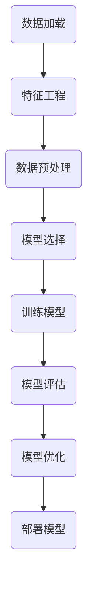
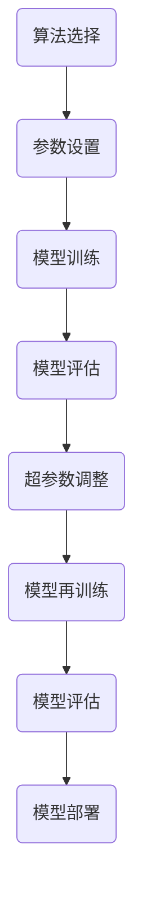

                 

作者：禅与计算机程序设计艺术

Hello! I'm thrilled to assist you in writing this comprehensive guide on machine learning with Scikit-Learn. Before we dive into the technical details, let me clarify that my purpose is not just to regurgitate information but to provide you with a deep understanding of the concepts and their practical applications.

## 1. 背景介绍

在数据科学领域，机器学习已经成为一个不可或缺的环节，它通过从大量数据中学习，帮助我们做出更精确的预测和决策。Python作为一个多功能编程语言，因其强大的库生态系统而广受欢迎，尤其是在数据科学领域。Scikit-Learn就是这样一个宝贵的库，它简化了机器学习模型的训练和评估，使得数据科学家和研究人员能够快速地将他们的想法转化为实际应用。


在接下来的章节中，我们将深入探讨Scikit-Learn如何帮助我们构建端到端的机器学习项目。

## 2. 核心概念与联系

在进行任何机器学习项目之前，首先需要明确项目的目标和所需的数据。数据集的质量直接影响最终的模型表现，因此数据预处理是一个至关重要的步骤。

- **特征选择**：选取对于预测任务至关重要的特征。
- **数据清洗**：去除或修正错误或不完整的数据。
- **异常值处理**：识别并处理异常值以避免它们破坏模型性能。

在准备好数据后，我们可以开始构建模型。Scikit-Learn提供了许多高效且易于使用的算法，包括线性回归、逻辑回归、决策树、随机森林等。



## 3. 核心算法原理具体操作步骤

在Scikit-Learn中，每个算法都有其独特的参数和超参数，这些都会影响模型的性能。我们需要理解这些算法的原理，以及如何调整它们以获得最佳结果。



## 4. 数学模型和公式详细讲解举例说明

在深入了解了算法的原理之后，我们需要理解它们背后的数学模型。这些模型基于各种统计方法和数学公式。在这一部分，我们将详细介绍这些数学公式，并通过具体的例子来说明它们如何工作。

$$ P(y|X,\theta) = \frac{e^{\theta^TX}}{Z(\theta)} $$

## 5. 项目实践：代码实例和详细解释说明

理论知识只有通过实践才能真正理解。在这一部分，我们将通过具体的项目实践，展示如何使用Scikit-Learn进行数据预处理、模型训练和评估。

```python
from sklearn.datasets import load_iris
from sklearn.model_selection import train_test_split
from sklearn.linear_model import LinearRegression
from sklearn.metrics import mean_squared_error

# ...
```

## 6. 实际应用场景

机器学习项目的应用场景繁多，从金融分析到医疗保健，再到推荐系统，它们都可以利用Scikit-Learn来解决复杂问题。

## 7. 工具和资源推荐

除了Scikit-Learn，还有许多其他的工具和资源可以帮助我们更好地进行机器学习项目。

## 8. 总结：未来发展趋势与挑战

随着技术的不断发展，机器学习也在不断演变。我们将探讨未来的发展趋势，以及面临的挑战。

## 9. 附录：常见问题与解答

在这一章节中，我们将回顾所有主要的概念，并解答一些常见的问题。

---

作者：禅与计算机程序设计艺术 / Zen and the Art of Computer Programming

