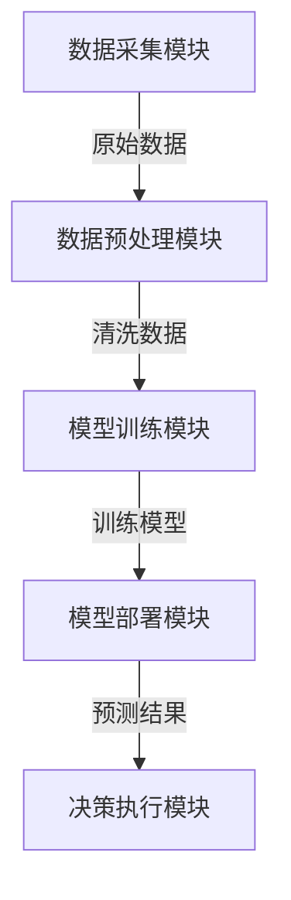

# Python机器学习实战：机器学习在智能交通系统中的应用

## 1. 背景介绍

### 1.1 智能交通系统的重要性

随着城市化进程的加快和汽车保有量的不断增长,交通拥堵、安全隐患等问题日益严重,亟需建立高效、智能的交通管理系统来缓解这些问题。智能交通系统(Intelligent Transportation Systems, ITS)正是为解决这些挑战而诞生的一种创新性交通管理方案。

ITS通过整合现代信息技术、数据通信技术、电子感知技术、自动控制技术等,实现对整个交通运行系统的实时监控、有效管理和科学调度,从而提高交通运营效率、确保行车安全、减少能源消耗和环境污染。

### 1.2 机器学习在智能交通系统中的作用

机器学习作为人工智能的一个重要分支,在智能交通系统的建设和优化中扮演着越来越重要的角色。通过对历史交通数据的学习和分析,机器学习算法可以发现数据中潜在的规律和模式,从而实现交通流量的精准预测、交通事件的智能识别、交通信号的自适应控制等,极大提升了交通系统的智能化水平。

## 2. 核心概念与联系  

在智能交通系统中应用机器学习技术涉及多个核心概念,它们之间存在紧密的联系。让我们逐一了解这些概念。

### 2.1 交通大数据采集

为了应用机器学习算法,首先需要获取足够的交通数据作为训练样本。常见的交通数据采集方式包括:

- 路侧设备(如感应线圈、视频监控等)
- 车载设备(如GPS、OBD等)
- 移动终端(如手机APP等)
- 社交媒体数据等

这些数据包括交通流量、车辆位置、速度、行程时间等,需要进行数据清洗和预处理,为后续的机器学习算法提供高质量的数据支持。

### 2.2 交通模式识别

基于采集的交通大数据,可以应用机器学习算法对交通模式进行识别,例如:

- 交通流量模式识别
- 驾驶行为模式识别
- 交通事件(如拥堵、事故等)识别

常用的机器学习算法包括分类算法(如决策树、支持向量机等)、聚类算法(如K-Means等)、深度学习算法(如卷积神经网络等)。

### 2.3 交通预测与决策

通过对历史数据的学习,机器学习算法可以预测未来的交通状况,例如:

- 短期交通流量预测
- 长期交通需求预测
- 交通事件发生概率预测

基于预测结果,可以进一步优化交通管控策略,实现交通信号自适应控制、可变车道配置、智能路径规划等,从而提高交通系统的运营效率和应对能力。

### 2.4 机器学习系统架构

为了将机器学习算法应用于实际的智能交通系统中,需要构建完整的系统架构,涵盖数据采集、数据预处理、模型训练、模型部署、决策执行等多个环节,并实现各模块的seamless集成和高效协作。



该系统架构需要具备实时数据处理、高性能计算、可扩展性等特性,以满足智能交通系统的实际需求。

通过上述核心概念的介绍,我们可以看到机器学习在智能交通系统中扮演着连接器和赋能者的重要角色,将海量的交通数据转化为有价值的知识和决策,推动交通系统向智能化和精细化方向发展。

## 3. 核心算法原理及操作步骤

机器学习在智能交通系统中的应用涉及多种算法,本节将重点介绍其中两种常用且具有代表性的算法:K-Means聚类算法和长短期记忆(LSTM)神经网络。

### 3.1 K-Means聚类算法

K-Means是一种无监督学习算法,常用于交通模式识别,如交通流量模式聚类、驾驶行为模式聚类等。其核心思想是将n个样本数据划分为k个簇,使得簇内数据点之间的距离尽可能小,簇间数据点之间的距离尽可能大。算法步骤如下:

1. 随机选取k个初始质心
2. 计算每个数据点到各个质心的距离,将其归入距离最近的簇
3. 重新计算每个簇的质心
4. 重复步骤2和3,直至质心不再发生变化

该算法的优点是简单高效,但也存在一些缺陷,如对初始质心的选择敏感、难以处理非凸形状的簇等。在实际应用中,可以结合其他算法或先验知识来提高聚类效果。

### 3.2 长短期记忆(LSTM)神经网络

LSTM是一种特殊的递归神经网络,广泛应用于时序数据的建模和预测,如交通流量预测、交通需求预测等。与传统的循环神经网络相比,LSTM引入了门控机制和记忆细胞,能够更好地捕捉长期依赖关系,避免梯度消失或爆炸问题。

LSTM的核心思想是通过遗忘门、输入门和输出门来控制信息的流动,从而决定删除、保留或者添加哪些信息到记忆细胞中。具体来说,在时间步t,LSTM的计算过程如下:

1. 遗忘门: $$f_t = \sigma(W_f \cdot [h_{t-1}, x_t] + b_f)$$
2. 输入门: $$i_t = \sigma(W_i \cdot [h_{t-1}, x_t] + b_i)$$
3. 候选记忆细胞: $$\tilde{C}_t = \tanh(W_C \cdot [h_{t-1}, x_t] + b_C)$$
4. 记忆细胞: $$C_t = f_t \odot C_{t-1} + i_t \odot \tilde{C}_t$$
5. 输出门: $$o_t = \sigma(W_o \cdot [h_{t-1}, x_t] + b_o)$$
6. 隐藏状态: $$h_t = o_t \odot \tanh(C_t)$$

其中,$\sigma$表示sigmoid函数,$\odot$表示元素wise乘积,W和b分别表示权重矩阵和偏置向量。

在训练过程中,LSTM通过反向传播算法来学习这些门控权重,使得输出序列能够很好地拟合目标序列。训练完成后,LSTM可以对新的输入序列进行预测,广泛应用于交通流量预测、交通需求预测等场景。

上述两种算法均有其适用场景和特点,在实际应用中需要结合具体问题进行选择和优化,以获得最佳的效果。

## 4. 数学模型和公式详细讲解

在机器学习算法中,数学模型和公式扮演着十分重要的角色,是算法的理论基础。本节将重点介绍在智能交通系统中常用的两种数学模型:交通流理论模型和时间序列预测模型。

### 4.1 交通流理论模型

交通流理论模型旨在描述交通流的宏观行为,为交通状态预测、交通控制等提供理论支撑。著名的交通流模型包括:

1. **车辆跟驱模型(Car-Following Model)**

   描述前车与后车之间的相互作用,常用于微观交通仿真。著名的模型有Gipps模型、IDM模型等。以IDM模型为例,加速度公式如下:

   $$a = a_{max}\left(1 - \left(\frac{v}{v_0}\right)^\delta - \left(\frac{s^*(v,\Delta v)}{s}\right)^2\right)$$

   其中,$a$为加速度,$v$为当前速度,$v_0$为期望速度,$s$为与前车的距离,$\Delta v$为与前车的速度差,$s^*$为期望车距,$a_{max}$和$\delta$为模型参数。

2. **宏观交通流模型(Macroscopic Traffic Flow Model)**

   从整体上描述交通流的密度、流量、速度等宏观特征,常用于交通网络建模和控制。著名的模型有LWR模型、METANET模型等。以LWR模型为例,交通流守恒方程如下:

   $$\frac{\partial \rho}{\partial t} + \frac{\partial q}{\partial x} = 0$$

   其中,$\rho$为交通密度,$q$为交通流量,$t$为时间,$x$为空间坐标。流量$q$与密度$\rho$的关系由基本diagram给出:$q = \rho v(\rho)$。

这些模型为交通流量预测、交通控制等提供了理论基础,同时也为机器学习算法的设计和优化提供了有价值的启发。

### 4.2 时间序列预测模型

交通流量、行程时间等交通指标通常表现为时间序列的形式,因此时间序列预测模型在智能交通系统中有着广泛的应用。常见的时间序列预测模型包括:

1. **自回归移动平均模型(ARMA)**

   ARMA模型将时间序列$y_t$表示为自回归(AR)部分和移动平均(MA)部分的线性组合:

   $$y_t = c + \phi_1y_{t-1} + \phi_2y_{t-2} + ... + \phi_py_{t-p} + \theta_1\epsilon_{t-1} + \theta_2\epsilon_{t-2} + ... + \theta_q\epsilon_{t-q} + \epsilon_t$$

   其中,$c$为常数项,$\phi_i$和$\theta_j$分别为AR和MA部分的系数,$\epsilon_t$为白噪声序列。ARMA模型适用于平稳时间序列。

2. **季节自回归综合移动平均模型(SARIMA)**

   SARIMA模型是ARMA模型在处理周期性时间序列时的扩展,能够很好地捕捉交通流量的日周期、周周期等规律性变化。其模型形式为:

   $$(1 - \phi_1B - ... - \phi_pB^p)(1 - \Phi_1B^s - ... - \Phi_PB^{Ps})(1 - B)^d(1 - B^s)^Dy_t = c + (1 + \theta_1B + ... + \theta_qB^q)(1 + \Theta_1B^s + ... + \Theta_QB^{Qs})\epsilon_t$$

   其中,$B$为滞后算子,$s$为周期长度,$P,Q$为季节自回归和移动平均的阶数,$d,D$分别为非季节和季节差分阶数。

3. **长短期记忆(LSTM)神经网络**

   如前所述,LSTM是一种特殊的递归神经网络,能够有效捕捉时间序列中的长期依赖关系,在交通流量预测等任务中表现出色。LSTM的核心思想是通过门控机制控制信息的流动,从而决定删除、保留或者添加哪些信息到记忆细胞中,具体公式如3.2节所示。

上述模型各有特点,在实际应用中需要结合数据的特征和任务要求进行选择和优化,以获得最佳的预测效果。

通过对数学模型和公式的详细介绍,我们可以更好地理解机器学习算法的理论基础,为算法的设计和优化提供有力支撑。

## 5. 项目实践:代码实例和详细解释

为了更好地理解机器学习在智能交通系统中的应用,本节将提供一个基于Python的实际项目案例,涵盖数据预处理、模型训练、模型评估等全流程。

### 5.1 项目概述

本项目旨在基于历史交通数据,构建一个交通流量预测模型,预测未来一段时间内的交通流量变化趋势。项目所使用的数据集来自某城市的交通监控系统,包含了过去一年中该城市多个路段的交通流量记录。

项目的主要流程如下:

1. 数据预处理
2. 特征工程
3. 模型训练
4. 模型评估
5. 模型部署

### 5.2 数据预处理

```python
import pandas as pd

# 读取原始数据
traffic_data = pd.read_csv('traffic_data.csv')

#