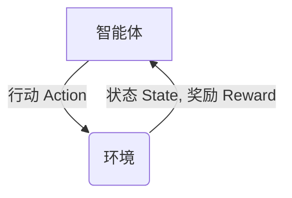

# Reinforcement Learning 原理与代码实战案例讲解

## 1.背景介绍

### 1.1 什么是强化学习？

强化学习(Reinforcement Learning, RL)是机器学习的一个重要分支,它研究如何基于环境反馈来学习行为策略,以获得最大化的长期回报。不同于监督学习需要大量标注数据,强化学习的智能体(Agent)通过与环境(Environment)不断交互,根据获得的奖励信号自主学习最优策略。

强化学习的思想源于心理学中的行为主义理论,通过奖惩机制来形成和强化期望行为。在强化学习中,智能体采取行动会影响环境的状态,环境则会给出对应的奖惩反馈,智能体的目标是通过不断尝试并根据反馈调整策略,最终获得最大化的累积奖励。

### 1.2 强化学习的应用场景

强化学习具有广泛的应用前景,包括但不限于:

- 机器人控制与规划
- 游戏AI与对抗性AI
- 自动驾驶与智能交通系统 
- 资源调度与生产制造
- 投资组合优化与金融决策
- 能源管理与智能电网
- 自然语言处理与对话系统

其中,AlphaGo战胜人类棋手在围棋领域,OpenAI的机器人手臂学会了各种操作技能,都是强化学习在实践中取得的重大突破。

## 2.核心概念与联系

### 2.1 强化学习的核心元素

强化学习系统由四个核心元素组成:

1. **智能体(Agent)**: 也称为决策者,它基于当前状态选择行动。
2. **环境(Environment)**: 智能体所处的外部世界,描述了当前状态。
3. **策略(Policy)**: 智能体根据状态选择行动的策略或规则。
4. **奖励(Reward)**: 环境给予智能体的反馈信号,指导智能体朝着正确方向学习。

智能体和环境是一个持续交互的过程,如下图所示:

### 2.2 马尔可夫决策过程

强化学习问题通常建模为**马尔可夫决策过程(Markov Decision Process, MDP)**,是一种离散时间随机控制过程。MDP由以下五元组组成:

- 状态集合 $\mathcal{S}$
- 行动集合 $\mathcal{A}$  
- 转移概率 $\mathcal{P}_{ss'}^a = \mathbb{P}(S_{t+1}=s'|S_t=s, A_t=a)$
- 奖励函数 $\mathcal{R}_s^a = \mathbb{E}[R_{t+1}|S_t=s, A_t=a]$
- 折扣因子 $\gamma \in [0, 1)$

在MDP中,智能体的目标是找到一个最优策略 $\pi^*$,使得在任何初始状态下,期望的累积折扣奖励最大化:

$$\pi^* = \arg\max_\pi \mathbb{E}_\pi[\sum_{t=0}^\infty \gamma^t R_{t+1}|S_0=s]$$

### 2.3 价值函数与贝尔曼方程

为了解决MDP问题,我们引入**价值函数(Value Function)**的概念,表示在当前状态下遵循某策略所能获得的预期累积奖励。状态价值函数和行动价值函数分别定义如下:

$$
V^\pi(s) = \mathbb{E}_\pi[\sum_{t=0}^\infty \gamma^t R_{t+1}|S_0=s] \\
Q^\pi(s,a) = \mathbb{E}_\pi[\sum_{t=0}^\infty \gamma^t R_{t+1}|S_0=s, A_0=a]
$$

价值函数满足著名的**贝尔曼方程(Bellman Equation)**:

$$
V^\pi(s) = \sum_{a \in \mathcal{A}} \pi(a|s) \Big( \mathcal{R}_s^a + \gamma \sum_{s' \in \mathcal{S}} \mathcal{P}_{ss'}^a V^\pi(s') \Big) \\
Q^\pi(s,a) = \mathcal{R}_s^a + \gamma \sum_{s' \in \mathcal{S}} \mathcal{P}_{ss'}^a V^\pi(s')
$$

求解贝尔曼方程即可获得最优价值函数和最优策略。

## 3.核心算法原理具体操作步骤 

强化学习算法主要分为三大类:基于价值函数(Value-based)、基于策略(Policy-based)和基于行动值(Actor-Critic)。我们分别介绍其核心原理和具体操作步骤。

### 3.1 基于价值函数的算法

基于价值函数的算法先估计最优价值函数,再由价值函数导出最优策略,包括经典的动态规划算法和时序差分(Temporal Difference, TD)学习算法。

#### 3.1.1 动态规划算法

动态规划算法需要已知MDP的精确模型,通过值迭代(Value Iteration)或策略迭代(Policy Iteration)求解最优价值函数和策略。

**值迭代算法步骤**:

1. 初始化价值函数 $V(s)$ 为任意值
2. 重复直到收敛:
    - 对每个状态 $s \in \mathcal{S}$, 更新 $V(s)$:
        $$V(s) \leftarrow \max_{a \in \mathcal{A}} \Big( \mathcal{R}_s^a + \gamma \sum_{s' \in \mathcal{S}} \mathcal{P}_{ss'}^a V(s') \Big)$$
3. 由最优价值函数 $V^*(s)$ 导出最优策略 $\pi^*(s)$:
    $$\pi^*(s) = \arg\max_{a \in \mathcal{A}} \Big( \mathcal{R}_s^a + \gamma \sum_{s' \in \mathcal{S}} \mathcal{P}_{ss'}^a V^*(s') \Big)$$

**策略迭代算法步骤**:

1. 初始化策略 $\pi(s)$ 为任意策略
2. 重复直到收敛:
    - 基于当前策略 $\pi$ 求解价值函数 $V^\pi$
        $$V^\pi(s) = \sum_{a \in \mathcal{A}} \pi(a|s) \Big( \mathcal{R}_s^a + \gamma \sum_{s' \in \mathcal{S}} \mathcal{P}_{ss'}^a V^\pi(s') \Big)$$
    - 由 $V^\pi$ 导出新的改进策略 $\pi'$
        $$\pi'(s) = \arg\max_{a \in \mathcal{A}} \Big( \mathcal{R}_s^a + \gamma \sum_{s' \in \mathcal{S}} \mathcal{P}_{ss'}^a V^\pi(s') \Big)$$
    - 令 $\pi \leftarrow \pi'$

#### 3.1.2 时序差分学习

时序差分(TD)学习算法通过与环境交互采样数据,逐步更新价值函数估计,无需事先知道MDP的精确模型。

**Sarsa算法步骤**:

1. 初始化行动价值函数 $Q(s,a)$ 为任意值,初始状态 $s$
2. 对每个时间步:
    - 基于当前策略 $\pi$ 选择行动 $a \sim \pi(\cdot|s)$
    - 执行行动 $a$,观测到新状态 $s'$ 和奖励 $r$
    - 基于新状态 $s'$ 选择新行动 $a' \sim \pi(\cdot|s')$ 
    - 更新 $Q(s,a)$:
        $$Q(s,a) \leftarrow Q(s,a) + \alpha \Big[ r + \gamma Q(s',a') - Q(s,a) \Big]$$
    - 令 $s \leftarrow s', a \leftarrow a'$

**Q-Learning算法步骤**:

1. 初始化行动价值函数 $Q(s,a)$ 为任意值,初始状态 $s$
2. 对每个时间步:
    - 基于当前策略 $\pi$ 选择行动 $a \sim \pi(\cdot|s)$  
    - 执行行动 $a$,观测到新状态 $s'$ 和奖励 $r$
    - 更新 $Q(s,a)$:
        $$Q(s,a) \leftarrow Q(s,a) + \alpha \Big[ r + \gamma \max_{a'} Q(s',a') - Q(s,a) \Big]$$
    - 令 $s \leftarrow s'$

### 3.2 基于策略的算法

基于策略的算法直接优化策略函数,包括策略梯度(Policy Gradient)算法。

**策略梯度算法步骤**:

1. 初始化策略参数 $\theta$,初始状态 $s$
2. 对每个episode:
    - 生成轨迹 $\tau = (s_0, a_0, r_1, s_1, a_1, ..., r_T)$ 
    - 计算累积奖励 $R(\tau) = \sum_{t=0}^T \gamma^t r_{t+1}$
    - 估计策略梯度:
        $$\hat{g} = \frac{1}{T} \sum_{t=0}^T \nabla_\theta \log \pi_\theta(a_t|s_t) R(\tau)$$
    - 更新策略参数 $\theta \leftarrow \theta + \alpha \hat{g}$

### 3.3 基于行动值的算法

基于行动值的算法结合了价值函数和策略优化的优点,包括演员-评论家(Actor-Critic)算法。

**A2C算法步骤**:

1. 初始化行动价值函数 $Q_w(s,a)$ 和策略 $\pi_\theta(a|s)$
2. 对每个时间步:
    - 基于当前策略 $\pi_\theta$ 选择行动 $a_t \sim \pi_\theta(\cdot|s_t)$
    - 执行行动 $a_t$,观测到新状态 $s_{t+1}$ 和奖励 $r_{t+1}$
    - 计算时序差分目标 $y_t = r_{t+1} + \gamma Q_w(s_{t+1}, a_{t+1})$
    - 更新行动价值函数 $Q_w$ 朝向 $y_t$
    - 计算优势函数 $A_w(s_t, a_t) = Q_w(s_t, a_t) - V_w(s_t)$
    - 更新策略 $\pi_\theta$ 朝向提高 $A_w(s_t, a_t)$ 的方向

## 4.数学模型和公式详细讲解举例说明

在强化学习中,我们经常使用数学模型和公式来形式化描述问题和算法。以下是一些常见模型和公式的详细讲解和举例说明。

### 4.1 马尔可夫决策过程(MDP)

马尔可夫决策过程(MDP)是强化学习问题的数学形式化表示,由状态集合 $\mathcal{S}$、行动集合 $\mathcal{A}$、转移概率 $\mathcal{P}_{ss'}^a$、奖励函数 $\mathcal{R}_s^a$ 和折扣因子 $\gamma$ 组成。

**举例**:

考虑一个简单的网格世界,智能体的目标是从起点到达终点。每个状态 $s$ 表示智能体在网格中的位置,行动集合 $\mathcal{A}$ 包括上下左右四个移动方向。转移概率 $\mathcal{P}_{ss'}^a$ 表示在状态 $s$ 执行行动 $a$ 后,转移到状态 $s'$ 的概率。奖励函数 $\mathcal{R}_s^a$ 可以设置为在终点给予大的正奖励,其他情况给予小的负奖励(惩罚移动)。折扣因子 $\gamma$ 控制将来奖励的重视程度。

### 4.2 价值函数和贝尔曼方程

价值函数 $V^\pi(s)$ 和 $Q^\pi(s,a)$ 表示在当前状态下遵循策略 $\pi$ 所能获得的预期累积奖励。它们满足著名的贝尔曼方程:

$$
\begin{aligned}
V^\pi(s) &= \sum_{a \in \mathcal{A}} \pi(a|s) \Big( \mathcal{R}_s^a + \gamma \sum_{s' \in \mathcal{S}} \mathcal{P}_{ss'}^a V^\pi(s') \Big) \\
Q^\pi(s,a) &= \mathcal{R}_s^a + \gamma \sum_{s' \in \mathcal{S}} \mathcal{P}_{ss'}^a V^\pi(s')
\end{aligned}
$$

**举例**:

在网格