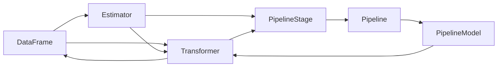

# Spark MLlib原理与代码实例讲解

## 1. 背景介绍
### 1.1 大数据时代的机器学习需求
在当今大数据时代,各行各业都在积累海量的数据。如何从这些数据中挖掘出有价值的信息和知识,成为企业获得竞争优势的关键。机器学习作为人工智能的核心,为从大规模数据中自动提取知识提供了有效的手段。然而,传统的机器学习算法和框架在处理海量数据时往往力不从心,无法满足实时性和可扩展性的要求。
### 1.2 Spark与机器学习
Apache Spark作为一个快速通用的大规模数据处理引擎,凭借其高效的内存计算和良好的可扩展性,成为大数据处理的事实标准。Spark不仅提供了高效的数据处理和SQL查询,还集成了丰富的机器学习算法库MLlib,使得在海量数据上训练机器学习模型变得简单高效。
### 1.3 MLlib概述
MLlib是Spark的分布式机器学习库,提供了常用的学习算法,如分类、回归、聚类、协同过滤等,以及底层的优化原语和高层的管道API。MLlib目标是使得实用的机器学习在Spark上变得简单和可扩展。它适用于各种规模的数据,从一台笔记本电脑到数百台服务器的集群。

## 2. 核心概念与联系
### 2.1 DataFrame与Dataset
Spark SQL提供了DataFrame和Dataset两个分布式数据集合,它们可以进行关系操作,也是MLlib的基本数据结构。DataFrame是一个分布式的行式存储的表格式数据集合,类似于关系型数据库中的二维表。Dataset是DataFrame的一个扩展,提供了强类型的API和编译时类型检查。
### 2.2 Transformer与Estimator  
MLlib使用Transformer和Estimator作为构建块,它们都是一个简单的抽象。

- Transformer: 一个转换器,它将一个DataFrame转换为另一个DataFrame。比如模型就是一个Transformer,它可以将一个不包含预测标签的测试数据集DataFrame转换为一个包含预测标签的DataFrame。

- Estimator: 一个评估器,它是学习算法或训练过程的抽象。它可以基于一个DataFrame训练出一个Transformer(通常是一个模型)。比如一个随机森林算法就是一个Estimator,它可以基于训练数据集DataFrame学习出一个随机森林模型(Transformer)。

### 2.3 Pipeline
许多机器学习问题都需要多个处理阶段,如数据预处理、特征提取、模型训练等。MLlib提供了Pipeline(管道)来指定一个机器学习工作流,它由一系列的PipelineStage(如Transformer和Estimator)组成。管道本身也是一个Estimator,可以基于训练数据集产生一个PipelineModel(也是一个Transformer)。

下面是MLlib核心概念之间的关系图:


## 3. 核心算法原理与具体步骤
本节我们将介绍MLlib中几个核心的机器学习算法的原理和使用步骤。
### 3.1 线性回归
线性回归是一种常用的有监督学习算法,用于预测连续型目标变量。它假设目标变量可以被输入变量的线性组合所近似。
#### 3.1.1 算法原理
设有m个训练样本,每个样本有n个特征。令 $x^{(i)}$ 表示第i个样本的特征向量, $y^{(i)}$ 表示其对应的目标值。我们希望学习一个线性函数:
$$h_{\theta}(x) = \theta_0 + \theta_1x_1 + ... + \theta_nx_n$$
使得预测值 $h_{\theta}(x^{(i)})$ 与真实值 $y^{(i)}$ 的差异最小化。我们定义损失函数为均方误差(MSE):
$$J(\theta) = \frac{1}{2m}\sum_{i=1}^m(h_{\theta}(x^{(i)}) - y^{(i)})^2$$
目标是找到参数 $\theta$ 使得 $J(\theta)$ 最小化。这可以通过梯度下降法来迭代更新 $\theta$:
$$\theta_j := \theta_j - \alpha\frac{1}{m}\sum_{i=1}^m(h_{\theta}(x^{(i)}) - y^{(i)})x_j^{(i)}$$
其中 $\alpha$ 是学习率。
#### 3.1.2 使用步骤
1. 准备训练数据集DataFrame,包含特征列和标签列。
2. 创建一个LinearRegression实例,设置参数如最大迭代次数等。
3. 调用fit方法训练模型。
4. 在测试集上调用transform方法进行预测。
5. 使用RegressionEvaluator计算评估指标如均方根误差(RMSE)。

### 3.2 逻辑回归
逻辑回归是一种常用的分类算法,用于二分类问题。它使用Sigmoid函数将线性回归的输出压缩到0到1之间,作为样本属于正类的概率。
#### 3.2.1 算法原理 
在逻辑回归中,我们假设:
$$P(y=1|x;\theta) = \frac{1}{1+e^{-\theta^Tx}} = h_{\theta}(x)$$
$$P(y=0|x;\theta) = 1 - P(y=1|x;\theta) = \frac{e^{-\theta^Tx}}{1+e^{-\theta^Tx}}$$
目标是最大化m个训练样本的对数似然函数:
$$J(\theta) = \sum_{i=1}^m y^{(i)}\log h_{\theta}(x^{(i)}) + (1-y^{(i)})\log (1-h_{\theta}(x^{(i)}))$$
这可以通过梯度上升法来迭代更新参数 $\theta$:
$$\theta_j := \theta_j + \alpha\sum_{i=1}^m(y^{(i)} - h_{\theta}(x^{(i)}))x_j^{(i)}$$
#### 3.2.2 使用步骤
1. 准备训练数据集DataFrame,包含特征列和二值标签列。
2. 创建一个LogisticRegression实例,设置参数如最大迭代次数、正则化参数等。
3. 调用fit方法训练模型。
4. 在测试集上调用transform方法进行预测。
5. 使用BinaryClassificationEvaluator计算评估指标如AUC。

### 3.3 随机森林
随机森林是一种集成学习算法,它通过构建多个决策树并将它们的预测结果进行组合来提高预测性能。每棵树都是在训练集的一个自助采样子集上训练的,并且在每个节点分裂时,只考虑随机选择的特征子集。这种随机性可以降低过拟合。
#### 3.3.1 算法原理
随机森林的训练过程如下:
1. 对于t=1,2,...,T:
   - 从原始训练集D中自助采样出一个子集 $D_t$
   - 基于 $D_t$ 训练一棵决策树 $h_t$:
     - 在每个节点分裂时,从全部d个特征中随机选择 $k(k<<d)$ 个特征
     - 基于这k个特征,选择最优的分裂点进行分裂  
2. 集成T棵决策树 ${h_t}$ 得到随机森林 $H(x) = majority\ vote\{h_1(x),...,h_T(x)\}$

对于分类问题,随机森林通过多数投票来组合各棵树的预测结果;对于回归问题,它返回各棵树预测值的平均。
#### 3.3.2 使用步骤  
1. 准备训练数据集DataFrame,包含特征列和标签列。
2. 创建一个RandomForestClassifier(分类)或RandomForestRegressor(回归)实例,设置参数如树的数量、最大深度等。
3. 调用fit方法训练模型。
4. 在测试集上调用transform方法进行预测。
5. 使用MulticlassClassificationEvaluator(多分类)、BinaryClassificationEvaluator(二分类)或RegressionEvaluator(回归)计算评估指标。

## 4. 数学模型和公式详细讲解举例说明
本节我们将详细讲解MLlib中的ALS(交替最小二乘)推荐算法的数学模型和公式,并给出一个电影推荐的例子。
### 4.1 ALS算法原理
ALS是一种基于矩阵分解的协同过滤算法,常用于构建推荐系统。它通过将用户-物品评分矩阵分解为用户隐因子矩阵和物品隐因子矩阵的乘积来发现用户和物品的隐含特征,并基于这些隐含特征来预测用户对未评分物品的喜好程度。

设有m个用户、n个物品,令 $R$ 为 $m \times n$ 的用户-物品评分矩阵, $U$ 为 $m \times k$ 的用户隐因子矩阵, $V$ 为 $n \times k$ 的物品隐因子矩阵,其中k为隐因子的数量。我们希望通过最小化下面的损失函数来求解U和V:

$$\min_{U,V} \sum_{(i,j):r_{ij}\neq0}(r_{ij} - u_i^Tv_j)^2 + \lambda(\sum_{i=1}^m||u_i||^2 + \sum_{j=1}^n||v_j||^2)$$

其中 $r_{ij}$ 是用户i对物品j的评分, $u_i$ 是用户i的隐因子向量, $v_j$ 是物品j的隐因子向量, $\lambda$ 是正则化参数。

ALS算法交替固定U或V,并优化另一个矩阵,直到收敛。具体地,在每一次迭代中:

1. 固定U,求解V:

$$v_j = (U^TU + \lambda I)^{-1}U^TR_{:j}$$

其中 $R_{:j}$ 是评分矩阵R的第j列。

2. 固定V,求解U:

$$u_i = (V^TV + \lambda I)^{-1}V^TR_{i:}$$

其中 $R_{i:}$ 是评分矩阵R的第i行。

最后,我们可以用 $\hat{r}_{ij} = u_i^Tv_j$ 来预测用户i对物品j的评分。

### 4.2 电影推荐示例
假设我们有以下用户-电影评分矩阵:

|   | 泰坦尼克号 | 阿甘正传 | 霸王别姬 |
|---|---|---|---|
| 用户1 | 5 | 3 |   |
| 用户2 |   | 4 | 2 |  
| 用户3 | 4 |   | 5 |

我们希望预测用户1对霸王别姬的评分。

首先,我们将评分矩阵分解为用户隐因子矩阵U和电影隐因子矩阵V(k=2):

$$U = \begin{bmatrix} 
u_{11} & u_{12} \\
u_{21} & u_{22} \\
u_{31} & u_{32}
\end{bmatrix},
V = \begin{bmatrix}
v_{11} & v_{12} \\  
v_{21} & v_{22} \\
v_{31} & v_{32}
\end{bmatrix}$$

然后,我们通过ALS算法交替优化U和V,得到:

$$U \approx \begin{bmatrix}
1.21 & 0.27 \\
-0.63 & 1.05 \\ 
1.52 & -0.12
\end{bmatrix},
V \approx \begin{bmatrix}
1.16 & 0.54 \\
0.38 & 1.35 \\
1.14 & -0.85
\end{bmatrix}$$

最后,我们可以预测用户1对霸王别姬的评分为:

$$\hat{r}_{13} = u_1^Tv_3 = [1.21, 0.27] \begin{bmatrix}
1.14 \\ -0.85
\end{bmatrix} \approx 4.1$$

这表明用户1很可能会喜欢霸王别姬这部电影。

## 5. 项目实践：代码实例和详细解释说明
本节我们将使用Spark MLlib实现一个电影推荐系统,并详细解释关键代码。
### 5.1 数据准备
首先,我们读取评分数据并转换为DataFrame:

```scala
val ratingsData = sc.textFile("data/ml-latest-small/ratings.csv")
val ratingsDF = ratingsData.map(_.split(",")).map(
  p => Rating(p(0).toInt,