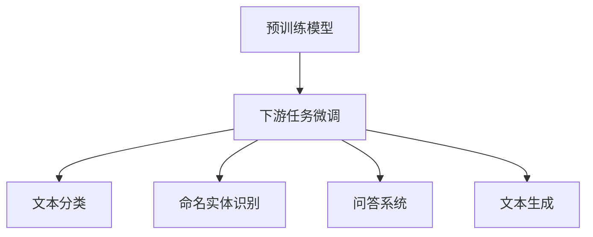

# Transformer大模型实战 针对下游任务进行微调

## 1. 背景介绍
### 1.1 Transformer模型的发展历程
#### 1.1.1 Transformer的诞生
#### 1.1.2 Transformer在NLP领域的应用
#### 1.1.3 Transformer大模型的崛起
### 1.2 Transformer大模型的优势
#### 1.2.1 强大的语义理解能力
#### 1.2.2 灵活的迁移学习能力
#### 1.2.3 高效的并行计算能力
### 1.3 针对下游任务微调的意义
#### 1.3.1 提高模型在特定任务上的性能
#### 1.3.2 降低训练成本和时间
#### 1.3.3 扩展模型的应用场景

## 2. 核心概念与联系
### 2.1 Transformer模型的基本结构
#### 2.1.1 Encoder-Decoder架构
#### 2.1.2 Self-Attention机制
#### 2.1.3 位置编码
### 2.2 预训练与微调
#### 2.2.1 预训练的目的和方法
#### 2.2.2 微调的概念和优势
#### 2.2.3 预训练和微调的关系
### 2.3 下游任务的类型
#### 2.3.1 文本分类
#### 2.3.2 命名实体识别
#### 2.3.3 问答系统
#### 2.3.4 文本生成



## 3. 核心算法原理具体操作步骤
### 3.1 微调的一般流程
#### 3.1.1 选择合适的预训练模型
#### 3.1.2 准备下游任务数据集
#### 3.1.3 设计微调的网络结构
#### 3.1.4 选择合适的优化策略
#### 3.1.5 进行微调训练和评估
### 3.2 不同下游任务的微调方法
#### 3.2.1 文本分类任务的微调
#### 3.2.2 命名实体识别任务的微调
#### 3.2.3 问答任务的微调
#### 3.2.4 文本生成任务的微调
### 3.3 微调过程中的技巧和优化
#### 3.3.1 学习率的选择
#### 3.3.2 Batch Size的设置
#### 3.3.3 梯度裁剪的使用
#### 3.3.4 正则化技术的应用

## 4. 数学模型和公式详细讲解举例说明
### 4.1 Transformer的数学表示
#### 4.1.1 Self-Attention的计算公式
$Attention(Q,K,V) = softmax(\frac{QK^T}{\sqrt{d_k}})V$
#### 4.1.2 Multi-Head Attention的计算公式
$MultiHead(Q,K,V) = Concat(head_1, ..., head_h)W^O$
$head_i = Attention(QW_i^Q, KW_i^K, VW_i^V)$
#### 4.1.3 前馈神经网络的计算公式
$FFN(x) = max(0, xW_1 + b_1)W_2 + b_2$
### 4.2 微调中的损失函数
#### 4.2.1 交叉熵损失函数
$L_{CE} = -\sum_{i=1}^{N}y_i \log(\hat{y}_i)$
#### 4.2.2 平方损失函数
$L_{MSE} = \frac{1}{N}\sum_{i=1}^{N}(y_i - \hat{y}_i)^2$
#### 4.2.3 Focal Loss
$L_{FL} = -\sum_{i=1}^{N}\alpha(1-\hat{y}_i)^\gamma y_i \log(\hat{y}_i)$
### 4.3 微调中的优化算法
#### 4.3.1 Adam优化算法
$m_t = \beta_1 m_{t-1} + (1 - \beta_1)g_t$
$v_t = \beta_2 v_{t-1} + (1 - \beta_2)g_t^2$
$\hat{m}_t = \frac{m_t}{1 - \beta_1^t}$
$\hat{v}_t = \frac{v_t}{1 - \beta_2^t}$
$\theta_t = \theta_{t-1} - \frac{\eta}{\sqrt{\hat{v}_t} + \epsilon}\hat{m}_t$
#### 4.3.2 AdamW优化算法
$m_t = \beta_1 m_{t-1} + (1 - \beta_1)g_t$
$v_t = \beta_2 v_{t-1} + (1 - \beta_2)g_t^2$
$\hat{m}_t = \frac{m_t}{1 - \beta_1^t}$
$\hat{v}_t = \frac{v_t}{1 - \beta_2^t}$
$\theta_t = \theta_{t-1} - \frac{\eta}{\sqrt{\hat{v}_t} + \epsilon}(\hat{m}_t + \lambda \theta_{t-1})$

## 5. 项目实践：代码实例和详细解释说明
### 5.1 使用Hugging Face的Transformers库进行微调
#### 5.1.1 安装Transformers库
```bash
pip install transformers
```
#### 5.1.2 加载预训练模型
```python
from transformers import BertForSequenceClassification, BertTokenizer

model = BertForSequenceClassification.from_pretrained('bert-base-uncased')
tokenizer = BertTokenizer.from_pretrained('bert-base-uncased')
```
#### 5.1.3 准备数据集
```python
from datasets import load_dataset

dataset = load_dataset('glue', 'sst2')
train_dataset = dataset['train']
eval_dataset = dataset['validation']
```
#### 5.1.4 定义数据预处理函数
```python
def preprocess_function(examples):
    return tokenizer(examples['sentence'], truncation=True, padding=True)

train_dataset = train_dataset.map(preprocess_function, batched=True)
eval_dataset = eval_dataset.map(preprocess_function, batched=True)
```
#### 5.1.5 设置训练参数并进行微调
```python
from transformers import TrainingArguments, Trainer

training_args = TrainingArguments(
    output_dir='./results',
    num_train_epochs=3,
    per_device_train_batch_size=16,
    per_device_eval_batch_size=64,
    warmup_steps=500,
    weight_decay=0.01,
    logging_dir='./logs',
    logging_steps=10,
)

trainer = Trainer(
    model=model,
    args=training_args,
    train_dataset=train_dataset,
    eval_dataset=eval_dataset,
)

trainer.train()
```
### 5.2 使用PyTorch进行微调
#### 5.2.1 加载预训练模型
```python
import torch
from transformers import BertForSequenceClassification, BertTokenizer

model = BertForSequenceClassification.from_pretrained('bert-base-uncased')
tokenizer = BertTokenizer.from_pretrained('bert-base-uncased')
```
#### 5.2.2 准备数据集
```python
from torch.utils.data import DataLoader, RandomSampler, SequentialSampler
from transformers import glue_convert_examples_to_features

train_dataset = glue_convert_examples_to_features(
    examples=train_examples,
    tokenizer=tokenizer,
    max_length=128,
    task='sst-2',
    label_list=['0', '1']
)

train_sampler = RandomSampler(train_dataset)
train_dataloader = DataLoader(train_dataset, sampler=train_sampler, batch_size=32)

eval_dataset = glue_convert_examples_to_features(
    examples=eval_examples,
    tokenizer=tokenizer,
    max_length=128,
    task='sst-2',
    label_list=['0', '1']
)

eval_sampler = SequentialSampler(eval_dataset)
eval_dataloader = DataLoader(eval_dataset, sampler=eval_sampler, batch_size=32)
```
#### 5.2.3 定义优化器和损失函数
```python
from transformers import AdamW

optimizer = AdamW(model.parameters(), lr=2e-5, eps=1e-8)

from torch.nn import CrossEntropyLoss

criterion = CrossEntropyLoss()
```
#### 5.2.4 进行微调训练和评估
```python
for epoch in range(num_epochs):
    model.train()
    for batch in train_dataloader:
        inputs = {
            'input_ids': batch[0],
            'attention_mask': batch[1],
            'labels': batch[3]
        }
        outputs = model(**inputs)
        loss = criterion(outputs[1], inputs['labels'])
        loss.backward()
        optimizer.step()
        optimizer.zero_grad()

    model.eval()
    eval_loss = 0
    eval_accuracy = 0
    for batch in eval_dataloader:
        with torch.no_grad():
            inputs = {
                'input_ids': batch[0],
                'attention_mask': batch[1],
                'labels': batch[3]
            }
            outputs = model(**inputs)
            tmp_eval_loss = criterion(outputs[1], inputs['labels'])
            eval_loss += tmp_eval_loss.mean().item()
            
            preds = outputs[1].argmax(dim=1)
            eval_accuracy += (preds == inputs['labels']).sum().item() / len(inputs['labels'])
    
    print(f'Epoch {epoch + 1} - Loss: {eval_loss / len(eval_dataloader)} - Accuracy: {eval_accuracy / len(eval_dataloader)}')
```

## 6. 实际应用场景
### 6.1 情感分析
#### 6.1.1 应用背景
#### 6.1.2 数据准备
#### 6.1.3 模型选择和微调
#### 6.1.4 效果评估
### 6.2 智能客服
#### 6.2.1 应用背景
#### 6.2.2 数据准备
#### 6.2.3 模型选择和微调
#### 6.2.4 效果评估
### 6.3 知识图谱构建
#### 6.3.1 应用背景
#### 6.3.2 数据准备
#### 6.3.3 模型选择和微调
#### 6.3.4 效果评估
### 6.4 机器翻译
#### 6.4.1 应用背景 
#### 6.4.2 数据准备
#### 6.4.3 模型选择和微调
#### 6.4.4 效果评估

## 7. 工具和资源推荐
### 7.1 预训练模型资源
#### 7.1.1 BERT
#### 7.1.2 RoBERTa
#### 7.1.3 GPT系列
#### 7.1.4 T5
### 7.2 数据集资源
#### 7.2.1 GLUE
#### 7.2.2 SQuAD
#### 7.2.3 CNN/Daily Mail
#### 7.2.4 WMT
### 7.3 开发工具和框架
#### 7.3.1 Hugging Face Transformers
#### 7.3.2 PyTorch
#### 7.3.3 TensorFlow
#### 7.3.4 Fairseq

## 8. 总结：未来发展趋势与挑战
### 8.1 模型的轻量化和移动端部署
### 8.2 零样本和少样本学习
### 8.3 多模态学习
### 8.4 可解释性和可信性
### 8.5 隐私保护和安全性

## 9. 附录：常见问题与解答
### 9.1 如何选择合适的预训练模型？
### 9.2 微调过程中出现过拟合怎么办？
### 9.3 如何处理不平衡的数据集？
### 9.4 微调后的模型如何部署到生产环境？
### 9.5 如何进一步提高微调后模型的性能？

作者：禅与计算机程序设计艺术 / Zen and the Art of Computer Programming