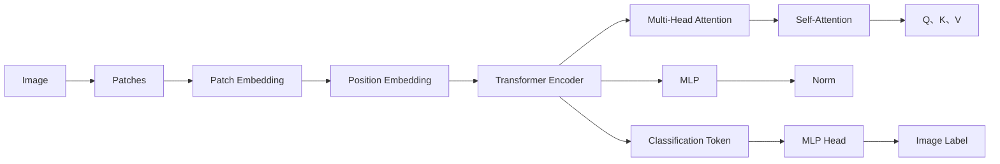

# ViT原理与代码实例讲解

## 1. 背景介绍

### 1.1 视觉transformer的兴起

近年来,transformer模型在自然语言处理领域取得了巨大成功,如BERT、GPT等模型。受此启发,研究者们开始尝试将transformer架构应用到计算机视觉领域。Vision Transformer(简称ViT)就是其中的代表性工作,它将纯transformer结构直接应用于图像分类任务,在ImageNet数据集上取得了优于CNN的结果。ViT的出现引发了视觉transformer的研究热潮。

### 1.2 ViT的优势

与传统的CNN模型相比,ViT具有以下优势:

1. 全局建模能力强。ViT通过self-attention机制对图像patches进行全局建模,能够更好地捕捉长距离依赖关系。
2. 并行计算效率高。ViT的计算过程高度并行,利用现代GPU可以非常高效地训练和推理。  
3. 模型结构简单。ViT摒弃了CNN中的卷积、池化等操作,模型结构简洁,易于理解和改进。
4. 泛化能力强。ViT在大规模预训练后,可以在下游任务上取得很好的迁移学习效果。

### 1.3 ViT的应用前景

ViT强大的性能和优势使其在计算机视觉领域具有广阔的应用前景,如:

1. 图像分类:ViT可以作为通用的图像分类backbone,应用于各种分类场景。
2. 目标检测:用ViT替换Faster R-CNN等模型的backbone,可以提升检测性能。
3. 语义分割:ViT与CNN结合,可以很好地解决语义分割任务。
4. 行为识别:ViT可以用于时空序列的建模,在视频行为识别中大有可为。

随着视觉transformer的不断发展,相信其将在越来越多的视觉任务中崭露头角。

## 2. 核心概念与联系

### 2.1 Transformer

Transformer最初是应用于机器翻译任务的一种seq2seq模型。其核心是self-attention机制,通过计算序列中不同位置之间的关联度,实现了对全局信息的建模。Transformer包含编码器和解码器两部分,编码器用于对输入序列进行特征提取,解码器根据编码器的输出和之前的预测结果生成输出序列。

### 2.2 Self-Attention

Self-Attention是Transformer的核心组件。对于输入序列的每个位置,通过与其他所有位置的关联计算,生成该位置的注意力表示。具体来说,self-attention分为以下三步:

1. 计算Query、Key、Value。将输入embedding乘以三个不同的权重矩阵,得到Q、K、V三个向量。
2. 计算Attention Scores。将每个位置的Query与所有位置的Key做点积,得到Attention Scores矩阵。
3. 加权求和。将Attention Scores归一化后,与对应的Value相乘求和,得到self-attention的输出表示。

通过Self-Attention,模型能够学习序列中不同位置之间的相关性,挖掘全局信息。

### 2.3 Multi-Head Attention

为了让模型能够关注输入序列的不同表示子空间,Transformer使用了多头注意力机制。将self-attention的计算过程重复多次,每次使用不同的Q、K、V权重,然后将多个头的输出拼接起来,经过线性变换得到最终的多头注意力输出。

### 2.4 Position Embedding

由于self-attention是位置无关的,为了引入位置信息,Transformer在输入embedding中加入了可学习的位置编码。对于序列的每个位置,将一个固定长度的位置向量与词向量相加,作为transformer的输入。

### 2.5 ViT

ViT将图像分割成固定大小的patches,然后将patches序列输入到Transformer中,从而将transformer用于图像分类。ViT的整体架构与原始的Transformer编码器非常相似,主要区别在于:

1. 输入序列从自然语言词元变为图像patches。
2. 加入了一个额外的可学习的分类token,用于聚合序列信息进行分类。
3. 最后的输出表示接一个MLP头,用于图像分类。

ViT的核心思想是将图像看作是一个patches的序列,利用transformer的强大建模能力,学习patches之间的全局关系,从而得到图像的整体表示用于分类。

### 2.6 概念联系图

下面是ViT核心概念之间的联系图(用Mermaid绘制):

## 3. 核心算法原理具体操作步骤

### 3.1 图像分割为Patches

1. 设输入图像的大小为(H, W, C),其中H、W、C分别表示高度、宽度、通道数。
2. 指定patch的大小为(P, P),通常取P=16。
3. 将图像在高度和宽度两个维度上按照patch大小进行分割,得到(H/P, W/P)个patches。
4. 将每个patch展平,变成一个长度为P*P*C的向量。
5. 将所有patches组成一个序列,形状为(N, P*P*C),其中N=H*W/(P*P)为patches的数量。

### 3.2 Patch Embedding

1. 定义一个线性映射层,将patch向量的长度从P*P*C映射到D维,其中D为transformer的隐藏层维度。
2. 将所有patch向量通过该映射层,得到形状为(N, D)的patch embedding序列。

### 3.3 Position Embedding

1. 定义一个可学习的位置编码矩阵,形状为(N, D),与patch embedding序列的形状相同。
2. 将位置编码矩阵与patch embedding序列相加,得到最终的输入序列。

### 3.4 Transformer Encoder

1. 定义L个transformer编码器层,每层包含两个子层:Multi-Head Attention和MLP。
2. 对于第l层编码器,将上一层的输出序列输入其中:
   - 经过Layer Norm
   - 输入到Multi-Head Attention层
   - 残差连接,与输入相加
   - 经过Layer Norm
   - 输入到MLP层
   - 残差连接,与Layer Norm的输出相加
3. 重复步骤2,直到得到最后一层编码器的输出序列。

### 3.5 分类头

1. 在transformer编码器的输入序列开头,附加一个可学习的分类token向量,维度与patch embedding相同。
2. 将分类token与patch embedding一起输入到transformer编码器中。
3. 取transformer编码器最后一层输出序列中,分类token对应的向量。
4. 将该向量输入到一个MLP分类头,得到图像的分类logits。
5. 将logits通过softmax函数,得到图像的分类概率。

## 4. 数学模型和公式详细讲解举例说明

### 4.1 Self-Attention计算公式

设输入序列为$X \in \mathbb{R}^{N \times D}$,其中N为序列长度,D为隐藏层维度。Self-Attention的计算过程如下:

1. 计算Query、Key、Value矩阵:

$$ Q = XW_Q, K = XW_K, V = XW_V $$

其中$W_Q, W_K, W_V \in \mathbb{R}^{D \times D_h}$为可学习的权重矩阵,$D_h$为每个注意力头的维度。

2. 计算Attention Scores:

$$ A = \text{softmax}(\frac{QK^T}{\sqrt{D_h}}) $$

其中$A \in \mathbb{R}^{N \times N}$为注意力分数矩阵。

3. 加权求和:

$$ \text{Attention}(Q, K, V) = AV $$

最终得到Self-Attention的输出$\text{Attention}(Q, K, V) \in \mathbb{R}^{N \times D_h}$。

举例说明:
假设有一个长度为4的输入序列,隐藏层维度为512,Self-Attention的计算过程如下:

$$
X = \begin{bmatrix} 
x_1 \\ x_2 \\ x_3 \\ x_4
\end{bmatrix}, X \in \mathbb{R}^{4 \times 512}
$$

1. 计算Q、K、V矩阵,假设单头注意力的维度为64:

$$
Q = XW_Q = \begin{bmatrix}
q_1 \\ q_2 \\ q_3 \\ q_4
\end{bmatrix}, Q \in \mathbb{R}^{4 \times 64} \\
K = XW_K = \begin{bmatrix}
k_1 \\ k_2 \\ k_3 \\ k_4
\end{bmatrix}, K \in \mathbb{R}^{4 \times 64} \\
V = XW_V = \begin{bmatrix}
v_1 \\ v_2 \\ v_3 \\ v_4
\end{bmatrix}, V \in \mathbb{R}^{4 \times 64}
$$

2. 计算Attention Scores矩阵:

$$
A = \text{softmax}(\frac{QK^T}{\sqrt{64}}) = \begin{bmatrix}
a_{11} & a_{12} & a_{13} & a_{14} \\
a_{21} & a_{22} & a_{23} & a_{24} \\
a_{31} & a_{32} & a_{33} & a_{34} \\
a_{41} & a_{42} & a_{43} & a_{44}
\end{bmatrix}, A \in \mathbb{R}^{4 \times 4}
$$

3. 加权求和得到输出:

$$
\text{Attention}(Q, K, V) = AV = \begin{bmatrix}
a_{11}v_1 + a_{12}v_2 + a_{13}v_3 + a_{14}v_4 \\
a_{21}v_1 + a_{22}v_2 + a_{23}v_3 + a_{24}v_4 \\
a_{31}v_1 + a_{32}v_2 + a_{33}v_3 + a_{34}v_4 \\
a_{41}v_1 + a_{42}v_2 + a_{43}v_3 + a_{44}v_4
\end{bmatrix} \in \mathbb{R}^{4 \times 64}
$$

### 4.2 Multi-Head Attention计算公式

Multi-Head Attention将Self-Attention的计算过程重复h次,每次使用不同的权重矩阵。设第i个头的权重矩阵为$W_Q^i, W_K^i, W_V^i$,则Multi-Head Attention的计算公式为:

$$
\text{MultiHead}(X) = \text{Concat}(\text{head}_1, ..., \text{head}_h)W^O \\
\text{head}_i = \text{Attention}(XW_Q^i, XW_K^i, XW_V^i)
$$

其中$W^O \in \mathbb{R}^{hD_h \times D}$为输出线性变换的权重矩阵。

举例说明:
假设使用8个注意力头,每个头的维度为64,则Multi-Head Attention的计算过程如下:

1. 对于每个头$i=1,2,...,8$,计算$\text{head}_i$:

$$
\text{head}_i = \text{Attention}(XW_Q^i, XW_K^i, XW_V^i) \in \mathbb{R}^{4 \times 64}
$$

2. 将8个头的输出拼接起来:

$$
\text{Concat}(\text{head}_1, ..., \text{head}_8) \in \mathbb{R}^{4 \times 512}
$$

3. 经过输出线性变换得到最终的Multi-Head Attention输出:

$$
\text{MultiHead}(X) = \text{Concat}(\text{head}_1, ..., \text{head}_8)W^O \in \mathbb{R}^{4 \times 512}
$$

其中$W^O \in \mathbb{R}^{512 \times 512}$。

### 4.3 Transformer Encoder计算公式

设第l层编码器的输入为$X^{(l)}$,则其计算过程为:

$$
\begin{aligned}
X^{(l)} &= \text{LayerNorm}(X^{(l-1)}) \\
\hat{X}^{(l)} &= \text{MultiHead}(X^{(l)}) + X^{(l)} \\
X^{(l)} &= \text{LayerNorm}(\hat{X}^{(l)}) \\
\tilde{X}^{(l)} &= \text{MLP}(X^{(l)}) + X^{(l)} \\
X^{(l+1)} &= \tilde{X}^{(l)}
\end{aligned}