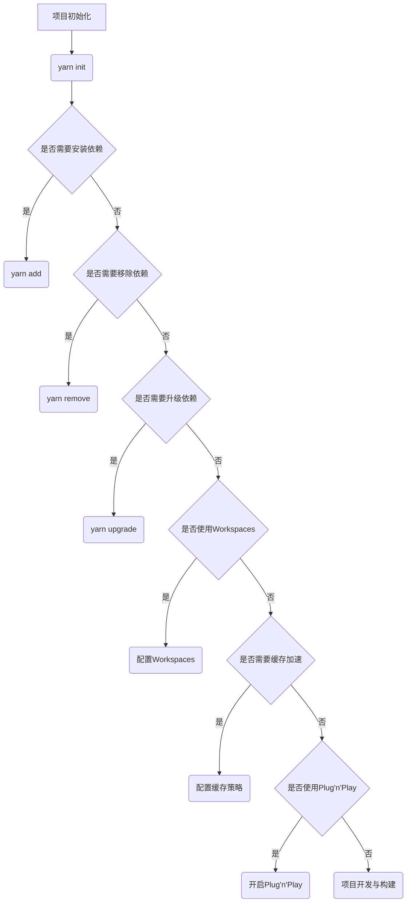

# Yarn 原理与代码实例讲解

## 1. 背景介绍
### 1.1 Yarn 的诞生背景
### 1.2 Yarn 在前端开发中的重要性
### 1.3 Yarn 与 npm 的异同点

## 2. 核心概念与联系
### 2.1 包管理器的基本概念
#### 2.1.1 包的定义与组成
#### 2.1.2 依赖管理的重要性
#### 2.1.3 版本控制策略
### 2.2 Yarn 的核心特性
#### 2.2.1 快速可靠的安装
#### 2.2.2 确定性的依赖管理
#### 2.2.3 网络弹性设计
### 2.3 Yarn 与其他包管理器的关系
#### 2.3.1 Yarn 与 npm 的兼容性
#### 2.3.2 Yarn 与 pnpm 的异同点

## 3. 核心算法原理具体操作步骤
### 3.1 依赖解析算法
#### 3.1.1 依赖树的构建
#### 3.1.2 版本冲突的解决策略
#### 3.1.3 扁平化安装的优势
### 3.2 缓存机制与离线安装
#### 3.2.1 本地缓存的工作原理  
#### 3.2.2 缓存的有效性验证
#### 3.2.3 离线安装的步骤与优势
### 3.3 Plug'n'Play 安装策略
#### 3.3.1 Plug'n'Play 的核心思想
#### 3.3.2 与传统 node_modules 的区别
#### 3.3.3 Plug'n'Play 的优缺点分析

## 4. 数学模型和公式详细讲解举例说明
### 4.1 语义化版本控制规范
#### 4.1.1 版本号的结构与含义
#### 4.1.2 版本范围的表示方法
#### 4.1.3 版本优先级计算公式
### 4.2 依赖解析的数学建模
#### 4.2.1 依赖图的数学表示
#### 4.2.2 最小版本选择策略的数学描述
#### 4.2.3 回溯算法在依赖解析中的应用

## 5. 项目实践：代码实例和详细解释说明 
### 5.1 使用 Yarn 初始化项目
#### 5.1.1 yarn init 命令详解
#### 5.1.2 package.json 文件结构解析
#### 5.1.3 配置 Yarn 的全局选项
### 5.2 常用的 Yarn 命令实例
#### 5.2.1 yarn add 安装依赖包
#### 5.2.2 yarn remove 移除依赖包
#### 5.2.3 yarn upgrade 升级依赖包
### 5.3 Yarn Workspaces 的使用
#### 5.3.1 Workspaces 的概念与优势
#### 5.3.2 创建和管理 Workspaces
#### 5.3.3 Workspaces 下的依赖管理

## 6. 实际应用场景
### 6.1 大型前端项目的依赖管理 
#### 6.1.1 项目结构与依赖关系梳理
#### 6.1.2 使用 Yarn 优化依赖安装速度
#### 6.1.3 Yarn 在 CI/CD 流程中的应用
### 6.2 Monorepo 项目的最佳实践
#### 6.2.1 Monorepo 的优势与挑战
#### 6.2.2 Yarn Workspaces 在 Monorepo 中的应用
#### 6.2.3 Monorepo 项目的版本发布管理
### 6.3 Yarn 与现代前端框架的集成
#### 6.3.1 Yarn 在 React 项目中的应用
#### 6.3.2 Yarn 与 Vue CLI 的集成
#### 6.3.3 Yarn 在 Angular 项目中的最佳实践

## 7. 工具和资源推荐
### 7.1 Yarn 生态系统中的常用工具
#### 7.1.1 Yarn Plugin 系统介绍
#### 7.1.2 常用的 Yarn Plugins 推荐
#### 7.1.3 Yarn 与 Lerna 的集成使用
### 7.2 学习 Yarn 的优质资源
#### 7.2.1 官方文档与教程
#### 7.2.2 优秀的 Yarn 相关博客与文章
#### 7.2.3 Yarn 社区与交流渠道

## 8. 总结：未来发展趋势与挑战
### 8.1 Yarn 的发展历程与未来规划
### 8.2 包管理器的发展趋势
### 8.3 Yarn 面临的机遇与挑战

## 9. 附录：常见问题与解答
### 9.1 Yarn 安装与升级问题
### 9.2 常见的依赖冲突解决方法
### 9.3 Yarn 使用过程中的常见错误与处理

Yarn 是现代化的 JavaScript 包管理器,诞生于 npm 的一些缺陷和不足,如安装速度慢、不确定性等问题。Yarn 通过引入缓存机制、确定性算法等改进,提供了更快速、可靠的依赖管理方案。

Yarn 的核心概念包括包的定义与组成、依赖管理、版本控制策略等。它采用了快速可靠的安装策略、确定性的依赖管理、网络弹性设计等特性,与 npm 保持了很好的兼容性。

在算法原理方面,Yarn 采用了高效的依赖解析算法,通过构建依赖树、制定版本冲突解决策略、扁平化安装等手段,优化了依赖管理的效率。同时引入了缓存机制与离线安装,使得安装过程更加快速可靠。Yarn 还提出了 Plug'n'Play 安装策略,改变了传统的 node_modules 方式。

语义化版本控制是 Yarn 的重要规范,通过对版本号的结构化定义、版本范围的表示方法,以及版本优先级计算公式,实现了严谨的版本管理。依赖解析问题可以使用数学建模的方法,通过依赖图的数学表示、最小版本选择策略的数学描述等,优化求解过程。

在实际项目中,我们通过 yarn init 初始化项目,yarn add、yarn remove、yarn upgrade 等命令管理依赖包。对于 Monorepo 项目,Yarn Workspaces 提供了更好的支持。在现代前端框架如 React、Vue、Angular 等项目中,Yarn 也有广泛的应用。

除了 Yarn 本身,它的生态系统中还有许多优秀的工具,如 Yarn Plugin 系统、与 Lerna 的集成等。开发者可以通过官方文档、优质博客、社区交流等渠道,深入学习 Yarn 的使用。

展望未来,Yarn 仍将不断发展,紧跟前端技术的变革步伐。同时,Yarn 也面临着新的机遇和挑战,需要在性能、体验、生态等方面持续优化和创新。

总之,Yarn 作为优秀的现代化 JavaScript 包管理器,为前端项目的依赖管理提供了高效、可靠的解决方案。深入理解 Yarn 的原理和最佳实践,对于提升前端开发效率和项目可维护性有着重要意义。

作者：禅与计算机程序设计艺术 / Zen and the Art of Computer Programming