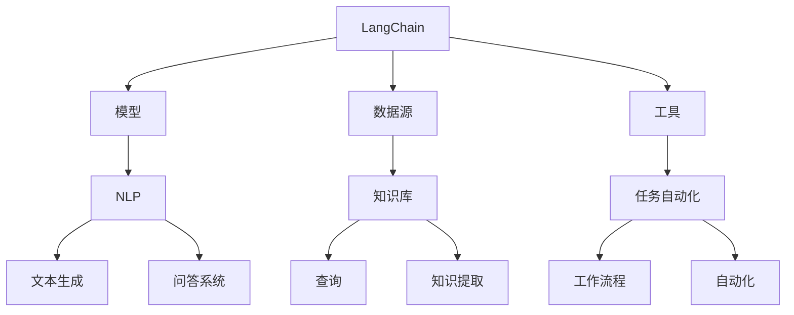
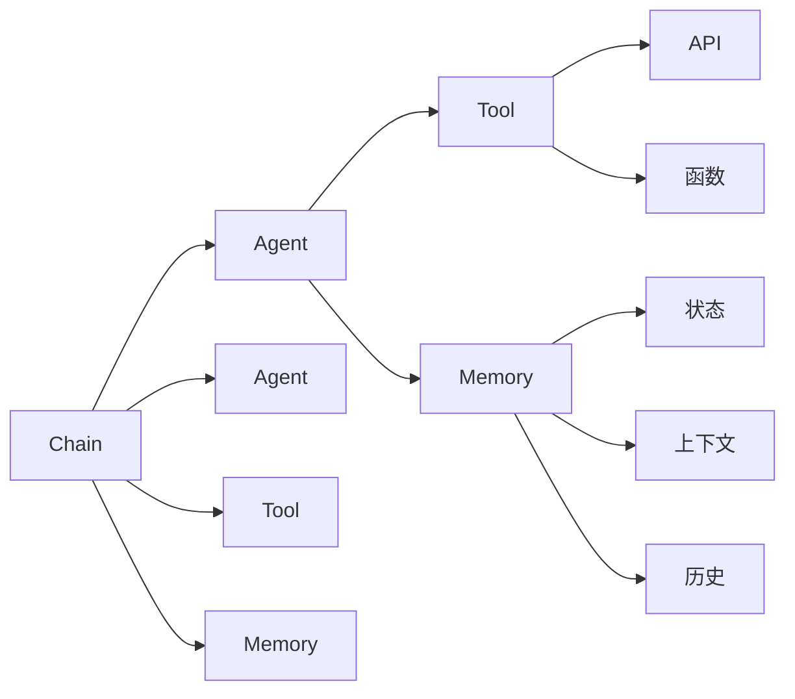
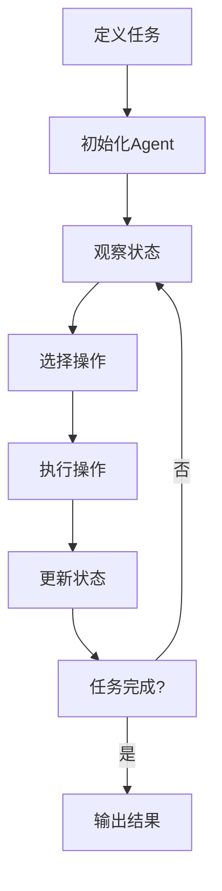

# 【LangChain编程：从入门到实践】

## 1. 背景介绍

在当今数据驱动的时代，人工智能(AI)和机器学习(ML)已经成为各行各业不可或缺的工具。然而,构建和部署AI/ML系统仍然是一项艰巨的挑战,需要大量的时间和资源。LangChain是一个强大的Python库,旨在简化AI/ML系统的开发和部署过程,使开发人员能够更轻松地构建智能应用程序。

LangChain的核心思想是将不同的AI/ML模型、数据源和工具链接在一起,形成一个统一的工作流程。它提供了一种抽象层,使开发人员可以专注于构建应用程序的逻辑,而不必过多关注底层技术细节。无论是自然语言处理(NLP)、知识库查询还是任务自动化,LangChain都可以为您提供强大的支持。

### Mermaid 流程图



## 2. 核心概念与联系

LangChain的核心概念包括Agent、Tool、Memory和Chain。

- **Agent**是一个智能代理,负责执行特定的任务。它可以与各种工具(Tool)交互,并利用记忆(Memory)来存储和检索信息。
- **Tool**是一个可执行的函数或API,用于完成特定的任务,如查询知识库、进行Web搜索或调用外部服务。
- **Memory**是一个存储和检索信息的组件,可用于保存Agent的状态、上下文信息或执行历史。
- **Chain**是一系列Agent、Tool和Memory的组合,用于构建复杂的工作流程。

这些核心概念紧密相连,共同构建了LangChain的强大功能。Agent利用Tool完成任务,并将结果存储在Memory中。Chain则将这些组件组合在一起,形成一个完整的工作流程。

### Mermaid 流程图



## 3. 核心算法原理具体操作步骤

LangChain的核心算法原理是基于**序列决策**和**规划**。在执行任务时,Agent会根据当前状态和目标,选择合适的Tool执行操作,并将结果存储在Memory中。然后,Agent会根据新的状态和目标,再次选择合适的Tool执行操作,直到完成整个任务。

这个过程可以用以下步骤总结:

1. **定义任务**:明确任务目标和约束条件。
2. **初始化Agent**:创建一个Agent,并为其分配合适的Tool和Memory。
3. **观察状态**:Agent观察当前状态,包括任务目标、约束条件和Memory中的信息。
4. **选择操作**:Agent根据当前状态和目标,选择合适的Tool执行操作。
5. **执行操作**:Agent调用选定的Tool,执行相应的操作。
6. **更新状态**:Agent将操作的结果存储在Memory中,更新当前状态。
7. **重复步骤3-6**:重复观察状态、选择操作、执行操作和更新状态的过程,直到完成整个任务。
8. **输出结果**:Agent输出最终结果。

这种基于序列决策和规划的算法原理,使LangChain能够灵活地组合各种AI/ML模型、数据源和工具,构建复杂的智能应用程序。

### Mermaid 流程图



## 4. 数学模型和公式详细讲解举例说明

在LangChain中,Agent选择操作的过程可以用**马尔可夫决策过程(MDP)**来建模。MDP是一种描述序列决策问题的数学框架,包括以下几个关键要素:

- **状态集合 $S$**:所有可能的状态组成的集合。
- **动作集合 $A$**:所有可能的操作组成的集合。
- **转移概率 $P(s'|s,a)$**:在状态 $s$ 下执行操作 $a$ 后,转移到状态 $s'$ 的概率。
- **奖励函数 $R(s,a,s')$**:在状态 $s$ 下执行操作 $a$ 并转移到状态 $s'$ 时获得的奖励。
- **折扣因子 $\gamma$**:用于权衡即时奖励和长期奖励的重要性。

Agent的目标是找到一个策略 $\pi(a|s)$,即在每个状态 $s$ 下选择操作 $a$ 的概率分布,使得期望的累积奖励最大化:

$$
\max_\pi \mathbb{E}\left[\sum_{t=0}^\infty \gamma^t R(s_t, a_t, s_{t+1})\right]
$$

其中 $s_t$ 和 $a_t$ 分别表示第 $t$ 个时间步的状态和操作。

LangChain使用强化学习算法,如Q-Learning或策略梯度,来学习最优策略 $\pi^*$。在执行任务时,Agent根据当前状态 $s$ 和学习到的策略 $\pi^*(a|s)$,选择合适的操作 $a$ 执行。

### 示例

假设我们有一个简单的任务:根据一段文本,回答相关的问题。我们可以将这个任务建模为一个MDP:

- 状态 $s$:包含当前文本和问题的信息。
- 操作 $a$:可以是查询知识库、进行Web搜索或调用NLP模型等操作。
- 转移概率 $P(s'|s,a)$:执行操作 $a$ 后,状态转移到 $s'$ 的概率,取决于操作的结果。
- 奖励函数 $R(s,a,s')$:如果操作 $a$ 能够帮助回答问题,则获得正奖励;否则获得负奖励或零奖励。

Agent的目标是学习一个策略 $\pi^*$,在每个状态下选择合适的操作序列,最大化累积奖励,即正确回答问题的概率。

## 5. 项目实践:代码实例和详细解释说明

下面是一个使用LangChain构建问答系统的简单示例:

```python
from langchain import OpenAI, ConversationChain, PromptTemplate

# 初始化OpenAI模型
llm = OpenAI(temperature=0)

# 定义问答提示模板
template = """基于以下上下文,回答问题:

上下文: {context}

问题: {question}

回答:"""
prompt = PromptTemplate(template=template, input_variables=["context", "question"])

# 创建对话链
conversation = ConversationChain(llm=llm, prompt=prompt)

# 设置上下文和问题
context = "LangChain是一个用于构建应用程序的Python库,可以将大语言模型、工具和数据源连接在一起。它支持自然语言处理、知识库查询和任务自动化等功能。"
question = "LangChain支持哪些功能?"

# 获取回答
result = conversation.run(context=context, question=question)
print(result)
```

在这个示例中,我们首先初始化了OpenAI的大语言模型。然后,我们定义了一个问答提示模板,用于指导模型根据给定的上下文和问题生成回答。

接下来,我们创建了一个`ConversationChain`对象,将语言模型和提示模板连接在一起。这个对象就是我们的Agent,负责执行问答任务。

最后,我们设置了上下文和问题,并调用`conversation.run()`方法获取回答。

这个示例虽然简单,但展示了LangChain如何将语言模型和提示模板结合起来,构建一个基本的问答系统。在实际应用中,我们可以添加更多的Tool和Memory,构建更复杂的智能应用程序。

## 6. 实际应用场景

LangChain可以应用于各种场景,包括但不限于:

1. **问答系统**:利用大语言模型和知识库,构建智能问答系统,为用户提供准确、全面的回答。
2. **文本总结**:自动生成文本的摘要,提高信息的可读性和可理解性。
3. **数据分析**:将自然语言查询转换为数据库查询,实现对数据的高效分析和可视化。
4. **任务自动化**:根据用户的自然语言指令,自动执行一系列操作,如文件处理、Web交互等。
5. **智能助手**:构建多功能的智能助手,协助用户完成各种任务,如日程安排、信息查询等。
6. **知识管理**:从各种数据源中提取知识,构建统一的知识库,支持知识的存储、查询和推理。

无论是在企业内部还是面向最终用户,LangChain都可以为各种应用程序提供强大的支持,提高工作效率和用户体验。

## 7. 工具和资源推荐

如果您想深入学习和使用LangChain,以下是一些推荐的工具和资源:

1. **LangChain官方文档**:LangChain的官方文档(https://python.langchain.com/en/latest/index.html)提供了详细的API参考、教程和示例代码,是学习LangChain的绝佳资源。
2. **LangChain示例库**:LangChain官方提供了一个示例库(https://github.com/hwchase17/langchain-examples),包含了各种应用场景的示例代码,可以帮助您快速上手。
3. **LangChain社区**:LangChain拥有一个活跃的社区,您可以在GitHub上提出问题或贡献代码(https://github.com/hwchase17/langchain)。
4. **LangChain课程**:一些在线课程和教程,如Coursera上的"LangChain for LLM Application Development"课程,可以帮助您系统地学习LangChain。
5. **AI/ML工具**:LangChain可以与各种AI/ML工具集成,如OpenAI的GPT-3、Hugging Face的Transformers等,熟悉这些工具将有助于您更好地利用LangChain。

通过利用这些工具和资源,您可以快速掌握LangChain的使用方法,并将其应用于实际项目中。

## 8. 总结:未来发展趋势与挑战

LangChain是一个极具潜力的库,为构建智能应用程序提供了强大的支持。随着AI/ML技术的不断发展,LangChain也将面临新的挑战和机遇。

未来,LangChain可能会在以下几个方面有所突破:

1. **更智能的Agent**:通过引入更先进的机器学习算法和技术,如深度强化学习、元学习等,Agent能够更好地理解任务,自主选择合适的操作序列。
2. **更丰富的工具集**:集成更多的AI/ML模型、数据源和工具,为开发者提供更多选择,构建更加强大的应用程序。
3. **更好的可解释性**:提高Agent的决策过程的透明度和可解释性,使用户能够更好地理解和信任智能系统。
4. **更强的安全性和隐私保护**:加强对敏感数据和模型的保护,确保智能应用程序的安全和隐私。

同时,LangChain也面临着一些挑战,如:

1. **模型偏差和公平性**:确保底层AI/ML模型不存在偏差和不公平,避免产生有害或歧视性的输出。
2. **可靠性和鲁棒性**:提高智能系统的可靠性和鲁棒性,确保在各种情况下都能正常工作。
3. **可扩展性**:随着应用程序规模的扩大,如何保证LangChain的性能和效率。
4. **人机协作**:探索人工智能与人类的协作方式,充分发挥双方的优势,实现真正的人机协作。

总的来说,LangChain为构建智能应用程序提供了一个强大的框架,但